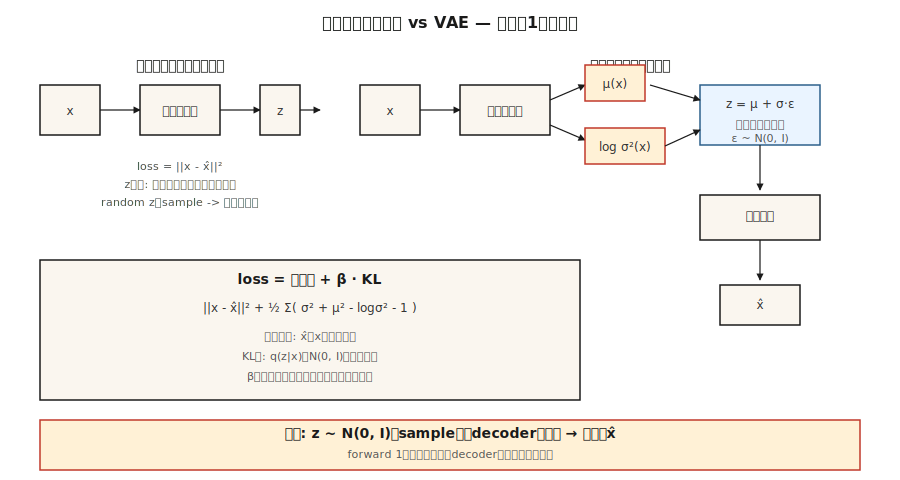

# Autoencoders & Variational Autoencoders (VAE)

> 普通自动编码器压缩然后重建。它会记住。它不会产生。添加一个技巧--强制代码看起来高斯--你就会得到一个采样器。这个技巧，即“z = μ + σ·ε”的重新参数化，就是为什么你在2026年使用的每个潜在扩散和流匹配图像模型都在输入端有一个VAE。

** 类型：** 构建
** 语言：** Python
** 先决条件：** 阶段3 · 02（Backprop）、阶段3 · 07（CNN）、阶段8 · 01（分类）
** 时间：** ~75分钟

## The Problem

将784像素的MNIST数字压缩为16个数字代码，然后重建。普通的自动编码器可以重建SSE，但代码空间却一团糟。在代码空间中选择一个随机点，对其进行解码，就会得到噪音。它没有采样器。这是一个精心打扮的压缩模型。

您实际想要的是：（a）代码空间是一个干净、平滑的分布，您可以从中进行采样--比如各向同性高斯“N（0，I）”，（b）解码任何样本都会产生一个合理的数字，并且（c）编码器和解码器仍然压缩得很好。三个目标，一个架构，一个失败。

Kingma的2013年VAE通过训练编码器输出 * 分布 *' q（z）解决了这个问题|x）= N（μ（x），Sigma（x）²）'，通过KL罚分将该分布拉向先前的“N（0，I）'，然后从' q（z）中采样'| x）'解码前。在推断时，丢弃编码器，采样“z ~ N（0，I）”，解码。KL惩罚是强制代码空间结构化的原因。

2026年，VAE很少单独发布-它们在原始图像质量方面被扩散所超越-但它们是每个潜在扩散模型（SD 1/2/XL/3、Flux、AudioCraft）的首选编码器。学习VAE后，您就会了解您使用的每个图像管道的不可见的第一层。

## The Concept



** 自动编码器。** ' z =编码器（x）'，' x =解码器（z）'，损失='|| x - x|| ² '。代码空间非结构化。

**VAE编码器。**输出两个载体：“μ（x）”和“log西格玛²（x）”。这些定义了“q（z| x）= N（μ，diag（Sigma ²））'。

** 重新参数化技巧。**从' q（z）采样|x）'不可区分。将样本重写为“z = μ + Sigma·e '，其中“e-N（0，I）”。现在“z”是“（μ，西格玛）”的确定性函数加上流经“μ”和“西格玛”的非参数噪音梯度。

** 损失。**证据下限（ELBO），两个术语：

```
loss = reconstruction + β · KL[q(z|x) || N(0, I)]
     = ||x - x̂||²  + β · Σ_i ( σ_i² + μ_i² - log σ_i² - 1 ) / 2
```

重建将“x”推向“x”。KL推动' q（z| x）'走向先前。他们权衡。小β（<1）=更清晰的样本，码空间更少高斯。大β（>1）=更干净的代码空间，更模糊的样本。β-VAE（Higgins 2017）使这个旋钮闻名并开启了解纠缠研究。

** 抽样。**推理时：绘制“z ~ N（0，I）”，通过解码器转发。一次向前通过-没有像扩散那样的迭代采样。

## Build It

' code/main.py '实现了一个没有numpy或火炬的微型VAE。输入是从8维2分量高斯混合物中提取的8维合成数据。编码器和解码器是单个隐藏层MPP。我们实现tanh激活、向前传递、丢失和手写向后传递。不是生产--教育学。

### Step 1: encoder forward

```python
def encode(x, enc):
    h = tanh(add(matmul(enc["W1"], x), enc["b1"]))
    mu = add(matmul(enc["W_mu"], h), enc["b_mu"])
    log_sigma2 = add(matmul(enc["W_sig"], h), enc["b_sig"])
    return mu, log_sigma2
```

“log Sigma ²”而不是“Sigma”，因此网络输出是不受约束的（Sigma的softplus是一个陷阱-梯度在Sigma Ÿ 0处消失）。

### Step 2: reparameterize and decode

```python
def reparameterize(mu, log_sigma2, rng):
    eps = [rng.gauss(0, 1) for _ in mu]
    sigma = [math.exp(0.5 * lv) for lv in log_sigma2]
    return [m + s * e for m, s, e in zip(mu, sigma, eps)]

def decode(z, dec):
    h = tanh(add(matmul(dec["W1"], z), dec["b1"]))
    return add(matmul(dec["W_out"], h), dec["b_out"])
```

### Step 3: the ELBO

```python
def elbo(x, x_hat, mu, log_sigma2, beta=1.0):
    recon = sum((a - b) ** 2 for a, b in zip(x, x_hat))
    kl = 0.5 * sum(math.exp(lv) + m * m - lv - 1 for m, lv in zip(mu, log_sigma2))
    return recon + beta * kl, recon, kl
```

精确的封闭形式KL，因为两个分布都是高斯分布。不要进行数字积分。到2026年，人们仍然按照monte-carlo KL的估计发货代码-无缘无故地慢了3倍。

### Step 4: generate

```python
def sample(dec, z_dim, rng):
    z = [rng.gauss(0, 1) for _ in range(z_dim)]
    return decode(z, dec)
```

这就是生成模型。五行。

## Pitfalls

- ** 后部塌陷。** KL术语驱动& q（z| x）-N（0，I）'攻击性如此强，以至于“z '不包含有关“x '的信息。修复：β-annealing（开始β=0，斜坡到1）、释放位或跳过非活动维度上的KL。
- ** 样本模糊。**高斯解码器似然意味着SSE重建，这对于L2（平均值）是Bayes最优的-一组看似合理的数字的平均值是模糊数字。修复：离散解码器（VQ-VAE、NVAE），或仅使用VAE作为编码器和潜伏区上的堆栈扩散（这就是Stable Distance所做的）。
- **β太大，太早。**参见后部塌陷。从β ð0.01开始并斜坡。
- ** 潜在的昏暗太小。** 16-D适用于MNIST，256-D适用于ImageNet 256²，2048-D适用于ImageNet 1024²。Stable Distance的VAE压缩512 x 512 x 3 - 64 x 64 x 4（空间区域中的32倍下采样因子，通道中的32倍）。

## Use It

2026年VAE堆栈：

| 情况 | 接 |
|-----------|------|
| 用于扩散的图像潜伏编码器 | 稳定扩散VAE（' sd--ft-ema '）或通量VAE |
| 音频潜伏编码器 | Encodec（Meta）、SoundStream或ADC（描述） |
| 视频潜伏 | Sora的时空斑块、拿铁VAE、WAN VAE |
| 解开的表示学习 | β-VAE、FactorVAE、TCVAE |
| 离散潜伏（用于Transformer建模） | VQ-VAE、RVQ（剩余VQ） |
| 一代的持续潜伏 | 简单描述VAE，然后在该潜在空间中调节流动/扩散模型 |

潜在扩散模型是一个VAE，其中扩散模型位于编码器和解码器之间。VAE进行粗压缩，扩散模型进行繁重的工作。视频（VAE +视频扩散DiT）和音频（Encodec + MusicGen Transformer）的模式相同。

## Ship It

保存“输出/skill-vae-trainer.md”。

技能需要：数据集配置文件+潜伏暗目标+下游使用（重建、采样或潜伏扩散输入）和输出：架构选择（纯/β/VQ/RVQ）、β时间表、潜伏暗度、解码器可能性（高斯vs分类）和评估计划（重建MBE、每个暗度KL、' q（z）之间的Fréchet距离|x）'和' N（0，I）'）。

## Exercises

1. ** 简单。**将' code/main.py '中的' β '更改为'、'、' 0.01 '、'。记录最终重建的SSE和KL。哪个β最适合您的合成数据？
2. ** 中等。**将高斯解码器似然替换为伯努里似然（交叉熵损失）。比较相同合成数据的二进制版本的样本质量。
3. ** 很难。**将“code/main.py”扩展到迷你VQ-VAE：用K=32个条目的码本中最近查找邻居替换连续的“z”。比较重建SSE并报告使用了多少码本条目（码本崩溃是真实的）。

## Key Terms

| Term | 别人怎么说 | 它实际上意味着什么 |
|------|-----------------|-----------------------|
| Autoencoder | 编码解码网络 | ' x-z-x '，学习SSE。不生成。 |
| VAE | 带采样器的AE | 编码器输出分布，KL罚分整形代码空间。 |
| Elbo | 证据下限 | ' log p（x）= recon - KL[q（z） | x）\ | \ | p（z）]';当' q = p（z）时紧 | x）'。 |
| 重新参数 | ' z = μ + Sigma·e ' | 将随机节点重写为确定性+纯噪音。通过采样启用反推。 |
| 之前 | ' p（z）' | 潜在目标分布，通常为“N（0，I）”。 |
| 后部塌陷 | “KL学期获胜” | 编码器忽略“x”，输出先验信息;解码器一定产生幻觉。 |
| β-VAE | 可调KL体重 | “损失=侦察+ β·KL”。更高的β =更清晰但更模糊。 |
| VQ-VAE | 离散潜在 | 用最近的码本载体替换连续“z”;启用Transformer建模。 |

## Production note: the VAE is the hottest path in a diffusion server

在Stable Dispatch/ Flux /SD 3管道中，每个请求会调用VAE两次-一次用于编码（如果执行IMG 2 IMG/修补），一次用于解码。在1024²处，解码器通道通常是整个流水线中最大的激活存储器峰值，因为它会上采样“128 x 128 x 16”潜在回到“1024 x 1024 x 3”。两个实际后果：

- ** 切片或拼贴解码。** ' diffusers '暴露了' pipe.'. connect_tiling（）'和'。拼贴用小接缝文物换取“O（tile²）”内存，而不是“O（H·W）”。对于1024²以上消费级图形处理器至关重要。
- ** bf 16解码器，fp 32数字用于最终调整大小。** SD 1.x VAE在fp 32中发布，当在1024²+的情况下转换到fp 16时，* 悄然产生NaN *。SDXL发布了“madebyollin/sdxl-spread-fp 16-Fix”-始终更喜欢fp 16-Fix变体或使用bf 16。

## Further Reading

- [Kingma & Welling（2013）。自动编码变分Bayes]（https：//arxiv.org/abs/1312.6114）-VAE论文。
- [Higgins et al.（2017）.β-VAE：使用约束变分框架学习基本视觉概念]（https：openreview.net/forum? id= Sy 2fzU 9 gl）-解缠结的β-VAE。
- [van den Oord等人（2017）。神经离散表示学习]（https：//arxiv.org/abs/1711.00937）- VQ-VAE。
- [Vahdat & Kautz（2021）。NVAE：深度分层变分自动编码器]（https：//arxiv.org/ab/2007.03898）-最先进的图像VAE。
- [Rombach等人（2022）。使用潜在扩散模型的高分辨率图像合成]（https：//arxiv.org/ab/2112.10752）-稳定扩散; VAE作为编码器。
- [Défossez等人（2022）。高保真神经音频压缩]（https：//arxiv.org/ab/2210.13438）- Encodec，音频VAE标准。
