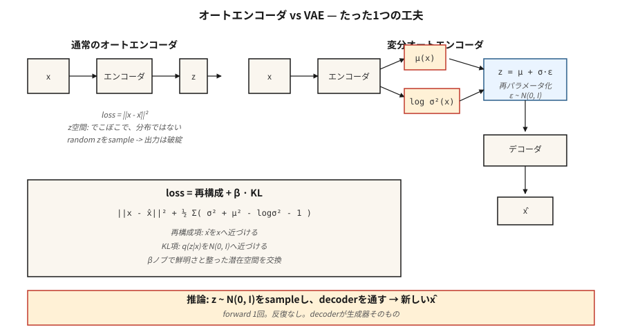

# 自编码器与变分自编码器 (VAE)

> 普通自编码器压缩然后重建。它记忆，但不生成。加一个技巧——迫使编码看起来像高斯分布——你就得到了一个采样器。这个单一技巧，即 `z = μ + σ·ε` 的重参数化，是你在 2026 年使用的每个潜在扩散和流匹配图像模型在输入端都有一个 VAE 的原因。

**类型：** 构建
**语言：** Python
**前置知识：** 阶段 3 · 02（反向传播）、阶段 3 · 07（CNN）、阶段 8 · 01（分类体系）
**时间：** ~75 分钟

## 问题

将 784 像素的 MNIST 数字压缩为 16 个数的编码，然后重建。普通自编码器可以完美地完成重建 MSE，但编码空间是一个凹凸不平的混乱。在编码空间中随机选一点，解码后得到的是噪声。它没有采样器。它只是一个伪装的压缩模型。

你实际想要的是：（a）编码空间是一个干净、平滑的分布，你可以从中采样——例如各向同性高斯分布 `N(0, I)`，（b）解码任何样本都能产生一个合理的数字，（c）编码器和解码器仍然压缩良好。三个目标，一个架构，一个损失。

Kingma 在 2013 年提出的 VAE 通过训练编码器输出一个*分布* `q(z|x) = N(μ(x), σ(x)²)`，通过 KL 惩罚将该分布推向先验 `N(0, I)`，然后在解码之前从 `q(z|x)` 中采样 `z` 来解决这个问题。推理时，丢弃编码器，采样 `z ~ N(0, I)`，解码。KL 惩罚是迫使编码空间结构化的关键。

到 2026 年，VAE 很少独立部署——它们在原始图像质量上已被扩散超越——但它们是每个潜在扩散模型（SD 1/2/XL/3、Flux、AudioCraft）的首选编码器。学会 VAE，你就学会了使用的每个图像流水线的不可见第一层。

## 概念



**自编码器。** `z = encoder(x)`，`x̂ = decoder(z)`，损失 = `||x - x̂||²`。编码空间无结构。

**VAE 编码器。** 输出两个向量：`μ(x)` 和 `log σ²(x)`。它们定义了 `q(z|x) = N(μ, diag(σ²))`。

**重参数化技巧。** 从 `q(z|x)` 采样不可微。将采样重写为 `z = μ + σ·ε`，其中 `ε ~ N(0, I)`。现在 `z` 是 `(μ, σ)` 的确定性函数加上非参数的噪声——梯度流经 `μ` 和 `σ`。

**损失。** 证据下界（ELBO），两项：

```
loss = reconstruction + β · KL[q(z|x) || N(0, I)]
     = ||x - x̂||²  + β · Σ_i ( σ_i² + μ_i² - log σ_i² - 1 ) / 2
```

重建项将 `x̂` 推向 `x`。KL 项将 `q(z|x)` 推向先验。两者相互权衡。小的 β（<1）= 更清晰的样本，编码空间不那么高斯。大的 β（>1）= 更干净的编码空间，更模糊的样本。β-VAE（Higgins 2017）让这个旋钮出名，并开启了解耦表示研究。

**采样。** 推理时：抽取 `z ~ N(0, I)`，通过解码器前向传播。一次前向传播——不像扩散那样需要迭代采样。

```figure
vae-latent-grid
```

## 动手实现

`code/main.py` 实现了一个微型 VAE，无需 numpy 或 torch。输入是从 8 维中的双分量高斯混合中抽取的 8 维合成数据。编码器和解码器是单隐藏层 MLP。我们实现了 tanh 激活、前向传播、损失和手写的反向传播。不是生产代码——而是教学用途。

### 步骤 1：编码器前向

```python
def encode(x, enc):
    h = tanh(add(matmul(enc["W1"], x), enc["b1"]))
    mu = add(matmul(enc["W_mu"], h), enc["b_mu"])
    log_sigma2 = add(matmul(enc["W_sig"], h), enc["b_sig"])
    return mu, log_sigma2
```

使用 `log σ²` 而不是 `σ`，以便网络输出不受约束（对 σ 使用 softplus 是个陷阱——梯度在 σ ≈ 0 时消失）。

### 步骤 2：重参数化并解码

```python
def reparameterize(mu, log_sigma2, rng):
    eps = [rng.gauss(0, 1) for _ in mu]
    sigma = [math.exp(0.5 * lv) for lv in log_sigma2]
    return [m + s * e for m, s, e in zip(mu, sigma, eps)]

def decode(z, dec):
    h = tanh(add(matmul(dec["W1"], z), dec["b1"]))
    return add(matmul(dec["W_out"], h), dec["b_out"])
```

### 步骤 3：ELBO

```python
def elbo(x, x_hat, mu, log_sigma2, beta=1.0):
    recon = sum((a - b) ** 2 for a, b in zip(x, x_hat))
    kl = 0.5 * sum(math.exp(lv) + m * m - lv - 1 for m, lv in zip(mu, log_sigma2))
    return recon + beta * kl, recon, kl
```

精确的闭式 KL，因为两个分布都是高斯分布。不要用数值积分。到 2026 年仍然有人在代码中使用蒙特卡洛 KL 估计——无端慢了 3 倍。

### 步骤 4：生成

```python
def sample(dec, z_dim, rng):
    z = [rng.gauss(0, 1) for _ in range(z_dim)]
    return decode(z, dec)
```

这就是生成式模型。五行代码。

## 陷阱

- **后验坍缩。** KL 项将 `q(z|x) → N(0, I)` 推得过猛，导致 `z` 不携带关于 `x` 的信息。修复方法：β 退火（从 β=0 开始，逐渐增加到 1）、free bits，或在非活跃维度上跳过 KL。
- **模糊样本。** 高斯解码器似然意味着 MSE 重建，这对 L2（均值）是贝叶斯最优的——一组合理数字的均值是一个模糊的数字。修复方法：离散解码器（VQ-VAE、NVAE），或仅将 VAE 用作编码器并在潜在空间上叠加扩散（这就是 Stable Diffusion 的做法）。
- **β 过大、过早。** 参见后验坍缩。从 β≈0.01 开始并逐渐增加。
- **潜在维度过小。** MNIST 用 16 维，256² 的 ImageNet 用 256 维，1024² 的 ImageNet 用 2048 维。Stable Diffusion 的 VAE 将 512×512×3 压缩为 64×64×4（空间面积 32 倍下采样，通道数 32 倍）。

## 应用

2026 年的 VAE 技术栈：

| 场景 | 选择 |
|-----------|------|
| 扩散的图像潜在编码器 | Stable Diffusion VAE（`sd-vae-ft-ema`）或 Flux VAE |
| 音频潜在编码器 | Encodec（Meta）、SoundStream 或 DAC（Descript） |
| 视频潜在表示 | Sora 的时空补丁、Latte VAE、WAN VAE |
| 解耦表示学习 | β-VAE、FactorVAE、TCVAE |
| 离散潜在表示（用于 Transformer 建模） | VQ-VAE、RVQ（ResidualVQ） |
| 用于生成的连续潜在表示 | 普通 VAE，然后在该潜在空间中条件化一个流/扩散模型 |

潜在扩散模型是一个 VAE，在编码器和解码器之间有一个扩散模型。VAE 做粗略压缩，扩散模型做繁重工作。视频（VAE + 视频扩散 DiT）和音频（Encodec + MusicGen Transformer）也是同样的模式。

## 交付

保存为 `outputs/skill-vae-trainer.md`。

技能接受：数据集概况 + 潜在维度目标 + 下游用途（重建、采样或潜在扩散输入）并输出：架构选择（普通/β/VQ/RVQ）、β 调度、潜在维度、解码器似然（高斯 vs 类别）和评估计划（重建 MSE、每维 KL、`q(z|x)` 与 `N(0, I)` 之间的 Fréchet 距离）。

## 练习

1. **简单。** 将 `code/main.py` 中的 `β` 改为 `0.01`、`0.1`、`1.0`、`5.0`。记录最终的重建 MSE 和 KL。对于你的合成数据，哪个 β 是帕累托最优的？
2. **中等。** 将高斯解码器似然替换为伯努利似然（交叉熵损失）。在相同合成数据的二值化版本上比较样本质量。
3. **困难。** 将 `code/main.py` 扩展为迷你 VQ-VAE：将连续 `z` 替换为在 K=32 个条目的码本中进行最近邻查找。比较重建 MSE，并报告有多少码本条目被使用（码本坍缩是真实存在的）。

## 关键术语

| 术语 | 人们说的 | 实际含义 |
|------|-----------------|-----------------------|
| Autoencoder | 编码-解码网络 | `x → z → x̂`，学习 MSE。非生成式。 |
| VAE | 带采样器的 AE | 编码器输出分布，KL 惩罚塑造编码空间。 |
| ELBO | 证据下界 | `log p(x) ≥ recon - KL[q(z|x) \|\| p(z)]`；当 `q = p(z|x)` 时紧。 |
| Reparameterization | `z = μ + σ·ε` | 将随机节点重写为确定性 + 纯噪声。使反向传播能够通过采样。 |
| Prior | `p(z)` | 潜在表示的目标分布，通常为 `N(0, I)`。 |
| Posterior collapse | "KL 项赢了" | 编码器忽略 `x`，输出先验；解码器必须幻觉。 |
| β-VAE | 可调 KL 权重 | `loss = recon + β·KL`。β 越大，解耦越好但越模糊。 |
| VQ-VAE | 离散潜在表示 | 将连续 `z` 替换为最近的码本向量；使 Transformer 建模成为可能。 |

## 生产说明：VAE 是扩散服务器中最热的路径

在 Stable Diffusion / Flux / SD3 流水线中，每次请求 VAE 被调用两次——一次用于编码（如果做 img2img / inpainting），一次用于解码。在 1024² 分辨率下，解码器通往往是整个流水线中最大的激活内存峰值，因为它将 `128×128×16` 的潜在表示上采样回 `1024×1024×3`。两个实际后果：

- **分片或分块解码。** `diffusers` 暴露了 `pipe.vae.enable_slicing()` 和 `pipe.vae.enable_tiling()`。分块用微小的接缝伪影换取 `O(tile²)` 内存而不是 `O(H·W)`。对于消费级 GPU 上的 1024²+ 分辨率至关重要。
- **bf16 解码器，最终缩放用 fp32 数值精度。** SD 1.x VAE 以 fp32 发布，在 1024²+ 分辨率下转换为 fp16 时*静默产生 NaN*。SDXL 附带了 `madebyollin/sdxl-vae-fp16-fix`——始终首选 fp16-fix 变体或使用 bf16。

## 延伸阅读

- [Kingma & Welling (2013). Auto-Encoding Variational Bayes](https://arxiv.org/abs/1312.6114) — VAE 论文。
- [Higgins et al. (2017). β-VAE: Learning Basic Visual Concepts with a Constrained Variational Framework](https://openreview.net/forum?id=Sy2fzU9gl) — 解耦的 β-VAE。
- [van den Oord et al. (2017). Neural Discrete Representation Learning](https://arxiv.org/abs/1711.00937) — VQ-VAE。
- [Vahdat & Kautz (2021). NVAE: A Deep Hierarchical Variational Autoencoder](https://arxiv.org/abs/2007.03898) — 最先进的图像 VAE。
- [Rombach et al. (2022). High-Resolution Image Synthesis with Latent Diffusion Models](https://arxiv.org/abs/2112.10752) — Stable Diffusion；VAE 作为编码器。
- [Défossez et al. (2022). High Fidelity Neural Audio Compression](https://arxiv.org/abs/2210.13438) — Encodec，音频 VAE 标准。
