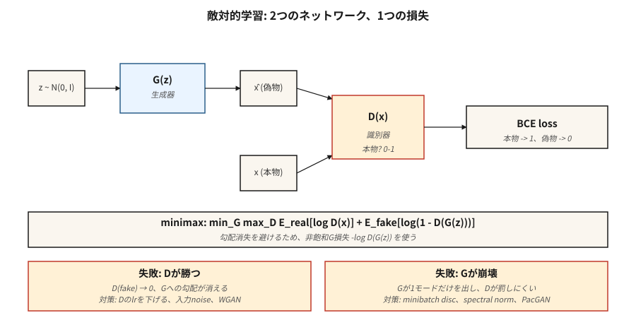

# GAN'lar — Jeneratör ve Ayırıcı

> Goodfellow'un 2014'teki numarası yoğunluğu tamamen atlamaktı. İki ağ. Biri sahtekarlık yapıyor. Biri onları yakalıyor. Sahtesi gerçeğinden ayırt edilemeyecek hale gelinceye kadar savaşırlar. Çalışmamalı. Çoğu zaman olmaz. Böyle olduğunda, örnekler hala dar alanlar için literatürdeki en keskin örneklerdir.

**Tür:** Yapım
**Diller:** Python
**Önkoşullar:** Aşama 3 · 02 (Backprop), Aşama 3 · 08 (Optimize Ediciler), Aşama 8 · 02 (VAE)
**Süre:** ~75 dakika

## Sorun

VAE'ler bulanık örnekler üretir çünkü MSE kod çözücü kayıpları *ortalama* görüntü için Bayes açısından optimaldir ve birçok makul rakamın ortalaması bulanık bir rakamdır. Herhangi bir hedefe piksel bazında yakınlığı değil, *inandırıcılığı* ödüllendiren bir kayıp istiyorsunuz. İnandırıcılık için kapalı bir form yoktur. Bunu öğrenmelisin.

Goodfellow'un fikri: Gerçek görüntüleri sahte olanlardan ayırt etmek için bir `D(x)` sınıflandırıcıyı eğitmek. `D`'yi kandırmak için bir `G(z)` jeneratörünü eğitin. `G` için kayıp sinyali, `D`'nin şu anda bir şeyin gerçek görünmesini sağladığını düşündüğü şeydir. Bu sinyal, `G` hareket eden bir hedefi takip ederek geliştikçe güncellenir. Her iki ağ da birleşirse, `G`, `log p(x)`'yi hiç yazmadan veri dağıtımını öğrenmiştir.

Bu bir düşman eğitimidir. Matematik bir minimax oyunudur:

```
min_G max_D  E_real[log D(x)] + E_fake[log(1 - D(G(z)))]
```

2026'da GAN'lar artık SOTA oluşturucusu olmayacak (difüzyon ve akış eşleştirme bu tacı yedi). Ancak StyleGAN 2/3 şimdiye kadar gönderilen en keskin yüzlü modeller olmaya devam ediyor, GAN ayırıcıları difüzyon eğitiminde *algısal kayıplar* olarak kullanılıyor ve çekişmeli eğitim, gerçek zamanlı difüzyon göndermenize olanak tanıyan hızlı 1 adımlı damıtmaları (SDXL-Turbo, SD3-Turbo, LCM) güçlendiriyor.

## Konsept



**Jeneratör `G(z)`.** `z ~ N(0, I)` gürültü vektörünü bir `x̂` örneğiyle eşler. Kod çözücü şeklinde bir ağ (yoğun veya aktarılmış dönüşüm).

**Ayırıcı `D(x)`.** Bir örneği skaler bir olasılıkla (veya puanla) eşler. Gerçek → 1, sahte → 0.

**Kayıp.** İki alternatif güncelleme:

- **`D` treni:** `loss_D = -[ log D(x) + log(1 - D(G(z))) ]`. Gerçek=1, sahte=0'da ikili çapraz entropi.
- **`G` treni:** `loss_G = -log D(G(z))`. Bu, Goodfellow'un kullandığı *doymayan* formdur (orijinal `log(1 - D(G(z)))`, `D` kendinden emin olduğunda gradient'leri doyurur ve öldürür).

**Eğitim döngüsü.** Bir adım `D`, bir adım `G`. Tekrarlamak.

**Neden işe yarıyor?** `G`, `p_data` ile mükemmel bir şekilde eşleşirse, `D` şanstan daha iyisini yapamaz ve her yerde 0,5 çıktı verir; `G` artık gradient almıyor. Denge.

**Neden bozulur?** Modun çökmesi (`G`, `D`'nin sınıflandıramadığı bir mod bulur ve onu sonsuza kadar basar), gradient'nin ortadan kaybolması (`D` çok hızlı öğrenir ve `log D` doygunluğa ulaşır), eğitim istikrarsızlığı (öğrenme oranları, parti boyutları, herhangi bir şey).

## GAN'ların çalışmasını sağlayan değişkenler

| Yıl | Yenilik | Düzelt |
|------|------------|-----|
| 2015 | DCGAN | Conv/deconv, toplu norm, LeakyReLU — ilk kararlı mimari. |
| 2017 | WGAN, WGAN-GP | BCE'yi Wasserstein mesafesi + gradient cezası ile değiştirin. gradient'nin kaybolması düzeltildi. |
| 2017 | Spektral normalleştirme | Ayrımcıyı Lipschitz bağladı. 2026'daki ayırıcılarda hala kullanılıyor. |
| 2018 | Aşamalı GAN | Önce düşük çözünürlüğü eğitin, katman ekleyin. İlk megapiksel sonuçları. |
| 2019 | StilGAN / StilGAN2 | Haritalama ağı + uyarlanabilir örnek normu. Sabit alanlı fotogerçekçilik için son teknoloji. |
| 2021 | StilGAN3 | Takma ad içermeyen, çeviriye eşdeğer — 2026'da hâlâ altın standart olarak kabul ediliyor. |
| 2022 | StilGAN-XL | Koşullu, sınıfa duyarlı, daha büyük ölçekli. |
| 2024 | R3GAN | Daha güçlü düzenlemeyle yeniden markalamalar; 1024²'de hile olmadan çalışır. |

```figure
gan-minimax
```

## İnşa Et

`code/main.py`, küçük bir GAN'ı 1 boyutlu veriler üzerinde eğitir: iki Gauss'un karışımı. Jeneratör ve ayırıcı tek gizli katmanlı MLP'lerdir. İleri, geri ve minimax döngüsünü elle uyguluyoruz. Amaç, iki temel arıza modunu (mod çökmesi + kaybolma gradient) gerçekleştiği anda görmektir.

### Adım 1: Doymayan kayıp

D, G'nin sahtesini yüksek güvenle sahte olarak sınıflandırdığında vanilya Goodfellow kaybı `log(1 - D(G(z)))` 0'a gider. Bu noktada G için gradient temelde sıfırdır — G gelişemez. Doymamış form olan `-log D(G(z))`'nin asimptotu zıttır: D kendinden emin olduğunda patlar ve G'ye güçlü bir sinyal verir.

```python
def g_loss(d_fake):
    # maximize log D(G(z))  <=>  minimize -log D(G(z))
    return -sum(math.log(max(p, 1e-8)) for p in d_fake) / len(d_fake)
```

### Adım 2: jeneratör adımı başına bir ayırıcı adım

```python
for step in range(steps):
    # train D
    real_batch = sample_real(batch_size)
    fake_batch = [G(z) for z in sample_noise(batch_size)]
    update_D(real_batch, fake_batch)

    # train G
    fake_batch = [G(z) for z in sample_noise(batch_size)]  # fresh fakes
    update_G(fake_batch)
```

G için yeni sahteler, aksi halde gradient'ler bayattır.

### 3. Adım: modun çöküşünü izleyin

```python
if step % 200 == 0:
    samples = [G(z) for z in sample_noise(500)]
    mode_a = sum(1 for s in samples if s < 0)
    mode_b = 500 - mode_a
    if min(mode_a, mode_b) < 50:
        print("  [!] mode collapse: one mode is starved")
```

Kanonik belirti: iki gerçek moddan birinin üretiminin durması. Ayırıcı kişi bunu düzeltmeyi bırakır çünkü hiçbir zaman sahte olarak görülmez.

## Tuzaklar

- **Ayırıcı çok güçlü.** D'nin öğrenme oranını 2-5 kat azaltın veya örnek/katman gürültüsü ekleyin. D >%95 doğruluğa ulaşırsa G ölür.
- **Jeneratör bir modu ezberler.** D girişlerine gürültü ekleyin, bir mini parti ayırıcı katman kullanın veya WGAN-GP'ye geçin.
- **Toplu norm sızıntı istatistikleri.** Aynı BN katmanından akan gerçek toplu + sahte toplu, istatistiklerini karıştırır. Bunun yerine örnek normu veya spektral normu kullanın.
- **Başlangıç skorlu oyun.** FID ve IS, düşük örnek sayılarında gürültülüdür. Değerlendirmede ≥10k numune kullanın.
- **Tek seferlik örnekleme, koşullu görevler için bir yalandır.** Kullanılabilir çıktılar elde etmek için hâlâ CFG ölçeklerine, kesme hilelerine ve yeniden örneklemeye ihtiyacınız var.

## Kullan onu

2026 GAN yığını:

| Durum | Seç |
|-----------|------|
| Fotogerçek insan yüzleri, sabit poz | StyleGAN3 (en keskin, en küçük) |
| Anime / stilize yüzler | StilGAN-XL veya Kararlı Difüzyon LoRA |
| Resimden resme çeviri | Pix2Pix / CycleGAN (Aşama 8 · 04) veya ControlNet (Aşama 8 · 08) |
| Hızlı 1 adımda metinden resme | Difüzyonun ters damıtılması (SDXL-Turbo, SD3-Turbo) |
| Yayılım eğiticisinin içindeki algı kaybı | Görüntü kırpmalarında küçük GAN ayırıcı |
| Çok modlu, açık uçlu her şey | Yapmayın — yayılma veya akış eşleştirmeyi kullanmayın |

GAN'lar keskin ama dardır. Etki alanınız açıldığında (fotoğraflar, isteğe bağlı metin prompt'ler, video) dağıtıma geçin. Düşmanlık hilesi, bağımsız bir jeneratör olarak değil, bir bileşen (algısal kayıplar, damıtma) olarak varlığını sürdürüyor.

## Gönderin

`outputs/skill-gan-debugger.md`'yi kaydedin. Skill, başarısız bir GAN çalıştırmasını (kayıp eğrileri, örnek ızgara, dataset boyutu) alır ve olası nedenlerin sıralı bir listesini, tek satırlık düzeltmeleri ve yeniden çalıştırma protokolünü çıkarır.

## Egzersizler

1. **Kolay.** `code/main.py`'yi stok ayarlarıyla çalıştırın. Daha sonra `D_LR = 5 * G_LR`'yi ayarlayın ve yeniden çalıştırın. G'nin kaybı ne kadar hızlı bir sabite çöker?
2. **Orta.** Goodfellow BCE kaybını WGAN kaybıyla değiştirin: `loss_D = E[D(fake)] - E[D(real)]`, `loss_G = -E[D(fake)]` ve D'nin ağırlıklarını `[-0.01, 0.01]`'ye klipsleyin. Eğitim daha istikrarlı mı? Duvar saati yakınsamasını karşılaştırın.
3. **Zor.** 1 boyutlu örneği 2 boyutlu verilere (bir halkadaki 8 Gauss'un karışımı) genişletin. Jeneratörün 1k, 5k, 10k adımlarında 8 moddan kaç tanesini yakaladığını takip edin. Mini parti ayrımını uygulayın ve yeniden ölçün.

## Anahtar Terimler

| Dönem | İnsanlar ne diyor | Aslında ne anlama geliyor |
|------|-----------------|-----------------------|
| Jeneratör | "G" | Gürültüden örnekleme ağı, `G: z → x̂`. |
| Ayırıcı | "D" | Sınıflandırıcı `D: x → [0, 1]`, gerçek ve sahte. |
| Minimaks | "Oyun" | `min_G max_D` ortak bir hedefin. |
| Doymamış kayıp | "Düzeltme" | G için `log(1 - D(G(z)))` yerine `-log D(G(z))` kullanın. |
| Mod daralt | "G bir şeyi ezberledi" | Jeneratör, çeşitli verilere rağmen az sayıda farklı çıktı üretir. |
| WGAN | "Wasserstein" | BCE'yi Earth-Mover mesafesi + gradient cezasıyla değiştirin; daha pürüzsüz gradient. |
| Spektral norm | "Lipschitz numarası" | D'nin ağırlık normlarını eğimini sınırlayacak şekilde sınırlayın; antrenmanı stabilize eder. |
| StilGAN | "Çalışan" | Haritalama ağı + AdaIN; Yüzler için sınıfının en iyisi, hâlâ 2026'da. |

## Üretim notu: tek seferlik inference, GAN'ın kalıcı avantajıdır

GAN'lar artık açık alan oluşturmada örnek kalitesinden kazanmıyor ancak yine de inference maliyetinden kazanıyorlar. Üretim-inference literatür sözlüğünde bir GAN şunları içerir:

- **Ön doldurma yok, kod çözme aşaması yok.** Tek bir `G(z)` ileri geçiş. TTFT ≈ toplam gecikme.
- **KV-önbellek baskısı yok.** Tek durum ağırlıklardır. Toplu iş boyutu önbellekle değil etkinleştirme belleğiyle sınırlıdır.
- **Önemsiz sürekli toplu işlem.** Her istek aynı sabit FLOP'ları aldığından, sunucunun hedef doluluğundaki statik toplu iş genellikle en uygunudur. Uçuş sırasında programlayıcıya gerek yok.

GAN damıtmanın (SDXL-Turbo, SD3-Turbo, ADD, LCM) 2026'da hızlı metinden görüntüye yönelik baskın teknik olmasının nedeni budur: 20-50 adımlı bir difüzyon hattını 1-4 GAN tarzı ileri geçişlere daraltırken bir difüzyon tabanının dağılımını korur. Düşmanın kaybı, yavaş jeneratörleri hızlı jeneratörlere dönüştürmek için bir eğitim süresi düğmesi olarak varlığını sürdürüyor.

## Daha Fazla Okuma

- [Goodfellow ve ark. (2014). Üretken Rekabet Ağları](https://arxiv.org/abs/1406.2661) — orijinal GAN ​​makalesi.
-[Radford ve ark. (2015). DCGAN](https://arxiv.org/abs/1511.06434) ile Denetimsiz Temsil Öğrenimi — ilk kararlı mimari.
- [Arjovsky, Chintala, Bottou (2017). Wasserstein GAN](https://arxiv.org/abs/1701.07875) — WGAN.
- [Miyato ve ark. (2018). GAN'lar için Spektral Normalleştirme](https://arxiv.org/abs/1802.05957) — SN.
- [Karras ve ark. (2020). StyleGAN'ın Görüntü Kalitesini Analiz Etme ve İyileştirme](https://arxiv.org/abs/1912.04958) — StyleGAN2.
- [Karras ve ark. (2021). Takma Adsız Üretken Çekişmeli Ağlar](https://arxiv.org/abs/2106.12423) — StyleGAN3.
- [Sauer ve ark. (2023). Adversarial Difüzyon Damıtma](https://arxiv.org/abs/2311.17042) — SDXL-Turbo.
