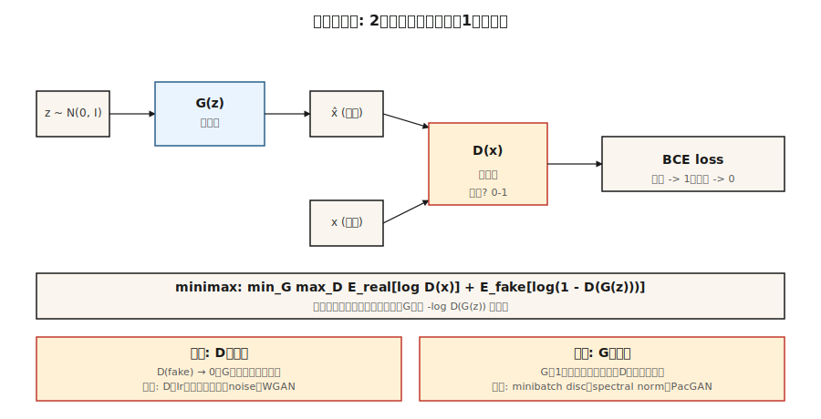

# GAN — 生成器 vs 判别器

> Goodfellow 在 2014 年的巧思是彻底跳过密度估计。两个网络。一个制造假样本。一个负责捕捉。它们相互对抗，直到假样本与真实样本无法区分。这个方法理论上不该奏效——实际上也常常失败。但当它成功时，在狭窄领域内生成的样本仍然是文献中最清晰的。

**类型：** 构建
**语言：** Python
**前置知识：** 阶段 3 · 02（反向传播），阶段 3 · 08（优化器），阶段 8 · 02（VAE）
**时间：** ~75 分钟

## 问题

VAE 生成的样本模糊，原因是其均方误差（MSE）解码器损失对于*平均*图像是贝叶斯最优的——而多个合理数字的平均值就是一个模糊的数字。我们需要一种奖励*合理性*的损失函数，而不是像素级接近某个单一目标。合理性没有闭式解，必须通过学习获得。

Goodfellow 的想法：训练一个分类器 `D(x)` 来区分真实图像和假图像。训练一个生成器 `G(z)` 来欺骗 `D`。`G` 的损失信号来自于 `D` 当前认为什么东西看起来真实。这个信号会随着 `G` 的改进而更新，追随着一个移动的目标。如果两个网络收敛，`G` 就学会了数据分布，而从未显式写出 `log p(x)`。

这就是对抗训练。其数学形式是一个极小极大博弈：

```
min_G max_D  E_real[log D(x)] + E_fake[log(1 - D(G(z)))]
```

在 2026 年，GAN 已不再是 SOTA 生成器（扩散和流匹配已经取代了它的地位）。但 StyleGAN 2/3 仍然是史上最清晰的人脸模型，GAN 判别器被用作扩散训练中的*感知损失*，而对抗训练驱动了快速一步蒸馏（SDXL-Turbo、SD3-Turbo、LCM），使得实时扩散成为可能。

## 概念



**生成器 `G(z)`。** 将噪声向量 `z ~ N(0, I)` 映射到样本 `x̂`。一个解码器形状的网络（全连接层或转置卷积）。

**判别器 `D(x)`。** 将样本映射到一个标量概率（或分数）。真实 → 1，虚假 → 0。

**损失。** 两个交替更新的步骤：

- **训练 `D`：** `loss_D = -[ log D(x) + log(1 - D(G(z))) ]`。对真实标签=1、虚假标签=0 的二元交叉熵。
- **训练 `G`：** `loss_G = -log D(G(z))`。这是 Goodfellow 使用的*非饱和*形式（原始的 `log(1 - D(G(z)))` 在 `D` 自信时会饱和并杀死梯度）。

**训练循环。** 一步 `D`，一步 `G`。重复。

**为什么有效。** 如果 `G` 完美匹配 `p_data`，那么 `D` 只能随机猜测，输出全为 0.5；`G` 不再获得梯度。达到均衡。

**为什么会失败。** 模式崩塌（`G` 找到一个 `D` 无法分类的模式，然后无限生产该模式）、梯度消失（`D` 学习过快，`log D` 饱和）、训练不稳定（学习率、批量大小、任何因素都可能）。

## 使 GAN 有效工作的变体

| 年份 | 创新 | 修复 |
|------|------|------|
| 2015 | DCGAN | 卷积/反卷积、批归一化、LeakyReLU——第一个稳定架构。 |
| 2017 | WGAN, WGAN-GP | 用 Wasserstein 距离 + 梯度惩罚替代 BCE。修复梯度消失。 |
| 2017 | 谱归一化 | 对判别器施加 Lipschitz 约束。2026 年的判别器中仍在使用。 |
| 2018 | Progressive GAN | 先训练低分辨率，再逐层添加。首次实现百万像素结果。 |
| 2019 | StyleGAN / StyleGAN2 | 映射网络 + 自适应实例归一化。固定领域照片级真实感的 SOTA。 |
| 2021 | StyleGAN3 | 无混叠、平移等变——2026 年仍是人脸黄金标准。 |
| 2022 | StyleGAN-XL | 条件式、类别感知、更大规模。 |
| 2024 | R3GAN | 通过更强的正则化重新定义；在 1024² 上无需技巧即可工作。 |

## 构建它

`code/main.py` 在一个一维数据上训练一个小型 GAN：两个高斯分布的混合。生成器和判别器是单隐藏层的 MLP。我们手动实现前向、反向和极小极大循环。目标是亲眼观察两个关键失败模式（模式崩塌 + 梯度消失）的发生过程。

### 第 1 步：非饱和损失

原始的 Goodfellow 损失 `log(1 - D(G(z)))` 在 D 高度自信地判定 G 生成的假样本为假时会趋近于 0。此时 G 的梯度基本为零——G 无法改进。非饱和形式 `-log D(G(z))` 具有相反的渐近线：当 D 自信时它会爆炸，给 G 提供强烈信号。

```python
def g_loss(d_fake):
    # 最大化 log D(G(z))  <=>  最小化 -log D(G(z))
    return -sum(math.log(max(p, 1e-8)) for p in d_fake) / len(d_fake)
```

### 第 2 步：每个生成器步骤对应一个判别器步骤

```python
for step in range(steps):
    # 训练 D
    real_batch = sample_real(batch_size)
    fake_batch = [G(z) for z in sample_noise(batch_size)]
    update_D(real_batch, fake_batch)

    # 训练 G
    fake_batch = [G(z) for z in sample_noise(batch_size)]  # 全新的假样本
    update_G(fake_batch)
```

为 G 使用全新的假样本，否则梯度会过时。

### 第 3 步：监控模式崩塌

```python
if step % 200 == 0:
    samples = [G(z) for z in sample_noise(500)]
    mode_a = sum(1 for s in samples if s < 0)
    mode_b = 500 - mode_a
    if min(mode_a, mode_b) < 50:
        print("  [!] 模式崩塌：一个模式被饿死")
```

典型症状：两个真实模式中的一个不再被生成。判别器不再纠正它，因为从未看到它作为假样本。

## 陷阱

- **判别器太强。** 将 D 的学习率降低 2-5 倍，或添加实例/层噪声。如果 D 达到 >95% 的准确率，G 就死了。
- **生成器记住了某个模式。** 给 D 输入添加噪声，使用小批量判别器层，或切换到 WGAN-GP。
- **批归一化泄露统计量。** 真实批次和假批次流过同一个 BN 层会混合它们的统计量。改用实例归一化或谱归一化。
- **Inception 分数被操纵。** FID 和 IS 在低样本数时有噪声。评估时使用 ≥10k 样本。
- **对于条件任务来说，单次采样是谎言。** 你仍然需要 CFG 尺度、截断技巧和重采样才能获得可用的输出。

## 如何使用

2026 年的 GAN 技术栈：

| 场景 | 选择 |
|------|------|
| 照片级真实人脸，固定姿态 | StyleGAN3（最清晰，最小） |
| 动漫/风格化人脸 | StyleGAN-XL 或 Stable Diffusion LoRA |
| 图像到图像翻译 | Pix2Pix / CycleGAN（阶段 8 · 04）或 ControlNet（阶段 8 · 08） |
| 快速一步文本到图像 | 扩散的对抗蒸馏（SDXL-Turbo, SD3-Turbo） |
| 扩散训练器内部的感知损失 | 在图像块上的小型 GAN 判别器 |
| 任何多模态、开放式的场景 | 不要用——使用扩散或流匹配 |

GAN 清晰但狭窄。一旦领域开放——照片、任意文本提示、视频——就切换到扩散。对抗技巧作为组件（感知损失、蒸馏）而存在，不再是独立的生成器。

## 交付物

保存 `outputs/skill-gan-debugger.md`。技能要求：给定一个失败的 GAN 运行（损失曲线、样本网格、数据集大小），输出一个按可能性排序的原因列表、一行修复方案以及一个重新运行的协议。

## 练习

1. **简单。** 使用默认设置运行 `code/main.py`。然后将 `D_LR = 5 * G_LR` 并重新运行。G 的损失多久会塌缩为一个常数？
2. **中等。** 将 Goodfellow 的 BCE 损失替换为 WGAN 损失：`loss_D = E[D(fake)] - E[D(real)]`，`loss_G = -E[D(fake)]`，并将 D 的权重裁剪到 `[-0.01, 0.01]`。训练更稳定吗？比较收敛所需的墙钟时间。
3. **困难。** 将一维示例扩展到二维数据（环上的 8 个高斯分布混合）。追踪生成器在第 1k、5k、10k 步时捕获了多少个模式（共 8 个）。实现小批量判别然后重新测量。

## 关键术语

| 术语 | 常用说法 | 实际含义 |
|------|----------|----------|
| 生成器 (Generator) | "G" | 噪声到样本的网络，`G: z → x̂`。 |
| 判别器 (Discriminator) | "D" | 分类器 `D: x → [0, 1]`，真实 vs 虚假。 |
| 极小极大 (Minimax) | "博弈" | 联合目标的 `min_G max_D`。 |
| 非饱和损失 (Non-saturating loss) | "修复" | 对 G 使用 `-log D(G(z))` 而非 `log(1 - D(G(z)))`。 |
| 模式崩塌 (Mode collapse) | "G 记住了一个东西" | 尽管数据多样，生成器只产生少数几种不同的输出。 |
| WGAN | "Wasserstein" | 用推土机距离 + 梯度惩罚替代 BCE；梯度更平滑。 |
| 谱归一化 (Spectral norm) | "Lipschitz 技巧" | 约束 D 的权重范数以限制其斜率；稳定训练。 |
| StyleGAN | "那个能用的" | 映射网络 + AdaIN；在人脸领域同类最佳，2026 年依然如此。 |

## 生产环境备注：单次推理是 GAN 的持久优势

GAN 在开放域样本质量上已不再领先，但在推理成本上仍然胜出。从生产推理文献术语来看，GAN 具有：

- **没有预填充、没有解码阶段。** 单次 `G(z)` 前向传播。TTFT ≈ 总延迟。
- **没有 KV 缓存压力。** 唯一的状态是权重。批量大小受激活内存限制，而非缓存。
- **简单的连续批处理。** 由于每个请求的 FLOPs 固定，服务器目标占用率的静态批次通常最优。无需实时调度器。

这就是为什么 GAN 蒸馏（SDXL-Turbo、SD3-Turbo、ADD、LCM）在 2026 年是快速文本到图像的主流技术：它将 20-50 步的扩散流水线压缩为 1-4 步 GAN 风格的前向传播，同时保留扩散先验的分布。对抗损失作为训练时的调节旋钮幸存下来，用于将慢生成器变成快生成器。

## 延伸阅读

- [Goodfellow et al. (2014). Generative Adversarial Nets](https://arxiv.org/abs/1406.2661) — 原始 GAN 论文。
- [Radford et al. (2015). Unsupervised Representation Learning with DCGAN](https://arxiv.org/abs/1511.06434) — 第一个稳定架构。
- [Arjovsky, Chintala, Bottou (2017). Wasserstein GAN](https://arxiv.org/abs/1701.07875) — WGAN。
- [Miyato et al. (2018). Spectral Normalization for GANs](https://arxiv.org/abs/1802.05957) — SN。
- [Karras et al. (2020). Analyzing and Improving the Image Quality of StyleGAN](https://arxiv.org/abs/1912.04958) — StyleGAN2。
- [Karras et al. (2021). Alias-Free Generative Adversarial Networks](https://arxiv.org/abs/2106.12423) — StyleGAN3。
- [Sauer et al. (2023). Adversarial Diffusion Distillation](https://arxiv.org/abs/2311.17042) — SDXL-Turbo。