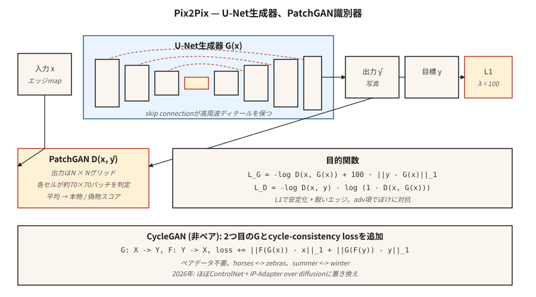

# Koşullu GAN'lar ve Pix2Pix

> 2014-2017'nin ilk büyük kilidi bir GAN'ın ne yaptığını kontrol etmekti. Bir etiket, bir resim veya bir cümle ekleyin. Pix2Pix görüntü versiyonunu yaptı ve dar görüntüden görüntüye görevlerinde hala tüm genel metinden görüntüye modelini geride bırakıyor.

**Tür:** Yapım
**Diller:** Python
**Önkoşullar:** Aşama 8 · 03 (GAN'lar), Aşama 4 · 06 (U-Net), Aşama 3 · 07 (CNN'ler)
**Süre:** ~75 dakika

## Sorun

Koşulsuz bir GAN, rastgele yüzleri örnekler. Demo için yararlı, üretimde işe yaramaz. Şunları istiyorsunuz: *bir çizimi bir fotoğrafla eşleyin*, *bir haritayı havadan çekilmiş bir fotoğrafla eşleyin*, *gündüz sahnesini geceyle eşleyin*, *gri tonlamalı bir görüntüyü renklendirin*. Bunların hepsinde, size bir giriş görüntüsü `x` verilir ve bazı anlamsal karşılıklarla birlikte `y` çıktısını almanız gerekir. `x` başına pek çok makul `y` vardır. Ortalama kare hatası onları lapa haline getirir. Rakiplerin kaybı bunu yapmaz çünkü "gerçek gibi görünmek" keskindir.

Koşullu GAN (Mirza ve Osindero, 2014), hem `G` hem de `D`'ye giriş olarak bir `c` koşulu ekler. Pix2Pix (Isola ve diğerleri, 2017) şu konuda uzmanlaşmıştır: durum tam giriş görüntüsüdür, oluşturucu bir U-Net'tir, ayırıcı *yama tabanlı* bir sınıflandırıcıdır (PatchGAN) ve kayıp çekişmeli + L1'dir. Bu tarif, *eşleştirilmiş veriler* üzerinde eğitildiğinden, dar görüntüden görüntüye etki alanlarında sıfırdan metinden görüntüye modellerden daha iyi performans gösterir; çünkü tam olarak ihtiyacınız olan sinyale sahipsiniz.

## Konsept



**Koşullu G.** `G(x, z) → y`. Pix2Pix'te, `z`, G'nin içinde çıkar (giriş gürültüsü yok — Isola, açık gürültünün göz ardı edildiğini buldu).

**Koşullu D.** `D(x, y) → [0, 1]`. Giriş *çifttir* (koşul, çıkış). Temel fark budur: D, yalnızca `y`'nin gerçek görünüp görünmediğini değil, `y`'nin `x` ile tutarlı olup olmadığına karar vermelidir.

**U-Net generator.** ​​Darboğaz boyunca atlama bağlantılarına sahip kodlayıcı-kod çözücü. Giriş ve çıkışın düşük seviyeli yapıyı (kenarlar, siluet) paylaştığı görevler için kritiktir. Atlamalar olmazsa yüksek frekanslı ayrıntılar kaybolur.

**PatchGAN ayırıcı.** Tek bir gerçek/sahte puan çıktısı vermek yerine D, her hücrenin ~70×70 piksellik bir alıcı alanı değerlendirdiği bir `N×N` ızgarası çıktısı verir. Ortalama. Bu bir Markov rastgele alan varsayımıdır: gerçekçilik yereldir. Eğitmek çok daha hızlı, daha az parametre, daha keskin çıktı.

**Kayıp.**

```
loss_G = -log D(x, G(x)) + λ · ||y - G(x)||_1
loss_D = -log D(x, y) - log (1 - D(x, G(x)))
```

L1 terimi eğitimi stabilize eder ve G'yi bilinen hedefe doğru iter. L1, L2'ye göre daha keskin kenarlar verir (medyanlar, ortalamalar değil). `λ = 100` Pix2Pix'in varsayılanıydı.

## CycleGAN — çiftleriniz olmadığında

Pix2Pix'in eşleştirilmiş `(x, y)` verisine ihtiyacı var. CycleGAN (Zhu ve diğerleri, 2017), ekstra bir kayıp pahasına bu gereksinimi ortadan kaldırır: *döngü tutarlılığı* kaybı. İki generator `G: X → Y` ve `F: Y → X`. Onları `F(G(x)) ≈ x` ve `G(F(y)) ≈ y` şekilde eğitin. Bu, eşleştirilmiş örnekler olmadan atları zebralara, yazdan kışa çevirmenize olanak tanır.

2026'da, eşleştirilmemiş görüntüden görüntüye geçiş çoğunlukla CycleGAN yerine difüzyon (ControlNet, IP-Adapter) yoluyla yapılıyor, ancak döngü tutarlılığı fikri neredeyse tüm eşleştirilmemiş alan uyarlama makalelerinde varlığını sürdürüyor.

## İnşa Et

`code/main.py`, 1 boyutlu veriler üzerinde küçük bir koşullu GAN uygular. `c` koşulu bir sınıf etiketidir (0 veya 1). Görev: Verilen sınıf için koşullu dağılımdan bir örnek üretmek.

### Adım 1: koşulu hem G hem de D girişlerine ekleyin

```python
def G(z, c, params):
    return mlp(concat([z, one_hot(c)]), params)

def D(x, c, params):
    return mlp(concat([x, one_hot(c)]), params)
```

Tek sıcak kodlama en basit yoldur. Daha büyük modeller öğrenilmiş embedding'leri, FiLM modülasyonunu veya çapraz dikkati kullanır.

### Adım 2: koşullu eğitim

```python
for step in range(steps):
    x, c = sample_real_conditional()
    noise = sample_noise()
    update_D(x_real=x, x_fake=G(noise, c), c=c)
    update_G(noise, c)
```

Generatorün, marjinal değil, *verilen koşul* için gerçek dağılımla eşleşmesi gerekir.

### Adım 3: sınıf başına çıktıyı doğrulayın

```python
for c in [0, 1]:
    samples = [G(noise, c) for noise in batch]
    mean_c = mean(samples)
    assert_near(mean_c, real_mean_for_class_c)
```

## Tuzaklar

- **Koşul göz ardı edilir.** G marjinalleştirmeyi öğrenir, D koşul sinyali zayıf olduğu için asla ceza vermez. Düzeltme: D koşulu daha agresif bir şekilde (sadece geç değil, erken katman), projeksiyon discriminatorsı kullanın (Miyato ve Koyama 2018).
- **L1'in ağırlığı çok düşük.** G, sadık çıktılar yerine keyfi, gerçek görünümlü çıktılara doğru sürükleniyor. Pix2Pix tarzı görevler için λ≈100 ile başlayın.
- **L1 ağırlığı çok yüksek.** L1 hala bir L_p normu olduğundan G, bulanık çıktılar üretir. Eğitim stabil hale geldiğinde tavlayın.
- **D'de temel gerçek sızıntısı.** Yalnızca `y`'yi değil, `(x, y)`'yi D girişi olarak birleştirin. Bu olmadan D tutarlılığı kontrol edemez.
- **Sınıf başına mod çöküşü.** Her sınıf bağımsız olarak daraltılabilir. Sınıf koşullu çeşitlilik kontrollerini çalıştırın.

## Kullan onu

Görüntüden görüntüye görevlerin 2026 durumu:

| Görev | En iyi yaklaşım |
|------|---------------|
| Taslak → fotoğraf, aynı alan adı, eşleştirilmiş veriler | Pix2Pix / Pix2PixHD (hala hızlı, hâlâ keskin) |
| Taslak → fotoğraf, eşleştirilmemiş | Scribble koşullandırma modeline sahip ControlNet |
| Semantik seg → fotoğraf | SPADE / GauGAN2 veya SD + ControlNet-Seg |
| Stil aktarımı | IP Adaptörü veya LoRA ile Dağıtım; GAN yöntemleri eskidir |
| Derinlik → fotoğraf | Stable Diffusion Üzerinden ControlNet Derinliği |
| Süper çözünürlük | Real-ESRGAN (GAN), ESRGAN-Plus veya SD-Upscale (yayılım) |
| Renklendirme | ColTran, difüzyon bazlı renklendiriciler veya Pix2Pix-color |
| Gündüz → gece, mevsimler, hava durumu | CycleGAN veya ControlNet tabanlı |

Pix2Pix, (a) binlerce eşleştirilmiş örneğiniz olduğunda, (b) görev dar ve tekrarlanabilir olduğunda ve (c) hızlı inference ihtiyacınız olduğunda doğru araç olmaya devam eder. Genel açık alan görevlerinde yayılma kazanır.

## Gönderin

`outputs/skill-img2img-chooser.md`'yi kaydet. Skill bir görev tanımını, veri kullanılabilirliğini (eşleştirilmiş ve eşleşmemiş, N örnek) ve gecikme/kalite bütçesini alır ve ardından çıktılar verir: yaklaşım (Pix2Pix, CycleGAN, ControlNet varyantı, SDXL + IP Adaptörü), eğitim verileri gereksinimleri, inference maliyeti ve değerlendirme protokolü (LPIPS, FID, göreve özel).

## Egzersizler

1. **Kolay.** Üçüncü bir sınıf eklemek için `code/main.py` öğesini değiştirin. G'nin hala her sınıfın gürültüsünü doğru moda eşlediğini doğrulayın.
2. **Orta.** 1-B ayarında L1'i algısal stil kaybıyla değiştirin (e.g. özellik çıkarıcı görevi gören küçük donmuş bir D). Koşullu dağılımın keskinliğini değiştirir mi?
3. **Zor.** 1 boyutlu ortamda bir CycleGAN taslağı çizin: iki dağıtım, iki generator, döngü kaybı. Eşleştirilmiş veri olmadan bunlar arasında eşleme yapmayı öğrendiğini gösterin.

## Anahtar Terimler

| Dönem | İnsanlar ne diyor | Aslında ne anlama geliyor |
|------|-----------------|-----------------------|
| Koşullu GAN | "Etiketli GAN" | G(z, c), D(x, c). Her iki ağ da durumu görüyor. |
| Pix2Pix | "Görüntüden görüntüye GAN" | cGAN'ı U-Net G ve PatchGAN D + L1 kaybıyla eşleştirdi. |
| U-Net | "Atlamalı kodlayıcı-kod çözücü" | Simetrik dönüşüm ağı; atlamalar yüksek frekansı korur. |
| YamaGAN | "Yerel gerçekçilik sınıflandırıcısı" | D, genel puan yerine yama başına puan verir. |
| DöngüGAN | "Eşleştirilmemiş görüntü çevirisi" | İki G + döngü tutarlılığı kaybı; eşleştirilmiş veri yok. |
| KÜRE | "GauGAN" | Anlamsal harita ile ara aktivasyonları normalleştirir; görüntüye segmentasyon. |
| FİLM | "Özellik açısından doğrusal modülasyon" | Koşuldan özellik başına afin dönüşüm; ucuz klima. |

## Üretim notu: Gecikmeye bağlı bir temel çizgi olarak Pix2Pix

Verileri eşleştirdiğinizde ve dar bir göreve (çizgi → oluşturma, anlamsal harita → fotoğraf, gündüz → gece) sahip olduğunuzda, Pix2Pix'in tek seferlik inference özelliği, gecikme açısından difüzyonu büyüklük sırasına göre geride bırakır. Üretim karşılaştırması genellikle:

| Yol | Adımlar | Tek bir L4'te 512²'lik tipik gecikme |
|------|-------|----------------------------------------|
| Pix2Pix (U-Net ileri) | 1 | ~30 ms |
| SD-Inpaint veya SD-Img2Img | 20 | ~1,2 sn |
| SDXL-Turbo Img2Img | 1-4 | ~0,15-0,35 sn |
| ControlNet + SDXL tabanı | 20-30 | ~3-5 sn |

Pix2Pix, statik gruplar halinde üretimde kazanır (her istek aynı FLOP'tur). Yayılma, kalite ve genelleme açısından kazanır. Modern oyun genellikle dar görev için Pix2Pix tarzı damıtılmış bir model ve kuyruk girişleri için bir difüzyon geri dönüşü sunmaktır.

## Daha Fazla Okuma

- [Mirza ve Osindero (2014). Koşullu Üretken Çekişmeli Ağlar](https://arxiv.org/abs/1411.1784) — cGAN makalesi.
- [Isola ve diğerleri. (2017). Koşullu Çekişmeli Ağlarla Görüntüden Görüntüye Çeviri](https://arxiv.org/abs/1611.07004) — Pix2Pix.
- [Zhu ve ark. (2017). Döngüyle Tutarlı Çekişmeli Ağlar Kullanarak Eşleştirilmemiş Görüntüden Görüntüye Çeviri](https://arxiv.org/abs/1703.10593) — CycleGAN.
- [Wang ve ark. (2018). Koşullu GAN'larla Yüksek Çözünürlüklü Görüntü Sentezi](https://arxiv.org/abs/1711.11585) — Pix2PixHD.
- [Park ve ark. (2019). Uzamsal Olarak Uyarlanabilir Normalleştirme ile Semantik Görüntü Sentezi](https://arxiv.org/abs/1903.07291) — SPADE / GauGAN.
- [Miyato ve Koyama (2018). Projeksiyon Discriminatorlı cGAN'lar](https://arxiv.org/abs/1802.05637) — projeksiyon D.
