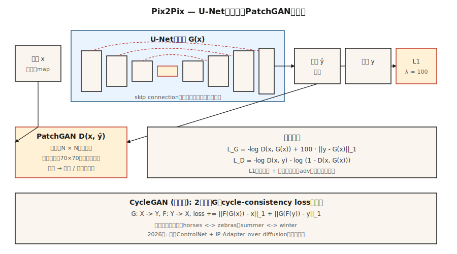

# 有条件的GAN和Pix2 Pix

> 2014-2017年的第一个重大解锁是控制GAN的制作内容。附上标签、图像或句子。Pix 2 Pix开发了图像版本，在狭窄的图像到图像任务上，它仍然优于所有通用的文本到图像模型。

** 类型：** 构建
** 语言：** Python
** 先决条件：** 阶段8 · 03（GAN）、阶段4 · 06（U-Net）、阶段3 · 07（CNN）
** 时间：** ~75分钟

## 问题

无条件GAN采样任意面孔。对于演示有用，在生产中无用。您需要：* 将草图映射到照片 *、* 将地图映射到航空照片 *、* 将日间场景映射到夜间 *、* 对灰度图像进行着色 *。在所有这些中，您都会收到一个输入图像“x”，并且必须输出具有一些语义对应的“y”。每个“x”有许多看似合理的“y”。均方误差会让它们陷入困境。对抗性损失则不然，因为“看起来真实”是尖锐的。

条件GAN（Mirza & Osindero，2014）添加条件“c”作为“G”和“D”的输入。Pix 2 Pix（Isola等人，2017年）专门化：条件是完整输入图像，生成器是U-Net，RST是 * 基于补丁的 * 分类器（PatchGAN），损失是对抗+ L1。即使在2026年，该食谱在狭窄的图像到图像域上的表现也优于从头开始的文本到图像模型，因为它是在 * 配对数据 * 上训练的--您拥有所需的信号。

## 概念



** 有条件G。** ' G（x，z）-y '。在Pix 2 Pix中，“z”在G内是dropout（没有输入噪音- Isola发现显式噪音被忽略）。

** 有条件D。** ' D（x，y）→ [0，1]'。输入是 * 对 *（条件、输出）。这是关键区别：D必须判断“y”是否与“x”一致，而不仅仅是“y”看起来是否真实。

**U-Net生成器。**跨越瓶颈跳过连接的编码器-解码器。对于输入和输出共享低级结构（边缘、轮廓）的任务至关重要。如果没有跳过，高频细节就会消失。

**PatchGAN酒店，纽约 ** D输出的不是一个单一的真/假分数，而是一个“N×N”网格，每个细胞判断一个约70×70像素的感受野。平均值。这是一个马尔可夫随机场假设：现实主义是局部的。训练速度更快、参数更少、输出更清晰。

** 损失。**

```
loss_G = -log D(x, G(x)) + λ · ||y - G(x)||_1
loss_D = -log D(x, y) - log (1 - D(x, G(x)))
```

L1术语稳定训练并推动G达到已知目标。L1的边缘比L2更清晰（中位数，而不是平均值）。Pix2 Pix默认设置为“A = 100”。

## CycleGAN -当你没有配对时

Pix2Pix需要成对的`（x，y）`数据。CycleGAN（Zhu等人，2017）以额外损失为代价放弃了这一要求：* 周期一致性 * 损失。两个发生器`G：X → Y`和`F：Y → X`。训练它们，使其“F（G（x））x”和“G（F（y））y”。这可以让您将马翻译为斑马，从夏天翻译为冬天，而无需配对示例。

2026年，未配对的图像到图像主要通过扩散（控制Net、IP适配器）而不是CycleGAN完成，但循环一致性的想法几乎在所有未配对的域适应论文中都存在。

## 建设党

' code/main.py '在1-D数据上实现了一个微小的条件GAN。条件“c”是类标签（0或1）。任务：从给定类的条件分布中生成样本。

### 步骤1：将条件添加到G和D输入

```python
def G(z, c, params):
    return mlp(concat([z, one_hot(c)]), params)

def D(x, c, params):
    return mlp(concat([x, one_hot(c)]), params)
```

一热编码是最简单的方法。较大的模型使用习得嵌入、FiLM调制或交叉注意。

### 第2步：有条件训练

```python
for step in range(steps):
    x, c = sample_real_conditional()
    noise = sample_noise()
    update_D(x_real=x, x_fake=G(noise, c), c=c)
    update_G(noise, c)
```

生成器必须匹配给定条件 * 的真实分布 *，而不是边际分布。

### 第3步：验证每个类的输出

```python
for c in [0, 1]:
    samples = [G(noise, c) for noise in batch]
    mean_c = mean(samples)
    assert_near(mean_c, real_mean_for_class_c)
```

## 陷阱

- ** 条件被忽略。** G学会边缘化，D从不因为条件信号弱而惩罚。修复：条件D更积极（早期层，而不仅仅是后期），使用投影预设（Miyato & Koyama 2018）。
- **L1重量太低。** G漂移到任意的真实外观的输出，而不是忠实的输出。针对Pix2 Pixi风格的任务启动| 100。
- **L1重量太高。** G会产生模糊的输出，因为L1仍然是L_p规范。训练稳定后进行退欧。
- ** D中的地面真相泄露。**将“（x，y）”串联为D输入，而不仅仅是“y”。如果没有这个D就无法检查一致性。
- ** 每个班级的模式崩溃。**每个类都可以独立崩溃。运行类别条件多样性检查。

## 使用它

2026年图像到图像任务状态：

| 任务 | 最佳方法 |
|------|---------------|
| 草图→照片，相同域，配对数据 | Pix 2 Pix/Pix 2 PixHD（仍然快速，仍然锐利） |
| 草图-照片，未配对 | 具有Scribble条件模型的ControlNet |
| 语义段-照片 | SPADE /GauGAN 2或SD + Control Net-Seg |
| 风格迁移 | 使用IP适配器或LoRA进行传播; GAN方法是遗留的 |
| 深度-照片 | 稳定扩散上的控制网深度 |
| 超分辨率 | Real-ESRGAN（GAN）、ESRGAN-Plus或SD-Upscale（扩散） |
| 彩色化 | ColTran、基于扩散的着色剂或Pix 2 Pix-Color |
| 白天-夜间、季节、天气 | CycleGAN或基于Control Net |

当（a）您有数千个配对示例，（b）任务范围狭窄且可重复，并且（c）您需要快速推理时，Pix2 Pix仍然是合适的工具。在通用开放领域任务中，扩散获胜。

## 把它运

保存“输出/skill-img2img-chooser.md”。Skill获取任务描述、数据可用性（配对与未配对，N个样本）和延迟/质量预算，然后输出：方法（Pix 2 Pix、CycleGAN、ControlNet变体、SDXL + IP-适配器）、训练数据要求、推断成本和评估协议（LPIPS、DID、特定任务）。

## 演习

1. ** 简单。**修改' code/main.py '以添加第三类。确认G仍然将每个类别的噪音映射到正确的模式。
2. ** 中等。**用1-D设置中的感知风格损失替换L1（例如，小的冻结D充当特征提取器）。它会改变条件分布的清晰度吗？
3. ** 很难。**在1-D设置中绘制CycleGAN：两个分布、两个生成器、循环损失。表明它学会在没有配对数据的情况下在它们之间进行映射。

## 关键术语

| Term | 别人怎么说 | 它实际上意味着什么 |
|------|-----------------|-----------------------|
| 条件GAN | “带标签的GAN” | G（z，c），D（x，c）。两个网络都看到了这种情况。 |
| Pix2Pix | “图像到图像GAN” | 配对cGAN与U-Net G和PatchGAN D + L1损失。 |
| U-Net | “带跳跃的编码器-解码器” | 对称转换网络;跳过保留高频。 |
| PatchGAN | “地方现实主义分类器” | D输出每个补丁的分数，而不是全局分数。 |
| CycleGAN | “未配对的图像翻译” | 两个G+循环一致性丧失;没有配对数据。 |
| 黑桃 | “GaugAN” | 使用语义地图规范中间激活;分割到图像。 |
| 膜 | “逐流线性调制” | 根据条件进行的每个特征仿射变换;廉价的条件反射。 |

## 制作注释：Pix2 Pix作为延迟界限基线

当您拥有配对的数据和一项狭窄任务（草图、渲染、语义地图、照片、白天、夜晚）时，Pix2 Pix的一次性推理在延迟方面比扩散要好一个数量级。生产比较通常是：

| 路径 | 步骤 | 单个L4上的典型延迟为512² |
|------|-------|----------------------------------------|
| Pix 2 Pix（U-Net前锋） | 1 | 约30 ms |
| SD-Inpaint或SD-Img 2Img | 20 | ~1.2秒 |
| SDXL-Turbo Img 2 IMG | 1-4 | ~0.15-0.35秒 |
| 控制网络+ SDXL基础 | 20-30 | 约3-5秒 |

Pix2 Pix在静态批处理中的吞吐量上获胜（每个请求都是相同的FLOP）。扩散在质量和普遍性上获胜。现代游戏通常是为狭窄任务运送Pix2 Pixi风格的提炼模型，并为尾部输入提供扩散后备。

## 进一步阅读

- [Mirza & Osindero（2014）。条件生成对抗网络]（https：//arxiv.org/ab/1411.1784）-cGAN论文。
- [Isola等人（2017）。使用条件对抗网络的图像到图像翻译]（https：//arxiv.org/abs/1611.07004）-Pix 2 Pix。
- [Zhu等人（2017）。使用循环一致对抗网络的未配对图像到图像翻译]（https：//arxiv.org/ab/1703.10593）- CycleGAN。
- [Wang等人（2018）。使用条件GAN的高分辨率图像合成]（https：//arxiv.org/ab/1711.11585）-Pix 2 PixHD。
- [Park等人（2019）。使用空间自适应归一化的语义图像合成]（https：//arxiv.org/abs/1903.07291）- SPADE / GauGAN。
- [Miyato & Koyama（2018）.具有投影鉴别器的cGANs]（https：//arxiv.org/abs/1802.05637）-投影D.
