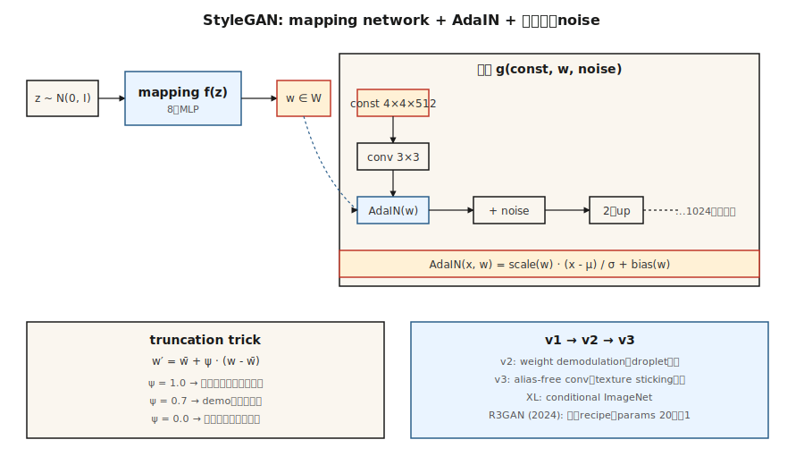

# StyleGAN

> ほとんどの生成器は、すべての層に同時に `z` を混ぜ込みます。StyleGAN はそれを分解しました。まず `z` を中間表現 `w` に写像し、そのうえで AdaIN によって各解像度レベルへ `w` を注入します。このひとつの変更で潜在空間のもつれがほどけ、フォトリアルな顔生成はその後 7 年にわたって解けた問題になりました。

**種別:** 構築
**言語:** Python
**前提条件:** Phase 8 · 03 (GANs), Phase 4 · 08 (Normalization), Phase 3 · 07 (CNNs)
**所要時間:** 約45分

## 問題

DCGAN は、転置畳み込みのスタックを通して `z` を画像へ写像します。問題は、`z` が姿勢、照明、アイデンティティ、背景のすべてを、もつれたまま制御してしまうことです。`z` の 1 軸に沿って動かすと、4 つすべてが変わります。表現がそのように分解されていないため、モデルに「同じ人物で、違う姿勢」と頼むことはできません。

Karras et al. (2019, NVIDIA) は、`z` を畳み込み層へ直接入れるのをやめることを提案しました。ネットワーク入力として定数の `4×4×512` テンソルを与えます。`z ∈ Z → w ∈ W` を写像する 8 層 MLP を学習します。*adaptive instance normalization* (AdaIN) によって、各解像度で `w` を注入します。つまり各畳み込み特徴マップを正規化し、`w` のアフィン射影でスケールとシフトを与えます。さらに、皮膚の毛穴や髪の束のような確率的な細部のために、層ごとのノイズを追加します。

結果として、`W` は「高レベルのスタイル」(姿勢、アイデンティティ) と「細かなスタイル」(照明、色) について、おおむね直交した軸を持つようになります。低解像度レベルでは画像 A の `w` を使い、高解像度レベルでは画像 B の `w` を使うことで、2 枚の画像のスタイルを交換できます。これにより、編集、ドメイン横断のスタイライズ、そして「StyleGAN-inversion」研究全体が可能になりました。

## The Concept



**Mapping network.** `f: Z → W` の 8 層 MLP です。`Z = N(0, I)^512` です。`W` は Gaussian であることを強制されず、データに適応した形を学習します。

**Synthesis network.** 学習された定数 `4×4×512` から始まります。各解像度ブロックは `upsample → conv → AdaIN(w_i) → noise → conv → AdaIN(w_i) → noise` です。解像度は 4, 8, 16, 32, 64, 128, 256, 512, 1024 と倍増します。

**AdaIN.**

```
AdaIN(x, y) = y_scale · (x - mean(x)) / std(x) + y_bias
```

ここで `y_scale` と `y_bias` は `w` のアフィン射影から得られます。特徴マップごとに正規化してから、スタイルを付け直します。ここでいう「スタイル」は特徴マップの 1 次および 2 次統計量です。

**Per-layer noise.** 各特徴マップに単一チャネルの Gaussian noise を加え、学習されるチャネルごとの係数でスケールします。大域構造に影響を与えずに、確率的な細部を制御します。

**Truncation trick.** 推論時に `z` をサンプルし、`w = mapping(z)` を計算してから、`w' = ŵ + ψ·(w - ŵ)` とします。`ŵ` は多くのサンプルにわたる平均 `w` です。`ψ < 1` は多様性と品質をトレードオフします。ほぼすべての StyleGAN デモは `ψ ≈ 0.7` を使います。

## StyleGAN 1 → 2 → 3

| Version | Year | Innovation |
|---------|------|------------|
| StyleGAN | 2019 | Mapping network + AdaIN + noise + progressive growing. |
| StyleGAN2 | 2020 | Weight demodulation が AdaIN を置き換える (droplet artifacts を修正); skip/residual architecture; path-length regularization. |
| StyleGAN3 | 2021 | Alias-free convolution + equivariant kernels; texture が pixel grid に張り付く問題を解消。 |
| StyleGAN-XL | 2022 | Class-conditional, 1024², ImageNet. |
| R3GAN | 2024 | より強い正則化で再構成; FFHQ-1024 で diffusion との差を 20x 少ないパラメータで縮める。 |

2026 年でも StyleGAN3 は、(a) 狭いドメインの高 FPS フォトリアリズム、(b) few-shot domain adaptation (100 枚の新データセットで学習し、mapping を凍結)、(c) inversion ベースの編集 (実写真を再構成する `w` を見つけ、その `w` を編集) の標準です。オープンドメインの text-to-image には、この道具ではありません。diffusion を使います。

## 実装

`code/main.py` は、1-D の toy "style-GAN lite" を実装します。mapping MLP、学習された定数ベクトルを受け取って `w` 由来の scale/bias で変調する synthesis function、そして per-layer noise です。affine-modulation によって `w` を注入する方法が、生成器入力へ `z` を連結する方法と同等以上であることを示します。

### Step 1: mapping network

```python
def mapping(z, M):
    h = z
    for i in range(num_layers):
        h = leaky_relu(add(matmul(M[f"W{i}"], h), M[f"b{i}"]))
    return h
```

### Step 2: adaptive instance normalization

```python
def adain(x, w_scale, w_bias):
    mu = mean(x)
    sd = std(x)
    x_norm = [(xi - mu) / (sd + 1e-8) for xi in x]
    return [w_scale * xi + w_bias for xi in x_norm]
```

特徴マップごとの scale と bias は、線形射影を通して `w` から得られます。

### Step 3: per-layer noise

```python
def add_noise(x, sigma, rng):
    return [xi + sigma * rng.gauss(0, 1) for xi in x]
```

チャネルごとの sigma は学習可能です。

## Pitfalls

- **Droplet artifacts.** StyleGAN 1 は、AdaIN が平均をゼロにするため特徴マップに丸い droplet を生成しました。StyleGAN 2 の weight demodulation は、代わりに畳み込み重みをスケールすることで修正します。
- **Texture sticking.** StyleGAN 1 と 2 の texture は、物体座標ではなく pixel coordinates に従いました (補間時に見えます)。StyleGAN 3 の alias-free convolutions は windowed sinc filters でこれを修正します。
- **Mode coverage.** Truncation `ψ < 0.7` はきれいに見えますが、狭い cone からサンプルします。多様性が必要なら `ψ = 1.0` を使います。
- **Inversion is lossy.** 実写真を `W` へ反転する処理は、通常、最適化または encoder (e4e, ReStyle, HyperStyle) で行います。結果は多数の反復でドリフトします。

## Use It

| Use case | Approach |
|----------|----------|
| フォトリアルな人物顔 (anime, product, narrow) | StyleGAN3 FFHQ / custom fine-tune |
| 写真からの顔編集 | e4e inversion + StyleSpace / InterFaceGAN directions |
| Face swap / reenactment | StyleGAN + encoder + blending |
| Avatar pipelines | StyleGAN3 w/ ADA for low-data fine-tune |
| 少数画像からの domain adaptation | Freeze mapping network, fine-tune synthesis |
| Multi-modal または text-conditioned generation | 使わない。diffusion を使う |

「人物の顔写真」が答えになるプロダクト級デモでは、StyleGAN は推論コスト (single forward pass、4090 で <10ms) と、同じ品質基準での sharpness において diffusion に勝ちます。

## Ship It

`outputs/skill-stylegan-inversion.md` を保存します。この skill は実写真を受け取り、inversion method (e4e / ReStyle / HyperStyle)、期待される latent loss、editing budget (アーティファクトが出る前に `W` 内でどれだけ動かせるか)、既知の有効な editing directions (age, expression, pose) のリストを出力します。

## Exercises

1. **Easy.** `adain_on=True` と `adain_on=False` で `code/main.py` を実行します。固定 latent と摂動した latent について、出力の広がりを比較します。
2. **Medium.** mixing regularization を実装します。training batch で `w_a` と `w_b` を計算し、synthesis の前半には `w_a`、後半には `w_b` を適用します。decoder は disentangled styles を学習しますか。
3. **Hard.** 事前学習済みの StyleGAN3 FFHQ model (`ffhq-1024.pkl`) を使います。labelled samples で SVM を学習して「smile」を制御する `w` direction を見つけ、identity がドリフトする前にどこまで押せるかを報告します。

## Key Terms

| Term | What people say | What it actually means |
|------|-----------------|-----------------------|
| Mapping network | "The MLP" | `f: Z → W`、8 層。latent geometry を data statistics から切り離す。 |
| W space | "The style space" | mapping network の出力。おおむね disentangled。 |
| AdaIN | "Adaptive instance norm" | feature map を正規化し、`w`-projection で scale + shift する。 |
| Truncation trick | "Psi" | `w = mean + ψ·(w - mean)`。ψ<1 は多様性を品質と交換する。 |
| Path-length regularization | "PL reg" | `w` の単位変化あたりの画像変化が大きいことを罰し、`W` を滑らかにする。 |
| Weight demodulation | "The StyleGAN2 fix" | activations ではなく conv weights を正規化し、droplet artifacts を消す。 |
| Alias-free | "StyleGAN3's trick" | Windowed sinc filters。texture が pixel grid に張り付く問題を解消する。 |
| Inversion | "Find w for a real image" | `G(w) ≈ x` となるように `x → w` を最適化または encode する。 |

## Production note: why StyleGAN still ships in 2026

4090 上の StyleGAN3 は、1024² の FFHQ 顔を 10 ms 未満で生成します。`num_steps = 1`、VAE decode なし、cross-attention pass なしです。production の観点では、これはあらゆる画像生成器の floor latency です。同じ解像度の 50-step SDXL + VAE-decode pipeline は約 3 秒です。これは **300× gap** であり、狭いドメインの製品 (avatar services, ID document pipelines, stock face generation) では TCO で勝ちます。

運用上の帰結は 2 つあります。

- **No scheduler, no batcher.** 目標 occupancy での static batch が最適です。continuous batching (LLMs と diffusion では必須) は、すべての request が同じ FLOPs を使うため利点がありません。
- **Truncation `ψ` is the safety knob.** `ψ < 0.7` は mapping network の範囲内の狭い cone からサンプルします。serving layer が sample variance に対して持つ唯一のレバーです。ピーク負荷では `ψ` を下げ、premium users では上げます。

## 参考文献

- [Karras et al. (2019). A Style-Based Generator Architecture for GANs](https://arxiv.org/abs/1812.04948) — StyleGAN.
- [Karras et al. (2020). Analyzing and Improving the Image Quality of StyleGAN](https://arxiv.org/abs/1912.04958) — StyleGAN2.
- [Karras et al. (2021). Alias-Free Generative Adversarial Networks](https://arxiv.org/abs/2106.12423) — StyleGAN3.
- [Tov et al. (2021). Designing an Encoder for StyleGAN Image Manipulation](https://arxiv.org/abs/2102.02766) — e4e inversion.
- [Sauer et al. (2022). StyleGAN-XL: Scaling StyleGAN to Large Diverse Datasets](https://arxiv.org/abs/2202.00273) — StyleGAN-XL.
- [Huang et al. (2024). R3GAN: The GAN is dead; long live the GAN!](https://arxiv.org/abs/2501.05441) — modern minimal GAN recipe.
