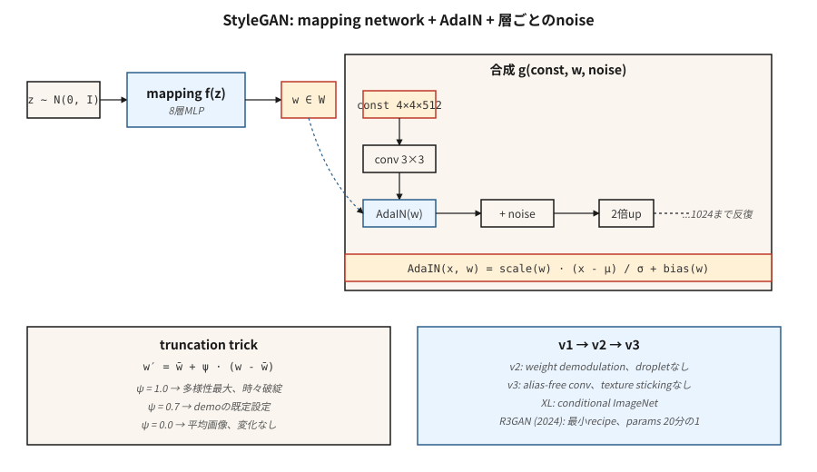

# StyleGAN

> 大多数生成器将 `z` 同时搅拌到每一层中。StyleGAN 将其拆分：先将 `z` 映射到中间变量 `w`，然后通过 AdaIN 在每个分辨率级别*注入* `w`。这一个改变解开了潜在空间的纠缠，并使照片级真实感人脸成为连续七年解决了的难题。

**类型：** 构建
**语言：** Python
**前置知识：** 阶段 8 · 03（GAN）、阶段 4 · 08（归一化）、阶段 3 · 07（CNN）
**时间：** ~45 分钟

## 问题

DCGAN 通过堆叠的转置卷积将 `z` 映射到图像。问题在于：`z` 控制一切——姿态、光照、身份、背景——全部纠缠在一起。沿 `z` 的一个轴移动，所有四个都改变。你不能要求模型"同一个人，不同姿态"，因为表示不是那样分解的。

Karras 等人（2019，NVIDIA）提出：停止直接将 `z` 馈入卷积层。馈入一个常量 `4×4×512` 张量作为网络输入。学习一个 8 层 MLP，将 `z ∈ Z → w ∈ W` 映射。通过*自适应实例归一化*（AdaIN）在每个分辨率级别注入 `w`：归一化每个卷积特征图，然后通过 `w` 的仿射投影进行缩放和平移。添加逐层噪声用于随机细节（皮肤毛孔、发丝）。

结果：`W"` 对于"高级风格"（姿态、身份）vs"精细风格"（光照、颜色）拥有大致正交的轴。你可以通过使用图像 A 的 `w` 用于低分辨率级别，图像 B 的 `w` 用于高分辨率，来在两幅图像之间交换风格。这解锁了编辑、跨域风格化以及整个"StyleGAN 反演"研究方向。

## 概念



**映射网络。** `f: Z → W`，一个 8 层 MLP。`Z = N(0, I)^512`。`W` 不被迫为高斯分布——它学习数据适应的形状。

**合成网络。** 从学习到的常量 `4×4×512` 开始。每个分辨率块：`upsample → conv → AdaIN(w_i) → noise → conv → AdaIN(w_i) → noise`。分辨率加倍：4、8、16、32、64、128、256、512、1024。

**AdaIN。**

```
AdaIN(x, y) = y_scale · (x - mean(x)) / std(x) + y_bias
```

其中 `y_scale` 和 `y_bias` 来自 `w` 的仿射投影。按特征图归一化，然后重新样式化。这里的"风格"是特征图的一阶和二阶统计量。

**逐层噪声。** 添加到每个特征图的单通道高斯噪声，按学习到的逐通道因子缩放。控制随机细节而不影响全局结构。

**截断技巧。** 推理时，采样 `z`，计算 `w = mapping(z)`，然后 `w' = ŵ + ψ·(w - ŵ)`，其中 `ŵ` 是许多样本上 `w` 的均值。`ψ < 1` 用多样性换取质量。几乎所有 StyleGAN 演示都使用 `ψ ≈ 0.7`。

## StyleGAN 1 → 2 → 3

| 版本 | 年份 | 创新 |
|---------|------|------------|
| StyleGAN | 2019 | 映射网络 + AdaIN + 噪声 + 渐进式增长。 |
| StyleGAN2 | 2020 | 权重解调取代 AdaIN（修复液滴伪影）；跳跃/残差架构；路径长度正则化。 |
| StyleGAN3 | 2021 | 无混叠卷积 + 等变核；消除了纹理粘附在像素网格上的问题。 |
| StyleGAN-XL | 2022 | 类别条件、1024²、ImageNet。 |
| R3GAN | 2024 | 通过更强正则化重塑；在 FFHQ-1024 上以 20 倍更少的参数缩小了与扩散的差距。 |

到 2026 年，StyleGAN3 在以下方面仍然是默认选择：（a）高帧率下的窄域照片级真实感，（b）少样本域自适应（在 100 张图像的新数据集上训练，冻结映射网络），（c）基于反演的编辑（找到重建真实照片的 `w`，然后编辑该 `w`）。对于开放域文生图，它不是正确的工具——扩散才是。

## 动手实现

`code/main.py` 在 1-D 中实现了一个玩具"style-GAN lite"：一个映射 MLP，一个接收学习到的常量向量并用 `w` 派生的缩放/偏置进行调制的合成函数，以及逐层噪声。它展示了通过仿射调制注入 `w` 可以匹配或胜过将 `z` 连接到生成器输入。

### 步骤 1：映射网络

```python
def mapping(z, M):
    h = z
    for i in range(num_layers):
        h = leaky_relu(add(matmul(M[f"W{i}"], h), M[f"b{i}""]))
    return h
```

### 步骤 2：自适应实例归一化

```python
def adain(x, w_scale, w_bias):
    mu = mean(x)
    sd = std(x)
    x_norm = [(xi - mu) / (sd + 1e-8) for xi in x]
    return [w_scale * xi + w_bias for xi in x_norm]
```

逐特征图的缩放和偏置通过线性投影来自 `w`。

### 步骤 3：逐层噪声

```python
def add_noise(x, sigma, rng):
    return [xi + sigma * rng.gauss(0, 1) for xi in x]
```

逐通道的 sigma 是可学习的。

## 陷阱

- **液滴伪影。** StyleGAN 1 在特征图中产生块状液滴，因为 AdaIN 将均值归零了。StyleGAN 2 的权重解调通过缩放卷积权重来修复此问题。
- **纹理粘附。** StyleGAN 1 和 2 的纹理跟随像素坐标，而不是物体坐标（在插值时可见）。StyleGAN 3 的无混叠卷积使用窗口化的 sinc 滤波器修复了此问题。
- **模式覆盖。** 截断 `ψ < 0.7` 看起来干净，但从狭窄的锥体区域采样；如果你需要多样性，使用 `ψ = 1.0`。
- **反演有损。** 将真实照片反演到 `W` 通常通过优化或编码器（e4e、ReStyle、HyperStyle）完成。结果随迭代次数增加而漂移。

## 应用

| 使用场景 | 方法 |
|----------|----------|
| 照片级真实感人脸（动漫、产品、窄域） | StyleGAN3 FFHQ / 自定义微调 |
| 从照片进行人脸编辑 | e4e 反演 + StyleSpace / InterFaceGAN 方向 |
| 人脸交换 / 重现 | StyleGAN + 编码器 + 混合 |
| 头像流水线 | 使用 ADA 的 StyleGAN3 进行低数据微调 |
| 从少量图像进行域自适应 | 冻结映射网络，微调合成网络 |
| 多模态或文本条件生成 | 不要——使用扩散 |

对于答案是"人脸照片"的产品级演示，StyleGAN 在推理成本（单次前向传播，4090 上 <10ms）和相同质量水平下的清晰度上胜过扩散。

## 交付

保存为 `outputs/skill-stylegan-inversion.md`。技能接受一张真实照片并输出：反演方法（e4e / ReStyle / HyperStyle）、期望的潜在损失、编辑预算（在出现伪影之前在 `W` 中能移动多远）以及已知有效的编辑方向列表（年龄、表情、姿态）。

## 练习

1. **简单。** 在 `adaOn=True` 和 `adain_on=False` 下运行 `code/main.py`。比较固定潜在变量与扰动潜在变量下输出的分布范围。
2. **中等。** 实现混合正则化：对于一个训练批次，计算 `w_a`、`w_b`，并在合成的前半部分使用 `w_a`，后半部分使用 `w_b`。解码器学习到解耦的风格了吗？
3. **困难。** 获取一个预训练的 StyleGAN3 FFHQ 模型（ffhq-1024.pkl）。通过在有标签样本上训练 SVM 找到控制"微笑"的 `w` 方向；报告在身份漂移之前能推多远。

## 关键术语

| 术语 | 人们说的 | 实际含义 |
|------|-----------------|-----------------------|
| Mapping network | "MLP" | `f: Z → W`，8 层，将潜在几何与数据统计解耦。 |
| W space | "风格空间" | 映射网络的输出；大致解耦。 |
| AdaIN | "自适应实例归一化" | 归一化特征图，然后通过 `w` 投影进行缩放 + 平移。 |
| Truncation trick | "Psi" | `w = mean + ψ·(w - mean)`，ψ<1 用多样性换质量。 |
| Path-length regularization | "PL reg" | 惩罚 `w` 单位变化下图像的过大变化；使 `W` 更平滑。 |
| Weight demodulation | "StyleGAN2 修复" | 归一化卷积权重而不是激活；消除液滴伪影。 |
| Alias-free | "StyleGAN3 的技巧" | 窗口化 sinc 滤波器；消除纹理粘附在像素网格上。 |
| Inversion | "为真实图像找 w" | 优化或编码 `x → w` 使得 `G(w) ≈ x`。 |

## 生产说明：为什么 StyleGAN 在 2026 年仍然被部署

StyleGAN3 在 4090 上生成 1024² 的 FFHQ 人脸耗时不到 10ms——`num_steps = 1`，没有 VAE 解码，没有交叉注意力通。在生产术语中，这是任何图像生成器的最低延迟。相同分辨率下 50 步 SDXL + VAE 解码流水线约为 3 秒。这是 **300 倍的差距**，对于窄域产品（头像服务、身份证件流水线、股票人脸生成）它在 TCO 上胜出。

两个运营后果：

- **没有调度器，没有批处理器。** 目标占用率下的静态批是最优的。连续批处理（对 LLM 和扩散至关重要）提供零收益，因为每个请求消耗相同的 FLOPs。
- **截断 `ψ` 是安全旋钮。** `ψ < 0.7` 从映射网络范围的狭窄锥体采样。这是服务层对样本方差拥有的唯一杠杆。高峰负载时降低 `ψ`，为高级用户提高它。

## 延伸阅读

- [Karras et al. (2019). A Style-Based Generator Architecture for GANs](https://arxiv.org/abs/1812.04948) — StyleGAN。
- [Karras et al. (2020). Analyzing and Improving the Image Quality of StyleGAN](https://arxiv.org/abs/1912.04958) — StyleGAN2。
- [Karras et al. (2021). Alias-Free Generative Adversarial Networks](https://arxiv.org/abs/2106.12423) — StyleGAN3。
- [Tov et al. (2021). Designing an Encoder for StyleGAN Image Manipulation](https://arxiv.org/abs/2102.02766) — e4e 反演。
- [Sauer et al. (2022). StyleGAN-XL: Scaling StyleGAN to Large Diverse Datasets](https://arxiv.org/abs/2202.00273) — StyleGAN-XL。
- [Huang et al. (2024). R3GAN: The GAN is dead; long live the GAN!](https://arxiv.org/abs/2501.05441) — 现代极简 GAN 配方。
