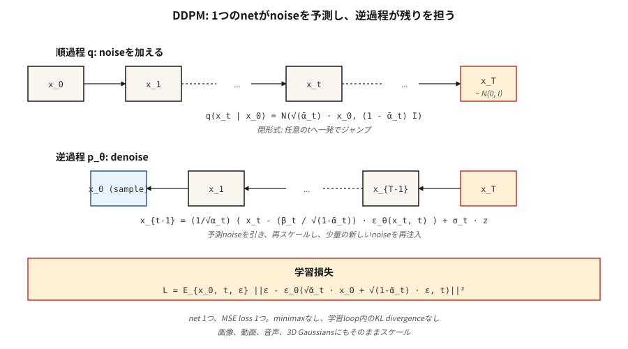

# Difüzyon Modelleri — Sıfırdan DDPM

> Ho, Jain, Abbeel (2020) alana vazgeçemeyeceği bir reçete verdi. Binlerce küçük adımda verileri gürültüyle yok edin. Gürültüyü tahmin etmek için bir sinir ağını eğitin. inference'deki işlemi tersine çevirin. Bugün her ana akım görüntü, video, 3D ve müzik modeli, muhtemelen akış eşleştirme veya tutarlılık hileleriyle birlikte bu döngü üzerinde çalışıyor.

**Tür:** Yapım
**Diller:** Python
**Önkoşullar:** Aşama 3 · 02 (Backprop), Aşama 8 · 02 (VAE)
**Süre:** ~75 dakika

## Sorun

`p_data(x)` için bir örnekleyici istiyorsunuz. GAN'lar sıklıkla farklılık gösteren bir minimax oyunu oynarlar. VAE'ler Gauss kod çözücüden bulanık örnekler üretir. Gerçekten istediğiniz şey, (a) tek bir kararlı kayıp (eyer noktası yok, minimum maksimum yok), (b) `log p(x)`'de bir alt sınır (böylece olasılıklarınız var) ve (c) SOTA kalitesiyle eşleşen örnekler olan bir eğitim hedefidir.

Sohl-Dickstein ve ark. (2015) teorik bir cevaba sahipti: Yavaş yavaş Gauss gürültüsü ekleyen bir Markov zinciri `q(x_t | x_{t-1})` tanımlayın ve gürültüyü gidermek için bir ters zincir `p_θ(x_{t-1} | x_t)` eğitin. Ho, Jain, Abbeel (2020), kaybın tek satıra kadar basitleştirilebileceğini gösterdi (gürültüyü tahmin edin) ve matematiği düzeltti. 2020 yılında bu bir merak konusuydu. 2021 yılında son teknoloji numuneler üretti. 2022'de Kararlı Difüzyon oldu. 2026'da substrattır.

## Konsept



**İleri süreç `q`.** `T` küçük adımlarla Gauss gürültüsünü ekleyin. Kapalı form (matematiğin izlenebilir olmasının nedeni) kümülatif adımın da Gaussian olmasıdır:

```
q(x_t | x_0) = N( sqrt(α̅_t) · x_0,  (1 - α̅_t) · I )
```

burada `β_t` çizelgesi için `α̅_t = ∏_{s=1..t} (1 - β_s)`. `β_t`'yi T=1000 adım üzerinden doğrusal olarak 1e-4'ten 0,02'ye seçin ve `x_T` yaklaşık olarak `N(0, I)`'dir.

**`p_θ` işlemini tersine çevirin.** Eklenen gürültüyü tahmin eden `ε_θ(x_t, t)` sinir ağını öğrenin. `x_t` verildiğinde, gürültüyü şu şekilde giderin:

```
x_{t-1} = (1 / sqrt(α_t)) · ( x_t - (β_t / sqrt(1 - α̅_t)) · ε_θ(x_t, t) )  +  σ_t · z
```

burada `σ_t`, `sqrt(β_t)` veya öğrenilmiş bir varyanstır. İfade çirkin ama sadece cebirdir - son `q(x_{t-1} | x_t, x_0)` verildiğinde `x_{t-1}`'yi çözmek ve `x_0`'yi gürültü tahminli tahminiyle değiştirmek.

**Eğitim kaybı.**

```
L_simple = E_{x_0, t, ε} [ || ε - ε_θ( sqrt(α̅_t) · x_0 + sqrt(1 - α̅_t) · ε,  t ) ||² ]
```

Verilerden `x_0`'yi örnekleyin, rastgele bir `t` seçin, `ε ~ N(0, I)`'yi örnekleyin, gürültülü `x_t`'yi kapalı form aracılığıyla tek seferde hesaplayın ve gürültüye göre gerileme yapın. Tek kayıp, minimum maksimum yok, KL yok, yeniden parametrelendirme hileleri yok.

**Örnekleme.** `x_T ~ N(0, I)`'yi başlatın. `t = T`'den `1`'ye kadar ters adımı yineleyin. Tamamlamak.

## Neden işe yarıyor?

Üç sezgi:

1. **Gürültüyü gidermek kolaydır; üretmek zordur.** `t=T`'de veriler saf gürültüdür; ağın önemsiz bir sorunu çözmesi gerekir. `t=0`'de ağın yalnızca birkaç pikseli temizlemesi gerekir. `t` orta seviyesinde sorun zordur ancak ağda her gürültü seviyesinde aynı ağırlıklardan akan birçok gradient vardır.

2. **Gizli puan eşleştirme.** Vincent (2011), gürültüyü tahmin etmenin `∇_x log q(x_t | x_0)`, *puan*'ı tahmin etmeye eşdeğer olduğunu kanıtladı. Ters SDE, bu puanı gradient yoğunluğunu artırmak için kullanır; bu, yüksek olasılıklı bölgelere doğru yönlendirilmiş rastgele bir yürüyüştür.

3. **ELBO basit MSE'ye indirgenir.** Tam değişken alt sınır, zaman adımı başına bir KL terimine sahiptir. DDPM'nin parametrelendirmesi ile bu KL terimleri, belirli katsayılarla gürültü tahmini konusunda MSE'ye basitleştirilir; Ho katsayıları düşürdü ("basit" kayıp olarak adlandırdı) ve kalite *iyileşti*.

```figure
diffusion-denoise
```

## İnşa Et

`code/main.py`, 1 boyutlu bir DDPM uygular. Veriler iki modlu bir karışımdır. "Ağ", `(x_t, t)`'yi alan ve tahmin edilen gürültüyü çıkaran küçük bir MLP'dir. Eğitim tek hat kaybıdır. Örnekleme ters zinciri yineler.

### Adım 1: ileri program (kapalı form)

```python
betas = [1e-4 + (0.02 - 1e-4) * t / (T - 1) for t in range(T)]
alphas = [1 - b for b in betas]
alpha_bars = []
cum = 1.0
for a in alphas:
    cum *= a
    alpha_bars.append(cum)
```

### Adım 2: `x_t`'yi tek seferde örnekleyin

```python
def forward_sample(x0, t, alpha_bars, rng):
    a_bar = alpha_bars[t]
    eps = rng.gauss(0, 1)
    x_t = math.sqrt(a_bar) * x0 + math.sqrt(1 - a_bar) * eps
    return x_t, eps
```

### Adım 3: bir eğitim adımı

```python
def train_step(x0, model, alpha_bars, rng):
    t = rng.randrange(T)
    x_t, eps = forward_sample(x0, t, alpha_bars, rng)
    eps_hat = model_forward(model, x_t, t)
    loss = (eps - eps_hat) ** 2
    return loss, gradient_step(model, ...)
```

### Adım 4: ters örnekleme

```python
def sample(model, alpha_bars, T, rng):
    x = rng.gauss(0, 1)
    for t in range(T - 1, -1, -1):
        eps_hat = model_forward(model, x, t)
        beta_t = 1 - alphas[t]
        x = (x - beta_t / math.sqrt(1 - alpha_bars[t]) * eps_hat) / math.sqrt(alphas[t])
        if t > 0:
            x += math.sqrt(beta_t) * rng.gauss(0, 1)
    return x
```

40 zaman adımlı ve 24 birimlik bir MLP'ye sahip 1 boyutlu bir problem için bu, iki modlu karışımı ~200 dönemde öğrenir.

## Zaman koşullandırma

Ağın hangi zaman adımında gürültü çıkardığını bilmesi gerekiyor. İki standart seçenek:

- **Sinüzoidal embedding.** Transformer konumsal kodlama gibi. `embed(t) = [sin(t/ω_0), cos(t/ω_0), sin(t/ω_1), ...]`. Bir MLP'den geçin, ağa yayınlayın.
- **Film / grup normu koşullandırma.** Her blokta kanal başına ölçek/bias (FiLM) için embedding projesi.

Oyuncak kodumuz sinüzoidal → concat'ı kullanır. Üretim U-Net'leri FiLM kullanır.

## Tuzaklar

- **Zamanlama çok önemlidir.** Doğrusal `β`, DDPM varsayılanıdır ancak kosinüs planı (Nichol ve Dhariwal, 2021) aynı hesaplama için daha iyi FID sağlar. Kalitede duraklamalar varsa programları değiştirin.
- **Zaman adımı embedding hassastır.** Ham `t`'nin kayan nokta olarak iletilmesi oyuncak 1-D için işe yarar ancak görüntüler için başarısız olur; her zaman uygun bir embedding kullanın.
- **V-tahmini ve ε-tahmini.** Dar rejimler için (çok küçük veya çok büyük t), `ε`'nin sinyal-gürültü oranı düşüktür. V tahmini (`v = α·ε - σ·x`) daha kararlıdır; SDXL, SD3 ve Flux bunu kullanır.
- **Sınıflandırıcıdan bağımsız rehberlik.** inference'de, hem koşullu hem de koşulsuz `ε`'yi, ardından `w ≈ 3-7` ile `ε_cfg = (1 + w) · ε_cond - w · ε_uncond`'yi hesaplayın. Ders 08'de ele alınmıştır.
- **1000 adım çok fazla.** Üretimde DDIM (20-50 adım), DPM-Solver (10-20 adım) veya damıtma (1-4 adım) kullanılır. 12. Derse bakın.

## Kullan onu

| Rol | 2026'daki tipik yığın |
|------|-----------------------|
| Görüntü piksel alanı yayılımı (küçük, oyuncak) | DDPM + U-Net |
| Görüntünün gizli yayılması | VAE kodlayıcı + U-Net veya DiT (Ders 07) |
| Videonun gizli yayılması | Uzay-zamansal DiT (Sora, Veo, WAN) |
| Sesin gizli yayılması | Kodlama + difüzyon transformer |
| Bilim (moleküller, proteinler, fizik) | Eşdeğişken difüzyon (EDM, RFdifüzyon, AlphaFold3) |

Difüzyon evrensel üretken omurgadır. Akış eşleştirme (Ders 13), genellikle aynı kalitede inference hızında kazanan 2024-2026 yarışmacısıdır.

## Gönderin

`outputs/skill-diffusion-trainer.md`'yi kaydedin. Skill, dataset + hesaplama bütçesini ve çıktılarını alır: zamanlama (doğrusal/kosinüs/sigmoid), tahmin hedefi (ε/v/x), adım sayısı, rehberlik ölçeği, örnekleyici ailesi ve bir değerlendirme protokolü.

## Egzersizler

1. **Kolay.** `code/main.py`'de T'yi 40'tan 10'a değiştirin. Örnek kalitesi (çıktıların görsel histogramı) nasıl bozulur? İki modlu yapı hangi T değerinde çöker?
2. **Orta.** ε tahmininden v tahminine geçiş yapın. Ters adımı yeniden türetin. Nihai numune kalitesini karşılaştırın.
3. **Zor.** Sınıflandırıcısız rehberlik ekleyin. `c ∈ {0, 1}` sınıf etiketini koşullandırın, eğitim sırasında bunu %10 oranında bırakın ve örnekleme zamanında `ε = (1+w)·ε_cond - w·ε_uncond` kullanın. `w = 0, 1, 3, 7`'de koşullu mod isabet oranını ölçün.

## Anahtar Terimler

| Dönem | İnsanlar ne diyor | Aslında ne anlama geliyor |
|------|-----------------|-----------------------|
| İleri süreç | "Gürültü ekleme" | Verileri yok eden Markov zinciri `q(x_t \| x_{t-1})` düzeltildi. |
| Ters işlem | "Gürültü Giderme" | Verileri yeniden yapılandıran öğrenilmiş zincir `p_θ(x_{t-1} \| x_t)`. |
| β programı | "Gürültü merdiveni" | Adım başına varyans; doğrusal, kosinüs veya sigmoid. |
| α̅ | "Alfa çubuğu" | Kümülatif ürün `∏(1 - β)`; `x_0`'den kapalı form `x_t` verir. |
| Basit kayıp | "Gürültü üzerine MSE" | `\|\|ε - ε_θ(x_t, t)\|\|²`; tüm varyasyonel türetmeler buna çöker. |
| ε-tahmini | "Gürültüyü tahmin et" | Çıktı eklenen gürültüdür; standart DDPM. |
| V-tahmini | "Hızı tahmin et" | Çıkış `α·ε - σ·x`'dir; t genelinde daha iyi kondisyon. |
| DPM | "Kağıt" | Ho ve ark. 2020; doğrusal β, 1000 adım, U-Net. |
| DDIM | "Deterministik örnekleyici" | Markov olmayan örnekleyici, 20-50 adım, aynı eğitim hedefi. |
| Sınıflandırıcısız rehberlik | "CFG" | Koşullandırmayı güçlendirmek için koşullu ve koşulsuz gürültü tahminlerini karıştırın. |

## Üretim notu: difüzyon inference bir adım sayma problemidir

DDPM kağıdı T=1000 ters adımı çalıştırır. Kimse bunu üretimde göndermiyor. Her gerçek inference yığını üç stratejiden birini seçer ve her biri "gecikmenin nereden geldiği" üretim çerçevesiyle temiz bir şekilde eşleşir:

1. **Daha hızlı örnekleyici, aynı model.** DDIM (20-50 adım), DPM-Solver++ (10-20), UniPC (8-16). Ters döngünün takılıp değiştirilmesi; eğitilmiş `ε_θ` ağırlıklarına dokunulmaz. Gecikmeyi 20-50 kat azaltır.
2. **Distilasyon.** Bir öğrenciyi öğretmene daha az adımda uyması için eğitin: Aşamalı Damıtma (2 → 1), Tutarlılık Modelleri (keyfi → 1-4), LCM, SDXL-Turbo, SD3-Turbo. Gecikmeyi 5-10 kat daha azaltır, yeniden eğitim gerektirir.
3. **Önbelleğe alma ve derleme.** `torch.compile(unet, mode="reduce-overhead")`, TensorRT-LLM'nin dağıtım arka uçları, `xformers`/SDPA dikkati, bf16 ağırlıkları. Adım başına gecikmeyi ~2 kat azaltır. (1) ve (2) ile yığınlanır.

Bir üretim dağıtım sunucusu için bütçe konuşması, üretim literatürünün LLM'ler için tanımladığıyla aynıdır: gecikme `num_steps × step_cost + VAE_decode`, aktarım hızı `batch_size × (num_steps × step_cost)^-1`'dir. TTFT küçüktür (bir adım); TPOT eşdeğeri tam yanıt süresidir çünkü görüntü oluşturma kullanıcının bakış açısına göre "hepsi aynı anda"dır.

## Daha Fazla Okuma

- [Sohl-Dickstein ve ark. (2015). Dengesiz Termodinamiği Kullanarak Derin Denetimsiz Öğrenme](https://arxiv.org/abs/1503.03585) — zamanının ilerisinde bir yayılma makalesi.
- [Ho, Jain, Abbeel (2020). Gürültü Giderici Difüzyon Olasılık Modelleri](https://arxiv.org/abs/2006.11239) — DDPM.
- [Şarkı, Meng, Ermon (2021). Gürültü Giderici Difüzyon Örtülü Modelleri](https://arxiv.org/abs/2010.02502) — DDIM, daha az adım.
- [Nichol ve Dhariwal (2021). Geliştirilmiş DDPM](https://arxiv.org/abs/2102.09672) — kosinüs programı, öğrenilen varyans.
- [Dhariwal ve Nichol (2021). Difüzyon Modelleri Görüntü Sentezinde GAN'ları Geçiyor](https://arxiv.org/abs/2105.05233) — sınıflandırıcı kılavuzu.
- [Ho ve Salimans (2022). Sınıflandırıcıdan Bağımsız Dağıtım Kılavuzu](https://arxiv.org/abs/2207.12598) — CFG.
- [Karras ve ark. (2022). Difüzyon Tabanlı Üretken Modellerin (EDM) Tasarım Uzayını Aydınlatmak](https://arxiv.org/abs/2206.00364) — birleşik gösterim, en temiz tarif.
