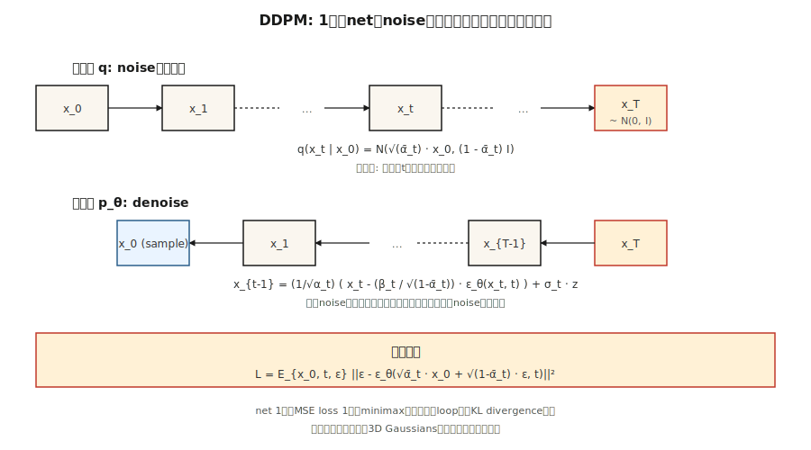

# Diffusion Models — DDPM from Scratch

> Ho、Jain、Abbeel（2020）为该领域提供了一个无法退出的食谱。通过一千个小步骤用噪音破坏数据。训练一个神经网络来预测噪音。在推理时颠倒这一过程。如今，每个主流图像、视频、3D和音乐模型都在这个循环中运行，其中可能还带有流匹配或一致性技巧。

** 类型：** 构建
** 语言：** Python
** 先决条件：** 阶段3 · 02（反向推进）、阶段8 · 02（VAE）
** 时间：** ~75分钟

## The Problem

您需要“p_data（x）”的采样器。GAN玩的是一个经常出现分歧的极小极大游戏。VAE从高斯解码器产生模糊样本。您真正想要的是一个训练目标，该目标是（a）单一稳定损失（没有鞍点，没有极小化），（b）“log p（x）”的下限（因此您有可能性），以及（c）与SOTA质量相匹配的样本。

Sohl-Dickstein等人（2015）有一个理论答案：定义马尔科夫链' q（x_t| x_{t-1}）'逐渐添加高斯噪音，并训练反向链' p_0（x_{t-1}| x_t）'去降噪。Ho、Jain、Abbeel（2020）表明，损失可以简化为一条线--预测噪音--并清理了数学。2020年，这是一个奇怪的现象。2021年，它生产了最先进的样品。2022年，它成为稳定扩散。2026年，它是底层。

## The Concept



** 转发进程' q '。**以“T”小步骤添加高斯噪音。封闭形式--数学易于处理的原因--是累积步骤也是高斯的：

```
q(x_t | x_0) = N( sqrt(α̅_t) · x_0,  (1 - α̅_t) · I )
```

其中' a ð_t = ð_{s=1. t}（1 - β_s）'对于'的时间表'。在T=1000个步骤内线性地从1 e-4选择“β_t”到0.02，并且“x_T”大约为“N（0，I）”。

** 反向过程' p_θ '。**学习预测添加的噪音的神经网络' e_0（x_t，t）'。给定“x_t”，通过以下方式降噪：

```
x_{t-1} = (1 / sqrt(α_t)) · ( x_t - (β_t / sqrt(1 - α̅_t)) · ε_θ(x_t, t) )  +  σ_t · z
```

其中“西格玛_t”是“平方t（β_t）”或习得方差。该表达很难看，但它只是代数-在给定后验‘q（x_{t-1}）的情况下求解‘x_{t-1}| x_t，x_0）'并用其噪音预测估计替换' x_0 '。

** 训练损失。**

```
L_simple = E_{x_0, t, ε} [ || ε - ε_θ( sqrt(α̅_t) · x_0 + sqrt(1 - α̅_t) · ε,  t ) ||² ]
```

从数据中采样“x_0”，选择随机的“t”，采样“e ~ N（0，I）”，通过封闭形式一次性计算有噪的“x_t”，并对噪音进行回归。一次损失，没有极小化，没有KL，没有重新参数化技巧。

** 抽样。**开始' x_T ~ N（0，I）'。迭代从“t = T”到“1”的相反步骤。完了

## Why it works

三个直觉：

1. ** 去噪很容易;生成很难。**在“t=T”时，数据是纯粹的噪音-网络必须解决一个琐碎的问题。在' t=0 '时，网络只需清理几个像素。在中间' t '处，问题很难，但网络具有许多梯度，流经来自每个噪音水平的相同权重。

2. ** 变相得分匹配。** Vincent（2011）证明预测噪音相当于估计'_x log q（x_t| x_0）'，* 分数 *。反向搜索器使用该分数向上移动密度梯度--引导随机移动到高概率区域。

3. ** ELBO简化为简单的SSE。**完整变分下限每个时间步有一个KL项。通过DDPM的参数化，这些KL项简化为具有特定系数的噪音预测的SSE; Ho删除了系数（称其为“简单”损失），质量 * 得到了改善 *。

## Build It

' code/main.py '实现1-D DDPM。数据是双模式混合。“net”是一个微小的MLP，它接受“（x_t，t）”并输出预测的噪音。训练就是一线损失。采样迭代反向链。

### Step 1: the forward schedule (closed form)

```python
betas = [1e-4 + (0.02 - 1e-4) * t / (T - 1) for t in range(T)]
alphas = [1 - b for b in betas]
alpha_bars = []
cum = 1.0
for a in alphas:
    cum *= a
    alpha_bars.append(cum)
```

### Step 2: sample `x_t` in one shot

```python
def forward_sample(x0, t, alpha_bars, rng):
    a_bar = alpha_bars[t]
    eps = rng.gauss(0, 1)
    x_t = math.sqrt(a_bar) * x0 + math.sqrt(1 - a_bar) * eps
    return x_t, eps
```

### Step 3: one training step

```python
def train_step(x0, model, alpha_bars, rng):
    t = rng.randrange(T)
    x_t, eps = forward_sample(x0, t, alpha_bars, rng)
    eps_hat = model_forward(model, x_t, t)
    loss = (eps - eps_hat) ** 2
    return loss, gradient_step(model, ...)
```

### Step 4: reverse sampling

```python
def sample(model, alpha_bars, T, rng):
    x = rng.gauss(0, 1)
    for t in range(T - 1, -1, -1):
        eps_hat = model_forward(model, x, t)
        beta_t = 1 - alphas[t]
        x = (x - beta_t / math.sqrt(1 - alpha_bars[t]) * eps_hat) / math.sqrt(alphas[t])
        if t > 0:
            x += math.sqrt(beta_t) * rng.gauss(0, 1)
    return x
```

对于具有40个时间步和24个单元MLP的一维问题，这可以在约200个历元内学习双模式混合。

## Time conditioning

网络需要知道它正在去噪的时间步骤。两个标准选项：

- ** 鼻窦嵌入。**就像Transformer位置编码一样。' embed（t）= [sin（t/ω_0），cos（t/ω_0），sin（t/ω_1），.]'。通过MLP，广播到网中。
- ** 电影/群体规范条件反射。**在每个块处按通道规模/偏差（FiLM）进行项目嵌入。

我们的玩具代码使用sinic-concat。生产U-Net使用FiLM。

## Pitfalls

- ** 日程安排很重要。**线性“β”是DDPM默认值，但cos调度（Nichol & Dhariwal，2021）为相同的计算提供了更好的DID。如果质量趋于平稳，则更改时间表。
- ** 时步嵌入是脆弱的。**将原始' t '作为float传递对于玩具1-D有效，但对于图像无效;始终使用正确的嵌入。
- ** V-预测vs e-预测。**对于窄范围（t非常小或非常大），“e”的信噪比很差。V预测（“v = a·e-Sigma·x”）更稳定; SDXL、SD 3和Flux使用它。
- ** 无分类指南。**在推断时，计算条件和无条件“e”，然后“e_CGM =（1 + w）·e_cond - w ·e_uncond '，其中“w ð 3-7”。涵盖在08课中。
- **1000步已经很多了。**生产使用DDIM（20-50步）、DPM-Solver（10-20步）或蒸馏（1-4步）。参见第12课。

## Use It

| 作用 | 2026年典型堆栈 |
|------|-----------------------|
| 图像像素空间扩散（小，玩具） | DDPM + U-Net |
| 图像潜扩散 | VAE编码器+ U-Net或DiT（第07课） |
| 视频潜在扩散 | 时空DiT（Sora、Veo、WA） |
| 音频潜在扩散 | Encodec +扩散Transformer |
| 科学（分子、蛋白质、物理学） | 等变扩散（EDM、RFdiffusion、AlphaFold 3） |

扩散是普遍的生成支柱。流匹配（第13课）是2024-2026年的竞争对手，通常以相同质量的推理速度获胜。

## Ship It

保存“输出/skill-diffusion-trainer.md”。技能需要数据集+计算预算并输出：时间表（线性/cos/sigmoid）、预测目标（e/v/x）、步骤数、指导规模、采样器系列和评估协议。

## Exercises

1. ** 简单。**在“code/main.py”中将T从40更改为10。样本质量（输出的视觉图表）如何下降？双模结构在多少T处崩溃？
2. ** 中等。**从e-预测切换到v-预测。重新推导相反的步骤。比较最终样本质量。
3. ** 很难。**添加无分类器指导。类别标签上的条件' c edo {0，1}'，训练期间10%的时间将其删除，并在采样时使用' s =（1+w）·e_cond - w·e_uncond '。测量“w = 0，1，3，7”时的条件模式命中率。

## Key Terms

| Term | 别人怎么说 | 它实际上意味着什么 |
|------|-----------------|-----------------------|
| 正向过程 | “增添噪音” | 固定马尔科夫链' q（x_t | x_{t-1}）'这会破坏数据。 |
| 逆过程 | “降噪” | 习得链' p_0（x_{t-1} | x_t）'重建数据。 |
| β时间表 | “噪音阶梯” | 每步方差;线性、cos或Sigmoid。 |
| α̅ | “阿尔法酒吧” | 累积积“RST（1 - β）”;给出来自“x_0”的封闭形式“x_t”。 |
| 简单赔付 | “噪音方面的SSE” | ` |  | e-e-e-e_e（x_t，t） |  | ² '所有变分推导都归结为此。 |
| e-预测 | “预测噪音” | 输出是添加的噪音;标准DDPM。 |
| V预测 | “预测速度” | 输出为“a·e-Sigma·x”; t上的条件调节效果更好。 |
| DDPM | “报纸” | Ho等人。2020;线性β，1000步，U-Net。 |
| DDIM | “确定性采样器” | 非马尔科夫采样器，20-50步，相同的训练目标。 |
| 无分类指南 | “CGM” | 混合有条件和无条件的噪音预测来放大条件作用。 |

## Production note: diffusion inference is a step-count problem

DDPM论文运行T=1000个反向步骤。没有人在生产中运送它。每个真正的推理栈都会选择三种策略之一，并且每个策略都清晰地映射到“延迟从哪里来”的生产框架：

1. ** 更快的采样器，相同的型号。** DDIM（20-50步）、DPM-Solver++（10-20）、UniPC（8-16）。反向循环的插入式替换;训练的“e_0”权重不受影响。将延迟缩短20-50倍。
2. ** 蒸馏。**通过更少的步骤训练学生与老师相匹配：逐步蒸馏（2 - 1）、一致性模型（任意-1-4）、RCM、SDXL-Turbo、SD 3-Turbo。将延迟再缩短5-10倍，需要重新训练。
3. ** 缓存和编译。** ' torch.compile（unet，mode=“reduce-overhead”）'，TensorRT-LLM的扩散后台，' xformers '/SDPA关注，bf 16权重。每步延迟减少约2倍。与（1）和（2）堆叠。

对于生产扩散服务器，预算对话与LLM的生产文献描述的相同：延迟是“num_steps x Step_cost + VAE_decode”，吞吐量是“batch_size x（num_steps x Step_cost））'-1 '。TTFT很小（一步）; TPOT等效是完整的响应时间，因为从用户的角度来看，图像生成是“一次性”的。

## Further Reading

- [Sohl-Dickstein等人（2015）。使用非平衡热力学的深度无监督学习]（https：//arxiv.org/ab/1503.03585）-领先的传播论文。
- [Ho、Jain，Abbeel（2020）。去噪扩散概率模型]（https：//arxiv.org/ab/2006.11239）- DDPM。
- [Song，孟，埃尔蒙（2021）。去噪扩散隐式模型]（https：//arxiv.org/ab/2010.02502）-DDIM，步骤更少。
- [Nichol & Dhariwal（2021）。改进的DDPM]（https：//arxiv.org/ab/2102.09672）-cos时间表，学习方差。
- [Dhariwal & Nichol（2021）.扩散模型在图像合成上击败GANs]（https：//arxiv.org/abs/2105.05233）-分类器指南。
- [Ho& Salimans（2022）。无分类扩散指南]（https：//arxiv.org/ab/2207.12598）-CGM。
- [卡拉斯等人（2022）。阐明基于扩散的生成模型（EDM）的设计空间]（https：//arxiv.org/ab/2206.00364）-统一的符号，最干净的食谱。
