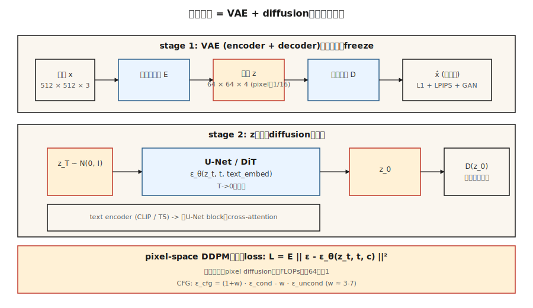

# Latent Diffusion & Stable Diffusion

> 512×512 画像に対する pixel-space diffusion は、計算量の観点では犯罪的です。Rombach et al. (2022) は、画像生成に 786k 次元すべては不要だと気づきました。必要なのは semantic structure を捉えるのに十分な表現と、残りを担当する別の decoder です。VAE の latent space 内で diffusion を走らせる。この 1 つの発想が Stable Diffusion です。

**種別:** 構築
**言語:** Python
**前提条件:** Phase 8 · 02 (VAE), Phase 8 · 06 (DDPM), Phase 7 · 09 (ViT)
**所要時間:** 約75分

## 問題

512² の pixel-space diffusion では、U-Net は shape `[B, 3, 512, 512]` の tensor 上で動きます。各 sampling step は 500M-param U-Net で約 100 GFLOPS です。50 steps なら 1 画像あたり 5 TFLOPS です。10 億枚の画像で学習すれば、compute bill は途方もなくなります。

その FLOPs の大半は、知覚的に重要でない細部を net に通すために使われます。lossy VAE で圧縮して捨てられる high-frequency texture です。Rombach の発想は、VAE を一度学習し (*first stage*)、凍結して、diffusion を完全に 4-channel 64×64 latent space (*second stage*) で走らせることでした。同じ U-Net。pixel 数は 1/16。品質は同程度で FLOPs は約 64x 少なくなります。

これが Stable Diffusion の recipe です。SD 1.x / 2.x は `64×64×4` latents 上の 860M U-Net を使い、SDXL は `128×128×4` 上の 2.6B U-Net を使い、SD3 は U-Net を flow matching 付きの Diffusion Transformer (DiT) に置き換えました。Flux.1-dev (Black Forest Labs, 2024) は 12B-param DiT-MMDiT を ship しています。すべて同じ 2-stage substrate で動きます。

## The Concept



**Two stages, separately trained.**

1. **Stage 1 — VAE.** Encoder `E(x) → z`、decoder `D(z) → x`。目標 compression は、各 spatial axis で 8× downsample し、channels を調整して total latent size を pixel count の約 1/16 にすることです。Loss = reconstruction (L1 + LPIPS perceptual) + KL (`z` を強く Gaussian に寄せる必要はないため小さな weight。`z` から厳密に sample する必要はありません)。decoded images を sharp にするため、adversarial loss とともに学習されることがよくあります。

2. **Stage 2 — diffusion on `z`.** `z = E(x_real)` を data として扱います。U-Net (または DiT) を学習し、`z_t` を denoise します。推論時は diffusion で `z_0` を sample し、その後 `x = D(z_0)` とします。

**Text conditioning.** 追加 component は 2 つです。凍結された text encoder (SD 1.x は CLIP-L、SD 2/XL は CLIP-L+OpenCLIP-G、SD3 と Flux は T5-XXL)。もう 1 つは cross-attention injection です。すべての U-Net block が `[Q = image features, K = V = text tokens]` を受け取り、それらを混ぜます。tokens は text が image に影響する唯一の経路です。

**The loss function is identical to Lesson 06.** noise に対する同じ DDPM / flow matching MSE です。data domain を入れ替えるだけです。

## Architecture variants

| Model | Year | Backbone | Latent shape | Text encoder | Params |
|-------|------|----------|--------------|--------------|--------|
| SD 1.5 | 2022 | U-Net | 64×64×4 | CLIP-L (77 tokens) | 860M |
| SD 2.1 | 2022 | U-Net | 64×64×4 | OpenCLIP-H | 865M |
| SDXL | 2023 | U-Net + refiner | 128×128×4 | CLIP-L + OpenCLIP-G | 2.6B + 6.6B |
| SDXL-Turbo | 2023 | Distilled | 128×128×4 | same | 1-4 step sampling |
| SD3 | 2024 | MMDiT (multimodal DiT) | 128×128×16 | T5-XXL + CLIP-L + CLIP-G | 2B / 8B |
| Flux.1-dev | 2024 | MMDiT | 128×128×16 | T5-XXL + CLIP-L | 12B |
| Flux.1-schnell | 2024 | MMDiT distilled | 128×128×16 | T5-XXL + CLIP-L | 12B, 1-4 step |

傾向は、U-Net を DiT (latent patches 上の transformer) に置き換えること、text encoder を大きくすること (prompt adherence では T5 が CLIP に勝つ)、latent channels を増やすこと (4 → 16 で細部の余裕が増える) です。

## 実装

`code/main.py` は Lesson 06 の DDPM の上に、toy 1-D "VAE" (demonstration 用の identity encoder + decoder。実際の VAE は conv net) を重ね、classifier-free guidance による class conditioning を追加します。同じ diffusion loss が raw 1-D values 上でも encoded values 上でも動くことを示します。これが重要な洞察です。

### Step 1: encoder/decoder

```python
def encode(x):    return x * 0.5          # toy "compression" to smaller scale
def decode(z):    return z * 2.0
```

実際の VAE には trained weights があります。教育目的では、この linear map だけで、diffusion が original data space を気にせず `z` 上で動くことを示すには十分です。

### Step 2: diffusion in `z`-space

Lesson 06 と同じ DDPM です。net が見る data は `z = E(x)` です。`z_0` を sample した後、`D(z_0)` で decode します。

### Step 3: classifier-free guidance

training 中は class label を 10% の確率で drop します (null token に置き換えます)。推論時は `ε_cond` と `ε_uncond` の両方を計算し、次のようにします。

```python
eps_cfg = (1 + w) * eps_cond - w * eps_uncond
```

`w = 0` = guidance なし (full diversity)、`w = 3` = default、`w = 7+` = saturated / over-sharp です。

### Step 4: text conditioning (concept, not code)

class label を凍結された text encoder output に置き換えます。cross-attention によって text embedding を U-Net に与えます。

```python
h = h + CrossAttention(Q=h, K=text_embed, V=text_embed)
```

これが、class-conditional diffusion model と Stable Diffusion の唯一の実質的な違いです。

## Pitfalls

- **VAE-scale mismatch.** SD 1.x VAEs には encoding 後に適用される scaling constant (`scaling_factor ≈ 0.18215`) があります。これを忘れると、U-Net は分散が大きく外れた latents で学習してしまいます。すべての checkpoint がこの値を持っています。
- **Text encoder silently wrong.** SD3 は >=128 tokens の T5-XXL を必要とし、CLIP-only への fallback は情報を失います。`use_t5=True` を必ず確認します。そうしないと prompt fidelity が崩れます。
- **Mixing latent spaces.** SDXL、SD3、Flux はすべて異なる VAEs を使います。SDXL latents で学習した LoRA は SD3 では動きません。Hugging Face diffusers 0.30+ は mismatched checkpoints の load を拒否します。
- **CFG too high.** `w > 10` は saturated で油っぽい画像を作り、多様性を犠牲にして prompt に over-fit します。sweet spot は `w = 3-7` です。
- **Negative prompts leaking.** empty negative prompt は null token になります。filled negative prompt は `ε_uncond` になります。これは同じではありません。一部の pipelines は黙って null を default にします。

## Use It

2026 年の production stacks:

| Target | Recommended backbone |
|--------|----------------------|
| 狭いドメイン、paired data、model from scratch の training | SDXL fine-tune (LoRA / full) — 最速で ship |
| Open-domain text-to-image, open weights | Flux.1-dev (12B, Apache / non-commercial) or SD3.5-Large |
| Fastest inference, open weights | Flux.1-schnell (1-4 step, Apache) or SDXL-Lightning |
| Best prompt adherence, hosted | GPT-Image / DALL-E 3 (still), Midjourney v7, Imagen 4 |
| Edit workflows | Flux.1-Kontext (Dec 2024) — image + text を native に受け付ける |
| Research, baseline | SD 1.5 — 古いがよく研究されている |

## Ship It

`outputs/skill-sd-prompter.md` を保存します。この skill は text prompt + target style を受け取り、model + checkpoint、CFG scale、sampler、negative prompt、resolution、optional ControlNet/IP-Adapter combo、per-step QA checklist を出力します。

## Exercises

1. **Easy.** guidance `w ∈ {0, 1, 3, 7, 15}` で `code/main.py` を実行します。class ごとの mean sample を記録します。どの `w` で class means が real data means を越えて乖離しますか。
2. **Medium.** toy linear encoder を、reconstruction loss 付きの tanh-MLP encoder/decoder pair に置き換えます。新しい latents 上で diffusion を再学習します。sample quality は変わりますか。
3. **Hard.** diffusers で実際の Stable Diffusion inference をセットアップします。`sdxl-base` を load し、CFG=7 で 30 Euler steps を実行して時間を測ります。次に 4 steps、CFG=0 の `sdxl-turbo` に切り替えます。同じ subject、異なる quality です。何が変わったのか、なぜ変わったのかを説明します。

## Key Terms

| Term | What people say | What it actually means |
|------|-----------------|-----------------------|
| First stage | "The VAE" | trained encoder/decoder pair。512² を 64² へ圧縮する。 |
| Second stage | "The U-Net" | latent space 上の diffusion model。 |
| CFG | "Guidance scale" | `(1+w)·ε_cond - w·ε_uncond`。conditioning strength を調整する。 |
| Null token | "Empty prompt embed" | `ε_uncond` に使う unconditional embed。 |
| Cross-attention | "How text gets in" | 各 U-Net block が text tokens を K と V として attend する。 |
| DiT | "Diffusion Transformer" | U-Net を latent patches 上の transformer に置き換える。scale しやすい。 |
| MMDiT | "Multi-modal DiT" | SD3 の architecture。joint attention を持つ text/image streams。 |
| VAE scaling factor | "Magic number" | latents を約 5.4 で割り、diffusion が unit-variance space で動くようにする。 |

## Production note: running Flux-12B on an 8GB consumer GPU

reference Flux integration は、標準的な「consumer GPU でこれを ship できるか」という recipe です。trick は、production inference literature が diffusion DiT に適用している同じ 3-knob recipe です。

1. **Staggered loading.** Flux には VRAM 上で同時に存在する必要のない 3 つの networks があります。T5-XXL text encoder (~10 GB in fp32)、CLIP-L (small)、12B MMDiT、そして VAE です。まず prompt を encode し、encoders を*削除*し、DiT を load し、denoise し、DiT を*削除*し、VAE を load して decode します。consumer 8GB GPUs は 1 stage ずつしか収まりません。
2. **4-bit quantization via bitsandbytes.** T5 encoder と DiT の両方に `BitsAndBytesConfig(load_in_4bit=True, bnb_4bit_compute_dtype=torch.bfloat16)` を使います。memory を 8× 削減し、Aritra の benchmarks (notebook にリンク) では text-to-image の品質低下は知覚できない程度です。
3. **CPU offload.** `pipe.enable_model_cpu_offload()` は、各 forward pass が進むにつれて modules を CPU と GPU の間で自動的に swap します。latency は 10-20% 増えますが、pipeline がそもそも動くようになります。

memory accounting は、`10 GB T5 / 8 = 1.25 GB` quantized、`12 B params × 0.5 bytes = ~6 GB` quantized DiT、それに activations です。stas00 の言葉では、これは TP=1 inference の extreme-end です。model parallelism はなく、maximum quantization です。production なら H100s 上で TP=2 または TP=4 を動かします。single dev laptop ならこれが recipe です。

## 参考文献

- [Rombach et al. (2022). High-Resolution Image Synthesis with Latent Diffusion Models](https://arxiv.org/abs/2112.10752) — Stable Diffusion.
- [Podell et al. (2023). SDXL: Improving Latent Diffusion Models for High-Resolution Image Synthesis](https://arxiv.org/abs/2307.01952) — SDXL.
- [Peebles & Xie (2023). Scalable Diffusion Models with Transformers (DiT)](https://arxiv.org/abs/2212.09748) — DiT.
- [Esser et al. (2024). Scaling Rectified Flow Transformers for High-Resolution Image Synthesis](https://arxiv.org/abs/2403.03206) — SD3, MMDiT.
- [Ho & Salimans (2022). Classifier-Free Diffusion Guidance](https://arxiv.org/abs/2207.12598) — CFG.
- [Labs (2024). Flux.1 — Black Forest Labs announcement](https://blackforestlabs.ai/announcing-black-forest-labs/) — Flux.1 family.
- [Hugging Face Diffusers docs](https://huggingface.co/docs/diffusers/index) — 上記すべての checkpoint の reference implementation。
