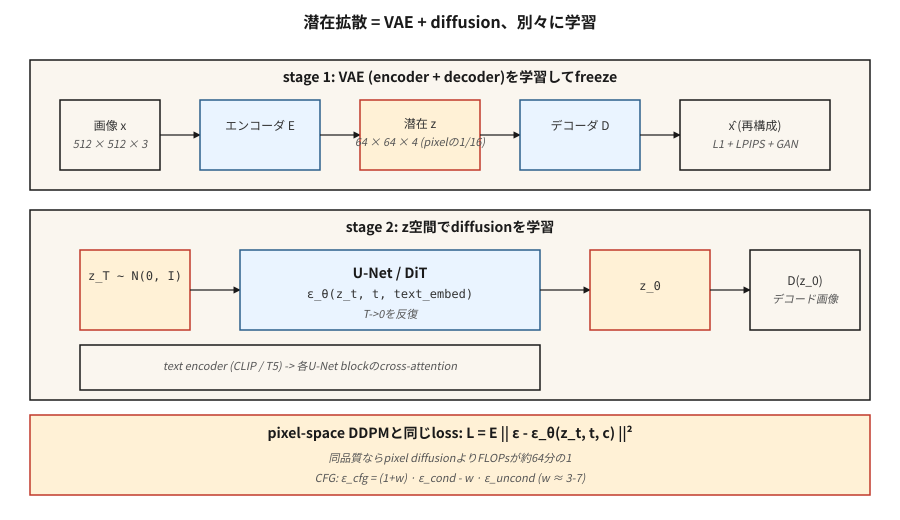

# Gizli Difüzyon ve Stable Diffusion

> 512×512 görüntülerdeki piksel uzayı yayılımı, hesaplamaya dayalı bir savaş suçudur. Rombach ve ark. (2022), bir görüntü oluşturmak için 786k boyutun tamamına ihtiyacınız olmadığını, anlamsal yapıyı yakalamak için yeterli miktarda ve geri kalanı için ayrı bir kod çözücüye ihtiyacınız olduğunu fark etti. Bir VAE'nin gizli alanı içinde difüzyonu çalıştırın. Bu fikirden biri Stable Diffusiondur.

**Tür:** Yapım
**Diller:** Python
**Önkoşullar:** Aşama 8 · 02 (VAE), Aşama 8 · 06 (DDPM), Aşama 7 · 09 (ViT)
**Süre:** ~75 dakika

## Sorun

512²'deki piksel uzayı difüzyonu, U-Net'in `[B, 3, 512, 512]` şeklindeki tensörler üzerinde çalıştığı anlamına gelir. Her örnekleme adımı, 500M parametreli bir U-Net için ~100 GFLOPS'tur. Elli adım, görüntü başına 5 TFLOPS'tur. Bir milyar görüntüyü eğittiğinizde hesaplama faturası saçma olur.

Bu FLOP'ların çoğu, algısal olarak önemsiz ayrıntıları - kayıplı bir VAE'nin sıkıştırabileceği yüksek frekanslı doku - ağ üzerinden itmeye gidiyor. Rombach'ın fikri: Bir VAE'yi bir kez eğitin (*ilk aşama*), dondurun ve difüzyonu tamamen 4 kanallı 64x64 gizli alanda çalıştırın (*ikinci aşama*). Aynı U-Net. Pikselin 1/16'sı. Karşılaştırılabilir kalite için ~64 kat daha az FLOP.

Bu Stable Diffusion tarifidir. SD 1.x / 2.x, `64×64×4` latent üzerinden 860M U-Net kullandı, SDXL, `128×128×4` üzerinden 2,6B U-Net kullandı, SD3, U-Net'i akış eşleştirmeli Difüzyon Transformer (DiT) ile değiştirdi. Flux.1-dev (Black Forest Labs, 2024), 12B parametreli bir DiT-MMDiT gönderir. Hepsi aynı iki aşamalı alt tabaka üzerinde çalışır.

## Konsept



**İki aşamalı, ayrı ayrı eğitilmiştir.**

1. **Aşama 1 — VAE.** Kodlayıcı `E(x) → z`, kod çözücü `D(z) → x`. Hedef sıkıştırma: Her uzamsal eksende 8x alt örnekleme + kanalları, toplam gizli boyut piksel sayısının ~1/16'sı olacak şekilde ayarlayın. Kayıp = yeniden yapılandırma (L1 + LPIPS algısal) + KL (küçük ağırlık dolayısıyla `z` çok fazla Gaussian'a zorlanmaz çünkü `z`'dan tam örneklemeye ihtiyacımız yoktur). Çoğu zaman düşmanca bir kayıpla eğitilirler, bu nedenle kodu çözülmüş görüntüler keskindir.

2. **Aşama 2 — `z` üzerinde yayılma.** `z = E(x_real)`'yi veri olarak değerlendirin. `z_t`'nin gürültüsünü gidermek için bir U-Net (veya DiT) eğitin. inference'da: difüzyon yoluyla `z_0`'ı örnekleyin, ardından `x = D(z_0)`'yi örnekleyin.

**Metin düzenleme.** İki ek bileşen. Dondurulmuş bir metin kodlayıcı (SD 1.x için CLIP-L, SD 2/XL için CLIP-L+OpenCLIP-G, SD3 ve Flux için T5-XXL). Çapraz dikkat enjeksiyonu: her U-Net bloğu `[Q = image features, K = V = text tokens]`'yu alır ve onları karıştırır. token'lar metnin görüntüyü etkilemesinin tek yoludur.

**loss function, Ders 06 ile aynıdır.** Gürültüde aynı DDPM/akış eşleşen MSE. Sadece veri alanını değiştirirsiniz.

## Mimari çeşitleri

| Model | Yıl | Omurga | Gizli şekil | Metin kodlayıcı | Parametreler |
|-------|------|----------|--------------|--------------|--------|
| SD 1.5 | 2022 | U-Net | 64×64×4 | KLİP-L (77 tokens) | 860M |
| SD 2.1 | 2022 | U-Net | 64×64×4 | OpenCLIP-H | 865M |
| SDXL | 2023 | U-Net + arıtıcı | 128×128×4 | CLIP-L + OpenCLIP-G | 2.6B + 6.6B |
| SDXL-Turbo | 2023 | Damıtılmış | 128×128×4 | aynı | 1-4 adımlı örnekleme |
| SD3 | 2024 | MMDiT (çok modlu DiT) | 128×128×16 | T5-XXL + KLİP-L + KLİP-G | 2B / 8B |
| Flux.1-dev | 2024 | MMDIT | 128×128×16 | T5-XXL + KLİP-L | 12B |
| Flux.1-schnell | 2024 | MMDiT damıtılmış | 128×128×16 | T5-XXL + KLİP-L | 12B, 1-4 adım |

Trend: U-Net'i DiT ile değiştirin (gizli yamalar üzerinde transformer), metin kodlayıcıyı ölçeklendirin (prompt uyumu için T5, CLIP'i geçer), gizli kanalları artırın (4 → 16, daha fazla ayrıntı payı sağlar).

```figure
noise-schedule
```

## İnşa Et

`code/main.py`, Ders 06'daki DDPM'nin üstüne bir oyuncak 1-D "VAE" (gösteri amaçlı kimlik kodlayıcı + kod çözücü; gerçek bir VAE, bir dönüşüm ağı olacaktır) istifler ve sınıflandırıcısız rehberlikle sınıf koşullandırması ekler. Bu, ister ham 1 boyutlu değerlerde, ister kodlanmış değerlerde çalışıyor olun, aynı difüzyon kaybının işe yaradığını gösterir; bu, temel içgörüdür.

### Adım 1: Kodlayıcı/kod çözücü

```python
def encode(x):    return x * 0.5          # toy "compression" to smaller scale
def decode(z):    return z * 2.0
```

Gerçek bir VAE'nin ağırlık antrenmanları vardır. Pedagoji açısından bu doğrusal harita, difüzyonun `z` üzerinde orijinal veri uzayını umursamadan çalıştığını göstermek için yeterlidir.

### Adım 2: `z`-uzayında yayılma

Ders 06 ile aynı DDPM. Ağın gördüğü veri `z = E(x)`'dir. `z_0`'yi örnekledikten sonra `D(z_0)` ile kodunu çözün.

### 3. Adım: sınıflandırıcısız rehberlik

Eğitim sırasında sınıf etiketini %10 oranında bırakın (boş bir token ile değiştirin). inference'da hem `ε_cond` hem de `ε_uncond`'yi hesaplayın, sonra:

```python
eps_cfg = (1 + w) * eps_cond - w * eps_uncond
```

`w = 0` = kılavuz yok (tam çeşitlilik), `w = 3` = varsayılan, `w = 7+` = doymuş / aşırı keskin.

### Adım 4: metin koşullandırma (kavram, kod değil)

Sınıf etiketini donmuş metin kodlayıcı çıktısıyla değiştirin. embedding metnini çapraz dikkat yoluyla U-Net'e gönderin:

```python
h = h + CrossAttention(Q=h, K=text_embed, V=text_embed)
```

Bu, sınıf koşullu yayılma modeli ile Kararlı Yayılım arasındaki tek önemli farktır.

## Tuzaklar

- **VAE ölçeği uyumsuzluğu.** SD 1.x VAE'lerde kodlamadan sonra uygulanan bir ölçeklendirme sabiti (`scaling_factor ≈ 0.18215`) vardır. Bunu unutmak, U-Net'in son derece yanlış varyanslarla gizli bilgiler üzerinde eğitim almasına neden olur. Her kontrol noktası bir tane gönderir.
- **Metin kodlayıcı kesinlikle yanlış.** SD3'ün >=128 tokens ile T5-XXL'ye ihtiyacı vardır ve yalnızca CLIP'e geri dönüş kayıplıdır. Her zaman `use_t5=True` veya prompt aslına uygunluk kraterlerini kontrol edin.
- **Gizli alanları karıştırma.** SDXL, SD3 ve Flux'un tümü farklı VAE'ler kullanır. SDXL latentleri üzerinde eğitilmiş bir LoRA, SD3 üzerinde çalışmaz. Hugging Face difüzörleri 0.30+ uyumsuz kontrol noktalarını yüklemeyi reddediyor.
- **CFG çok yüksek.** `w > 10` doymuş, yağlı görüntüler üretir ve çeşitlilik pahasına prompt'ye aşırı uyum sağlar. En tatlı nokta `w = 3-7`.
- **Negatif prompt sızıntı yapıyor.** Boş negatif prompt boş token olur; doldurulmuş bir negatif prompt, `ε_uncond` olur. Bunlar aynı değil; bazı işlem hatları sessizce varsayılan değere döner.

## Kullan onu

2026'daki üretim yığınları:

| Hedef | Önerilen omurga |
|--------|----------------------|
| Dar alan, eşleştirilmiş veriler, sıfırdan model eğitimi | SDXL ince ayarı (LoRA / tam) — en hızlı gönderim |
| Açık alan adı metinden resme, açık ağırlıklar | Flux.1-dev (12B, Apache / ticari olmayan) veya SD3.5-Large |
| En hızlı inference, açık ağırlıklar | Flux.1-schnell (1-4 adım, Apache) veya SDXL-Lightning |
| En iyi prompt uyum, barındırılan | GPT-Resim / DALL-E 3 (hareketsiz), Midjourney v7, Resim 4 |
| İş akışlarını düzenleyin | Flux.1-Kontext (Aralık 2024) — yerel olarak resim + metni kabul eder |
| Araştırma, temel | SD 1.5 — eski ama iyi çalışılmış |

## Gönderin

`outputs/skill-sd-prompter.md`'yi kaydet. Skill bir metin prompt + hedef stili alır ve çıktılar: model + kontrol noktası, CFG ölçeği, örnekleyici, negatif prompt, çözünürlük, isteğe bağlı ControlNet/IP-Adapter birleşimi ve adım başına QA kontrol listesi.

## Egzersizler

1. **Kolay.** `code/main.py`'yi `w ∈ {0, 1, 3, 7, 15}` kılavuzuyla çalıştırın. Ortalama örneği sınıfa göre kaydedin. Hangi `w` noktasında sınıf araçları gerçek veri ortalamalarını aşıyor?
2. **Orta.** Oyuncak doğrusal kodlayıcıyı yeniden yapılandırma kaybı olan bir tanh-MLP kodlayıcı/kod çözücü çiftiyle değiştirin. Yeni latentler üzerinde difüzyonu yeniden eğitin. Numune kalitesi değişir mi?
3. **Zor.** Difüzörlerle gerçek bir Stable Diffusion inference kurun: `sdxl-base` yükleyin, CFG=7 ile 30 Euler adımını çalıştırın, zamanlayın. Şimdi 4 adımla ve CFG=0 ile `sdxl-turbo`'ye geçin. Aynı konu, farklı kalite; neyin değiştiğini ve nedenini açıklayın.

## Anahtar Terimler

| Dönem | İnsanlar ne diyor | Aslında ne anlama geliyor |
|------|-----------------|-----------------------|
| İlk aşama | "VAE" | Eğitimli kodlayıcı/kod çözücü çifti; 512²'yi 64²'ye sıkıştırır. |
| İkinci aşama | "U-Net" | Gizli uzay üzerinde yayılma modeli. |
| CFG | "Kılavuz ölçeği" | `(1+w)·ε_cond - w·ε_uncond`; koşullandırma gücünü ayarlar. |
| Boş token | "prompt yerleştirmeyi boşalt" | `ε_uncond` için koşulsuz yerleştirme kullanıldı. |
| Çapraz dikkat | "Metin içeri nasıl girer?" | Her U-Net bloğu, token metinlerine K ve V olarak katılır. |
| DiT | "Dağıtım Transformer" | U-Net'i gizli yamalar üzerinden bir transformer ile değiştirin; daha iyi ölçeklenir. |
| MMDIT | "Çok modlu DiT" | SD3'ün mimarisi: ortak dikkatle metin ve görüntü akışları. |
| VAE ölçeklendirme faktörü | "Sihirli sayı" | Latentleri ~5,4'e bölerek difüzyonun birim varyans uzayında çalışmasını sağlar. |

## Üretim notu: Flux-12B'yi 8 GB tüketici GPU'sunda çalıştırmak

referans Flux entegrasyonu standarttır "Tüketici GPU'm var, bunu gönderebilir miyim?" yemek tarifi. İşin püf noktası, difüzyon DiT'ye uygulanan aynı üç düğmeli tarif üretimi inference literatür listesidir:

1. **Kademeli yükleme.** Flux'un VRAM'de hiçbir zaman bir arada bulunması gerekmeyen üç ağı vardır: T5-XXL metin kodlayıcı (fp32'de ~10 GB), CLIP-L (küçük), 12B MMDiT ve VAE. Önce prompt'yi kodlayın, kodlayıcıları *silin*, DiT'yi yükleyin, gürültüyü giderin, DiT'yi *silin*, VAE'yi yükleyin, kodu çözün. Tüketici 8 GB GPU'ları aynı anda yalnızca bir aşamaya sığar.
2. **Bitsandbytes aracılığıyla 4-bit niceleme.** Hem T5 kodlayıcıda hem de DiT'de `BitsAndBytesConfig(load_in_4bit=True, bnb_4bit_compute_dtype=torch.bfloat16)`. Belleği 8 kat keser, Aritra'nın benchmark'lerine (not defterinde bağlantılı) göre metinden görüntüye kalite düşüşü farkedilemez.
3. **CPU boşaltma.** `pipe.enable_model_cpu_offload()`, her ileri geçiş ilerledikçe modülleri CPU ve GPU arasında otomatik olarak değiştirir. %10-20 gecikme ekler ancak işlem hattının tamamen çalışmasını sağlar.

Bellek hesaplaması şu şekildedir: `10 GB T5 / 8 = 1.25 GB` nicelenmiş, `12 B params × 0.5 bytes = ~6 GB` nicelenmiş DiT artı aktivasyonlar. Stas00'ın terimleriyle bu, TP=1 inference'nin en uç noktasıdır — model paralelliği yok, maksimum nicemleme. Üretim için H100'lerde TP=2 veya TP=4'ü çalıştırırsınız; tek bir geliştirici dizüstü bilgisayar için tarif budur.

## Daha Fazla Okuma

- [Rombach ve ark. (2022). Gizli Yayılma Modelleriyle Yüksek Çözünürlüklü Görüntü Sentezi](https://arxiv.org/abs/2112.10752) — Kararlı Yayılma.
- [Podell ve ark. (2023). SDXL: Yüksek Çözünürlüklü Görüntü Sentezi için Gizli Yayılım Modellerinin Geliştirilmesi](https://arxiv.org/abs/2307.01952) — SDXL.
- [Peebles ve Xie (2023). Transformers (DiT)](https://arxiv.org/abs/2212.09748) — DiT ile Ölçeklenebilir Difüzyon Modelleri.
- [Esser ve ark. (2024). Yüksek Çözünürlüklü Görüntü Sentezi için Düzeltilmiş Akışı Ölçeklendirme Transformers](https://arxiv.org/abs/2403.03206) — SD3, MMDiT.
- [Ho ve Salimans (2022). Sınıflandırıcıdan Bağımsız Dağıtım Kılavuzu](https://arxiv.org/abs/2207.12598) — CFG.
- [Laboratuvarlar (2024). Flux.1 — Kara Orman Laboratuvarları duyurusu](https://blackforestlabs.ai/announcing-black-forest-labs/) — Flux.1 ailesi.
- [Sarılma Yüz Difüzörleri belgeleri](https://huggingface.co/docs/diffusers/index) — yukarıdaki her kontrol noktası için referans uygulaması.
