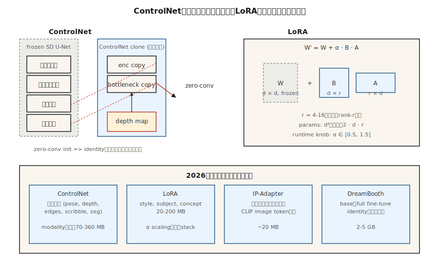

# ControlNet, LoRA & Conditioning

> text だけでは、制御信号として不器用です。ControlNet は pretrained diffusion model を clone し、depth map、pose skeleton、scribble、edge image で誘導できるようにします。LoRA は 10 million parameters を学習するだけで 2B-parameter model を fine-tune できるようにします。この 2 つが Stable Diffusion を toy から、2026 年にあらゆる agency が ship する image pipeline へ変えました。

**種別:** 構築
**言語:** Python
**前提条件:** Phase 8 · 07 (Latent Diffusion), Phase 10 (LLMs from Scratch — for LoRA foundation)
**所要時間:** 約75分

## 問題

"a woman in a red dress walking a dog on a busy street" のような prompt は、dog が*どこ*にいるのか、woman が*どんな pose*なのか、street の*perspective*がどうなっているのかをモデルに伝えません。text が指定できるのは、画像に必要な情報の約 10% です。残りは visual であり、言葉では効率よく記述できません。

pose、depth、canny、segmentation など、信号ごとに新しい conditional model を scratch から学習するのは高コストすぎます。2.6B-param SDXL backbone を凍結したまま、conditioning を読む小さな side-network を取り付け、それが backbone の intermediate features を少し動かすようにしたい。これが ControlNet です。

また、full model を retrain せずに新しい concept (自分の顔、自社製品、自分の style) をモデルに教えたい。100x 小さい delta が欲しい。これが LoRA、既存の attention weights に差し込む low-rank adapters です。

ControlNet + LoRA + text = 2026 年の実務家の toolkit です。ほとんどの production image pipelines は、SDXL / SD3 / Flux base の上に 2-5 個の LoRAs、1-3 個の ControlNets、そして IP-Adapter を重ねます。

## The Concept



### ControlNet (Zhang et al., 2023)

pretrained SD を取り、U-Net の encoder half を*clone*します。original は凍結します。clone は追加の conditioning input (edges, depth, pose) を受け取るように学習します。clone を original の decoder half に、*zero-convolution* skip connections (ゼロ初期化された 1×1 convs。最初は no-op で、delta を学習する) で接続します。

```
SD U-Net decoder:   ... ← orig_enc_features + zero_conv(controlnet_enc(condition))
```

Zero-conv init により、ControlNet は identity として始まります。training 前でも害はありません。1M の (prompt, condition, image) triples で、標準の diffusion loss を使って学習します。

modality ごとの ControlNets は小さな side models として提供されます (SDXL で約 360M、SD 1.5 で約 70M)。推論時に合成できます。

```
features += weight_a * control_a(depth) + weight_b * control_b(pose)
```

### LoRA (Hu et al., 2021)

model 内の任意の linear layer `W ∈ R^{d×d}` について、`W` を凍結し、low-rank delta を追加します。

```
W' = W + ΔW,  ΔW = B @ A,  A ∈ R^{r×d},  B ∈ R^{d×r}
```

ここで `r << d` です。attention では rank 4-16、heavy fine-tunes では rank 64-128 が標準です。新規 parameters 数は `d²` ではなく `2 · d · r` です。`d=640` の SDXL attention で `r=16` なら、adapter あたり 410k ではなく 20k params、つまり 20x reduction です。model 全体では、LoRA は通常 base 5GB に対して 20-200MB です。

推論時には LoRA を scale できます。`W' = W + α · B @ A` です。`α = 0.5-1.5` が通常です。複数の LoRAs は加法的に stack できます (非線形に相互作用するという通常の注意点はあります)。

### IP-Adapter (Ye et al., 2023)

conditioning として text に加えて*画像*を受け取る小さな adapter です。CLIP image encoder を使って image tokens を作り、text tokens と並べて cross-attention に注入します。base model ごとに約 20MB です。LoRA なしで「この reference の style で画像を生成する」ことができます。

## Composability matrix

| Tool | What it controls | Size | When to use |
|------|------------------|------|-------------|
| ControlNet | Spatial structure (pose, depth, edges) | 70-360MB | Exact layout, composition |
| LoRA | Style, subject, concept | 20-200MB | Personalization, style |
| IP-Adapter | Style or subject from reference image | 20MB | No text can describe the look |
| Textual Inversion | Single concept as a new token | 10KB | Legacy, mostly replaced by LoRA |
| DreamBooth | Full fine-tune on a subject | 2-5GB | Strong identity, high compute |
| T2I-Adapter | Lighter ControlNet alternative | 70MB | Edge devices, inference budget |

ControlNet ≈ spatial。LoRA ≈ semantic。両方を使います。

## 実装

`code/main.py` は 1-D で 2 つの仕組みを simulate します。

1. **LoRA.** pretrained linear layer `W`。これを凍結します。low-rank `B @ A` を学習し、`W + BA` が target linear layer に一致するようにします。rank-1 correction を完全に学習するには `r = 1` で十分であることを示します。

2. **ControlNet-lite.** "frozen base" predictor と、extra signal を読む "side network" です。side network の出力は、zero で初期化された learnable scalar で gate されます (zero-conv のこちらでの版)。学習すると gate が上がっていく様子を確認します。

### Step 1: LoRA math

```python
def lora(W, A, B, x, alpha=1.0):
    # W is frozen; A, B are the trainable low-rank factors.
    return [W[i][j] * x[j] for i, j in ...] + alpha * (B @ (A @ x))
```

### Step 2: zero-init side network

```python
side_out = control_net(x, condition)
gated = gate * side_out  # gate initialized to 0
h = base(x) + gated
```

step 0 では出力は base と同一です。early training では `gate` がゆっくり更新されます。catastrophic drift はありません。

## Pitfalls

- **Over-scaling LoRAs.** `α = 2` や `α = 3` は「もっと強くする」ためのよくある hack ですが、over-stylized / broken outputs を生みます。`α ≤ 1.5` に保ちます。
- **ControlNet weight conflict.** Pose ControlNet を weight 1.0、Depth ControlNet も weight 1.0 で使うと、たいてい overshoot します。weights の合計 ≈ 1.0 が安全な default です。
- **LoRA on the wrong base.** SDXL LoRAs は attention dimensions が一致しないため、SD 1.5 では silently no-op になります。Diffusers 0.30+ は警告します。
- **Textual Inversion drift.** ある checkpoint で学習された tokens は、別の checkpoint で大きく drift します。LoRA の方が portable です。
- **LoRA weight-merging and storage.** LoRA を base model weights に bake して推論を速くできます (runtime addition なし) が、runtime に `α` を scale する能力を失います。両方の version を保持します。

## Use It

| Goal | 2026 pipeline |
|------|---------------|
| brand の art style を再現 | LoRA trained on ~30 curated images at rank 32 |
| 生成画像に自分の顔を入れる | DreamBooth or LoRA + IP-Adapter-FaceID |
| specific pose + prompt | ControlNet-Openpose + SDXL + text |
| depth-aware composition | ControlNet-Depth + SD3 |
| reference + prompt | IP-Adapter + text |
| exact layout | ControlNet-Scribble or ControlNet-Canny |
| background replace | ControlNet-Seg + Inpainting (Lesson 09) |
| fast 1-step style | LCM-LoRA on SDXL-Turbo |

## Ship It

`outputs/skill-sd-toolkit-composer.md` を保存します。この skill は task (input assets: prompt, optional reference image, optional pose, optional depth, optional scribble) を受け取り、tool stack、weights、reproducible seed protocol を出力します。

## Exercises

1. **Easy.** `code/main.py` で LoRA rank `r` を 1 から 4 まで変えます。どの rank で LoRA は rank-2 target delta に正確に一致しますか。
2. **Medium.** 2 つの target transforms に対して 2 つの separate LoRAs を学習します。同時に load し、その additive interaction を示します。いつ interaction が linearity を破りますか。
3. **Hard.** diffusers を使って、SDXL-base + Canny-ControlNet (weight 0.8) + style LoRA (α 0.8) + IP-Adapter (weight 0.6) を stack します。stack weights を変えながら FID-vs-prompt-adherence trade-off を測定します。

## Key Terms

| Term | What people say | What it actually means |
|------|-----------------|-----------------------|
| ControlNet | "Spatial control" | cloned encoder + zero-conv skips。conditioning image を読む。 |
| Zero convolution | "Starts as identity" | zero で初期化された 1×1 conv。ControlNet は no-op として始まる。 |
| LoRA | "Low-rank adapter" | `W + B @ A`, `r << d`。full fine-tune より 100x 少ない params。 |
| rank r | "The knob" | LoRA compression。典型は 4-16、heavy personalization では 64+。 |
| α | "LoRA strength" | LoRA delta の runtime scaling。 |
| IP-Adapter | "Reference image" | CLIP-image tokens 経由の小さな image-conditioning adapter。 |
| DreamBooth | "Full subject fine-tune" | subject の ~30 images で full model を学習する。 |
| Textual Inversion | "New token" | 新しい word embedding だけを学習する。legacy で、ほぼ置き換え済み。 |

## Production note: LoRA swaps, ControlNet lanes, multi-tenant serving

実際の text-to-image SaaS は、同じ base checkpoint の上で数百の LoRAs と十数個の ControlNets を提供します。serving problem は LLM multi-tenancy にかなり似ています (production literature は LLM case を continuous batching と LoRAX / S-LoRA の文脈で扱っています)。

- **Hot-swap LoRAs, do not merge.** `W' = W + α·B·A` を base に merge すると per-step inference が約 3-5% 速くなりますが、`α` と base が固定されます。LoRAs は rank-r deltas として VRAM 上に hot に保持します。diffusers は request ごとの activation 用に `pipe.load_lora_weights()` + `pipe.set_adapters([...], adapter_weights=[...])` を提供します。swap cost は `2 · d · r · num_layers` weights、つまり MB-scale で sub-second です。
- **ControlNet as a second attention lane.** cloned encoder は base と並列に走ります。weight 1.0 の ControlNets が 2 つある場合、step ごとに 2 つの extra forward passes が発生します。1 つの merged pass ではありません。batch-size headroom は二次的に落ちます。active ControlNet ごとに約 1.5× step cost を見積もります。
- **Quantized LoRAs too.** base を quantize している場合 (Lesson 07 の 8GB 上の Flux を参照)、LoRA delta も 8-bit または 4-bit にきれいに quantize できます。QLoRA-style loading により、memory を破綻させずに 4-bit Flux base の上へ 5-10 個の LoRAs を stack できます。

Flux-specific: Niels の Flux-on-8GB notebook は base を 4-bit に quantize します。その quantized base に style LoRA (`pipe.load_lora_weights("user/style-lora")`) を `weight_name="pytorch_lora_weights.safetensors"` で stack しても動きます。これが、2026 年に多くの SaaS agencies が ship している recipe です。

## 参考文献

- [Zhang, Rao, Agrawala (2023). Adding Conditional Control to Text-to-Image Diffusion Models](https://arxiv.org/abs/2302.05543) — ControlNet.
- [Hu et al. (2021). LoRA: Low-Rank Adaptation of Large Language Models](https://arxiv.org/abs/2106.09685) — LoRA (originally for LLMs; diffusion に移植)。
- [Ye et al. (2023). IP-Adapter: Text Compatible Image Prompt Adapter](https://arxiv.org/abs/2308.06721) — IP-Adapter.
- [Mou et al. (2023). T2I-Adapter: Learning Adapters to Dig Out More Controllable Ability](https://arxiv.org/abs/2302.08453) — ControlNet の軽量な代替。
- [Ruiz et al. (2023). DreamBooth: Fine Tuning Text-to-Image Diffusion Models for Subject-Driven Generation](https://arxiv.org/abs/2208.12242) — DreamBooth.
- [HuggingFace Diffusers — ControlNet / LoRA / IP-Adapter docs](https://huggingface.co/docs/diffusers/training/controlnet) — reference pipelines.
