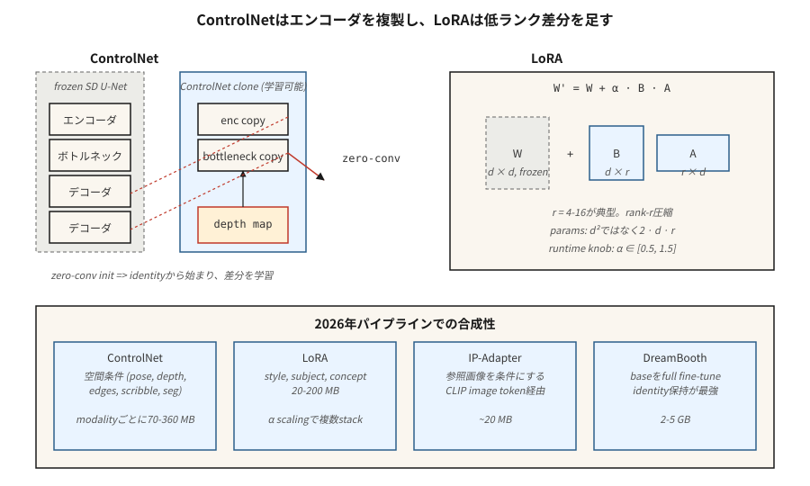

# ControlNet、LoRA 与条件化

> 仅靠文本是一种笨拙的控制信号。ControlNet 让你克隆一个预训练的扩散模型，并用深度图、姿态骨架、涂鸦或边缘图像来引导它。LoRA 让你通过训练 1000 万个参数来微调一个 2B 参数的模型。它们共同将 Stable Diffusion 从一个玩具变成了 2026 年每个机构都在部署的图像流水线。

**类型：** 构建
**语言：** Python
**前置知识：** 阶段 8 · 07（潜在扩散）、阶段 10（从零实现 LLM——为 LoRA 打基础）
**时间：** ~75 分钟

## 问题

像"一个穿着红裙的女人在繁忙的街上遛狗"这样的提示，没有给模型提供关于狗*在哪里*、女人*是什么姿势*或街道*是什么视角*的任何信息。文本只固定了你需要指定一张图像的约 10%。其余是视觉的，无法用语言有效描述。

为每种信号（姿态、深度、canny、分割）从头训练新的条件模型是不可行的。你希望保持 2.6B 参数的 SDXL 骨干冻结，附加一个读取条件的小型侧网络，让它推动骨干的中间特征。这就是 ControlNet。

你还希望教模型新概念（你的脸、你的产品、你的风格），而无需重新训练整个模型。你想要一个小 100 倍的增量。这就是 LoRA——插入现有注意力权重的低秩适配器。

ControlNet + LoRA + 文本 = 2026 年从业者的工具包。大多数生产图像流水线在 SDXL / SD3 / Flux 基座上叠加 2-5 个 LoRA、1-3 个 ControlNet 和一个 IP-Adapter。

## 概念



### ControlNet（Zhang et al., 2023）

取一个预训练的 SD。*克隆* U-Net 的编码器半部分。冻结原始模型。训练克隆接受额外的条件输入（边缘、深度、姿态）。通过*零卷积*跳跃连接（初始化为 0 的 1×1 卷积——开始时无操作，学习一个增量）将克隆连接回原始模型的解码器半部分。

```
SD U-Net 解码器：   ... ← orig_enc_features + zero_conv(controlnet_enc(condition))
```

零卷积初始化意味着 ControlNet 从恒等变换开始——即使训练前也不会造成伤害。使用标准扩散损失在 100 万（提示、条件、图像）三元组上训练。

每种模态的 ControlNet 作为小型侧模型部署（SDXL 约 360M，SD 1.5 约 70M）。你可以在推理时组合它们：

```
features += weight_a * control_a(depth) + weight_b * control_b(pose)
```

### LoRA（Hu et al., 2021）

对于模型中的任何线性层 `W ∈ R^{d×d}`，冻结 `W` 并添加一个低秩增量：

```
W' = W + ΔW,  ΔW = B @ A,  A ∈ R^{r×d},  B ∈ R^{d×r}
```

其中 `r << d`。注意力使用秩 4-16 是标准，重度微调使用秩 64-128。新参数量：`2 · d · r` 而不是 `d²`。对于 `d=640`、`r=16` 的 SDXL 注意力：每个适配器 20k 参数而不是 410k——减少 20 倍。整个模型：LoRA 通常为 20-200MB，而基座为 5GB。

推理时你可以缩放 LoRA：`W' = W + α · B @ A`。`α = 0.5-1.5` 是正常的。多个 LoRA 可加性叠加（通常的警告是它们以非线性方式交互）。

### IP-Adapter（Ye et al., 2023）

一个微小的适配器，接受*图像*作为条件（与文本并列）。使用 CLIP 图像编码器产生图像令牌，将其与文本令牌一起注入交叉注意力。每个基座模型约 20MB。让你可以在没有 LoRA 的情况下做"以这张参考图像的风格生成图像"。

## 可组合性矩阵

| 工具 | 控制什么 | 大小 | 何时使用 |
|------|------------------|------|-------------|
| ControlNet | 空间结构（姿态、深度、边缘） | 70-360MB | 精确布局、构图 |
| LoRA | 风格、主题、概念 | 20-200MB | 个性化、风格 |
| IP-Adapter | 来自参考图像的风格或主题 | 20MB | 无法用文本描述外观 |
| Textual Inversion | 作为新令牌的单一概念 | 10KB | 遗留方案，大多已被 LoRA 取代 |
| DreamBooth | 在主题上的全量微调 | 2-5GB | 强身份、高计算量 |
| T2I-Adapter | 更轻量的 ControlNet 替代 | 70MB | 边缘设备、推理预算有限 |

ControlNet ≈ 空间。LoRA ≈ 语义。两者都用。

## 动手实现

`code/main.py` 在 1-D 上模拟两种机制：

1. **LoRA。** 一个预训练的线性层 `W`。冻结它。训练一个低秩 `B @ A`，使得 `W + BA` 匹配目标线性层。展示 `r = 1` 足以完美学习秩-1 修正。

2. **ControlNet-lite。** 一个"冻结基座"预测器和一个读取额外信号的"侧网络"。侧网络的输出由一个初始化为零的可学习标量（我们的零卷积版本）门控。训练并观察门控值上升。

### 步骤 1：LoRA 数学

```python
def lora(W, A, B, x, alpha=1.0):
    # W is frozen; A, B are the trainable low-rank factors.
    return [W[i][j] * x[j] for i, j in ...] + alpha * (B @ (A @ x))
```

### 步骤 2：零初始化侧网络

```python
side_out = control_net(x, condition)
gated = gate * side_out  # gate initialized to 0
h = base(x) + gated
```

在第 0 步，输出与基座相同。早期训练缓慢更新 `gate`——没有灾难性漂移。

## 陷阱

- **LoRA 过缩放。** `α = 2` 或 `α = 3` 是一种常见的"让它更强"的黑客做法，会产生过度风格化/损坏的输出。保持 `α ≤ 1.5`。
- **ControlNet 权重冲突。** 使用权重 1.0 的 Pose ControlNet 和权重 1.0 的 Depth ControlNet 通常会过度。权重之和 ≈ 1.0 是安全默认值。
- **在错误的基座上使用 LoRA。** SDXL LoRA 在 SD 1.5 上静默无效，因为注意力维度不匹配。Diffusers 0.30+ 会警告。
- **Textual Inversion 漂移。** 在一个检查点上训练的令牌在另一个检查点上严重漂移。LoRA 更可移植。
- **LoRA 权重合并与存储。** 你可以将 LoRA 烘焙到基座模型权重中，以实现更快的推理（无运行时加法），但会失去在运行时缩放 `α` 的能力。保留两个版本。

## 应用

| 目标 | 2026 年流水线 |
|------|---------------|
| 重现品牌的艺术风格 | 在约 30 张精选图像上训练的秩 32 LoRA |
| 把脸放进生成的图像 | DreamBooth 或 LoRA + IP-Adapter-FaceID |
| 特定姿态 + 提示 | ControlNet-Openpose + SDXL + 文本 |
| 深度感知构图 | ControlNet-Depth + SD3 |
| 参考图 + 提示 | IP-Adapter + 文本 |
| 精确布局 | ControlNet-Scribble 或 ControlNet-Canny |
| 背景替换 | ControlNet-Seg + Inpainting（第 09 课） |
| 快速 1 步风格 | SDXL-Turbo 上的 LCM-LoRA |

## 交付

保存为 `outputs/skill-sd-toolkit-composer.md`。技能接受一个任务（输入资产：提示、可选的参考图像、可选的姿态、可选的深度、可选的涂鸦）并输出工具栈、权重和可重现的随机种子方案。

## 练习

1. **简单。** 在 `code/main.py` 中，将 LoRA 秩 `r` 从 1 变到 4。在什么秩时 LoRA 精确匹配秩-2 的目标增量？
2. **中等。** 在两个目标变换上训练两个独立的 LoRA。一起加载它们并展示它们的加性交互。交互何时打破线性？
3. **困难。** 使用 diffusers 堆叠：SDXL-base + Canny-ControlNet（权重 0.8）+ 一个风格 LoRA（α 0.8）+ IP-Adapter（权重 0.6）。随着堆叠权重变化，测量 FID-与-提示遵循的权衡。

## 关键术语

| 术语 | 人们说的 | 实际含义 |
|------|-----------------|-----------------------|
| ControlNet | "空间控制" | 克隆的编码器 + 零卷积跳跃连接；读取条件图像。 |
| Zero convolution | "从恒等开始" | 初始化为 0 的 1×1 卷积；ControlNet 从无操作开始。 |
| LoRA | "低秩适配器" | `W + B @ A`，`r << d`；比全量微调少 100 倍的参数。 |
| rank r | "旋钮" | LoRA 压缩度；4-16 典型，64+ 用于重度个性化。 |
| α | "LoRA 强度" | LoRA 增量的运行时缩放。 |
| IP-Adapter | "参考图像" | 通过 CLIP 图像令牌的小型图像条件适配器。 |
| DreamBooth | "全量主题微调" | 在约 30 张主题图像上训练完整模型。 |
| Textual Inversion | "新令牌" | 仅学习新词嵌入；遗留方案，大多已被取代。 |

## 生产说明：LoRA 交换、ControlNet 通道、多租户服务

一个真实的文生图 SaaS 在同一个基础检查点上服务数百个 LoRA 和十几个 ControlNet。服务问题看起来很像 LLM 多租户（生产文献在连续批处理和 LoRAX / S-LoRA 下涵盖了 LLM 案例）：

- **热交换 LoRA，不要合并。** 将 `W' = W + α·B·A` 合并到基座中可提供约 3-5% 的每步推理加速，但冻结了 `α` 和基座。将 LoRA 作为秩-r 增量保持在 VRAM 中；diffusers 暴露了 `pipe.load_lora_weights()` + `pipe.set_adapters([...], adapter_weights=[...])` 用于按请求激活。交换成本是 `2 · d · r · num_layers` 权重——MB 级别，亚秒级。
- **ControlNet 作为第二注意力通道。** 克隆的编码器与基座并行运行。两个权重各为 1.0 的 ControlNet = 每步两次额外前向传播，而不是一次合并传播。批大小余量二次下降。每个活跃 ControlNet 的预算约为 1.5 倍的步骤成本。
- **量化 LoRA 也适用。** 如果你量化了基座（见第 07 课，8GB 上的 Flux），LoRA 增量也能干净地量化为 8-bit 或 4-bit。QLoRA 风格的加载让你可以在 4-bit Flux 基座上堆叠 5-10 个 LoRA 而不爆内存。

Flux 特有：Niels 的 Flux-on-8GB notebook 将基座量化为 4-bit；在该量化基座上使用 `weight_name="pytorch_lora_weights.safetensors"` 堆叠一个风格 LoRA（`pipe.load_lora_weights("user/style-lora")`)）仍然有效。这是大多数 SaaS 机构在 2026 年部署的配方。

## 延伸阅读

- [Zhang, Rao, Agrawala (2023). Adding Conditional Control to Text-to-Image Diffusion Models](https://arxiv.org/abs/2302.05543) — ControlNet。
- [Hu et al. (2021). LoRA: Low-Rank Adaptation of Large Language Models](https://arxiv.org/abs/2106.09685) — LoRA（最初用于 LLM；移植到扩散）。
- [Ye et al. (2023). IP-Adapter: Text Compatible Image Prompt Adapter](https://arxiv.org/abs/2308.06721) — IP-Adapter。
- [Mou et al. (2023). T2I-Adapter: Learning Adapters to Dig Out More Controllable Ability](https://arxiv.org/abs/2302.08453) — 比 ControlNet 更轻量的替代品。
- [Ruiz et al. (2023). DreamBooth: Fine Tuning Text-to-Image Diffusion Models for Subject-Driven Generation](https://arxiv.org/abs/2208.12242) — DreamBooth。
- [HuggingFace Diffusers — ControlNet / LoRA / IP-Adapter docs](https://huggingface.co/docs/diffusers/training/controlnet) — 参考流水线。
