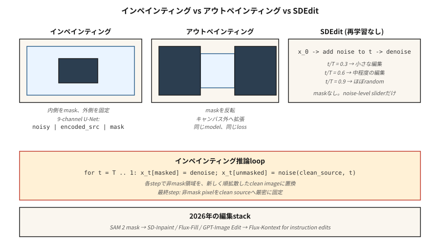

# İç Boyama, Dış Boyama ve Görüntü Düzenleme

> Metinden resme yeni şeyler katar. İç boyama eskileri onarır. Üretimde, faturalandırılabilir görüntü işlerinin %70'i düzenlemedir; bir arka planı değiştirin, bir logoyu kaldırın, tuvali genişletin, bir eli yeniden oluşturun. İç boyama, yayılmanın önemini kazandığı yerdir.

**Tür:** Yapım
**Diller:** Python
**Önkoşullar:** Aşama 8 · 07 (Gizli Difüzyon), Aşama 8 · 08 (ControlNet ve LoRA)
**Süre:** ~75 dakika

## Sorun

Bir müşteri, arka planda dikkat dağıtıcı bir işaret bulunan mükemmel bir ürün fotoğrafı gönderiyor. İşareti silmek ve diğer her şeyi piksel olarak aynı bırakmak istiyorsunuz. Metinden resme dönüştürmeyi sıfırdan çalıştıramazsınız; sonuçta farklı bir renk, farklı bir aydınlatma ve farklı ürün açısı olacaktır. *Yalnızca* maskelenen bölgeyi yeniden oluşturmak istiyorsunuz ve yenilemenin çevredeki bağlama saygı göstermesini istiyorsunuz.

Bu iç boyamadır. Varyantlar:

- **İç boyama.** Bir maskenin içinde yenileyin, dış pikselleri koruyun.
- **Dış boyama.** Bir maskenin dışında (veya tuvalin ötesinde) yenilenin, içeride kalın.
- **Görüntü düzenleme.** Tüm görüntüyü yeniden oluşturun ancak anlamsal veya yapısal olarak orijinale (SDEdit, InstructPix2Pix) sadık kalın.

2026'daki her dağıtım hattı bir iç boyama modu gönderiyor. Flux.1-Fill, Stabil Difüzyon İç Boyası, SDXL-Inpaint, DALL-E 3 Düzenle. Aynı prensipte çalışırlar.

## Konsept



### Saf yaklaşım (ve neden yanlış)

Bir maskeyle standart metinden resme dönüştürmeyi çalıştırın. Her örnekleme adımında, gürültülü gizli bölgenin maskesiz bölgesini ileri dağılmış temiz görüntüyle değiştirin. Kötü çalışıyor. Sınır artifact'ler taşıyor çünkü model, maskelenmiş bölgede ne olduğuna dair hiçbir bilgiye sahip değil.

### Uygun iç boyama modeli

4 yerine 9 giriş kanalı alan değiştirilmiş bir U-Net'i eğitin:

```
input = concat([ noisy_latent (4ch), encoded_image (4ch), mask (1ch) ], dim=channel)
```

Ekstra kanallar, VAE kodlu kaynak görüntünün bir kopyasına ek olarak tek kanallı bir maskedir. Eğitim zamanında, görüntünün bölgelerini rastgele maskelersiniz ve modeli yalnızca maskelenmiş bölgenin gürültüsünü giderecek şekilde eğitirsiniz; maskelenmemiş bölge ise temiz bir koşullandırma sinyali olarak verilir. inference'de model, maskelenmiş bölgeyi çevreleyen şeyleri "görebilir" ve tutarlı tamamlamalar üretebilir.

SD-Inpaint, SDXL-Inpaint, Flux-Fill'in tümü bu 9 kanallı (veya analog) girişi kullanır. Difüzörler `StableDiffusionInpaintPipeline`, `FluxFillPipeline`.

### SDEdit (Meng ve diğerleri, 2022) — ücretsiz düzenleme

Kaynak görüntüye bir miktar `t` orta düzeyine kadar gürültü ekleyin, ardından yeni bir prompt ile `t`'den 0'a kadar ters zinciri çalıştırın. Yeniden eğitim yok. `t`'yi başlatma seçimi, sadakati yaratıcı özgürlükle değiştirir:

- `t/T = 0.3` → kaynakla neredeyse aynı, küçük üslup değişiklikleri
- `t/T = 0.6` → orta düzey düzenlemeler, kaba yapıyı korur
- `t/T = 0.9` → gürültüye yakın, minimum kaynak korumasından üretilmiştir

### InstructPix2Pix (Brooks ve diğerleri, 2023)

`(input_image, instruction, output_image)` üçlülerinde bir difüzyon modeline ince ayar yapın. inference'de, hem giriş görüntüsüne hem de bir metin talimatına ilişkin koşul ("gün batımını yap", "ejderha ekle"). İki CFG ölçeği: görüntü ölçeği ve metin ölçeği.

### Yeniden Boya (Lugmayr ve diğerleri, 2022)

Standart, koşulsuz bir yayılma modelini koruyun. Her ters adımda, yeniden örnekleme yapın; ara sıra daha gürültülü bir duruma geri dönün ve yeniden oluşturun. artifact sınırlarını önler. Eğitimli bir iç boyama modeliniz olmadığında kullanılır.

## İnşa Et

`code/main.py`, 5 boyutlu veriler üzerinde oyuncak 1 boyutlu bir iç boyama şeması uygular. Her numunenin iki kümeden birinden 5 kayan nokta olduğu 5 boyutlu karışım verileri üzerinde bir DDPM eğitiyoruz. inference'de, 5 boyuttan 2'sini "maskeliyoruz", her adımda maskesiz üçünün gürültülü ileri versiyonunu enjekte ediyoruz ve yalnızca maskelenmiş boyutları yeniden oluşturuyoruz.

### Adım 1: 5-D DDPM verileri

```python
def sample_data(rng):
    cluster = rng.choice([0, 1])
    center = [-1.0] * 5 if cluster == 0 else [1.0] * 5
    return [c + rng.gauss(0, 0.2) for c in center], cluster
```

### Adım 2: 5 karartmanın tamamında gürültü gidericiyi eğitin

Standart DDPM. Net çıkışlar, 5 boyutlu gürültülü giriş için 5 boyutlu gürültü tahminidir.

### Adım 3: inference'de maskeye duyarlı geri dönüş

```python
def inpaint_step(x_t, mask, clean_image, alpha_bars, t, rng):
    # replace unmasked dims with a freshly noised version of the clean source
    a_bar = alpha_bars[t]
    for i in range(len(x_t)):
        if not mask[i]:
            x_t[i] = math.sqrt(a_bar) * clean_image[i] + math.sqrt(1 - a_bar) * rng.gauss(0, 1)
    # ...then run the normal reverse step on x_t
```

Bu naif bir yaklaşımdır ve oyuncak 1 boyutlu veriler üzerinde çalışır. Gerçek görüntü iç boyama 9 kanallı girişi kullanır çünkü doku tutarlılığı daha önemlidir.

### Adım 4: dış boyama

Dış boyama, maske ters çevrilmiş halde iç boyamadır: yeni (daha önce var olmayan) tuvali maskeleyin, geri kalanını orijinalle doldurun. Aynı eğitim hedefi.

## Tuzaklar

- **Dikişler.** gradient bilgisi maskenin üzerinden akmadığı için saf yaklaşım görünür sınırlar bırakır. Düzeltme: Maskeyi 8-16 piksel genişletin veya uygun bir iç boyama modeli kullanın.
- **Maske sızıntısı.** Koşullandırma görüntüsünün maskesiz bölgesi düşük kaliteli veya gürültülü ise maske içindeki nesli kirletir. Gürültüyü giderin veya hafifçe bulanıklaştırın.
- **CFG, maske boyutuyla etkileşime girer.** Küçük bir maskede yüksek CFG = doymuş yama. Küçük düzenlemeler için CFG'yi azaltın.
- **SDEdit aslına uygunluk uçurumu.** `t/T = 0.5`'den `t/T = 0.6`'ye gitmek kişinin kimliğini kaybedebilir. Süpürme ve kontrol noktası.
- **Prompt uyumsuzluğu.** prompt yalnızca yeni içeriği değil, *tüm* görüntüyü tanımlamalıdır. "Kedi" değil "sandalyede oturan kedi".

## Kullan onu

| Görev | Boru hattı |
|------|----------|
| Nesneyi kaldır, küçük maske | SD-Inpaint veya Flux-Fill, standart prompt |
| Gökyüzünü değiştir | SD-Inpaint + "gün batımında mavi gökyüzü" |
| Tuvali genişlet | SDXL dış boyama modu (8px tüy) veya dış boya maskeli Flux-Fill |
| El / yüzü yenileyin | Konuyu yeniden tanımlayan prompt ile SD-Inpaint + ControlNet-Openpose |
| Bir bölgenin stilini değiştirin | `t/T=0.5`'de maskelenmiş bölgede SDEdit |
| "Gün batımını yap" | InstructPix2Pix veya Flux-Kontext |
| Arka plan değiştirme | SAM maskesi → SD-Inpaint |
| Ultra yüksek doğruluk | En zor durumlar için Flux-Fill veya GPT-Image (barındırılan) |

SAM (Meta's Segment Everything, 2023) + difüzyon iç boyası, 2026 arka plan kaldırma hattıdır. SAM 2 (2024) video üzerinde çalışır.

## Gönderin

`outputs/skill-editing-pipeline.md`'yi kaydedin. Skill, orijinal bir görüntü + düzenleme açıklaması + isteğe bağlı maske (veya SAM prompt) alır ve çıktılar: maske oluşturma yaklaşımı, temel model, CFG ölçekleri (görüntü + metin), SDEdit-t veya iç boyama modu ve QA kontrol listesi.

## Egzersizler

1. **Kolay.** `code/main.py`'de maskelenen boyutların oranını 0,2 ile 0,8 arasında değiştirin. İç boya kalitesi (maskelenmiş solukluklarda kalan) koşulsuz üretime ne oranda eşittir?
2. **Orta.** RePaint'i uygulayın: her 10. ters adımda, 5 adım geri atlayın (gürültü ekleyin) ve yeniden gürültüyü giderin. Maske kenarında sınır kalıntısını azaltıp azaltmadığını ölçün.
3. **Zor.** Karşılaştırmak için Hugging Face difüzörlerini kullanın: 20 yüz yenileme görevinde SD 1.5 Inpaint + ControlNet-Openpose ve Flux.1-Fill. Poz uyumu ve kimliğin korunmasını ayrı ayrı puanlayın.

## Anahtar Terimler

| Dönem | İnsanlar ne diyor | Aslında ne anlama geliyor |
|------|-----------------|-----------------------|
| İç boyama | "Deliği doldurun" | Bir maskenin içinde yenilenin; dış pikselleri koruyun. |
| Dış Boyama | "Tuvali genişlet" | Tuvalin dışında yenilenin; içeride kal. |
| 9 kanallı U-Net | "Uygun iç boyama modeli" | Giriş olarak `noisy \| encoded-source \| mask` ile U-Net. |
| SDDüzenle | "Gürültü düzeyiyle birlikte Img2img" | Gürültüyü zamana karşı `t`, yeni prompt ile gürültüyü giderin. |
| InstructPix2Pix | "Salt metin düzenlemeleri" | (Görüntü, talimat, çıktı) üçlülerinde ince ayarlı yayılma. |
| Yeniden Boya | "Yeniden eğitim yok" | Dikişleri azaltmak için ters yönde periyodik olarak yeniden gürültü yapın. |
| SAM | "Her Şeyi Bölümlere Ayırın" | Tıklamalar veya kutucuklarla maske oluşturucu; inpaint ile eşleşir. |
| Flux-Bağlam | "Bağlamla düzenle" | Düzenlemeler için referans görseli + talimatı kabul eden flux çeşidi. |

## Üretim notu: düzenleme ardışık düzenleri gecikmeye duyarlıdır

Bir görüntüyü düzenleyen kullanıcılar, gidiş dönüşlerin 5 saniyenin altında olmasını bekler. 1024²'de 30 adımlı SDXL-Inpaint, L4'te 3-4 saniyedir, ayrıca SAM maskesi oluşturma (~200 ms) ve VAE kodlama/kod çözme (~500 ms birleşik). Üretim çerçevelemesinde bu, üretime bağlı olmaktan ziyade TTFT'ye bağlıdır - toplu 1, düşük eşzamanlılık, her aşamayı en aza indirin:

- **SAM-H yavaş olandır.** 1024²'deki SAM-H ~200 ms'dir; SAM-ViT-B, küçük kalite kaybıyla ~40 ms'dir. SAM 2 (video) zamansal yük ekler; tek görüntü düzenlemeleri için kullanmayın.
- **Mümkün olduğunda kodlamayı atlayın.** `pipe.image_processor.preprocess(img)` gizli olanları kodlar. Önceki nesilden gizli bilgilere sahipseniz (yinelemeli düzenleme kullanıcı arayüzlerinde tipiktir), bir VAE kodlamasını atlamak için bunları doğrudan `latents=...` aracılığıyla iletin.
- **Maske genişlemesi üretim açısından da önemlidir.** Küçük bir maske, U-Net ileri geçişinin çoğunun boşa gittiği anlamına gelir (maskelenmemiş pikseller yine de sıkıştırılır). `diffusers`' `StableDiffusionInpaintPipeline` ne olursa olsun tam U-Net'i çalıştırır; yalnızca 9 kanallı uygun iç boyama varyantları maskelenmiş bilgi işlemden yararlanır.
- **Flux-Kontext 2025'in yanıtıdır.** `(source_image, instruction)` üzerinden tek ileri geçiş — ayrı bir maske yok, SDEdit gürültü taraması yok. H100'de bir düzenleme ~1,5 saniyede gönderilir. Mimari ders: aşamaları daraltın.

## Daha Fazla Okuma

- [Lugmayr ve ark. (2022). RePaint: Gürültü Giderici Difüzyon Olasılık Modellerini kullanarak İç Boyama](https://arxiv.org/abs/2201.09865) — eğitim gerektirmeyen iç boyama.
- [Meng ve ark. (2022). SDEdit: Stokastik Diferansiyel Denklemlerle Kılavuzlu Görüntü Sentezi ve Düzenleme](https://arxiv.org/abs/2108.01073) — SDEdit.
- [Brooks, Holynski, Efros (2023). InstructPix2Pix](https://arxiv.org/abs/2211.09800) — metin talimatı düzenleme.
- [Kirillov ve ark. (2023). Her Şeyi Segmente Ayır](https://arxiv.org/abs/2304.02643) — SAM, maske kaynağı.
- [Ravi ve ark. (2024). SAM 2: Görüntülerdeki ve Videolardaki Her Şeyi Segmentlere Ayırın](https://arxiv.org/abs/2408.00714) — video SAM.
- [Hertz ve ark. (2022). Prompt-to-Prompt Çapraz Dikkat Kontrolüyle Görüntü Düzenleme](https://arxiv.org/abs/2208.01626) — dikkat düzeyinde düzenleme.
- [Kara Orman Laboratuvarları (2024). Flux.1-Fill ve Flux.1-Kontext](https://blackforestlabs.ai/flux-1-tools/) — 2024 takımlama.
