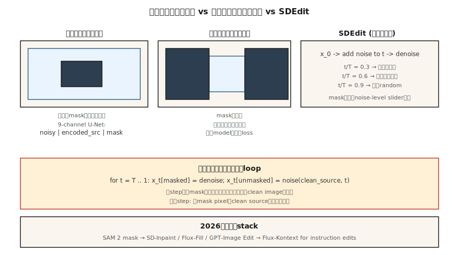

# Inpainting, Outpainting & Image Editing

> 文本到图像创造了新事物。修补旧的。在制作中，70%的计费图像工作是编辑-交换背景、删除徽标、扩展画布、再生手。修补是扩散赖以生存的地方。

** 类型：** 构建
** 语言：** Python
** 先决条件：** 第8期· 07（潜伏扩散）、第8期· 08期（Control Net & LoRA）
** 时间：** ~75分钟

## The Problem

客户发送了一张完美的产品照片，背景中有一个分散注意力的标志。您想擦除该标志并保留其他所有内容像素相同。您无法从头开始运行文本到图像-结果将具有不同的颜色、不同的灯光、不同的产品角度。您只想再生掩蔽区域，并且希望再生尊重周围的环境。

那就是修补。变体：

- ** 修补。**在面罩内部再生，保留外部像素。
- ** 油漆。**在面具外（或画布外）再生，留在里面。
- ** 图像编辑。**重新生成整个图像，但保持原始图像的语义或结构忠实度（SDEDdit、INSTPix2 Pix）。

2026年的每条扩散管道都采用修补模式。Flux.1-Fill、稳定扩散Inpaint、SDXL-Inpaint、DALL-E 3编辑。他们的工作原理相同。

## The Concept



### The naive approach (and why it's wrong)

使用面罩运行标准的文本到图像。在每个采样步骤中，用前向扩散干净图像替换有噪潜像的未掩蔽区域。它的工作...很糟糕。边界伪影会渗透，因为模型没有有关掩蔽区域中内容的信息。

### The proper inpainting model

训练修改后的U-Net，需要9个输入通道而不是4个：

```
input = concat([ noisy_latent (4ch), encoded_image (4ch), mask (1ch) ], dim=channel)
```

额外的通道是VAE编码的源图像的副本加上单通道屏蔽。在训练时，您随机屏蔽图像的区域并训练模型以仅对屏蔽区域进行降噪，而未屏蔽区域则作为干净的条件反射信号给出。推断，该模型可以“看到”掩蔽区域周围的内容并产生连贯的完成。

SD-Inpaint、SDXL-Inpaint、Flux-Fill均使用此9通道（或模拟）输入。扩散器' StableDiffusionInpaintPipeline '、'扩散器'、&#39

### SDEdit (Meng et al., 2022) — free editing

将噪音添加到源图像中，直到某个中间“t”，然后通过新提示运行从“t”向下到0的反向链。没有再培训。选择“t”以忠诚换取创作自由：

- ' t/T = 0.3 '-与源几乎相同，风格发生小变化
- ' t/T = 0.6 '-适度编辑，保留粗糙结构
- ' t/T = 0.9 '|从近噪音产生，最低限度的来源保存

### InstructPix2Pix (Brooks et al., 2023)

在“（输入_图像、指令、输出_图像）”三重组上微调扩散模型。在推断时，对输入图像和文本指令进行条件（“让它日落”、“添加龙”）。两种CGM比例：图像比例和文本比例。

### RePaint (Lugmayr et al., 2022)

保持标准的无条件扩散模型。在每个反向步骤中，重新采样-偶尔跳回噪音较高的状态并重新生成。避免边界文物。当您没有训练有素的修补模型时使用。

## Build It

' code/main.py '在5维数据上实现了玩具1-D修复方案。我们在5-D混合数据上训练DDPM，其中每个样本是来自两个集群之一的5个浮动。在推断时，我们“屏蔽”5个维度中的2个，在每一步注入未屏蔽的3个维度的干扰版本，并仅重新生成屏蔽的维度。

### Step 1: 5-D DDPM data

```python
def sample_data(rng):
    cluster = rng.choice([0, 1])
    center = [-1.0] * 5 if cluster == 0 else [1.0] * 5
    return [c + rng.gauss(0, 0.2) for c in center], cluster
```

### Step 2: train denoiser over all 5 dims

标准DDPM。净输出针对5-D有噪输入的5-D噪音预测。

### Step 3: at inference, mask-aware reverse

```python
def inpaint_step(x_t, mask, clean_image, alpha_bars, t, rng):
    # replace unmasked dims with a freshly noised version of the clean source
    a_bar = alpha_bars[t]
    for i in range(len(x_t)):
        if not mask[i]:
            x_t[i] = math.sqrt(a_bar) * clean_image[i] + math.sqrt(1 - a_bar) * rng.gauss(0, 1)
    # ...then run the normal reverse step on x_t
```

这是一种天真的方法，它适用于玩具1-D数据。真实图像修复使用9通道输入，因为纹理一致性更重要。

### Step 4: outpainting

修补是用倒置的面具修补：遮盖新的（以前不存在的）画布，用原来的画布填充其余的。相同的训练目标。

## Pitfalls

- ** 裂缝 **朴素的方法留下了可见的边界，因为渐变信息不会流过遮罩。修正：将蒙版放大8-16像素，或者使用适当的修补模型。
- ** 口罩泄漏。**如果条件反射图像的未掩蔽区域质量低或有噪音，就会污染掩蔽内部的生成。稍微去噪或模糊。
- ** CGM与口罩尺寸相互作用。**小口罩上的高CGM =饱和贴片。针对小型编辑减少CGM。
- **SDEDit忠诚悬崖。**从' t/T = 0.5 '到' t/T = 0.6 '可能会失去主体的身份。扫描和检查站。
- ** 提示不匹配。**提示应该描述 * 整个 * 图像，而不仅仅是新内容。“一只坐在椅子上的猫”而不是“一只猫”。

## Use It

| 任务 | 管道 |
|------|----------|
| 取出物体、小口罩 | SD-Inpaint或Flux-Fill，标准提示 |
| 取代天空 | SD-Inpaint +“日落时的蓝天” |
| 扩展画布 | SDXL outpaint模式（8 px羽毛）或带有outpaint面膜的Flux-Fill |
| 再生手/脸 | SD-带提示重新描述主题的Inpaint + ControlNet-Openpose |
| 改变一个地区的风格 | 屏蔽区域上' t/T=0.5 '的SDEDit |
| “让它日落” | 指令Pix 2 Pix或Flux-Kontext |
| 背景替换 | Sam口罩| SD-Inpaint |
| 超高保真 | Flux-Fill或GPT-Image（托管）适用于最困难的情况 |

Sam（Meta ' s Segment Anything，2023）+ diffusion inpaint是2026年背景去除管道。Sam 2（2024）适用于视频。

## Ship It

保存“输出/skill-editing-pipeline.md”。Skill获取原始图像+编辑描述+可选面罩（或Sam提示）并输出：面罩生成方法、基本模型、CGM比例（图像+文本）、SDEDit-t或修补模式和QA检查表。

## Exercises

1. ** 简单。**在“code/main.py”中，将掩蔽的维度分数从0.2变化到0.8。在多大比例上，修补质量（掩蔽暗度中的剩余）等于无条件生成？
2. ** 中等。**实施RePaint：每第10个反向步骤，跳回5个步骤（添加噪声）并重新去噪。测量它是否减少了掩模边缘的边界残留。
3. ** 很难。**使用Hugging Face扩散器进行比较：SD 1.5 Inpaint + Control Net-Openpose vs Flux.1-Fill 20个面部再生任务。分数分别构成遵守和身份保存。

## Key Terms

| Term | 别人怎么说 | 它实际上意味着什么 |
|------|-----------------|-----------------------|
| 修复 | “填补漏洞” | 在面罩内部再生;保留外部像素。 |
| 外墙彩绘 | “扩展画布” | 在画布外再生;留在画布内。 |
| 9-渠道U-Net | “正确的修补模型” | 带有“噪音”的U-Net | 编码源 | 屏蔽'作为输入。 |
| SDEDdit | “带有噪音水平的Img 2 IMG” | 噪音到时间' t '，使用新提示降噪。 |
| 指令Pix2 Pixx | “纯文本编辑” | （图像、指令、输出）三倍微调扩散。 |
| 重新粉刷 | “没有再培训” | 反向过程中定期重新降噪以减少接缝。 |
| 山姆 | “细分任何内容” | 通过点击或框生成面具;与inpaint配对。 |
| Flux-Kontext | “根据上下文编辑” | Flux变体，接受参考图像+编辑指令。 |

## Production note: edit pipelines are latency-sensitive

编辑图像的用户预计往返时间低于5秒。1024²时的30步SDXL-Inpaint在L4上需要3-4秒，加上Sam屏蔽生成（~200 ms）和VAE编码/解码（组合~500 ms）。在生产框架中，这是TTFT绑定而不是吞吐量绑定的-批处理1、低并发、最小化每个阶段：

- **SAM-H是慢的。** 1024²时的SAM-H约为200 ms; SAM-ViT-B约为40 ms，质量损失较小。Sam 2（视频）增加了临时负担;不要将其用于单图像编辑。
- ** 尽可能跳过编码。** ' pipe.Image_conductor.preProcess（IMG）'编码为潜在。如果您拥有上一代的潜在项（典型地在迭代编辑UI中），请通过“潜在项=.”直接传递它们跳过一个VAE编码。
- ** 口罩扩张也对吞吐量很重要。**较小的屏蔽意味着大部分U-Net正向传递被浪费（无论如何，未屏蔽的像素都会被钳位）。“diffusers”'' StablediffusionInpaintPipeline '无论如何都会运行完整的U-Net;只有9通道per-inpaint变体利用屏蔽计算。
- **Flux-Kontext是2025年的答案。**单次向前传递'（source_Image，指令）'-没有单独的屏蔽，没有SDEDit噪音扫描。在H100上，它可以在约1.5秒内完成编辑。建筑教训：倒塌舞台。

## Further Reading

- [Lugmayr等人（2022）。RePaint：使用去噪扩散概率模型修复]（https：//arxiv.org/ab/2201.09865）-免训练修复。
- [Meng等人（2022）。SDEDdit：使用随机方程进行引导图像合成和编辑]（https：//arxiv.org/ab/2108.01073）-SDEDdit。
- [布鲁克斯、霍林斯基、埃弗罗斯（2023）。INSTITPix 2 Pix]（https：//arxiv.org/ab/2211.09800）-文本指令编辑。
- [Kirillov等人（2023）。Segment Anything]（https：//arxiv.org/abs/2304.02643）- SAM，掩码源。
- [Ravi等人（2024）。Sam 2：在图像和视频中分割任何内容]（https：//arxiv.org/ab/2408.00714）-视频Sam。
- [赫兹等人（2022）。使用交叉注意力控制的提示图像编辑]（https：//arxiv.org/ab/2208.01626）-注意力级别编辑。
- [黑森林实验室（2024）。Flux.1-Fill和Flux.1-Kontext]（https：//blackforestlabs.ai/flux-1-tools/）-2024工具。
