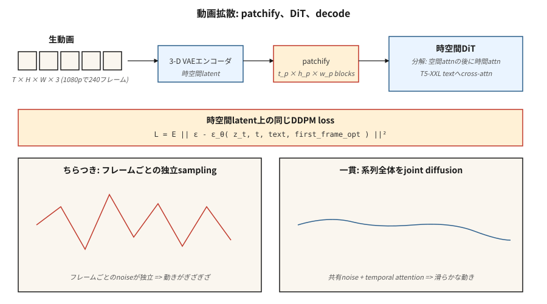

# Video Oluşturma

> Görüntü 2 boyutlu bir tensördür. Video 3 boyutlu bir videodur. Teori aynı; hesaplama 10-100 kat daha zordur. OpenAI'nin Sora'sı (Şubat 2024) bunun mümkün olduğunu kanıtladı. 2026'ya gelindiğinde Veo 2, Kling 1.5, Runway Gen-3, Pika 2.0 ve WAN 2.2, metinden 1080p'lik üretim videosu yayınlıyor - ve açık ağırlık yığını (CogVideoX, HunyuanVideo, Mochi-1, WAN 2.2) 12 ay geride.

**Tür:** Yapım
**Diller:** Python
**Önkoşullar:** Aşama 8 · 07 (Gizli Difüzyon), Aşama 7 · 09 (ViT), Aşama 8 · 06 (DDPM)
**Süre:** ~45 dakika

## Sorun

24 fps'de 10 saniyelik 1080p video, 1920×1080×3 piksellik 240 karedir. Bu, klip başına ~1,5 GB ham veri demektir. Piksel-uzay difüzyonu mümkün değildir. İhtiyacınız var:

1. **Uzaysal-zamansal sıkıştırma.** Kareleri değil videoları bir dizi uzamsal-zamansal yamalar halinde kodlayan bir VAE.
2. **Zamansal tutarlılık.** Çerçevelerin içeriği, aydınlatmayı ve nesne kimliğini saniyeler içinde paylaşması gerekir. Ağın hareketi modellemesi gerekir.
3. **Hesaplama bütçesi.** Video eğitimi, aynı model boyutu için görselden 10-100 kat daha pahalıdır.
4. **Koşullandırma.** Metin, resim (ilk kare), ses veya başka bir video. Çoğu üretim modeli dördünü de kabul eder.

Bunu çözen mimari, devasa (prompt, altyazı, video) dataset'ler üzerinde eğitilmiş, uzay-zamansal yamalara uygulanan **Diffusion Transformer (DiT)**'dir. Ders 06 ile aynı difüzyon kaybı.

## Konsept



### Patchleme

Videoyu 3D VAE (öğrenilmiş uzay-zaman sıkıştırması) ile kodlayın. Gizli şekil `[T_latent, H_latent, W_latent, C_latent]` şeklindedir. `[t_p, h_p, w_p]` boyutunda parçalara bölün. Sora tarzı modeller için, `t_p = 1` (kare başına yamalar) veya `t_p = 2` (her iki karede bir). 10 saniyelik bir 1080p video ~20.000-100.000 yamaya sıkıştırılır.

### Uzayzamansal DiT

Bir transformer, yamaların düz sırasını işler. Her yamanın 3 boyutlu bir konumsal embedding'si (zaman + y + x) vardır. Dikkat genellikle çarpanlara ayrılır:

- **Her karenin yamalarında **uzamsal dikkat**.
- Aynı mekansal konumdaki kareler arasında **zamansal attention**.
- **Tam 3D dikkat** 16-100 kat daha pahalıdır; yalnızca düşük çözünürlükte veya araştırmada kullanılır.

### Metin koşullandırma

Büyük bir metin kodlayıcıyla çapraz dikkat (Sora için T5-XXL, CogVideoX-5B, T5-XXL kullanır). Uzun promptönemlidir — Sora'nın eğitim seti, klip başına ortalama 200 token saniye süren, GPT tarafından oluşturulmuş yoğun yeniden altyazılara sahipti.

### Eğitim

Uzay-zamansal latentler üzerinde standart difüzyon kaybı (ε veya v tahmini). Veri: web videosu + ~100 milyon seçilmiş klip + sentetik metin altyazıları. Hesaplama: Küçük bir araştırma çalışması için bile 10.000'den fazla GPU saati; Sora ölçeği 100.000+'dir.

## 2026 üretim ortamı

| Model | Tarih | Maksimum süre | Maksimum çözünürlük | Ağırlıkları açmak mı? | Önemli |
|-------|------|--------------|---------|---------------|---------|
| Sora (OpenAI) | 2024-02 | 60'lar | 1080p | Hayır | Dünya simülatör özelliklerini geniş ölçekte gösteren ilk model |
| Sora Turbo | 2024-12 | 20'ler | 1080p | Hayır | Sora'nın üretimi 5 kat daha hızlı inference |
| Veo 2 (Google) | 2024-12 | 8'ler | 4K | Hayır | 2025'te en yüksek kalite + fizik |
| Veo 3 | 2025 3. Çeyrek | 15'ler | 4K | Hayır | Yerel ses ve daha güçlü kamera kontrolü |
| Kling 1.5 / 2.1 (Kuaishou) | 2024-2025 | 10'lar | 1080p | Hayır | 2025'in 1. çeyreğindeki en iyi insan hareketi |
| Pist Gen-3 Alfa | 2024-06 | 10'lar | 768p | Hayır | Profesyonel video araçları önde |
| Pika 2.0 | 2024-10 | 5'ler | 1080p | Hayır | En güçlü karakter tutarlılığı |
| CogVideoX (THUDM) | 2024 | 10'lar | 720p | Evet (2B, 5B) | İlk açık 5B ölçekli video |
| HunyuanVideo (Tencent) | 2024-12 | 5'ler | 720p | Evet (13B) | SOTA 2024 sonlarında açılıyor |
| Mochi-1 (Genmo) | 2024-10 | 5.4s | 480p | Evet (10B) | En hoşgörülü lisanslı |
| WAN 2.2 (Alibaba) | 2025-07 | 5'ler | 720p | Evet | 2025 ortasının en güçlü açık modeli |

Açık ağırlıklar, boşluğu görüntü alanına göre daha hızlı kapatıyor: HunyuanVideo + WAN 2.2 LoRA'lar, 2026 ortası itibarıyla çoğu açık kaynak iş akışına halihazırda güç sağlıyor.

## İnşa Et

`code/main.py`, temel uzay-zamansal DiT fikrini simüle eder: küçük bir sentetik videoyu yamalayın, yama başına bir konum embedding ekleyin ve yamalar üzerinde transformer tarzı bir dikkatle tüm sekansın gürültüsünü giderin. Uyuşukluk yok; saf Python. Bitişik çerçeveli yamalar bir gürültü gidericiyi ve embedding konumlarını paylaştığında, 1-B'de bile zamansal tutarlılığın ortaya çıktığını gösteriyoruz.

### 1. Adım: sentetik bir 1 boyutlu "videoya" yama uygulayın

```python
def make_video(T_frames=8, rng=None):
    # a "video" is a sequence of 1-D values following a smooth trajectory
    base = rng.gauss(0, 1)
    return [base + 0.3 * t + rng.gauss(0, 0.1) for t in range(T_frames)]
```

### Adım 2: kare başına embedding konumu

```python
def pos_embed(t, dim):
    return sinusoidal(t, dim)
```

### Adım 3: gürültü giderici tüm sıralamayı görür

Her karenin gürültüsünü bağımsız olarak gidermek yerine, küçük ağımız tüm kare değerlerini + bunların embedding konumlarını birleştirir ve tüm kareler için gürültüyü ortak olarak tahmin eder.

### Adım 4: zamansal tutarlılık testi

Eğitimden sonra bir video örneği alın. Çerçeveden çerçeveye deltayı ölçün. Model zamansal yapıyı öğrenmişse deltalar, her kareyi bağımsız olarak örneklemekten daha küçük kalır.

## Tuzaklar

- **Kare başına bağımsız örnekleme = titreme.** Görüntü dağıtımını her karede ayrı ayrı çalıştırırsanız, her karenin gürültüsü bağımsız olduğundan çıktı titrer. Video dağıtımı, çerçeveleri dikkat veya paylaşılan gürültü yoluyla birleştirerek bu sorunu giderir.
- **Saf 3D dikkat = OOM.** 10 saniyelik 1080p gizli bir ortamda tam 3D dikkat, yüz milyarlarca işlem anlamına gelir. Uzamsal + zamansal olarak çarpanlara ayırın.
- **Veri altyazıları boyuttan daha önemlidir.** Sora'nın önceki çalışmalarına göre yaptığı ana iyileştirme, yaklaşık 10 kat daha ayrıntılı altyazılar (GPT-4 yeniden etiketlenmiş klipler) üzerinde eğitim almasıydı. OpenAI'nin teknik raporu bu konuda açıktır.
- **İlk kare koşullandırma.** Çoğu üretim modeli aynı zamanda görüntüyü ilk kare olarak kabul eder. Bu "görüntüden videoya" modudur; eğitim bu varyantı içerir.
- **Fizik kayması.** Uzun klipler (>10 saniye) ince tutarsızlıklar biriktirir. Kayar pencere oluşturma + ana kare sabitleme yardımcı olur.

## Kullan onu

| Kullanım örneği | 2026 seçimi |
|----------|-----------|
| En yüksek kalitede metinden videoya, barındırılan | Veo 3 veya Sora |
| Kamera kontrollü sinematik | Hareket fırçaları ile Pist Gen-3 |
| Klipler arasında karakter tutarlılığı | Pika 2.0 veya Kling 2.1 |
| Ağırlıkları açın, hızlı ince ayar yapın | WAN 2.2 + LoRA |
| Resimden videoya | WAN 2.2-I2V, Kling 2.1 I2V veya Pist |
| Sesten videoya dudak senkronizasyonu | Veo 3 (yerel ses) veya özel bir dudak senkronizasyonu modeli |
| Video düzenleme | Runway Act-İki, Kling Hareket Fırçası, Flux-Kontext (hareketsiz çerçeve) |

Kaliteli videonun saniye başına maliyeti 2024 ile 2026 arasında 20 kat düştü.

## Gönderin

`outputs/skill-video-brief.md`'yi kaydet. Skill bir video özeti alır (süre, en boy oranı, stil, kamera planı, konu tutarlılığı, ses) ve çıktılar: model + barındırma, prompt yapı iskelesi (kamera dili, konu açıklaması, hareket tanımlayıcılar), tohum + tekrar üretilebilirlik protokolü ve çerçeve düzeyinde bir QA kontrol listesi.

## Egzersizler

1. **Kolay.** `code/main.py`'da, (a) bağımsız kare başına örnekleme, (b) ortak dizi örnekleme için kareden kareye deltayı karşılaştırın. Deltaların ortalamasını ve varyansını bildirin.
2. **Orta.** Bir ilk kare koşulu ekleyin: belirli bir değere çerçeve 0'ı sabitleyin ve geri kalanını örnekleyin. Sabitlenen değerin nasıl yayıldığını ölçün.
3. **Zor.** CogVideoX-2B'yi yerel bir GPU'da çalıştırmak için HuggingFace difüzörlerini kullanın. 6 saniyelik bir klip için 720p'de 20 inference adım süre. Darboğazı belirlemek için uzay-zamansal dikkatin profilini çıkarın.

## Anahtar Terimler

| Dönem | İnsanlar ne diyor | Aslında ne anlama geliyor |
|------|-----------------|-----------------------|
| Video VAE | "3 boyutlu VAE" | `(T, H, W, C)` → uzay-zamansal gizliyi sıkıştıran kodlayıcı. |
| Yamalar | "token'lar" | Gizli olanın sabit boyutlu 3 boyutlu blokları; DiT'ye giriş. |
| Faktörlere ayrılmış dikkat | "Uzaysal + zamansal" | Dikkatinizi önce uzaya, sonra zamana yönlendirin; 3 boyutlu dikkatin tamamını atlayın. |
| Görüntüden videoya (I2V) | "Bu fotoğrafı canlandırın" | Model bir resim + metin alır, ondan başlayan bir videonun çıktısını alır. |
| Ana kare koşullandırma | "Ankraj çerçeveleri" | Videonun yayını kontrol etmek için belirli kareleri sabitleyin. |
| Hareket fırçası | "Yön ipucu" | Kullanıcının görüntüye hareket vektörlerini boyadığı kullanıcı arayüzü girişi. |
| Yeniden altyazı | "Yoğun altyazılar" | Eğitim kliplerini ayrıntılı prompt'larla yeniden etiketlemek için Yüksek Lisans kullanma. |
| Titreme | "Geçici artifact" | Kareden kareye tutarsızlık; birleşik gürültü giderme ile sabitlenmiştir. |

## Üretim notu: video latentleri bir bellek bant genişliği sorunudur

24 fps'de 10 saniyelik 1080p klip, 240 kare × 1920 × 1080 × 3 ≈ 1,5 GB ham pikseldir. 4× video VAE sıkıştırmasından (`2 × spatial × 2 × temporal`) sonra latent istek başına ~100 MB'dir. Bunu 1. partide 30 adım boyunca uzay-zamansal DiT üzerinden çalıştırın ve HBM üzerinden ~3 GB/adım hareket ediyorsunuz - darboğaz FLOP'lar değil, bellek bant genişliğidir.

Üç prodüksiyon düğmesi, hepsi doğrudan prodüksiyon-inference literatür inference bölümünden:

- **DiT genelinde TP.** Metinden videoya modeller rutin olarak ≥10B parametrelerdir. 4 H100'de TP=4 standarttır; 405B sınıfı modeller için PP=2 × TP=2. Adım başına gecikme, TP ile tamamen azaltma duvarına kadar kabaca doğrusal olarak düşer.
- **Çerçeve toplu işlemi = sürekli toplu iş.** Oluşturma zamanında video, kavramsal olarak dikkatle birbirine bağlanan bir kareler grubudur. Sürekli toplu işlem (hareket içi planlama) geçerlidir: model mimarisi kayan pencere oluşturmaya izin veriyorsa, `t-1` çerçevesi döndürülürken `t+1` çerçevesini oluşturmaya başlayın.
- **Klip düzeyinde önceden doldurma önbelleği.** Görüntüden videoya için, ilk kare koşullandırma, LLM'nin prompt ön doldurmasına benzer: bunu bir kez hesaplayın, zamansal kod çözücü geçişleri boyunca yeniden kullanın. Bu etkili bir şekilde video için bir KV önbelleğidir.

## Daha Fazla Okuma

- [Brooks ve ark. (2024). Dünya simülatörleri olarak video oluşturma modelleri](https://openai.com/index/video-generation-models-as-world-simulators/) — Sora teknik raporu.
- [Yang ve ark. (2024). CogVideoX: Bir Uzmanla Metinden Videoya Yayılma Modelleri Transformer](https://arxiv.org/abs/2408.06072) — CogVideoX.
- [Kong ve diğerleri. (2024). HunyuanVideo: Büyük Video Oluşturma Modelleri için Sistematik Bir Framework](https://arxiv.org/abs/2412.03603) — HunyuanVideo.
- [Genmo (2024). Mochi-1 Teknik Raporu](https://www.genmo.ai/blog/mochi) — Mochi-1.
- [Alibaba (2025). WAN 2.2](https://wanvideo.io/) — SOTA'yı 2025'in ortalarında açın.
- [Ho, Salimans, Gritsenko ve diğerleri. (2022). Video Yayılım Modelleri](https://arxiv.org/abs/2204.03458) — ufuk açıcı video yayılım makalesi.
- [Blattmann ve ark. (2023). Gizli Öğelerinizi Hizalayın (Video LDM)](https://arxiv.org/abs/2304.08818) — Kararlı Video Difüzyonunun atası.
