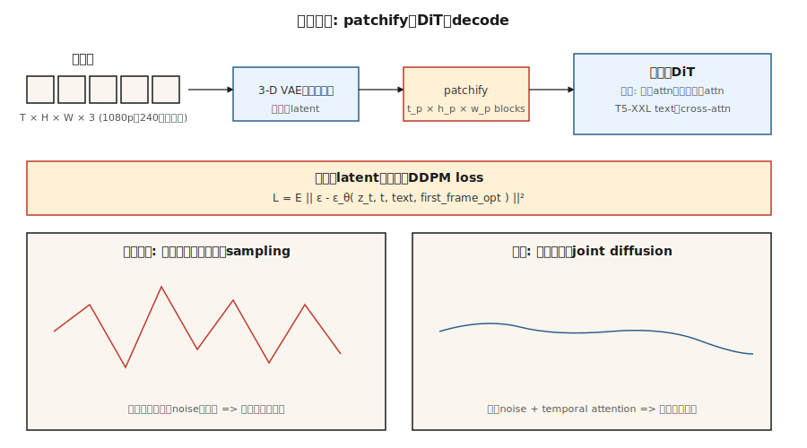

# Video Generation

> 图像是一个2-D张量。视频是3D视频。理论是一样的;计算难度为10- 100倍。OpenAI的Sora（2024年2月）证明了这是可能的。到2026年，Veo 2、Kling 1.5、Runway Gen-3、Pika 2.0和WA 2.2将以1080 p的速度推出文本制作视频，而开重量堆栈（CogVideoX、Hunyuan Video、Mochi-1、WA 2.2）落后12个月。

** 类型：** 构建
** 语言：** Python
** 先决条件：** 8 · 07期（潜伏扩散）、7 · 09期（ViT）、8 · 06期（DDPM）
** 时间：** ~45分钟

## The Problem

24帧/秒的10秒1080 p视频为240帧，像素为1920 x 1080 x 3。每个剪辑约有1.5 GB原始数据。像素空间扩散是不可行的。您需要：

1. ** 时空压缩。**一种VAE，将视频（而不是帧）编码为时空补丁序列。
2. ** 时间一致性。**框架需要在几秒钟内共享内容、灯光和对象身份。网络必须对运动进行建模。
3. ** 计算预算。**对于相同的型号尺寸，视频训练比图像昂贵10- 100倍。
4. ** 调节。**文本、图像（第一帧）、音频或其他视频。大多数生产型号都接受这四种。

解决这个问题的架构是应用于时空补丁的 ** 扩散Transformer（DiT）**，在巨大（提示、标题、视频）数据集上训练。扩散损失与06课相同。

## The Concept



### Patchify

使用3D VAE（学习时空压缩）对视频进行编码。潜势的形状为“[T_潜势，H_潜势，W_潜势，C_潜势]”。分裂为大小为“[t_p，h_p，w_p]'的补丁。对于Sora风格的模型，' t_p = 1 '（每帧补丁）或' t_p = 2 '（每两帧）。10秒的1080 p视频压缩为约20，000 - 100，000个补丁。

### Spatiotemporal DiT

一个Transformer处理补丁的平坦序列。每个补丁都有一个3D位置嵌入（时间+ y + x）。注意力通常被分解：

- ** 空间注意力 ** 在每个帧的补丁。
- ** 同一空间位置的帧间的时间注意力 **。
- ** 全3D注意力 ** 是16- 100倍昂贵;仅用于低分辨率或研究。

### Text conditioning

使用大型文本编码器进行交叉注意（Sora的T5-XXL，CogVideoX-5 B使用T5-XXL）。长提示很重要- Sora的训练集具有GPT生成的密集重新字幕，平均每个剪辑有200个代币。

### Training

时空潜伏的标准扩散损失（δ或v预测）。数据：网络视频+ ~ 1亿个精心策划的剪辑+合成文本字幕。计算：即使是小型研究运行，也需要10，000以上的图形处理时间;索拉规模为100，000以上。

## The 2026 production landscape

| 模型 | 日期 | 最大持续时间 | 马克斯雷斯 | 开放重量？ | 显著 |
|-------|------|--------------|---------|---------------|---------|
| Sora（OpenAI） | 2024-02 | 60年代 | 1080p | 没有 | 第一个大规模展示世界模拟器属性的模型 |
| 索拉·涡轮 | 2024-12 | 20s | 1080p | 没有 | Production Sora推理速度加快5倍 |
| Veo 2（谷歌） | 2024-12 | 8s | 4K | 没有 | 2025年最高质量+物理 |
| Veo 3 | 2025年第三季度 | 15s | 4K | 没有 | 原生音频和更强的相机控制 |
| 克林1.5 / 2.1（快收） | 2024-2025 | 10s | 1080p | 没有 | 2025年第一季度最佳人体动作 |
| Runway Gen-3 Alpha | 2024-06 | 10s | 768p | No | Professional video tools on top |
| Pika 2.0 | 2024-10 | 5s | 1080p | No | Strongest character consistency |
| CogVideoX (THUDM) | 2024 | 10s | 720p | Yes (2B, 5B) | First open 5B-scale video |
| HunyuanVideo (Tencent) | 2024-12 | 5s | 720p | Yes (13B) | Open SOTA late 2024 |
| Mochi-1 (Genmo) | 2024-10 | 5.4s | 480p | Yes (10B) | Most permissively licensed |
| WAN 2.2 (Alibaba) | 2025-07 | 5s | 720p | Yes | Strongest open model mid-2025 |

Open weights are closing the gap faster than in the image space: HunyuanVideo + WAN 2.2 LoRAs already power most open-source workflows by mid-2026.

## Build It

`code/main.py` simulates the core spatiotemporal DiT idea: patchify a small synthetic video, add a per-patch position embedding, and denoise the whole sequence with a transformer-style attention over patches. No numpy; pure Python. We show that temporal coherence emerges even in 1-D when adjacent-frame patches share a denoiser and position embeddings.

### Step 1: patchify a synthetic 1-D "video"

```python
def make_video(T_frames=8, rng=None):
    # a "video" is a sequence of 1-D values following a smooth trajectory
    base = rng.gauss(0, 1)
    return [base + 0.3 * t + rng.gauss(0, 0.1) for t in range(T_frames)]
```

### Step 2: position embedding per frame

```python
def pos_embed(t, dim):
    return sinusoidal(t, dim)
```

### Step 3: denoiser sees the whole sequence

Instead of denoising each frame independently, our tiny net concatenates all frame values + their position embeddings and predicts the noise for all frames jointly.

### Step 4: temporal coherence test

After training, sample a video. Measure the frame-to-frame delta. If the model has learned temporal structure, the deltas stay smaller than sampling each frame independently.

## Pitfalls

- **Independent per-frame sampling = flicker.** If you run image diffusion on each frame separately, the output flickers because each frame's noise is independent. Video diffusion fixes this by coupling the frames through attention or shared noise.
- **Naive 3D attention = OOM.** Full 3D attention on a 10-second 1080p latent is hundreds of billions of operations. Factorize into spatial + temporal.
- **Data captioning matters more than size.** Sora's main upgrade over prior work was training on ~10x more detailed captions (GPT-4 re-labelled clips). OpenAI's technical report is explicit on this.
- **First-frame conditioning.** Most production models also accept an image as the first frame. This is "image-to-video" mode; training includes this variant.
- **Physics drift.** Long clips (>10s) accumulate subtle inconsistencies. Sliding-window generation + keyframe anchoring helps.

## Use It

| Use case | 2026 pick |
|----------|-----------|
| Highest-quality text-to-video, hosted | Veo 3 or Sora |
| Camera-controlled cinematic | Runway Gen-3 with motion brushes |
| Character consistency across clips | Pika 2.0 or Kling 2.1 |
| Open weights, fast fine-tune | WAN 2.2 + LoRA |
| Image-to-video | WAN 2.2-I2V, Kling 2.1 I2V, or Runway |
| Audio-to-video lip sync | Veo 3 (native audio) or a dedicated lip-sync model |
| Video editing | Runway Act-Two, Kling Motion Brush, Flux-Kontext (still-frame) |

Cost per second of video at quality parity has dropped 20x between 2024 and 2026.

## Ship It

Save `outputs/skill-video-brief.md`. Skill takes a video brief (duration, aspect ratio, style, camera plan, subject consistency, audio) and outputs: model + hosting, prompt scaffolding (camera language, subject description, motion descriptors), seed + reproducibility protocol, and a frame-level QA checklist.

## Exercises

1. **Easy.** In `code/main.py`, compare frame-to-frame delta for (a) independent per-frame sampling, (b) joint sequence sampling. Report the mean and variance of the deltas.
2. **Medium.** Add a first-frame condition: pin frame 0 to a given value and sample the rest. Measure how the pinned value propagates.
3. **Hard.** Use HuggingFace diffusers to run CogVideoX-2B on a local GPU. Time 20 inference steps at 720p for a 6-second clip. Profile the spatiotemporal attention to identify the bottleneck.

## Key Terms

| Term | What people say | What it actually means |
|------|-----------------|-----------------------|
| Video VAE | "3-D VAE" | Encoder that compresses `(T, H, W, C)` → spatiotemporal latent. |
| Patches | "The tokens" | Fixed-size 3-D blocks of the latent; input to the DiT. |
| Factorized attention | "Spatial + temporal" | Run attention over space, then over time; skip full 3-D attention. |
| Image-to-video (I2V) | "Animate this photo" | Model takes an image + text, outputs a video that starts from it. |
| Keyframe conditioning | "Anchor frames" | Pin specific frames to control the video's arc. |
| Motion brush | "Directional hint" | UI input where the user paints motion vectors onto the image. |
| Re-captioning | "Dense captions" | Using an LLM to re-label training clips with detailed prompts. |
| Flicker | "Temporal artifact" | Frame-to-frame inconsistency; fixed with coupled denoising. |

## Production note: video latents are a memory-bandwidth problem

A 10-second 1080p clip at 24 fps is 240 frames × 1920 × 1080 × 3 ≈ 1.5 GB of raw pixels. After a 4× video VAE compression (`2 × spatial × 2 × temporal`) the latent is ~100 MB per request. Run this through a spatiotemporal DiT for 30 steps at batch 1 and you are moving ~3 GB/step through HBM — memory bandwidth, not FLOPs, is the bottleneck.

Three production knobs, all straight from production-inference literature inference chapter:

- **TP across the DiT.** Text-to-video models are routinely ≥10B params. TP=4 across 4 H100s is standard; PP=2 × TP=2 for 405B-class models. Latency per step drops roughly linearly with TP up to the all-reduce wall.
- **Frame batching = continuous batching.** At generation time, video is conceptually a batch of frames linked by attention. Continuous batching (in-flight scheduling) applies: start rendering frame `t+1` while frame `t-1` is being returned, if the model architecture allows sliding-window generation.
- **Clip-level prefill cache.** For image-to-video, the first-frame conditioning is analogous to an LLM's prompt prefill: compute it once, reuse across the temporal decoder passes. This is effectively a KV-cache for video.

## Further Reading

- [Brooks et al. (2024). Video generation models as world simulators](https://openai.com/index/video-generation-models-as-world-simulators/) — Sora technical report.
- [Yang et al. (2024). CogVideoX: Text-to-Video Diffusion Models with An Expert Transformer](https://arxiv.org/abs/2408.06072) — CogVideoX.
- [Kong et al. (2024). HunyuanVideo: A Systematic Framework for Large Video Generative Models](https://arxiv.org/abs/2412.03603) — HunyuanVideo.
- [Genmo (2024). Mochi-1 Technical Report](https://www.genmo.ai/blog/mochi) — Mochi-1.
- [Alibaba (2025). WAN 2.2](https://wanvideo.io/) — open SOTA mid-2025.
- [Ho, Salimans, Gritsenko et al. (2022). Video Diffusion Models](https://arxiv.org/abs/2204.03458) — the seminal video diffusion paper.
- [Blattmann et al. (2023). Align your Latents (Video LDM)](https://arxiv.org/abs/2304.08818) — Stable Video Diffusion's ancestor.
