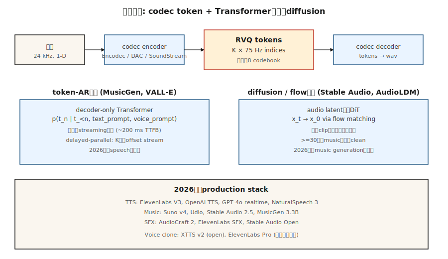

# Audio Generation

> Audio is a 1-D signal at 16-48 kHz. A five-second clip is 80-240k samples. No transformer attends to that sequence directly. The solution for every production audio model in 2026 is the same: a neural codec (Encodec, SoundStream, DAC) compresses audio to discrete tokens at 50-75 Hz, and a transformer or diffusion model generates tokens.

**Type:** Build
**Languages:** Python
**Prerequisites:** Phase 6 · 02 (Audio Features), Phase 6 · 04 (ASR), Phase 8 · 06 (DDPM)
**Time:** ~45 minutes

## The Problem

Three audio generation tasks:

1. **Text-to-speech.** Given text, produce speech. Clean speech is narrow-band and has strong phonetic structure — solved well by transformer-over-tokens. VALL-E (Microsoft), NaturalSpeech 3, ElevenLabs, OpenAI TTS.
2. **Music generation.** Given a prompt (text, melody, chord progression, genre), produce music. Much broader distribution. MusicGen (Meta), Stable Audio 2.5, Suno v4, Udio, Riffusion.
3. **Audio effects / sound design.** Given a prompt, produce ambient sound or Foley. AudioGen, AudioLDM 2, Stable Audio Open.

All three run on the same substrate: neural audio codec + token-AR or diffusion generator.

## The Concept



### Neural audio codecs

Encodec (Meta, 2022), SoundStream (Google, 2021), Descript Audio Codec (DAC, 2023). A convolutional encoder compresses waveform to a per-timestep vector; residual vector quantization (RVQ) converts each vector to a cascade of K codebook indices. Decoder reverses it. 24 kHz audio at 2 kbps using 8 RVQ codebooks at 75 Hz = 600 tokens/sec.

```
waveform (16000 samples/sec)
    └─ encoder conv ─┐
                     ├─ RVQ layer 1 → indices at 75 Hz
                     ├─ RVQ layer 2 → indices at 75 Hz
                     ├─ ...
                     └─ RVQ layer 8
```

### Two generative paradigms on top

**Token-autoregressive.** Flatten RVQ tokens into a sequence, run a decoder-only transformer. MusicGen uses "delayed parallel" to emit K codebook streams in parallel with per-stream offsets. VALL-E generates speech tokens from a text prompt + 3-second voice sample.

**Latent diffusion.** Pack codec tokens as continuous latents or model them with categorical diffusion. Stable Audio 2.5 uses flow matching on continuous audio latents. AudioLDM 2 uses text-to-mel-to-audio diffusion.

The 2024-2026 trend: flow matching is winning for music (faster inference, cleaner samples) while token-AR still dominates speech because it is naturally causal and streams well.

## Production landscape

| System | Task | Backbone | Latency |
|--------|------|----------|---------|
| ElevenLabs V3 | TTS | Token-AR + neural vocoder | ~300ms first token |
| OpenAI GPT-4o audio | Full-duplex speech | End-to-end multimodal AR | ~200ms |
| NaturalSpeech 3 | TTS | Latent flow matching | Non-streaming |
| Stable Audio 2.5 | Music / SFX | DiT + flow matching on audio latents | ~10s for 1-minute clip |
| Suno v4 | Full songs | Undisclosed; token-AR suspected | ~30s per song |
| Udio v1.5 | Full songs | Undisclosed | ~30s per song |
| MusicGen 3.3B | Music | Token-AR on Encodec 32kHz | Real-time |
| AudioCraft 2 | Music + SFX | Flow matching | ~5s for 5s clip |
| Riffusion v2 | Music | Spectrogram diffusion | ~10s |

## Build It

`code/main.py` simulates the core idea: train a tiny next-token transformer on synthetic "audio token" sequences generated from two distinct "styles" (alternating low and high tokens for style A, monotonic ramp for style B). Condition on style and sample.

### Step 1: synthetic audio tokens

```python
def make_tokens(style, length, vocab_size, rng):
    if style == 0:  # "speech-like": alternating
        return [i % vocab_size for i in range(length)]
    # "music-like": ramp
    return [(i * 3) % vocab_size for i in range(length)]
```

### Step 2: train a tiny token predictor

A bigram-style predictor conditioned on style. The point is the pattern: codec tokens → cross-entropy training → autoregressive sampling.

### Step 3: sample conditionally

Given the style token and a starting token, sample the next token from the predicted distribution. Continue for 20-40 tokens.

## Pitfalls

- **Codec quality caps output quality.** If the codec can't represent a sound faithfully, no amount of generator quality helps. DAC is the current open best.
- **RVQ error accumulation.** Each RVQ layer models the residual of the previous. Errors on layer 1 propagate. Sampling with temperature 0 on higher layers helps.
- **Musical structure.** 30 seconds of tokens is 20k+ tokens at 75 Hz. Hard for transformers. MusicGen uses sliding window + prompt continuation; Stable Audio uses shorter clips + crossfading.
- **Artifacts at boundaries.** Crossfading between generated clips needs careful overlap-add.
- **Clean-data appetite.** Music generators need tens of thousands of hours of licensed music. The Suno / Udio RIAA lawsuit (2024) brought this to the surface.
- **Voice cloning ethics.** A 3-second sample plus a text prompt is enough for VALL-E / XTTS / ElevenLabs to clone a voice. Every production model needs abuse detection + opt-out lists.

## Use It

| Task | 2026 stack |
|------|------------|
| Commercial TTS | ElevenLabs, OpenAI TTS, or Azure Neural |
| Voice cloning (consent-verified) | XTTS v2 (open) or ElevenLabs Pro |
| Background music, fast | Stable Audio 2.5 API, Suno, or Udio |
| Music with lyrics | Suno v4 or Udio v1.5 |
| Sound effects / Foley | AudioCraft 2, ElevenLabs SFX, or Stable Audio Open |
| Real-time voice agent | GPT-4o realtime or Gemini Live |
| Open-weights music research | MusicGen 3.3B, Stable Audio Open 1.0, AudioLDM 2 |
| Dubbing / translation | HeyGen, ElevenLabs Dubbing |

## Ship It

Save `outputs/skill-audio-brief.md`. Skill takes an audio brief (task, duration, style, voice, license) and outputs: model + hosting, prompt format (genre tags, style descriptors, structural markers), codec + generator + vocoder chain, seed protocol, and eval plan (MOS / CLAP score / CER for TTS / user A/B).

## Exercises

1. **Easy.** Run `code/main.py` and set style explicitly. Verify the generated sequences match the style's pattern.
2. **Medium.** Add delayed parallel decoding: simulate 2 streams of tokens that must stay offset by 1 step. Train a joint predictor.
3. **Hard.** Use HuggingFace transformers to run MusicGen-small locally. Generate a 10-second clip with three different prompts; A/B for style adherence.

## Key Terms

| Term | What people say | What it actually means |
|------|-----------------|-----------------------|
| Codec | "Neural compression" | Encoder / decoder for audio; typical output is 50-75 Hz tokens. |
| RVQ | "Residual VQ" | Cascade of K quantizers; each models the residual of the previous. |
| Token | "One codec symbol" | Discrete index into a codebook; 1024 or 2048 typical. |
| Delayed parallel | "Offset codebooks" | Emit K token streams with staggered offsets to reduce sequence length. |
| Flow matching | "The 2024 win for audio" | Straighter-path alternative to diffusion; faster sampling. |
| Voice prompt | "3-second sample" | Speaker embedding or token prefix that steers the cloned voice. |
| Mel spectrogram | "The visual" | Log-magnitude perceptual spectrogram; used by many TTS systems. |
| Vocoder | "Mel to wave" | Neural component that converts mel spectrograms back to audio. |

## Further Reading

- [Défossez et al. (2022). Encodec: High Fidelity Neural Audio Compression](https://arxiv.org/abs/2210.13438) — the codec standard.
- [Zeghidour et al. (2021). SoundStream](https://arxiv.org/abs/2107.03312) — the first widely used neural audio codec.
- [Kumar et al. (2023). High-Fidelity Audio Compression with Improved RVQGAN (DAC)](https://arxiv.org/abs/2306.06546) — DAC.
- [Wang et al. (2023). Neural Codec Language Models are Zero-Shot Text to Speech Synthesizers (VALL-E)](https://arxiv.org/abs/2301.02111) — VALL-E.
- [Copet et al. (2023). Simple and Controllable Music Generation (MusicGen)](https://arxiv.org/abs/2306.05284) — MusicGen.
- [Liu et al. (2023). AudioLDM 2: Learning Holistic Audio Generation with Self-supervised Pretraining](https://arxiv.org/abs/2308.05734) — AudioLDM 2.
- [Stability AI (2024). Stable Audio 2.5](https://stability.ai/news/introducing-stable-audio-2-5) — 2025 text-to-music with flow matching.
