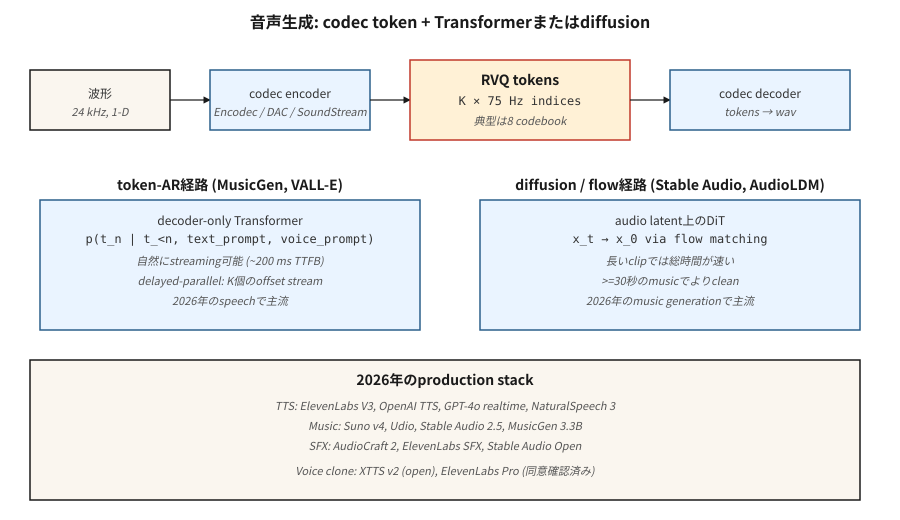

# Ses Üretimi

> Ses, 16-48 kHz'de 1 boyutlu bir sinyaldir. Beş saniyelik bir klip 80-240 bin örnektir. Hiçbir transformer bu diziye doğrudan katılmaz. 2026'da her prodüksiyon ses modeli için çözüm aynıdır: bir sinir codec'i (Encodec, SoundStream, DAC), sesi 50-75 Hz'de ayrık token'lere sıkıştırır ve bir transformer veya difüzyon modeli, token'leri üretir.

**Tür:** Yapım
**Diller:** Python
**Önkoşullar:** Aşama 6 · 02 (Ses Özellikleri), Aşama 6 · 04 (ASR), Aşama 8 · 06 (DDPM)
**Süre:** ~45 dakika

## Sorun

Üç ses oluşturma görevi:

1. **Metinden konuşmaya.** Verilen metin, konuşmayı üretir. Temiz konuşma dar bantlıdır ve güçlü bir fonetik yapıya sahiptir — transformer-over-tokens ile iyi bir şekilde çözümlenir. VALL-E (Microsoft), NaturalSpeech 3, ElevenLabs, OpenAI TTS.
2. **Müzik üretimi.** Bir prompt (metin, melodi, akor ilerlemesi, tür) verildiğinde, müzik üretin. Çok daha geniş dağıtım. MusicGen (Meta), Stabil Ses 2.5, Suno v4, Udio, Riffusion.
3. **Ses efektleri / ses tasarımı.** Bir prompt verildiğinde, ortam sesi veya Foley üretin. AudioGen, AudioLDM 2, Stable Audio Açık.

Üçü de aynı alt tabaka üzerinde çalışır: sinirsel ses codec'i + token-AR veya yayılma üreteci.

## Konsept



### Sinirsel ses codec bileşenleri

Encodec (Meta, 2022), SoundStream (Google, 2021), Descript Audio Codec (DAC, 2023). Evrişimli bir kodlayıcı, dalga biçimini zaman adımı başına bir vektöre sıkıştırır; artık vektör kuantizasyonu (RVQ), her vektörü K kod kitabı endekslerinin bir kademesine dönüştürür. Kod çözücü bunu tersine çevirir. 75 Hz'de 8 RVQ kod kitabı kullanılarak 2 kbps'de 24 kHz ses = 600 tokens/sn.

```
waveform (16000 samples/sec)
    └─ encoder conv ─┐
                     ├─ RVQ layer 1 → indices at 75 Hz
                     ├─ RVQ layer 2 → indices at 75 Hz
                     ├─ ...
                     └─ RVQ layer 8
```

### İki üretken paradigma zirvede

**Token-otoregresif.** RVQ token'leri bir sıraya düzleştirin, yalnızca kod çözücüyü transformer çalıştırın. MusicGen, K kod kitabı akışlarını akış başına ofsetlerle paralel olarak yaymak için "gecikmeli paralel"i kullanır. VALL-E, bir metinden prompt + 3 saniyelik ses örneğinden konuşma token'lar üretir.

**Gizli yayılma.** Codec token'leri sürekli gizli olarak paketleyin veya bunları kategorik yayılma ile modelleyin. Stable Audio 2.5, sürekli ses latentlerinde akış eşleştirmeyi kullanır. AudioLDM 2, metinden erimeye ses yayılımını kullanır.

2024-2026 trendi: akış eşleştirme müzikte kazanıyor (daha hızlı inference, daha temiz örnekler) ve token-AR, doğal olarak nedensel olduğundan ve iyi bir şekilde aktarıldığından hâlâ konuşmaya hakim durumda.

## Üretim ortamı

| Sistem | Görev | Omurga | Gecikme |
|--------|------|----------|---------|
| ElevenLab'lar V3 | TTS | Token-AR + sinirsel ses kodlayıcı | ~300ms ilk token |
| OpenAI GPT-4o ses | Tam çift yönlü konuşma | Uçtan uca çok modlu AR | ~200ms |
| Doğal Konuşma 3 | TTS | Gizli akış eşleştirme | Akış dışı |
| Stable Audio 2.5 | Müzik / SFX | Gizli seslerde DiT + akış eşleştirmesi | ~1 dakikalık klip için 10s |
| Suno v4 | Tüm şarkılar | Açıklanmadı; token-AR'den şüpheleniliyor | ~şarkı başına 30sn |
| Ses v1.5 | Tüm şarkılar | Açıklanmadı | ~şarkı başına 30sn |
| MüzikGen 3.3B | Müzik | Encodec 32kHz'de Token-AR | Gerçek zamanlı |
| AudioCraft 2 | Müzik + SFX | Akış eşleştirme | ~5s için 5s klip |
| Rifüzyon v2 | Müzik | Spektrogram difüzyonu | ~10s |

## İnşa Et

`code/main.py` temel fikri simüle eder: iki farklı "tarzdan" (tarz A için alternatif düşük ve yüksek token'ler, tarz B için monoton rampa) oluşturulan sentetik "ses token" dizileri üzerinde küçük bir sonraki-token transformer eğitin. Stil ve örnek durumu.

### Adım 1: sentetik ses token'ler

```python
def make_tokens(style, length, vocab_size, rng):
    if style == 0:  # "speech-like": alternating
        return [i % vocab_size for i in range(length)]
    # "music-like": ramp
    return [(i * 3) % vocab_size for i in range(length)]
```

### Adım 2: küçük bir token tahminciyi eğitin

Stile bağlı bir bigram tarzı tahminci. Önemli olan kalıptır: codec tokens → çapraz entropi eğitimi → otoregresif örnekleme.

### Adım 3: koşullu olarak örnekleyin

token stili ve token başlangıcı verildiğinde, tahmin edilen dağılımdan sonraki token'yi örnekleyin. 20-40 tokensn kadar devam edin.

## Tuzaklar

- **Codec kalitesi çıktı kalitesini sınırlar.** Codec bir sesi aslına sadık bir şekilde temsil edemiyorsa, generator kalitesinin hiçbir faydası olmaz. DAC şu anki açık en iyisidir.
- **RVQ hata birikimi.** Her RVQ katmanı bir öncekinin kalıntısını modeller. Katman 1'deki hatalar yayılır. Daha yüksek katmanlarda sıcaklık 0 ile numune alınması yardımcı olur.
- **Müzik yapısı.** 30 saniyelik tokens, 75 Hz'de 20k+ tokens'dir. transformersn için zor. MusicGen kayan pencere + prompt devamını kullanır; Stabil Ses, daha kısa klipler + çapraz geçiş kullanır.
- **Artifactsınırlardadır.** Oluşturulan klipler arasındaki çapraz soldurma dikkatli bir şekilde üst üste bindirme eklemeyi gerektirir.
- **Temiz veri iştahı.** Müzik oluşturucuların on binlerce saatlik lisanslı müziğe ihtiyacı vardır. Suno / Udio RIAA davası (2024) bunu yüzeye çıkardı.
- **Ses klonlama etiği.** VALL-E / XTTS / ElevenLabs'ın bir sesi klonlaması için 3 saniyelik bir örnek artı bir prompt metni yeterlidir. Her üretim modelinin kötüye kullanım tespiti + devre dışı bırakma listelerine ihtiyacı vardır.

## Kullan onu

| Görev | 2026 yığını |
|------|------------|
| Ticari TTS | ElevenLabs, OpenAI TTS veya Azure Neural |
| Ses klonlama (izin doğrulandı) | XTTS v2 (açık) veya ElevenLabs Pro |
| Fon müziği, hızlı | Stabil Ses 2.5 API, Suno veya Udio |
| Sözlü müzik | Suno v4 veya Udio v1.5 |
| Ses efektleri / Foley | AudioCraft 2, ElevenLabs SFX veya Stabil Ses Açık |
| Gerçek zamanlı ses agent | GPT-4o gerçek zamanlı veya Gemini Live |
| Açık ağırlıklı müzik araştırması | MusicGen 3.3B, Stable Audio Açık 1.0, AudioLDM 2 |
| Dublaj / çeviri | HeyGen, ElevenLabs Dublaj |

## Gönderin

`outputs/skill-audio-brief.md`'yi kaydet. Beceri bir sesli özet alır (görev, süre, stil, ses, lisans) ve çıktılar: model + barındırma, prompt biçimi (tür etiketleri, stil tanımlayıcıları, yapısal işaretleyiciler), codec + oluşturucu + ses kodlayıcı zinciri, tohum protokolü ve değerlendirme planı (MOS / CLAP puanı / TTS için CER / kullanıcı A/B).

## Egzersizler

1. **Kolay.** `code/main.py` komutunu çalıştırın ve stili açıkça ayarlayın. Oluşturulan dizilerin stilin deseniyle eşleştiğini doğrulayın.
2. **Orta.** Gecikmeli paralel kod çözme ekleyin: 1 adım ötede kalması gereken 2 token akışını simüle edin. Ortak bir tahminciyi eğitin.
3. **Zor.** MusicGen-small'ı yerel olarak çalıştırmak için HuggingFace transformers'yi kullanın. Üç farklı prompt ile 10 saniyelik bir klip oluşturun; Stil uyumu için A/B.

## Anahtar Terimler

| Dönem | İnsanlar ne diyor | Aslında ne anlama geliyor |
|------|-----------------|-----------------------|
| Kodlayıcı | "Sinir sıkışması" | Ses için kodlayıcı / kod çözücü; tipik çıkış 50-75 Hz tokens'dir. |
| RVQ | "Artık VQ" | K niceleyicilerin kademesi; her biri bir öncekinin kalıntısını modeller. |
| Token | "Bir kodek sembolü" | Bir kod kitabına ayrık indeks; 1024 veya 2048 tipik. |
| Gecikmeli paralel | "Ofset kod kitapları" | Dizi uzunluğunu azaltmak için kademeli ofsetlerle K token akışı yayınlayın. |
| Akış eşleştirme | "Ses alanında 2024'ün zaferi" | Difüzyona daha düz yol alternatifi; Daha hızlı örnekleme. |
| Ses prompt | "3 saniyelik örnek" | Klonlanan sesi yönlendiren hoparlör embedding veya token öneki. |
| Mel spektrogramı | "Görsel" | Log-büyüklükte algısal spektrogram; birçok TTS sistemi tarafından kullanılır. |
| Ses Kodlayıcı | "El sallamak için Mel" | Mel spektrogramlarını tekrar sese dönüştüren sinir bileşeni. |

## Prodüksiyon notu: ses bir akış sorunudur

Ses, kullanıcıların bir anda değil, *oluşturuldukça* ulaşmayı beklediği tek çıktı yöntemidir. Üretim açısından bu, TPOT'un önemli olduğu anlamına gelir (Çıktı Başına Zaman Token), çünkü kullanıcının okuma hızı değil, hedef aktarım hızı dinleme hızıdır. ~75 tokens/saniye (Kodlama) hızında dönüştürülen 16kHz tokenses için, oynatmanın sorunsuz devam etmesi için sunucunun kullanıcı başına ≥75 tokens/sn üretmesi gerekir.

İki mimari sonuç:

- **Akış uyumlu ses modelleri önemsiz bir şekilde yayınlanamaz.** Stable Audio 2.5 ve AudioCraft 2, tek geçişte sabit bir klip uzunluğu oluşturur. Akış yapmak için klibi parçalara ayırırsınız ve sınırları üst üste bindirirsiniz (kayan pencere dağıtımını düşünün), codec AR modeline kıyasla 100-300 ms gecikme ek yükü eklersiniz.

Ürün "canlı sesli sohbet" veya "gerçek zamanlı müzik devamı" ise codec AR yolunu seçin. "Gönderim sırasında 30 saniyelik bir klip oluştur" ise akış eşleştirme, kalite ve toplam gecikme açısından kazanır.

## Daha Fazla Okuma

- [Défossez ve ark. (2022). Kodlayıcı: Yüksek Hassasiyette Sinirsel Ses Sıkıştırma](https://arxiv.org/abs/2210.13438) — codec standardı.
- [Zeghidour ve ark. (2021). SoundStream](https://arxiv.org/abs/2107.03312) — yaygın olarak kullanılan ilk sinirsel ses codec bileşeni.
- [Kumar ve ark. (2023). Geliştirilmiş RVQGAN (DAC)](https://arxiv.org/abs/2306.06546) — DAC ile Yüksek Kaliteli Ses Sıkıştırma.
- [Wang ve ark. (2023). Nöral Codec Dil Modelleri, Sıfır Atışlı Metinden Konuşmaya Sentezleyicilerdir (VALL-E)](https://arxiv.org/abs/2301.02111) — VALL-E.
- [Copet ve ark. (2023). Basit ve Kontrol Edilebilir Müzik Üretimi (MusicGen)](https://arxiv.org/abs/2306.05284) — MusicGen.
- [Liu ve ark. (2023). AudioLDM 2: Kendi Kendini Denetleyen Ön Eğitim ile Bütünsel Ses Üretimini Öğrenme](https://arxiv.org/abs/2308.05734) — AudioLDM 2.
- [Kararlılık Yapay Zekası (2024). Stabil Ses 2.5](https://stability.ai/news/introducing-stable-audio-2-5) — 2025 akış eşleştirmeli metinden müziğe.
