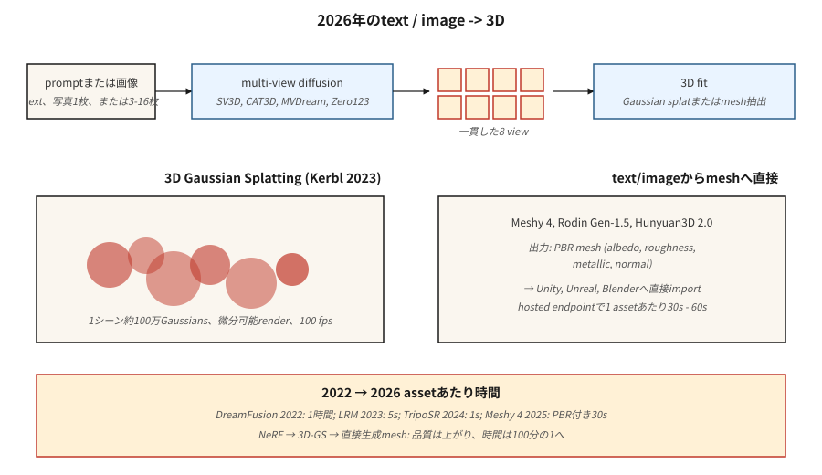

# 3D Nesil

> 3B, 2B'den 3B'ye geçişin en güçlü olduğu yöntemdir. 2023'teki atılım 3D Gaussian Splatting'ti. Tek bir prompt veya fotoğraftan nesneler ve sahneler üretmek için 2024-2026 üretken itme katmanları çoklu görüntü yayılımı + 3D yeniden yapılandırma.

**Tür:** Öğren
**Diller:** Python
**Önkoşullar:** Aşama 4 (Vizyon), Aşama 8 · 07 (Gizli Yayılma)
**Süre:** ~45 dakika

## Sorun

3D içerik acı vericidir:

- **Temsil.** Kafesler, nokta bulutları, voksel ızgaraları, işaretli mesafe alanları (SDF'ler), sinirsel parlaklık alanları (NeRF'ler), 3D Gaussian'lar. Her birinin değiş tokuşları vardır.
- **Veri kıtlığı.** ImageNet'te 14 milyon görüntü var. En büyük temiz 3D dataset (Objaverse-XL, 2023) ~10M nesneye sahiptir ve çoğu düşük kalitededir.
- **Bellek.** 512³'lük bir voksel ızgarası 128M vokseldir; kullanışlı bir sahne NeRF'nin 1 milyon örnek/ışına ihtiyacı vardır. Nesil yeniden inşa etmekten daha zordur.
- **Denetim.** 2D bir görüntü için piksellere sahipsiniz. 3D için genellikle az sayıda 2D görünümünüz olur ve 3D'ye geçmeniz gerekir.

2026 yığını iki sorunu birbirinden ayırıyor. İlk olarak, bir yayılma modeliyle *2D çoklu görünüm görüntüleri* oluşturun. İkinci olarak, bu görüntülere bir *3 boyutlu gösterim* (genellikle Gauss sıçraması) sığdırın.

## Konsept



### Temsil: 3D Gauss Splatting (Kerbl ve diğerleri, 2023)

Bir sahneyi ~1M 3D Gausslulardan oluşan bir bulut olarak temsil edin. Her birinin 59 parametresi vardır: konum (3), kovaryans (6 veya kuaterniyon 4 + ölçek 3), opaklık (1), küresel harmonikler rengi (3. derecede 48, 0. derecede 3).

Oluşturma = projeksiyon + alfa birleştirme. Hızlı (4090'da 1080p'de ~100 fps). Türevlenebilir. Gerçek fotoğraflara karşı gradient inişiyle sığdır. Bir sahne, tüketici GPU'suna 5-30 dakikaya sığar.

En üstte iki 2023-2024 yeniliği:
- **Üretken Gauss uyarıları.** LGM, LRM, InstantMesh gibi modeller bir Gauss bulutunu doğrudan bir veya birkaç görüntüden tahmin eder.
- **4D Gauss Splatting.** Dinamik sahneler için kare başına ofsetlere sahip Gaussian'lar.

### Çoklu görünüm dağıtımı

Bir prompt metninden veya tek bir görüntüden aynı nesnenin birden çok tutarlı görünümünü oluşturmak için önceden eğitilmiş bir görüntü dağıtım modeline ince ayar yapın. Zero123 (Liu ve diğerleri, 2023), MVDream (Shi ve diğerleri, 2023), SV3D (Stability, 2024), CAT3D (Google, 2024). Genellikle nesnenin etrafında Gaussian splatting veya NeRF yoluyla 3D'ye kaldırılmış 4-16 görünüm çıktısı alınır.

### Metinden 3D'ye işlem hatları

| Modeli | Giriş | Çıkış | Zaman |
|-------|-------|--------|------|
| RüyaFusion (2022) | metin | SDS aracılığıyla NeRF | ~varlık başına 1 saat |
| Magic3D | metin | ağ + doku | ~40 dk |
| Şekil-E (OpenAI, 2023) | metin | örtülü 3D | ~1 dk |
| SJC / ProlificDreamer | metin | NeRF / ağ | ~30 dk |
| LRM (Meta, 2023) | resim | üç kanatlı | ~5 sn |
| AnındaMesh (2024) | resim | ağ | ~10 sn |
| SV3D (Kararlılık, 2024) | resim | roman görünümleri | ~2 dk |
| CAT3D (Google, 2024) | 1-64 resimler | 3D NeRF | ~1 dk |
| TripoSR (2024) | resim | ağ | ~1 sn |
| Meshy 4 (2025) | metin + resim | PBR ağı | ~30 sn |
| Rodin Gen-1.5 (2025) | metin + resim | PBR ağı | ~60 sn |
| Tencent Hunyuan3D 2.0 (2025) | resim | ağ | ~30 sn |

2025-2026 yönü: oyun motorlarına uygun PBR malzemelerine sahip doğrudan metinden ağa modeller. Çoklu görüntülü dağıtım ara adımı, genel nesneler için hâlâ en iyi performansa sahip reçetedir.

### NeRF (bağlam için)

Nöral Parlaklık Alanı (Mildenhall ve diğerleri, 2020). Küçük bir MLP, `(x, y, z, view direction)`'yi alır ve `(color, density)` çıktısını alır. Işınlar boyunca entegre ederek oluşturun. Kalite açısından ağ tabanlı yeni görünüm sentezini geçer ancak işlenmesi 100-1000 kat daha yavaştır. Çoğu gerçek zamanlı kullanımda yerini Gauss sıçraması almıştır ancak araştırmada hala baskındır.

## İnşa Et

`code/main.py`, oyuncak bir 2B "Gauss sıçraması" uyumu uygular: 2B Gauss uyarılarının toplamı olarak sentetik bir hedef görüntüyü (pürüzsüz bir gradient) temsil eder. Hedefe uyacak şekilde konumları, renkleri ve kovaryansları gradient inişine göre optimize edin. İki temel işlemi görüyorsunuz: ileri işleme (uyarı + alfa kompozit) ve gradient inişine göre yerleştirme.

### Adım 1: 2D Gauss uyarısı

```python
def gaussian_at(x, y, gaussian):
    px, py = gaussian["pos"]
    sigma = gaussian["sigma"]
    d2 = (x - px) ** 2 + (y - py) ** 2
    return math.exp(-d2 / (2 * sigma * sigma))
```

### Adım 2: uyarıları toplayarak oluşturma

```python
def render(image_size, gaussians):
    img = [[0.0] * image_size for _ in range(image_size)]
    for g in gaussians:
        for y in range(image_size):
            for x in range(image_size):
                img[y][x] += g["color"] * gaussian_at(x, y, g)
    return img
```

Gerçek 3D Gauss sıçraması, Gauss'ları derinliğe ve alfa bileşimlerine göre sıralar. 2D oyuncağımız tam anlamıyla özetliyor.

### Adım 3: gradient inişine göre sığdır

```python
for step in range(steps):
    pred = render(size, gaussians)
    loss = mse(pred, target)
    gradients = compute_grads(pred, target, gaussians)
    update(gaussians, gradients, lr)
```

## Tuzaklar

- **Görüntü tutarsızlığı.** Bağımsız olarak 4 görünüm oluşturursanız ve nesne yapısı konusunda anlaşamıyorlarsa 3B sığdırma bulanık olur. Düzeltme: Paylaşılan dikkatle çoklu görüntü dağıtımı.
- **Arka taraf halüsinasyonu.** Tek görüntü → 3D'nin görünmeyen tarafı icat etmesi gerekiyor. Kalite çılgınca değişir.
- **Gauss uyarı patlaması.** Kısıtlamasız eğitim 10 milyon uyarıya ve aşırı uyumlara ulaşır. Yoğunlaştırma + budama buluşsal yöntemi (3D-GS orijinal kağıdından) önemlidir.
- **Topoloji sorunları.** Örtülü alanlardan (SDF'ler) gelen ağlarda genellikle delikler veya kendi kendine kesişmeler bulunur. Sevkiyattan önce bir remesher (e.g. blender'ın voksel remesh'i) çalıştırın.
- **Eğitim verileri lisansı.** Objaverse'nin karma lisansları vardır; ticari kullanım modele göre değişir.

## Kullan onu

| Görev | 2026 seçimi |
|------|-----------|
| Fotoğraflardan sahne rekonstrüksiyonu | Gauss sıçraması (3DGS, Gsplat, Scaniverse) |
| Oyunlar için metni 3 boyutlu nesneye dönüştürme | Meshy 4 veya Rodin Gen-1.5 (PBR çıkışı) |
| Görüntüden 3D'ye | Hunyuan3D 2.0, TripoSR, InstantMesh |
| Birkaç görüntüden yeni görünüm sentezi | CAT3D, SV3D |
| Dinamik sahne rekonstrüksiyonu | 4D Gauss Splatting |
| Avatar / giyinik insan | Gauss Avatarı, SARILMA |
| Araştırma / SOTA | Geçen hafta düşen ne varsa |

Bir oyun veya e-ticaret hattında üretim 3D'nin nakliyesi için: Meshy 4 veya Rodin Gen-1.5, doğrudan Unity / Unreal'a giden PBR ağlarının çıktısını alır.

## Gönderin

`outputs/skill-3d-pipeline.md`'yi kaydedin. Skill, 3 boyutlu bir özet alır (girdi: metin / bir görüntü / birkaç görüntü; çıktı: mesh / splat / NeRF; kullanım: render / oyun / VR) ve çıktılar: ardışık düzen (çoklu görünüm difüzyon + uyum veya doğrudan ağ modeli), temel model, yineleme bütçesi, topoloji son işleme, gerekli malzeme kanalları.

## Egzersizler

1. **Kolay.** `code/main.py`'yi 4, 16, 64 Gaussian ile çalıştırın. Nihai MSE ve hedef karşılaştırmasını raporlayın.
2. **Orta.** Renkli Gaussian'lara (RGB) genişletin. Yeniden yapılandırmanın hedef renk deseniyle eşleştiğini doğrulayın.
3. **Zor.** gsplat veya Nerfstudio'yu kullanarak 50 fotoğraflık bir yakalamadan gerçek bir nesneyi yeniden oluşturun. Uzatılmış görünümlerde uyum süresini ve son SSIM'yi raporlayın.

## Anahtar Terimler

| Dönem | İnsanlar ne diyor | Aslında ne anlama geliyor |
|------|-----------------|-----------------------|
| 3D Gauss Splatting | "3DGS" | 3D Gausslulardan oluşan bir bulut olarak sahne; diferansiyellenebilir alfa-bileşik render. |
| NeRF | "Sinirsel parlaklık alanı" | 3 boyutlu bir noktada renk + yoğunluk çıktısı veren MLP; ışın entegrasyonu ile render. |
| Üç kanatlı | "Üç 2 boyutlu uçak" | 3B'yi üç adet 2 boyutlu eksen hizalı özellik ızgarasına ayırın; hacimselden daha ucuzdur. |
| GBF | "Score damıtma örneklemesi" | 2B yayılma puanını sözde gradient olarak kullanarak 3B modeli eğitin. |
| Çoklu görünüm dağıtımı | "Aynı anda birçok görüntüleme" | Tutarlı kamera görüntüleri toplu çıktısı veren dağıtım modeli. |
| PBR | "Fiziksel tabanlı oluşturma" | Albedolu, pürüzlü, metalik, normal kanallı malzeme. |
| Yoğunlaştırma | "Uyarıları büyütün" | 3DGS eğitim buluşsal yöntemi: yüksek gradient bölgelerinde uyarıları bölme/klonlama. |

## Üretim notu: 3D'nin henüz paylaşılan alt tabakası yok

Görüntü (gizli difüzyon + DiT) ve videonun (uzay-zamansal DiT) aksine, 3D'nin 2026'da tek bir baskın çalışma süresi yoktur. Üretim karar ağacı temsile göre çatallanır:

- **NeRF / üç düzlem.** Inference ışın yürüyüşü + örnek başına bir MLP ileridir. 512²'lik bir işleme, milyonlarca MLP ileri iletimi gerektirir. Işın örneklerini agresif bir şekilde gruplayın; SDPA/xformers geçerlidir.
- **Çoklu görüntü dağıtımı + LRM yeniden yapılandırması.** İki aşamalı ardışık düzen. Aşama 1 (çoklu görünüm DiT), Ders 07 gibi bir dağıtım sunucusudur. Aşama 2 (LRM transformer), görünümler üzerinde tek seferlik ileri geçiştir. Genel gecikme profili "yayılma + tek seferlik"tir; aşama başına hizmet veren ilkelleri buna göre seçin.
- **SDS / DreamFusion.** Varlık başına optimizasyon, inference değil. İstek işleyicileri değil, işler oluşturun.

Çoğu 2026 ürünü için doğru yanıt, "istek üzerine çoklu görüntülü bir yayılma modeli çalıştırmak, eşzamansız olarak 3DGS'ye yeniden yapılandırmak, gerçek zamanlı görüntüleme için 3DGS'ye hizmet etmek" şeklindedir. Bu, iş yükünü GPU-inference sunucusu (hızlı) ve çevrimdışı optimize edici (yavaş) arasında temiz bir şekilde böler.

## Daha Fazla Okuma

- [Mildenhall ve ark. (2020). NeRF: Sahneleri Nöral Parlaklık Alanları Olarak Temsil Etmek](https://arxiv.org/abs/2003.08934) — NeRF.
- [Kerbl ve ark. (2023). Gerçek Zamanlı Parlaklık Alanı Oluşturma için 3D Gauss Splatting](https://arxiv.org/abs/2308.04079) — 3DGS.
- [Poole ve ark. (2022). DreamFusion: 2D Difüzyon kullanarak metinden 3D'ye](https://arxiv.org/abs/2209.14988) — SDS.
- [Liu ve ark. (2023). Sıfır-1'den 3'e: Sıfır Çekimli Tek Görüntüden 3D Nesneye](https://arxiv.org/abs/2303.11328) — Zero123.
- [Shi ve ark. (2023). MVDream](https://arxiv.org/abs/2308.16512) — çoklu görüntü dağıtımı.
- [Hong ve ark. (2023). LRM: Tek Görüntüden 3D'ye Büyük Yeniden Yapılandırma Modeli](https://arxiv.org/abs/2311.04400) — LRM.
- [Gao ve ark. (2024). CAT3D: Çoklu Görünümlü Dağıtım Modelleriyle 3D'de Her Şeyi Yaratın](https://arxiv.org/abs/2405.10314) — CAT3D.
- [Kararlılık Yapay Zekası (2024). Sabit Video 3D (SV3D)](https://stability.ai/research/sv3d) — SV3D.
