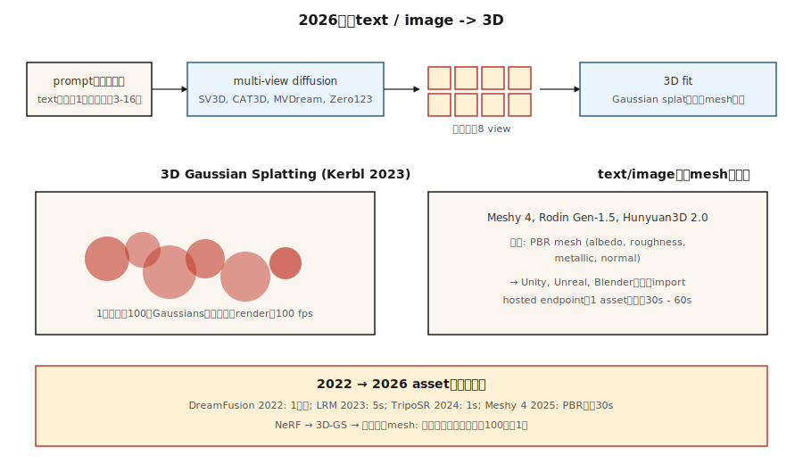

# 3D 生成

> 3D 是从 2D 到 3D  leverage 最强的模态。2023 年的突破是 3D 高斯溅射（3D Gaussian Splatting）。2024-2026 年的生成式推进在此基础上叠加了多视图扩散（multi-view diffusion）和 3D 重建，以从单个提示或照片生成物体和场景。

**类型：** 学习
**语言：** Python
**先决条件：** 第 4 阶段（视觉），第 8 阶段 · 07（潜在扩散）
**时间：** ~45 分钟

## 问题

3D 内容很痛苦：

- **表示。** 网格（Meshes）、点云（point clouds）、体素网格（voxel grids）、有符号距离场（SDFs）、神经辐射场（NeRFs）、3D 高斯（3D Gaussians）。每种都有权衡。
- **数据稀缺。** ImageNet 有 1400 万张图像。最大的干净 3D 数据集（Objaverse-XL，2023 年）有约 1000 万个物体，大多数质量较低。
- **内存。** 一个 512³ 的体素网格是 1.28 亿个体素；一个有用的场景 NeRF 需要每条光线 100 万个采样点。生成比重建更难。
- **监督。** 对于 2D 图像，你拥有像素。对于 3D，你通常只有少量 2D 视图，必须将其提升到 3D。

2026 年的技术栈将这两个问题分开。首先，使用扩散模型生成 *2D 多视图图像*。其次，将 *3D 表示*（通常是高斯溅射）拟合到这些图像上。

## 概念



### 表示：3D 高斯溅射 (Kerbl et al., 2023)

将场景表示为约 100 万个 3D 高斯的云。每个高斯有 59 个参数：位置 (3)、协方差 (6，或四元数 4 + 缩放 3)、不透明度 (1)、球谐颜色 (3 阶 48 个，0 阶 3 个)。

渲染 = 投影 + alpha 合成。速度快（在 4090 上 1080p 约 100 fps）。可微分。通过梯度下降拟合真实照片。一个场景在消费级 GPU 上需要 5-30 分钟。

2023-2024 年的两项创新：
- **生成式高斯溅射。** LGM、LRM、InstantMesh 等模型直接从一张或几张图像预测高斯云。
- **4D 高斯溅射。** 具有每帧偏移的高斯，用于动态场景。

### 多视图扩散

微调预训练的图像扩散模型，以从文本提示或单张图像生成同一物体的多个一致视图。Zero123 (Liu et al., 2023)、MVDream (Shi et al., 2023)、SV3D (Stability, 2024)、CAT3D (Google, 2024)。通常输出物体周围的 4-16 个视图，通过高斯溅射或 NeRF 提升到 3D。

### 文本到 3D 的流水线

| 模型 | 输入 | 输出 | 时间 |
|-------|-------|--------|------|
| DreamFusion (2022) | 文本 | 通过 SDS 的 NeRF | ~1 小时/资源 |
| Magic3D | 文本 | 网格 + 纹理 | ~40 分钟 |
| Shap-E (OpenAI, 2023) | 文本 | 隐式 3D | ~1 分钟 |
| SJC / ProlificDreamer | 文本 | NeRF / 网格 | ~30 分钟 |
| LRM (Meta, 2023) | 图像 | 三平面（triplane） | ~5 秒 |
| InstantMesh (2024) | 图像 | 网格 | ~10 秒 |
| SV3D (Stability, 2024) | 图像 | 新颖视图 | ~2 分钟 |
| CAT3D (Google, 2024) | 1-64 张图像 | 3D NeRF | ~1 分钟 |
| TripoSR (2024) | 图像 | 网格 | ~1 秒 |
| Meshy 4 (2025) | 文本 + 图像 | PBR 网格 | ~30 秒 |
| Rodin Gen-1.5 (2025) | 文本 + 图像 | PBR 网格 | ~60 秒 |
| Tencent Hunyuan3D 2.0 (2025) | 图像 | 网格 | ~30 秒 |

2025-2026 年方向：直接文本到网格模型，带有适用于游戏引擎的 PBR 材质。多视图扩散中间步骤仍然是通用物体的最佳性能方案。

### NeRF（背景）

神经辐射场 (Mildenhall et al., 2020)。一个微小的 MLP 接收 `(x, y, z, 视角方向)` 并输出 `(颜色, 密度)`。通过沿光线积分进行渲染。在质量上击败了基于网格的新颖视图合成，但渲染速度慢 100-1000 倍。对于大多数实时使用场景，已被高斯溅射取代，但在研究中仍占主导地位。

## 构建

`code/main.py` 实现了一个玩具级的 2D “高斯溅射”拟合：将合成目标图像（平滑渐变）表示为 2D 高斯溅射的总和。通过梯度下降优化位置、颜色和协方差以匹配目标。你会看到两个核心操作：前向渲染（溅射 + alpha 合成）和通过梯度下降拟合。

### 步骤 1：2D 高斯溅射

```python
def gaussian_at(x, y, gaussian):
    px, py = gaussian["pos"]
    sigma = gaussian["sigma"]
    d2 = (x - px) ** 2 + (y - py) ** 2
    return math.exp(-d2 / (2 * sigma * sigma))
```

### 步骤 2：通过求和溅射进行渲染

```python
def render(image_size, gaussians):
    img = [[0.0] * image_size for _ in range(image_size)]
    for g in gaussians:
        for y in range(image_size):
            for x in range(image_size):
                img[y][x] += g["color"] * gaussian_at(x, y, g)
    return img
```

真实的 3D 高斯溅射按深度对高斯进行排序并按顺序进行 alpha 合成。我们的 2D 玩具只是求和。

### 步骤 3：通过梯度下降拟合

```python
for step in range(steps):
    pred = render(size, gaussians)
    loss = mse(pred, target)
    gradients = compute_grads(pred, target, gaussians)
    update(gaussians, gradients, lr)
```

## 陷阱

- **视图不一致。** 如果你独立生成 4 个视图，它们对物体结构的看法不一致，3D 拟合会很模糊。修复方法：使用共享注意力机制的多视图扩散。
- **背面幻觉。** 单张图像 → 3D 必须发明看不见的背面。质量差异很大。
- **高斯溅射爆炸。** 无约束训练增长到 1000 万个溅射并过拟合。致密化 + 剪枝启发式方法（来自 3D-GS 原始论文）至关重要。
- **拓扑问题。** 来自隐式场（SDFs）的网格通常有孔洞或自相交。在发布前运行一个重网格化工具（例如 blender 的体素重网格化）。
- **训练数据的许可证。** Objaverse 有混合许可证；商业使用因模型而异。

## 使用

| 任务 | 2026 年选择 |
|------|-----------|
| 从照片进行场景重建 | 高斯溅射 (3DGS, Gsplat, Scaniverse) |
| 用于游戏的文本到 3D 物体 | Meshy 4 或 Rodin Gen-1.5 (PBR 输出) |
| 图像到 3D | Hunyuan3D 2.0, TripoSR, InstantMesh |
| 从少量图像进行新颖视图合成 | CAT3D, SV3D |
| 动态场景重建 | 4D 高斯溅射 |
| 化身 / 穿衣人体 | Gaussian Avatar, HUGS |
| 研究 / SOTA | 上周发布的任何内容 |

对于在游戏或电子商务流水线中发布生产级 3D：Meshy 4 或 Rodin Gen-1.5 输出 PBR 网格，可直接进入 Unity / Unreal。

## 交付

保存 `outputs/skill-3d-pipeline.md`。技能接收一个 3D 简报（输入：文本 / 一张图像 / 几张图像；输出：网格 / 溅射 / NeRF；用途：渲染 / 游戏 / VR）并输出：流水线（多视图扩散 + 拟合，或直接网格模型）、基础模型、迭代预算、拓扑后处理、所需材质通道。

## 练习

1. **简单。** 使用 4、16、64 个高斯运行 `code/main.py`。报告与目标的最终 MSE。
2. **中等。** 扩展到彩色高斯 (RGB)。确认重建与目标颜色模式匹配。
3. **困难。** 使用 gsplat 或 Nerfstudio，从 50 张照片捕捉中重建一个真实物体。报告拟合时间和在保留视图上的最终 SSIM。

## 关键术语

| 术语 | 人们怎么说 | 实际含义 |
|------|-----------------|-----------------------|
| 3D 高斯溅射 | "3DGS" | 将场景表示为 3D 高斯云；可微分的 alpha 合成渲染。 |
| NeRF | "神经辐射场" | 输出 3D 点颜色 + 密度的 MLP；通过光线积分渲染。 |
| 三平面 (Triplane) | "三个 2D 平面" | 将 3D 分解为三个 2D 轴对齐特征网格；比体素便宜。 |
| SDS | "分数蒸馏采样" | 通过使用 2D 扩散分数作为伪梯度来训练 3D 模型。 |
| 多视图扩散 | "一次生成多个视图" | 输出一批一致相机视图的扩散模型。 |
| PBR | "基于物理的渲染" | 具有反照率、粗糙度、金属度、法线通道的材质。 |
| 致密化 (Densification) | "增长溅射" | 3DGS 训练启发式方法：在高梯度区域分割 / 克隆溅射。 |

## 生产说明：3D 尚未有共享的底层架构

与图像（潜在扩散 + DiT）和视频（时空 DiT）不同，3D 在 2026 年没有单一的 dominant 运行时。生产决策树在表示上分叉：

- **NeRF / 三平面。** 推理是光线步进 + 每个采样点的 MLP 前向传播。512² 的渲染需要数百万次 MLP 前向传播。积极批量处理光线样本；应用 SDPA/xformers。
- **多视图扩散 + LRM 重建。** 两阶段流水线。第 1 阶段（多视图 DiT）与第 07 课的扩散服务器相同。第 2 阶段（LRM 转换器）是视图上的单次前向传播。整体延迟特征是“扩散 + 单次”——相应地选择每阶段服务原语。
- **SDS / DreamFusion。** 每资源优化，而非推理。构建作业，而非请求处理程序。

对于大多数 2026 年的产品，正确的答案是“按需运行多视图扩散模型，异步重建到 3DGS，为实时查看提供 3DGS 服务”。这干净地将工作负载分为 GPU 推理服务器（快速）和离线优化器（慢速）。

## 延伸阅读

- [Mildenhall et al. (2020). NeRF: Representing Scenes as Neural Radiance Fields](https://arxiv.org/abs/2003.08934) — NeRF。
- [Kerbl et al. (2023). 3D Gaussian Splatting for Real-Time Radiance Field Rendering](https://arxiv.org/abs/2308.04079) — 3DGS。
- [Poole et al. (2022). DreamFusion: Text-to-3D using 2D Diffusion](https://arxiv.org/abs/2209.14988) — SDS。
- [Liu et al. (2023). Zero-1-to-3: Zero-shot One Image to 3D Object](https://arxiv.org/abs/2303.11328) — Zero123。
- [Shi et al. (2023). MVDream](https://arxiv.org/abs/2308.16512) — 多视图扩散。
- [Hong et al. (2023). LRM: Large Reconstruction Model for Single Image to 3D](https://arxiv.org/abs/2311.04400) — LRM。
- [Gao et al. (2024). CAT3D: Create Anything in 3D with Multi-View Diffusion Models](https://arxiv.org/abs/2405.10314) — CAT3D。
- [Stability AI (2024). Stable Video 3D (SV3D)](https://stability.ai/research/sv3d) — SV3D。
