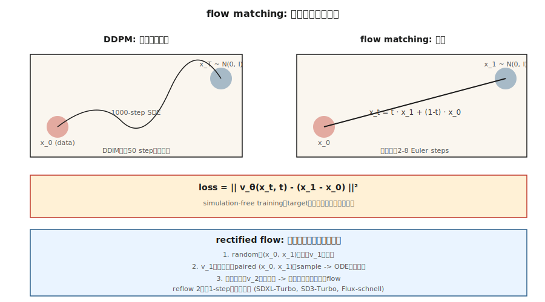

# Flow Matching & Rectified Flows

> Diffusion models が 20-50 回のサンプリングステップを必要とするのは、ノイズからデータへ曲がった経路をたどるためです。Flow matching (Lipman et al., 2023) と rectified flow (Liu et al., 2022) は、直線的な経路を学習しました。経路がまっすぐになるほどステップ数は減り、推論は速くなります。Stable Diffusion 3、Flux.1、AudioCraft 2 はいずれも 2024 年に flow matching へ移行しました。

**種別:** 構築
**言語:** Python
**前提条件:** Phase 8 · 06 (DDPM), Phase 1 · Calculus
**所要時間:** 約45分

## 問題

DDPM の逆過程は、`N(0, I)` からデータ分布へ戻る 1000 ステップの確率的な歩行です。DDIM はそれを 20-50 回の決定論的ステップに圧縮しました。欲しいのはさらに少ないステップ、理想的には 1 ステップです。障害になるのは、逆過程を解く ODE が stiff で、経路が曲がっていることです。

ノイズからデータへの経路が *直線* になるようにモデルを学習できれば、`t=1` から `t=0` への単一の Euler step でうまくいきます。Flow matching はこれを直接構成します。`x_1 ∼ N(0, I)` から `x_0 ∼ data` への直線補間を定義し、ベクトル場 `v_θ(x, t)` がその時間微分に一致するように学習し、推論時に積分します。

Rectified flow (Liu 2022) はさらに進みます。reflow 手続きで経路を反復的に直線化し、だんだん線形に近い ODE を作ります。2 回の reflow iteration の後では、2-step sampler が 50-step DDPM と同等の品質に達します。

## The Concept



### Straight-line flow

次のように定義します。

```
x_t = t · x_1 + (1 - t) · x_0,   t ∈ [0, 1]
```

ここで `x_0 ~ data`、`x_1 ~ N(0, I)` です。この直線上の時間微分は一定です。

```
dx_t / dt = x_1 - x_0
```

ニューラルベクトル場 `v_θ(x_t, t)` を定義し、この微分に一致するように学習します。

```
L = E_{x_0, x_1, t} || v_θ(x_t, t) - (x_1 - x_0) ||²
```

これが **conditional flow matching** loss (Lipman 2023) です。学習は simulation-free です。ODE を unroll することはありません。単に `(x_0, x_1, t)` をサンプルして回帰します。

### Sampling

推論時は、学習したベクトル場を時間方向に *逆向き* に積分します。

```
x_{t-Δt} = x_t - Δt · v_θ(x_t, t)
```

`x_1 ~ N(0, I)` から開始し、Euler step で `t=0` まで下ります。

### Rectified flow (Liu 2022)

Straight-line flow は機能しますが、学習された経路は *実際には直線ではありません*。多くの `x_0` が同じ `x_1` に対応し得るため、経路が曲がります。Rectified flow の reflow step は次の通りです。

1. ランダムなペアリングで flow model v_1 を学習する。
2. `x_1` から到達点 `x_0` まで v_1 を積分して、N 個のペア `(x_1, x_0)` をサンプルする。
3. そのペア例で v_2 を学習する。ペアが "ODE-matched" になったため、それらを結ぶ straight-line interpolant は本当により平坦になる。
4. 繰り返す。

実務では 2 回の reflow iteration でほぼ線形に到達し、2-4 step inference が可能になります。SDXL-Turbo、SD3-Turbo、LCM はすべて flow-matching model から distilled されたモデルです。

### Why this won for images in 2024

理由は 3 つあります。

1. **Simulation-free training** — 学習中に ODE unrolling がなく、実装が単純。
2. **Better loss geometry** — 直線経路は一貫した signal-to-noise を持つ一方、DDPM の ε-loss は schedule の端で SNR が悪い。
3. **Faster inference** — SDXL-Turbo 品質で 4-8 steps。consistency distillation なら 1 step。

## Flow matching vs DDPM — the exact connection

Gaussian-conditional path を使う flow matching は、*特定の noise schedule を持つ* diffusion です。`x_t = α(t) x_0 + σ(t) x_1` schedule を選ぶと、flow matching は `v = α'·x_0 - σ'·x_1` を持つ Stratonovich 形式の diffusion を復元します。Gaussian paths では両者は代数的に等価です。

Flow matching が加えたものは、ターゲットの *明快さ*（素直な velocity）、よりきれいな loss、そして non-Gaussian interpolants を試す自由です。

## 実装

`code/main.py` は、2 モード Gaussian mixture 上の 1-D flow matching を実装します。ベクトル場 `v_θ(x, t)` は、straight-line target で学習される小さな MLP です。推論時には 1、2、4、20 回の Euler steps で積分し、サンプル品質を比較します。

### Step 1: training loss

```python
def train_step(x0, net, rng, lr):
    x1 = rng.gauss(0, 1)
    t = rng.random()
    x_t = t * x1 + (1 - t) * x0
    target = x1 - x0
    pred = net_forward(x_t, t)
    loss = (pred - target) ** 2
    # backprop + update
```

### Step 2: multi-step inference

```python
def sample(net, num_steps):
    x = rng.gauss(0, 1)
    for i in range(num_steps):
        t = 1.0 - i / num_steps
        dt = 1.0 / num_steps
        x -= dt * net_forward(x, t)
    return x
```

### Step 3: compare step counts

4-step sampler がすでに 20-step の品質に一致することを期待してください。これは latency にとって大きな意味があります。

## Pitfalls

- **Time parameterization.** Flow matching は `t ∈ [0, 1]` を使い、`t=0` がデータ、`t=1` がノイズです。DDPM は `t ∈ [0, T]` を使い、`t=0` がデータ、`t=T` がノイズです。方向は同じで、スケールが異なります。論文ではここが頻繁に混同されます。
- **Schedule choice.** Rectified flow の直線は「その」flow-matching schedule ですが、より良い scale coverage のために cosine や logit-normal t-sampling（SD3 がこれを採用）も使えます。
- **Reflow cost.** Reflow 用の paired dataset を生成するには、サンプルごとに完全な inference pass が必要です。1-2 step inference が本当に必要な場合にだけ reflow してください。
- **Classifier-free guidance still applies.** 線形結合で ε を v に置き換えるだけです: `v_cfg = (1+w) v_cond - w v_uncond`。

## Use It

| Use case | 2026 stack |
|----------|-----------|
| Text-to-image, best quality | Flow matching: SD3, Flux.1-dev |
| Text-to-image, 1-4 steps | Distilled flow matching: Flux.1-schnell, SD3-Turbo, SDXL-Turbo |
| Real-time inference | Consistency distillation from a flow-matched base (LCM, PCM) |
| Audio generation | Flow matching: Stable Audio 2.5, AudioCraft 2 |
| Video generation | Flow matching mixed with diffusion (Sora, Veo, Stable Video) |
| Science / physics (particle trajectories, molecules) | Flow matching + equivariant vector field |

2025-2026 年の論文で "faster than diffusion" と書かれている場合、ほぼ常に flow matching + distillation です。

## Ship It

`outputs/skill-fm-tuner.md` を保存してください。この skill は diffusion-style model spec を受け取り、flow-matching training config に変換します。schedule choice、time sampling distribution（uniform / logit-normal）、optimizer、reflow plan、target step count、eval protocol を出力します。

## Exercises

1. **Easy.** `code/main.py` を実行し、真のデータ分布に対する 1-step と 20-step の MSE を比較してください。
2. **Medium.** uniform `t` sampling から logit-normal（mid-t にサンプリングを集中）へ切り替えてください。モデル品質は改善しますか。
3. **Hard.** 1 回の reflow iteration を実装してください。最初のモデルを積分して paired (x_0, x_1) を生成し、そのペアで 2 つ目のモデルを学習し、1-step sample quality を比較します。

## Key Terms

| Term | What people say | What it actually means |
|------|-----------------|-----------------------|
| Flow matching | "Straight-line diffusion" | Interpolant 上で `v_θ(x, t)` が `x_1 - x_0` に一致するように学習する。 |
| Rectified flow | "Reflow" | 学習された flows を直線化する反復手続き。 |
| Velocity field | "v_θ" | モデルの出力。`x_t` を動かす方向。 |
| Straight-line interpolant | "The path" | `x_t = (1-t)·x_0 + t·x_1`。target derivative が自明。 |
| Euler sampler | "1st order ODE solver" | 最も単純な integrator。経路が直線的なときにうまく機能する。 |
| Logit-normal t | "SD3 sampling" | 勾配が最も強い中間値へ `t` sampling を集中させる。 |
| Consistency distillation | "1-step sampler" | 任意の `x_t` を直接 `x_0` へ写す student を学習する。 |
| CFG with velocity | "v-CFG" | `v_cfg = (1+w) v_cond - w v_uncond`。同じ trick、新しい変数。 |

## Production note: Flux.1-schnell is flow matching at its fastest

Flow matching の production 上の勝ち筋は Flux.1-schnell です。flow-matched DiT を 1-4 inference steps へ distill しつつ、Flux-dev 級の品質を保っています。Niels の "Run Flux on an 8GB machine" notebook は、参照すべき deployment recipe です。T5 + CLIP encode、quantized MMDiT denoise（schnell では 4 steps、dev では 50 steps）、VAE decode という構成です。コストの内訳は次の通りです。

| Variant | Steps | Latency at 1024² on L4 | Total FLOPs (relative) |
|---------|-------|------------------------|------------------------|
| Flux.1-dev (raw) | 50 | ~15 s | 1.0× |
| Flux.1-schnell | 4 | ~1.2 s | 0.08× (12× faster) |
| SDXL-base | 30 | ~4 s | 0.25× |
| SDXL-Lightning 2-step | 2 | ~0.3 s | 0.03× |

Production rule: **flow-matched base + distillation = 高速 text-to-image における 2026 年の default。** 主要ベンダーはすべてこの組み合わせを出荷しています。SD3-Turbo（SD3 + flow + distillation）、Flux-schnell（Flux-dev + rectified-flow straightening）、CogView-4-Flash です。Pure diffusion bases は legacy checkpoints にのみ残っています。

## 参考文献

- [Liu, Gong, Liu (2022). Flow Straight and Fast: Learning to Generate and Transfer Data with Rectified Flow](https://arxiv.org/abs/2209.03003) — rectified flow.
- [Lipman et al. (2023). Flow Matching for Generative Modeling](https://arxiv.org/abs/2210.02747) — flow matching.
- [Esser et al. (2024). Scaling Rectified Flow Transformers for High-Resolution Image Synthesis](https://arxiv.org/abs/2403.03206) — SD3, rectified flow at scale.
- [Albergo, Vanden-Eijnden (2023). Stochastic Interpolants](https://arxiv.org/abs/2303.08797) — FM + diffusion を包含する一般的な枠組み。
- [Song et al. (2023). Consistency Models](https://arxiv.org/abs/2303.01469) — diffusion / flow の 1-step distillation。
- [Sauer et al. (2023). Adversarial Diffusion Distillation (SDXL-Turbo)](https://arxiv.org/abs/2311.17042) — turbo variant.
- [Black Forest Labs (2024). Flux.1 models](https://blackforestlabs.ai/announcing-black-forest-labs/) — production における flow matching。
