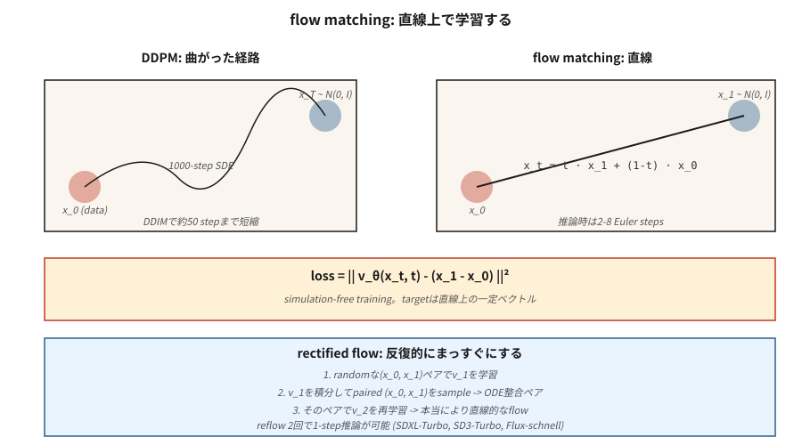

# 流匹配与纠正流

> 扩散模型需要 20-50 个采样步，因为它们从噪声到数据走的是弯曲路径。流匹配（Lipman et al., 2023）和纠正流（Liu et al., 2022）训练了直线路径。更直的路径意味着更少的步数，意味着更快的推理。Stable Diffusion 3、Flux.1 和 AudioCraft 2 在 2024 年都切换到了流匹配。

**类型：** 构建
**语言：** Python
**前置知识：** 阶段 8 · 06（DDPM）、阶段 1 · 微积分
**时间：** ~45 分钟

## 问题

DDPM 的反向过程是从 `N(0, I)` 回到数据分布的 1000 步随机游走。DDIM 将其压缩为 20-50 步确定性步骤。你想要更少的步数——最好一步。障碍在于求解反向过程的 ODE 是刚性的；路径是弯曲的。

如果你能训练模型使得从噪声到数据的路径是*直线*，从 `t=1` 到 `t=0` 的单步欧拉就能工作。流匹配直接构建了这一点：定义从 `x_1 ∼ N(0, I)` 到 `x_0 ∼ data` 的线性插值，训练向量场 `v_θ(x, t)` 匹配其时间导数，推理时积分。

纠正流（Liu 2022）更进一步：通过重流程序迭代地拉直路径，该程序产生一个逐渐接近线性的 ODE。经过两次重流迭代后，2 步采样器可以匹配 50 步 DDPM 的质量。

## 概念



### 直线流

定义：

```
x_t = t · x_1 + (1 - t) · x_0,   t ∈ [0, 1]
```

其中 `x_0 ~ data` 且 `x_1 ~ N(0, I)`。沿此直线的时间导数是常数：

```
dx_t / dt = x_1 - x_0
```

定义一个神经向量场 `v_θ(x_t, t)` 并训练它匹配此导数：

```
L = E_{x_0, x_1, t} || v_θ(x_t, t) - (x_1 - x_0) ||²
```

这就是**条件流匹配**损失（Lipman 2023）。训练免模拟：你永不解开 ODE。只需采样 `(x_0, x_1, t)` 并回归。

### 采样

推理时，在时间上*向后*积分学习到的向量场：

```
x_{t-Δt} = x_t - Δt · v_θ(x_t, t)
```

从 `x_1 ~ N(0, I)` 开始，欧拉步下降到 `t=0`。

### 纠正流（Liu 2022）

直线流有效，但学习到的路径*实际上并不直*——它们弯曲，因为许多 `x_0` 可以映射到相同的 `x_1`。纠正流的重流步骤：

1. 使用随机配对训练流模型 v_1。
2. 通过从 `x_1` 积分 v_1 到其着陆点 `x_0` 来采样 N 对 `(x_1, x_0)`。
3. 在这些配对示例上训练 v_2。因为配对现在"ODE 匹配"，它们之间的线性插值真正更平坦。
4. 重复。

在实践中，2 次重流迭代就能达到接近线性，实现 2-4 步推理。SDXL-Turbo、SD3-Turbo、LCM 都是从流匹配模型蒸馏得到的。

### 为什么这在 2024 年为图像胜出

三个原因：

1. **免模拟训练**——训练期间无需解开 ODE，实现简单。
2. **更好的损失几何**——直线路径有一致的信噪比，而 DDPM 的 ε-损失在调度边缘有较差的 SNR。
3. **更快的推理**——4-8 步达到 SDXL-Turbo 质量；结合一致性蒸馏只需 1 步。

## 流匹配 vs DDPM——精确联系

带有高斯条件路径的流匹配就是扩散*具有特定的噪声调度*。选择 `x_t = α(t) x_0 + σ(t) x_1` 调度，流匹配恢复为带有 `v = α'·x_0 - σ'·x_1` 的 Stratonovich 重表述扩散。两者对于高斯路径在代数上是等价的。

流匹配增加了什么：目标的*清晰度*（简单的速度）、更干净的损失，以及实验非高斯插值的许可。

## 动手实现

`code/main.py` 在双峰高斯混合上实现 1-D 流匹配。向量场 `v_θ(x, t)` 是一个以直线目标训练的微型 MLP。推理时，积分 1、2、4 和 20 个欧拉步并比较样本质量。

### 步骤 1：训练损失

```python
def train_step(x0, net, rng, lr):
    x1 = rng.gauss(0, 1)
    t = rng.random()
    x_t = t * x1 + (1 - t) * x0
    target = x1 - x0
    pred = net_forward(x_t, t)
    loss = (pred - target) ** 2
    # backprop + update
```

### 步骤 2：多步推理

```python
def sample(net, num_steps):
    x = rng.gauss(0, 1)
    for i in range(num_steps):
        t = 1.0 - i / num_steps
        dt = 1.0 / num_steps
        x -= dt * net_forward(x, t)
    return x
```

### 步骤 3：比较步数

预期 4 步采样器已经匹配 20 步质量——这对延迟来说意义重大。

## 陷阱

- **时间参数化。** 流匹配使用 `t ∈ [0, 1]`，`t=0` 在数据端，`t=1` 在噪声端。DDPM 使用 `t ∈ [0, T]`，`t=0` 在数据端，`t=T` 在噪声端。方向相同，尺度不同。论文经常搞错。
- **调度选择。** 纠正流的直线是"那个"流匹配调度，但你可以使用余弦或 logit-normal t-采样（SD3 这样做）以获得更好的尺度覆盖。
- **重流成本。** 生成用于重流的配对数据集需要对每个样本进行一次完整的推理。只有当你真正需要 1-2 步推理时才做重流。
- **无分类器引导仍然适用。** 只需在线性组合中将 ε 替换为 v：`v_cfg = (1+w) v_cond - w v_uncond`。

## 应用

| 使用场景 | 2026 年技术栈 |
|----------|-----------|
| 文生图，最佳质量 | 流匹配：SD3、Flux.1-dev |
| 文生图，1-4 步 | 蒸馏流匹配：Flux.1-schnell、SD3-Turbo、SDXL-Turbo |
| 实时推理 | 从流匹配基座的一致性蒸馏（LCM、PCM） |
| 音频生成 | 流匹配：Stable Audio 2.5、AudioCraft 2 |
| 视频生成 | 流匹配与扩散混合（Sora、Veo、Stable Video） |
| 科学 / 物理（粒子轨迹、分子） | 流匹配 + 等变向量场 |

每当 2025-2026 年的论文说"比扩散更快"时，几乎总是流匹配 + 蒸馏。

## 交付

保存为 `outputs/skill-fm-tuner.md`。技能接受扩散风格的模型规范并将其转换为流匹配训练配置：调度选择、时间采样分布（均匀 / logit-normal）、优化器、重流计划、目标步数、评估方案。

## 练习

1. **简单。** 运行 `code/main.py` 并比较 1 步 vs 20 步的 MSE 与真实数据分布。
2. **中等。** 从均匀 `t` 采样切换到 logit-normal（将采样集中在中间 t）。模型质量提高了吗？
3. **困难。** 实现一次重流迭代：通过积分第一个模型生成配对 (x_0, x_1)，在配对数据上训练第二个模型，并比较 1 步样本质量。

## 关键术语

| 术语 | 人们说的 | 实际含义 |
|------|-----------------|-----------------------|
| Flow matching | "直线扩散" | 训练 `v_θ(x, t)` 沿插值匹配 `x_1 - x_0`。 |
| Rectified flow | "重流" | 拉直学习到的流的迭代过程。 |
| Velocity field | "v_θ" | 模型的输出——移动 `x_t` 的方向。 |
| Straight-line interpolant | "路径" | `x_t = (1-t)·x_0 + t·x_1`；平凡的目标导数。 |
| Euler sampler | "1 阶 ODE 求解器" | 最简单的积分器；路径直时效果好。 |
| Logit-normal t | "SD3 采样" | 将 `t` 采样集中在梯度最强的中间值附近。 |
| Consistency distillation | "1 步采样器" | 训练学生模型直接将任意 `x_t` 映射到 `x_0`。 |
| CFG with velocity | "v-CFG" | `v_cfg = (1+w) v_cond - w v_uncond`；相同的技巧，新的变量。 |

## 生产说明：Flux.1-schnell 是最快的流匹配

流匹配的生产胜利是 Flux.1-schnell——一个流匹配的 DiT，蒸馏到 1-4 个推理步，同时保持 Flux-dev 级别的质量。Niels 的"在 8GB 机器上运行 Flux"的 notebook 是参考部署配方：T5 + CLIP 编码、量化的 MMDiT 去噪（schnell 4 步 vs dev 50 步）、VAE 解码。成本核算：

| 变体 | 步数 | L4 上 1024² 延迟 | 总 FLOPs（相对） |
|---------|-------|------------------------|------------------------|
| Flux.1-dev（原始） | 50 | ~15 s | 1.0× |
| Flux.1-schnell | 4 | ~1.2 s | 0.08×（快 12 倍） |
| SDXL-base | 30 | ~4 s | 0.25× |
| SDXL-Lightning 2-step | 2 | ~0.3 s | 0.03× |

生产规则：**流匹配基座 + 蒸馏 = 2026 年快速文生图的默认选择。** 每个主要供应商都部署这个组合：SD3-Turbo（SD3 + 流 + 蒸馏）、Flux-schnell（Flux-dev + 纠正流拉直）、CogView-4-Flash。纯扩散基座仅存在于遗留检查点。

## 延伸阅读

- [Liu, Gong, Liu (2022). Flow Straight and Fast: Learning to Generate and Transfer Data with Rectified Flow](https://arxiv.org/abs/2209.03003) — 纠正流。
- [Lipman et al. (2023). Flow Matching for Generative Modeling](https://arxiv.org/abs/2210.02747) — 流匹配。
- [Esser et al. (2024). Scaling Rectified Flow Transformers for High-Resolution Image Synthesis](https://arxiv.org/abs/2403.03206) — SD3，大规模纠正流。
- [Albergo, Vanden-Eijnden (2023). Stochastic Interpolants](https://arxiv.org/abs/2303.08797) — 涵盖 FM + 扩散的通用框架。
- [Song et al. (2023). Consistency Models](https://arxiv.org/abs/2303.01469) — 扩散/流的 1 步蒸馏。
- [Sauer et al. (2023). Adversarial Diffusion Distillation (SDXL-Turbo)](https://arxiv.org/abs/2311.17042) — turbo 变体。
- [Black Forest Labs (2024). Flux.1 models](https://blackforestlabs.ai/announcing-black-forest-labs/) — 生产中的流匹配。
