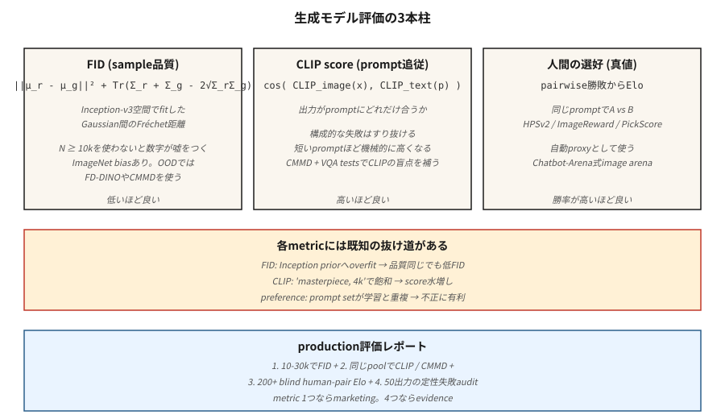

# 评估——FID、CLIP 分数、人类偏好

> 每个生成式模型排行榜都引用 FID、CLIP 分数和来自人类偏好竞技场的胜率。每个数字都有确定的攻击方式可以被有决心的研究人员利用。如果你不知道这些失败模式，你就无法区分真正的改进和利用漏洞的运行。

**类型：** 构建
**语言：** Python
**前置知识：** 阶段 8 · 01（分类体系）、阶段 2 · 04（评估指标）
**时间：** ~45 分钟

## 问题

生成式模型根据*样本质量*和*条件遵循度*来评判。两者都没有闭式度量。你的模型必须渲染 10,000 张图像；必须有东西给它们分配数字；你必须跨模型家族、跨分辨率、跨架构信任这些数字。有三个指标挺过了 2014-2026 年的考验：

- **FID（Fréchet Inception Distance）。** 在 Inception 网络的特征空间中，真实分布和生成分布之间的距离。越低越好。
- **CLIP 分数。** 生成图像的 CLIP-图像嵌入与提示的 CLIP-文本嵌入之间的余弦相似度。越高越好。衡量提示遵循度。
- **人类偏好。** 在相同提示上让两个模型直接对决，让人类（或 GPT-4 类模型）选择更好的一个，汇总为 Elo 分数。

你还会看到：IS（inception score，基本已退役）、KID、CMMD、ImageReward、PickScore、HPSv2、MJHQ-30k。每个都纠正了前一个的一个失败。

## 概念



### FID——样本质量

Heusel et al.（2017）。步骤：

1. 为 N 张真实图像和 N 张生成图像提取 Inception-v3 特征（2048 维）。
2. 为每个池拟合高斯分布：计算均值 `μ_r, μ_g` 和协方差 `Σ_r, Σ_g`。
3. FID = `||μ_r - μ_g||² + Tr(Σ_r + Σ_g - 2 · (Σ_r · Σ_g)^0.5)`。

解释：特征空间中两个多元高斯之间的 Fréchet 距离。越低 = 分布越相似。

失败模式：
- **小 N 有偏。** FID 是特征分布上的均方——小 N 低估协方差，给出虚假的低 FID。始终使用 N ≥ 10,000。
- **Inception 依赖。** Inception-v3 在 ImageNet 上训练。远离 ImageNet 的领域（人脸、艺术、文本图像）产生无意义的 FID。使用领域特定的特征提取器。
- **攻击。** 过拟合 Inception 先验给出低 FID 而无需视觉质量改进。用 CMMD 击败它（见下文）。

### CLIP 分数——提示遵循度

Radford et al.（2021）。对于生成的图像 + 提示：

```
clip_score = cos_sim( CLIP_image(x_gen), CLIP_text(prompt) )
```

在 30k 张生成图像上平均 → 一个可在模型之间比较的标量。

失败模式：
- **CLIP 自身的盲点。** CLIP 的组合推理能力弱（"蓝色球体上的红色立方体"经常失败）。模型可以在 CLIP 分数上排名靠前而实际上不遵循复杂提示。
- **短提示偏差。** 短提示在现实中有更多的 CLIP-图像匹配。长提示机械地有更低的 CLIP 分数。
- **提示攻击。** 在提示中包含"high quality, 4k, masterpiece"会抬高 CLIP 分数而不改善图像-文本绑定。

CMMD（Jayasumana et al., 2024）修复了其中一些问题：使用 CLIP 特征代替 Inception，使用最大均值差异代替 Fréchet。更好地检测细微质量差异。

### 人类偏好——真实标准

选择一个提示池。用模型 A 和模型 B 生成。将配对展示给人类（或强大的 LLM 评判者）。将胜场汇总为 Elo 或 Bradley-Terry 分数。基准：

- **PartiPrompts（Google）**：1,600 个多样化提示，12 个类别。
- **HPSv2**：107k 人类标注，广泛用作自动代理。
- **ImageReward**：137k 提示-图像偏好对，MIT 许可。
- **PickScore**：在 Pick-a-Pic 260 万偏好上训练。
- **Chatbot-Arena 风格的图像竞技场**：https://imagearena.ai/ 等。

失败模式：
- **评判者方差。** 非专家与专家有不同偏好。两者都用。
- **提示分布。** 精心挑选的提示偏向一个家族。始终记录。
- **LLM 评判者的奖励攻击。** GPT-4 评判者被漂亮但错误的输出欺骗。用人类交叉验证。

## 一起使用

生产级评估报告应包括：

1. 对 10-30k 样本与保留真实分布的 FID（样本质量）。
2. 相同样本与其提示的 CLIP 分数 / CMMD（遵循度）。
3. 盲测竞技场中对前一个模型的胜率（总体偏好）。
4. 失败模式分析：50 个随机采样输出，标记已知问题（手部解剖、文本渲染、一致的物体数量）。

任何一个单一指标都是谎言。三个相互印证的指标 + 定性审查才是一个主张。

## 动手实现

`code/main.py` 在合成的"特征向量"（我们使用 4-D 向量作为 Inception 特征的替代）上实现 FID、类似 CLIP 分数的计算和 Elo 聚合。你将看到：

- 在小 N 和大 N 上的 FID 计算——偏差。
- "CLIP 分数"作为特征池之间的余弦相似度。
- 来自合成偏好流的 Elo 更新规则。

### 步骤 1：四行 FID

```python
def fid(real_features, gen_features):
    mu_r, cov_r = mean_and_cov(real_features)
    mu_g, cov_g = mean_and_cov(gen_features)
    mean_diff = sum((a - b) ** 2 for a, b in zip(mu_r, mu_g))
    trace_term = trace(cov_r) + trace(cov_g) - 2 * sqrt_cov_product(cov_r, cov_g)
    return mean_diff + trace_term
```

### 步骤 2：CLIP 风格的余弦相似度

```python
def clip_like(image_feat, text_feat):
    dot = sum(a * b for a, b in zip(image_feat, text_feat))
    norm = math.sqrt(dot_self(image_feat) * dot_self(text_feat))
    return dot / max(norm, 1e-8)
```

### 步骤 3：Elo 聚合

```python
def elo_update(r_a, r_b, winner, k=32):
    expected_a = 1 / (1 + 10 ** ((r_b - r_a) / 400))
    actual_a = 1.0 if winner == "a" else 0.0
    r_a_new = r_a + k * (actual_a - expected_a)
    r_b_new = r_b - k * (actual_a - expected_a)
    return r_a_new, r_b_new
```

## 陷阱

- **N=1000 时的 FID。** 启发式在 N=10k 以下不可靠。报告低 N FID 的论文是在利用漏洞。
- **跨分辨率比较 FID。** Inception 的 299×299 缩放改变了特征分布。仅在匹配的分辨率下比较。
- **报告一个种子。** 至少运行 3 个种子。报告标准差。
- **通过负面提示抬高 CLIP 分数。** 一些流水线通过过拟合提示来提升 CLIP。检查视觉饱和。
- **提示重叠导致的 Elo 偏差。** 如果两个模型在训练期间都看到过基准提示，Elo 就无意义了。使用保留提示集。
- **人类评估付费群体偏差。** Prolific、MTurk 标注者偏向年轻/技术友好人群。与招募的艺术/设计专家混合。

## 应用

2026 年生产级评估方案：

| 支柱 | 最低要求 | 推荐 |
|--------|---------|-------------|
| 样本质量 | 对 10k 样本的 FID vs 保留真实分布 | + 对 5k 的 CMMD + 按类别的子集 FID |
| 提示遵循度 | 对 30k 的 CLIP 分数 | + HPSv2 + ImageReward + VQA 风格问答 |
| 偏好 | 200 个盲测配对 vs 基线 | + 2000 对人类 + LLM 评判者 + Chatbot Arena |
| 失败分析 | 50 个手工标记 | 500 个手工标记 + 自动化安全分类器 |

报告中全部四个支柱 = 主张。任何一个单独 = 营销。

## 交付

保存为 `outputs/skill-eval-report.md`。技能接受新的模型检查点 + 基线并输出完整的评估计划：样本量、指标、失败模式探测、签收标准。

## 练习

1. **简单。** 运行 `code/main.py`。比较在相同合成分布上 N=100 vs N=1000 时的 FID。报告偏差幅度。
2. **中等。** 从合成的 CLIP 风格特征实现 CMMD（见 Jayasumana et al., 2024 的公式）。比较对质量差异的敏感度 vs FID。
3. **困难。** 复现 HPSv2 设置：从 Pick-a-Pic 的一个子集中取 1000 个图像-提示对，在偏好上微调一个小的基于 CLIP 的评分器，并测量其与保留集的一致性。

## 关键术语

| 术语 | 人们说的 | 实际含义 |
|------|-----------------|-----------------------|
| FID | "Fréchet Inception Distance" | 真实与生成 Inception 特征的高斯拟合的 Fréchet 距离。 |
| CLIP score | "文本-图像相似度" | CLIP 图像和文本嵌入之间的余弦相似度。 |
| CMMD | "FID 的替代品" | CLIP 特征 MMD；偏差更小，无需高斯假设。 |
| IS | "Inception score" | Exp KL(p(y|x) || p(y))；在现代模型上相关性差，已退役。 |
| HPSv2 / ImageReward / PickScore | "学习到的偏好代理" | 在人类偏好上训练的小模型；用作自动评判者。 |
| Elo | "国际象棋评级" | 成对胜场的 Bradley-Terry 聚合。 |
| PartiPrompts | "基准提示集" | 1,600 个 Google 精选的提示，涵盖 12 个类别。 |
| FD-DINO | "自监督替代" | 使用 DINOv2 特征的 FD；对非 ImageNet 领域更好。 |

## 生产说明：评估也是一个推理工作负载

对 10k 样本运行 FID 意味着生成 10k 张图像。对于单个 L4 上 1024² 的 50 步 SDXL 基座，这大约是 11 小时的单请求推理。评估预算是真实存在的，框架正好是在线推理场景（最大化吞吐量，忽略 TTFT）：

- **硬批处理，忽略延迟。** 离线评估 = 在内存能容纳的最大尺寸下进行静态批处理。在 80GB H100 上使用 `num_images_per_prompt=8` 的 `pipe(...).images` 比单请求快 4-6 倍（墙上时钟）。
- **缓存真实特征。** 对真实参考集的 Inception（FID）或 CLIP（CLIP-score、CMMD）特征提取运行*一次*，存储为 `.npz`。不要在每次评估时重新计算。

对于 CI / 回归门控：在每个 PR 的 500 样本子集上运行 FID + CLIP 分数（约 30 分钟）；每晚运行完整的 10k FID + HPSv2 + Elo。

## 延伸阅读

- [Heusel et al. (2017). GANs Trained by a Two Time-Scale Update Rule Converge to a Local Nash Equilibrium (FID)](https://arxiv.org/abs/1706.08500) — FID 论文。
- [Jayasumana et al. (2024). Rethinking FID: Towards a Better Evaluation Metric for Image Generation (CMMD)](https://arxiv.org/abs/2401.09603) — CMMD。
- [Radford et al. (2021). Learning Transferable Visual Models from Natural Language Supervision (CLIP)](https://arxiv.org/abs/2103.00020) — CLIP。
- [Wu et al. (2023). HPSv2: A Comprehensive Human Preference Score](https://arxiv.org/abs/2306.09341) — HPSv2。
- [Xu et al. (2023). ImageReward: Learning and Evaluating Human Preferences for Text-to-Image Generation](https://arxiv.org/abs/2304.05977) — ImageReward。
- [Yu et al. (2023). Scaling Autoregressive Models for Content-Rich Text-to-Image Generation (Parti + PartiPrompts)](https://arxiv.org/abs/2206.10789) — PartiPrompts。
- [Stein et al. (2023). Exposing flaws of generative model evaluation metrics](https://arxiv.org/abs/2306.04675) — 失败模式调查。
