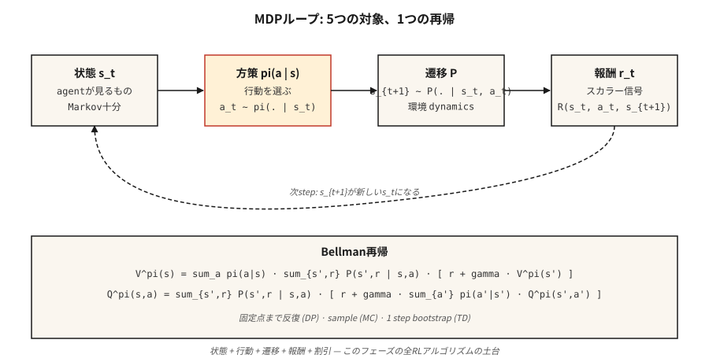

# MDP'ler, Durumlar, Eylemler ve Ödüller

> Markov Karar Süreci beş şeyden oluşur: durumlar, eylemler, geçişler, ödüller, indirim. RL'deki her şey (Q-öğrenme, PPO, DPO, GRPO) bu şekil üzerinde optimize edilir. Bir kez öğrenin, pekiştirmeli öğrenmenin geri kalanını kolayca anlayın.

**Tür:** Learn
**Diller:** Python
**Önkoşullar:** Aşama 1 · 06 (Olasılık ve Dağılımlar), Aşama 2 · 01 (ML Taksonomisi)
**Süre:** ~45 dakika

## Sorun

Bir satranç botu yazıyorsunuz. Veya bir envanter planlayıcısı. Veya bir ticaret agent. Veya bir akıl yürütme modelini eğiten PPO döngüsü. Dört farklı alan, şaşırtıcı bir gerçek: dördü de aynı matematiksel nesneyle ifade edilebiliyor.

Denetimli öğrenme size `(x, y)` çifti verir ve sizden bir fonksiyon uydurmanızı ister. Pekiştirmeli öğrenme size hiçbir etiket vermez; yalnızca bir durum akışı, gerçekleştirdiğiniz eylemler ve skaler bir ödül verir. Bu hamle oyunu kazandırdı mı? Stok yenileme kararı tasarruf sağladı mı? Ticaret kâr etti mi? LLM'nin az önce ürettiği token değerlendirme modelinden daha yüksek bir ödül almasına yol açtı mı?

Resmileştirmedikçe bu akıştan öğrenemezsiniz. "Gördüğüm şey", "ne yaptım", "sonra ne oldu", "bu ne kadar iyiydi" - bunların her biri hakkında mantık yürütebileceğiniz birer nesne haline gelmelidir. Bu resmileştirme bir Markov Karar Sürecidir. Sondaki RLHF ve GRPO döngüleri de dahil olmak üzere bu aşamadaki her RL algoritması bu şekil üzerinden optimizasyon yapar.

## Konsept



**Beş nesne.**

- **Durumlar** `S`. agent'ın karar vermesi gereken her şey. GridWorld'de hücre. Satrançta tahta. LLMta, context window artı herhangi bir bellek.
- **Eylemler** `A`. Seçimler. Yukarı/aşağı/sola/sağa hareket ettirin. Bir hamle oyna. Bir token yayınlayın.
- **Geçişler** `P(s' | s, a)`. `s` durumu ve `a` eylemi verildiğinde, sonraki duruma göre dağılım. Satrançta deterministik, envanterde stokastik, LLM kod çözmede neredeyse deterministik.
- **Ödüller** `R(s, a, s')`. Skaler sinyal. Galibiyet = +1, mağlubiyet = -1. Gelir eksi maliyet. GRPO'daki log-olabilirlik oranı terimi.
- **İndirim** `γ ∈ [0, 1)`. Gelecekteki ödülün şimdiki zamana göre ne kadar önemli olduğu. `γ = 0.99` ~100 adımlık etkili bir ufuk sağlar; `γ = 0.9` ~10 adımlık bir ufuk sağlar.

**Markov özelliği** `P(s_{t+1} | s_t, a_t) = P(s_{t+1} | s_0, a_0, …, s_t, a_t)`. Gelecek yalnızca mevcut duruma bağlıdır. Aksi takdirde durum temsili eksiktir; yöntemin başarısızlığı değil, durumun başarısızlığıdır.

**Politikalar ve dönüşler.** `π(a | s)` politikası, durumları eylem dağılımlarıyla eşleştirir. `G_t = r_t + γ r_{t+1} + γ² r_{t+2} + …` getirisi gelecekteki ödüllerin indirimli toplamıdır. `V^π(s) = E[G_t | s_t = s]` değeri, `π` politikası kapsamında `s`'dan başlayarak beklenen getiridir. Q değeri `Q^π(s, a) = E[G_t | s_t = s, a_t = a]`, belirli bir eylemle başlayan beklenen getiridir. Her RL algoritması bu ikisinden birini tahmin eder ve ardından buna göre `π`'yi iyileştirir.

**Bellman denklemleri.** Bu aşamadaki her şeyin kullandığı sabit nokta denklemleri:

`V^π(s) = Σ_a π(a|s) Σ_{s', r} P(s', r | s, a) [r + γ V^π(s')]`
`Q^π(s, a) = Σ_{s', r} P(s', r | s, a) [r + γ Σ_{a'} π(a'|s') Q^π(s', a')]`

Bunlar, beklenen getiriyi "bu adımın ödülü" artı "vardığınız yerin indirimli değeri" olarak bölüştürür. Özyinelemeli. Aşama 9'daki her algoritma ya bu denklemi yakınsamaya (dinamik programlama) yineler, ondan örnekler alır (Monte Carlo) ya da onu bir adım başlatır (zamansal fark).

```figure
discount-horizon
```

## Build It — Kendin İnşa Et

### Adım 1: küçük bir deterministik MDP

4×4 Izgara Dünyası. Agent sol üstte başlar, sağ altta terminal, adım başına -1 ödül, eylemler `{up, down, left, right}`. Bkz. `code/main.py`.

```python
GRID = 4
TERMINAL = (3, 3)
ACTIONS = {"up": (-1, 0), "down": (1, 0), "left": (0, -1), "right": (0, 1)}

def step(state, action):
    if state == TERMINAL:
        return state, 0.0, True
    dr, dc = ACTIONS[action]
    r, c = state
    nr = min(max(r + dr, 0), GRID - 1)
    nc = min(max(c + dc, 0), GRID - 1)
    return (nr, nc), -1.0, (nr, nc) == TERMINAL
```

Beş satır. Bütün ortam budur. Deterministik geçişler, sabit adım cezası, yutucu uç durum.

### 2. Adım: bir politika yayınlayın

Politika, durumdan eyleme dağılıma kadar olan bir fonksiyondur. En basiti: tekdüze rastgele.

```python
def uniform_policy(state):
    return {a: 0.25 for a in ACTIONS}

def rollout(policy, max_steps=200):
    s, total, steps = (0, 0), 0.0, 0
    for _ in range(max_steps):
        a = sample(policy(s))
        s, r, done = step(s, a)
        total += r
        steps += 1
        if done:
            break
    return total, steps
```

Rastgele politikayı 1000 kez çalıştırın. Bu 4×4 tahta için ortalama getiri -60 ila -80 civarındadır. Optimum getiri -6'dır (sağdan aşağıya düz çizgi). Bu açığı kapatmak 9. Aşamadaki her şeydir.

### Adım 3: `V^π`'yi tam olarak Bellman denklemi yoluyla hesaplayın

Küçük MDP'ler için Bellman denklemi doğrusal bir sistemdir. Durumları numaralandırın, beklentiyi uygulayın, değerlerin değişmesi durana kadar yineleyin.

```python
def policy_evaluation(policy, gamma=0.99, tol=1e-6):
    V = {s: 0.0 for s in all_states()}
    while True:
        delta = 0.0
        for s in all_states():
            if s == TERMINAL:
                continue
            v = 0.0
            for a, pi_a in policy(s).items():
                s_next, r, _ = step(s, a)
                v += pi_a * (r + gamma * V[s_next])
            delta = max(delta, abs(v - V[s]))
            V[s] = v
        if delta < tol:
            return V
```

Bu yinelenen politika değerlendirmesidir. Sutton & Barto'daki ilk algoritmadır ve takip eden her RL yönteminin teorik temelidir.

### Adım 4: `γ` fiziksel anlamı olan bir hiperparametredir

Etkili ufuk kabaca `1 / (1 - γ)`'dır. `γ = 0.9` → 10 adım. `γ = 0.99` → 100 adım. `γ = 0.999` → 1000 adım.

Çok düşükse agent miyop davranır. Çok yüksekse kredi tahsisi gürültülü hale gelir, çünkü ilk adımların çoğu uzak gelecekteki ödülün sorumluluğunu paylaşır. Bölümler kısa ve sınırlı olduğundan LLM RLHF genellikle `γ = 1` kullanır. Kontrol görevleri `0.95–0.99` kullanır. Uzun ufuklu strateji oyunları `0.999` kullanır.

## Tuzaklar

- **Markovian olmayan durum.** Karar vermek için son üç gözleme ihtiyacınız varsa, "durum" yalnızca mevcut gözlem değildir. Düzeltme: çerçeveleri yığınlayın (Atari yığınları 4'te DQN) veya yinelenen bir durum kullanın (gözlemler üzerinde LSTM/GRU).
- **Yetersiz ödüller.** Yalnızca kazanılan ödüller, geniş devlet alanlarında öğrenmeyi neredeyse imkansız hale getirir. Taklit yoluyla ödülleri (ara sinyal) veya önyüklemeyi şekillendirin (Aşama 9 · 09).
- **Ödül hackleme.** Proxy ödülünü optimize etmek çoğu zaman patolojik davranışlara neden olur. OpenAI'nin tekne yarışı agent, yarışı bitirmek yerine daireler çizerek sonsuza kadar güçlendiriciler topladı. Ödülü her zaman temsili sonuca göre değil, hedef sonuca göre tanımlayın.
- **İndirim katsayısının yanlış belirlenmesi.** Sonsuz ufuklu bir görevdeki `γ = 1`, her değeri sonsuz yapar. Daima sonlu bir ufukla veya `γ < 1` ile sınırlayın.
- **Ödül ölçeği.** {+100, -100} ile {+1, -1} arasındaki ödüller aynı optimal politikaları sağlar ancak oldukça farklı gradient büyüklüklere sahiptir. PPO/DQN'ye bağlanmadan önce `[-1, 1]`-ish'e normalleştirin.

## Use It — Uygula

2026 yığını, koda dokunmadan önce her RL ardışık düzenini bir MDP'ye indirir:

| Durum | Durum | Eylem | Ödül | γ |
|-----------|-------|--------|--------|---|
| Kontrol (hareket, manipülasyon) | Eklem açıları + hızlar | Sürekli torklar | Göreve özel şekilli | 0,99 |
| Oyunlar (satranç, Go, poker) | Yönetim Kurulu + geçmiş | Yasal hareket | Galibiyet=+1 / mağlubiyet=-1 | 1.0 (sonlu) |
| Envanter / fiyatlandırma | Stok + talep | Sipariş miktarı | Gelir - maliyet | 0,95 |
| LLM için RLHF | Bağlam token'lar | Sonraki token | Sonunda ödül modeli puanı | 1.0 (bölüm ~200 token'lar) |
| Muhakeme için GRPO | Prompt + kısmi yanıt | Sonraki token | Doğrulayıcı 0/1 sonunda | 1.0 |

Herhangi bir eğitim döngüsü yazmadan önce beş tuple'ı yazın. Çoğu "RL çalışmıyor" hata raporu, kağıt üzerinde bozuk bir MDP formülasyonuna kadar uzanır.

## Ship It — Ürüne Dönüştür

`outputs/skill-mdp-modeler.md` olarak kaydet:

```markdown
---
name: mdp-modeler
description: Given a task description, produce a Markov Decision Process spec and flag formulation risks before training.
version: 1.0.0
phase: 9
lesson: 1
tags: [rl, mdp, modeling]
---

Given a task (control / game / recommendation / LLM fine-tuning), output:

1. State. Exact feature vector or tensor spec. Justify Markov property.
2. Action. Discrete set or continuous range. Dimensionality.
3. Transition. Deterministic, stochastic-with-known-model, or sample-only.
4. Reward. Function and source. Sparse vs shaped. Terminal vs per-step.
5. Discount. Value and horizon justification.

Refuse to ship any MDP where the state is non-Markovian without explicit mention of frame-stacking or recurrent state. Refuse any reward that was not defined in terms of the target outcome. Flag any `γ ≥ 1.0` on an infinite-horizon task. Flag any reward range >100x the typical step reward as a likely gradient-explosion source.
```

## Egzersizler

1. **Kolay.** `code/main.py`'da 4×4 GridWorld'ü ve rastgele politika dağıtımını uygulayın. 10.000 bölüm çalıştırın. Ortalamayı ve getiri std'sini rapor edin. Optimum getiriyle (-6) karşılaştırın.
2. **Orta.** Tek tip rastgele ilkesi için `policy_evaluation`'yi `γ ∈ {0.5, 0.9, 0.99}` ile çalıştırın. Her biri için `V`'yi 4×4 ızgara olarak yazdırın. Terminal yakınındaki durum değerlerinin neden daha büyük `γ` ile daha hızlı büyüdüğünü açıklayın.
3. **Zor.** GridWorld'ü stokastik hale getirin: her eylem `p = 0.1` olasılıkla bitişik bir yöne kayar. Tek tip politikayı yeniden değerlendirin. `V[start]` iyileşiyor mu yoksa kötüleşiyor mu? Neden?

## Anahtar Terimler

| Terim | İnsanlar ne diyor | Aslında ne anlama geliyor |
|------|-----------------|-----------------------|
| MDP | "Pekiştirmeli öğrenme kurulumu" | Markov özelliğini karşılayan Tuple `(S, A, P, R, γ)`. |
| Durum | "agent ne görüyor" | Seçilen politika sınıfı kapsamında gelecekteki dinamikler için yeterli istatistik. |
| Politika | "Agent'nin davranışı" | Koşullu dağılım `π(a \| s)` veya deterministik harita `s → a`. |
| Getiri | "Toplam ödül" | Geçerli adımdan indirimli `Σ γ^t r_t` toplamı. |
| Değer | "Durum ne kadar iyidir" | `s`'dan itibaren `π` altında beklenen getiri. |
| Q değeri | "Bir eylem ne kadar iyidir" | İlk eylem `a` ile `s`'den başlayarak `π` altında beklenen getiri. |
| Bellman denklemi | "Dinamik programlama özyinelemesi" | Değerin / Q'nun tek adımlı ödül artı indirimli ardıl değere sabit nokta ayrıştırması. |
| İndirim `γ` | "Gelecek ve şimdiki zaman" | Uzak gelecekteki ödülde geometrik ağırlık; etkili ufuk `~1/(1-γ)`. |

## Daha Fazla Okuma

- [Sutton ve Barto (2018). Pekiştirmeli Öğrenme: Giriş, 2. baskı](http://incompleteideas.net/book/RLbook2020.pdf) — ders kitabı. Ch. 3, MDP'leri ve Bellman denklemlerini kapsar; Ch. 1, sonraki her dersin altında yatan ödül hipotezini motive eder.
-[Bellman (1957). Dinamik Programlama](https://press.princeton.edu/books/paperback/9780691146683/dynamic-programming) — Bellman denkleminin kökeni.
- [OpenAI Dönüyor — Bölüm 1: Temel Kavramlar](https://spinningup.openai.com/en/latest/spinningup/rl_intro.html) — derin RL açısından kısa MDP primeri.
- [Puterman (2005). Markov Karar Süreçleri](https://onlinelibrary.wiley.com/doi/book/10.1002/9780470316887) — MDP'lere ve kesin çözüm yöntemlerine ilişkin yöneylem araştırması referansı.
-[Littman (1996). Sıralı Karar Verme Algoritmaları (Doktora tezi)](https://www.cs.rutgers.edu/~mlittman/papers/thesis-main.pdf) — dinamik programlama uzmanlığı olarak MDP'lerin en temiz türevi.
