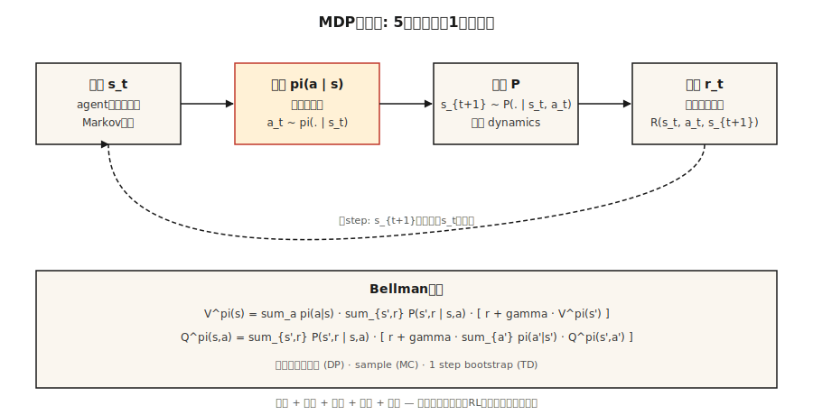

# MDP、状态、动作与奖励（MDPs, States, Actions & Rewards）

> 译注：本文译自同目录 [`en.md`](./en.md)。术语遵循仓根 [TRANSLATION_GUIDE.md](../../../../TRANSLATION_GUIDE.md)。

> 一个马尔可夫决策过程（Markov Decision Process）由五样东西组成：状态、动作、转移、奖励、折扣。RL 里所有东西——Q-learning、PPO、DPO、GRPO——都是在这个结构上做优化。学一次，剩下的强化学习内容都白送。

**Type:** Learn
**Languages:** Python
**Prerequisites:** Phase 1 · 06 (Probability & Distributions), Phase 2 · 01 (ML Taxonomy)
**Time:** ~45 minutes

## 问题（The Problem）

你在写一个国际象棋 bot。或者一个库存规划器。或者一个交易 agent。或者训练某个推理模型的 PPO loop。四个完全不同的领域，却有一个让人意外的事实：它们最终都坍缩到同一个数学对象上。

监督学习给你 `(x, y)` 对，让你拟合一个函数。强化学习不给标签——只给一连串状态、你采取的动作，以及一个标量奖励。这步棋赢下了对局吗？这次补货决策省钱了吗？这笔交易赚了吗？LLM 刚生成的 token 让裁判给出更高的奖励了吗？

在你把这条信息流形式化之前，你没法从中学习。「我看到了什么」「我做了什么」「接下来发生了什么」「这有多好」——每一项都得变成一个你可以推理的对象。这种形式化就是马尔可夫决策过程（Markov Decision Process）。这一阶段里的每个 RL 算法，包括末尾的 RLHF 和 GRPO loop，都是在这个结构上做优化。

## 概念（The Concept）



**五个对象。**

- **States（状态）** `S`。agent 做决策所需要的一切。在 GridWorld 里就是格子。在国际象棋里就是棋盘。在 LLM 里就是 context window 加上任何记忆。
- **Actions（动作）** `A`。可选的选择。上下左右移动。落子。生成一个 token。
- **Transitions（转移）** `P(s' | s, a)`。给定状态 `s` 和动作 `a`，下一个状态的分布。象棋里是确定性的，库存里是随机的，LLM 解码里几乎是确定性的。
- **Rewards（奖励）** `R(s, a, s')`。标量信号。赢 = +1，输 = -1。营收减成本。GRPO 里的对数似然比项。
- **Discount（折扣）** `γ ∈ [0, 1)`。未来奖励相对当下的权重。`γ = 0.99` 大约对应 100 步的视界；`γ = 0.9` 大约对应 10 步。

**马尔可夫性质（Markov property）** `P(s_{t+1} | s_t, a_t) = P(s_{t+1} | s_0, a_0, …, s_t, a_t)`。未来只依赖于当前状态。如果不成立，那就是状态表征不完整——不是方法的失败，是状态的失败。

**策略与回报。** 策略 `π(a | s)` 把状态映射到动作分布。回报 `G_t = r_t + γ r_{t+1} + γ² r_{t+2} + …` 是未来奖励的折扣和。价值函数 `V^π(s) = E[G_t | s_t = s]` 是在策略 `π` 下从 `s` 出发的期望回报。Q 值 `Q^π(s, a) = E[G_t | s_t = s, a_t = a]` 是从 `s` 出发、首个动作为 `a` 时的期望回报。每个 RL 算法都在估计这两者之一，然后据此改进 `π`。

**Bellman 方程。** 这一阶段所有内容都用到的不动点方程：

`V^π(s) = Σ_a π(a|s) Σ_{s', r} P(s', r | s, a) [r + γ V^π(s')]`
`Q^π(s, a) = Σ_{s', r} P(s', r | s, a) [r + γ Σ_{a'} π(a'|s') Q^π(s', a')]`

它们把期望回报拆成「这一步的奖励」加上「落地之后那个状态的折扣价值」。递归式的。Phase 9 里每一个算法，要么把这个方程迭代到收敛（动态规划），要么从中采样（Monte Carlo），要么单步 bootstrap（时序差分）。

## 动手实现（Build It）

### 第 1 步：一个迷你的确定性 MDP

一个 4×4 的 GridWorld。agent 从左上角出发，终点在右下角，每走一步奖励 -1，动作集 `{up, down, left, right}`。见 `code/main.py`。

```python
GRID = 4
TERMINAL = (3, 3)
ACTIONS = {"up": (-1, 0), "down": (1, 0), "left": (0, -1), "right": (0, 1)}

def step(state, action):
    if state == TERMINAL:
        return state, 0.0, True
    dr, dc = ACTIONS[action]
    r, c = state
    nr = min(max(r + dr, 0), GRID - 1)
    nc = min(max(c + dc, 0), GRID - 1)
    return (nr, nc), -1.0, (nr, nc) == TERMINAL
```

五行代码。这就是整个环境。确定性转移、固定的步长惩罚、吸收型终止状态。

### 第 2 步：roll out 一个策略

一个策略是从状态到动作分布的函数。最简单的：均匀随机。

```python
def uniform_policy(state):
    return {a: 0.25 for a in ACTIONS}

def rollout(policy, max_steps=200):
    s, total, steps = (0, 0), 0.0, 0
    for _ in range(max_steps):
        a = sample(policy(s))
        s, r, done = step(s, a)
        total += r
        steps += 1
        if done:
            break
    return total, steps
```

跑随机策略 1000 次。在这块 4×4 的板子上，平均回报大约 -60 到 -80。最优回报是 -6（直线走右下）。把这个差距合上，就是 Phase 9 的全部内容。

### 第 3 步：用 Bellman 方程精确求 `V^π`

对小规模 MDP，Bellman 方程就是一个线性方程组。把状态枚举一遍，应用期望，迭代到值不再变化为止。

```python
def policy_evaluation(policy, gamma=0.99, tol=1e-6):
    V = {s: 0.0 for s in all_states()}
    while True:
        delta = 0.0
        for s in all_states():
            if s == TERMINAL:
                continue
            v = 0.0
            for a, pi_a in policy(s).items():
                s_next, r, _ = step(s, a)
                v += pi_a * (r + gamma * V[s_next])
            delta = max(delta, abs(v - V[s]))
            V[s] = v
        if delta < tol:
            return V
```

这就是迭代式策略评估（iterative policy evaluation）。它是 Sutton & Barto 书里的第一个算法，也是后面每个 RL 方法的理论基石。

### 第 4 步：`γ` 是一个有物理意义的超参数

有效视界大约是 `1 / (1 - γ)`。`γ = 0.9` → 10 步。`γ = 0.99` → 100 步。`γ = 0.999` → 1000 步。

太低，agent 就会变得短视。太高，credit assignment（信用分配）会变得很噪——因为很多早期步骤都共同对遥远未来的奖励负责。LLM 的 RLHF 通常用 `γ = 1`，因为 episode 短而且有界。控制类任务用 `0.95–0.99`。长链路（long-horizon）的策略类游戏用 `0.999`。

## 陷阱（Pitfalls）

- **非马尔可夫状态。** 如果你需要最近三次观测才能做决策，那「状态」就不只是当前观测。修法：堆叠帧（DQN 在 Atari 上叠 4 帧），或者用循环状态（在观测序列上跑 LSTM/GRU）。
- **稀疏奖励。** 只有「赢」给奖励，在大状态空间里几乎学不动。塑造奖励（shape rewards，给中间信号），或者用模仿学习做 bootstrap（Phase 9 · 09）。
- **奖励黑客（reward hacking）。** 优化代理奖励经常产生病态行为。OpenAI 那个划船 agent 就在原地打圈无限收集道具，根本不去完赛。永远从目标结果定义奖励，而不是代理。
- **折扣设错。** 在无限视界任务上把 `γ = 1` 会让所有价值变无穷大。要么设有限视界，要么 `γ < 1`，必须有一个上界。
- **奖励量级。** 奖励为 {+100, -100} 和 {+1, -1} 给出的最优策略一样，但梯度幅度天差地别。塞进 PPO/DQN 之前要归一化到 `[-1, 1]` 左右。

## 用起来（Use It）

2026 年的 stack 把每个 RL 流水线在动代码之前先化成一个 MDP：

| 场景 | 状态 | 动作 | 奖励 | γ |
|-----------|-------|--------|--------|---|
| 控制（locomotion、操控） | 关节角 + 速度 | 连续力矩 | 任务相关、塑造过的 | 0.99 |
| 游戏（chess、Go、poker） | 棋盘 + 历史 | 合法落子 | 赢=+1 / 输=-1 | 1.0（有限） |
| 库存 / 定价 | 库存 + 需求 | 订货量 | 营收 - 成本 | 0.95 |
| LLM 的 RLHF | context token | 下一个 token | 末尾的 reward model 打分 | 1.0（episode 约 200 token） |
| 推理用 GRPO | prompt + 部分回复 | 下一个 token | 末尾验证器给 0/1 | 1.0 |

在写任何训练循环之前，先把这五元组写出来。绝大多数「RL 跑不通」的 bug 报告，根源都能追溯到一个在纸上就已经坏掉的 MDP 建模。

## 上线部署（Ship It）

存为 `outputs/skill-mdp-modeler.md`：

```markdown
---
name: mdp-modeler
description: Given a task description, produce a Markov Decision Process spec and flag formulation risks before training.
version: 1.0.0
phase: 9
lesson: 1
tags: [rl, mdp, modeling]
---

Given a task (control / game / recommendation / LLM fine-tuning), output:

1. State. Exact feature vector or tensor spec. Justify Markov property.
2. Action. Discrete set or continuous range. Dimensionality.
3. Transition. Deterministic, stochastic-with-known-model, or sample-only.
4. Reward. Function and source. Sparse vs shaped. Terminal vs per-step.
5. Discount. Value and horizon justification.

Refuse to ship any MDP where the state is non-Markovian without explicit mention of frame-stacking or recurrent state. Refuse any reward that was not defined in terms of the target outcome. Flag any `γ ≥ 1.0` on an infinite-horizon task. Flag any reward range >100x the typical step reward as a likely gradient-explosion source.
```

## 练习（Exercises）

1. **简单。** 在 `code/main.py` 里实现 4×4 的 GridWorld 和随机策略 rollout。跑 10,000 个 episode。报告回报的均值和标准差。和最优回报（-6）做对比。
2. **中等。** 用 `γ ∈ {0.5, 0.9, 0.99}` 跑一遍 `policy_evaluation`，策略用均匀随机。把每个 `γ` 下的 `V` 按 4×4 的网格打印出来。解释为什么靠近终点的状态价值在 `γ` 越大时增长得越快。
3. **困难。** 把 GridWorld 改成随机的：每个动作以 `p = 0.1` 的概率滑到相邻方向。重新评估均匀策略。`V[start]` 是变好还是变差？为什么？

## 关键术语（Key Terms）

| 术语 | 大家常说的 | 实际意思 |
|------|-----------------|-----------------------|
| MDP | 「强化学习的设定」 | 满足马尔可夫性质的元组 `(S, A, P, R, γ)`。 |
| State | 「agent 看到的东西」 | 在所选策略类下，对未来动力学的充分统计量。 |
| Policy | 「agent 的行为」 | 条件分布 `π(a \| s)` 或确定性映射 `s → a`。 |
| Return | 「总奖励」 | 从当前步开始的折扣和 `Σ γ^t r_t`。 |
| Value | 「一个状态有多好」 | 在策略 `π` 下从 `s` 出发的期望回报。 |
| Q-value | 「一个动作有多好」 | 在策略 `π` 下从 `s` 出发、首个动作为 `a` 时的期望回报。 |
| Bellman equation | 「动态规划递归」 | 把价值 / Q 分解成一步奖励加上后继状态折扣价值的不动点形式。 |
| Discount `γ` | 「未来 vs 当下」 | 远期奖励上的几何权重；有效视界 `~1/(1-γ)`。 |

## 延伸阅读（Further Reading）

- [Sutton & Barto (2018). Reinforcement Learning: An Introduction, 2nd ed.](http://incompleteideas.net/book/RLbook2020.pdf) — 这就是教科书。第 3 章讲 MDP 和 Bellman 方程；第 1 章给出后续每节课都要用到的 reward hypothesis 的动机。
- [Bellman (1957). Dynamic Programming](https://press.princeton.edu/books/paperback/9780691146683/dynamic-programming) — Bellman 方程的源头。
- [OpenAI Spinning Up — Part 1: Key Concepts](https://spinningup.openai.com/en/latest/spinningup/rl_intro.html) — 从深度 RL 角度的简明 MDP 入门。
- [Puterman (2005). Markov Decision Processes](https://onlinelibrary.wiley.com/doi/book/10.1002/9780470316887) — 运筹学视角下关于 MDP 与精确求解方法的标准参考。
- [Littman (1996). Algorithms for Sequential Decision Making (PhD thesis)](https://www.cs.rutgers.edu/~mlittman/papers/thesis-main.pdf) — 把 MDP 当作动态规划特例的最干净推导。
