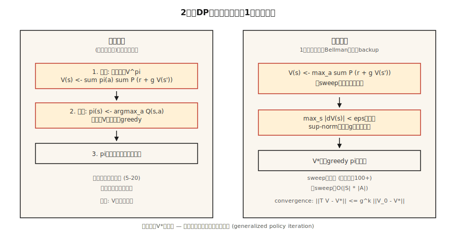

# Dynamic Programming — Policy Iteration と Value Iteration

> 動的計画法は、ずるができる RL です。遷移関数と報酬関数をすでに知っているので、`V` または `π` が動かなくなるまで Bellman 方程式を反復するだけです。これは、すべてのサンプリングベース手法が近づこうとするベンチマークです。

**種別:** 構築
**言語:** Python
**前提条件:** Phase 9 · 01 (MDPs)
**所要時間:** 約75分

## 問題

既知モデルを持つ MDP があるとします。任意の状態行動ペアについて `P(s' | s, a)` と `R(s, a, s')` を問い合わせられます。在庫管理者は需要分布を知っています。ボードゲームは決定的遷移を持ちます。gridworld は4行の Python です。つまり、あなたには *モデル* があります。

Model-free RL（Q-learning、PPO、REINFORCE）は、モデルがない場合、つまり環境からサンプルすることしかできない場合のために発明されました。しかしモデルがあるなら、より速く、より良い手法があります。動的計画法です。Bellman は1957年にそれを設計しました。いまでも正しさの基準を定義しています。人が「この MDP の最適方策」と言うとき、それは DP が返す方策を意味します。

2026年にこれが必要な理由は3つあります。第一に、RL 研究のすべての表形式環境（GridWorld、FrozenLake、CliffWalking）は、ゴールドスタンダード方策を作るために DP で解かれます。第二に、厳密な価値はサンプリング手法の *デバッグ* に使えます。Q-learning の `V*(s_0)` 推定が DP の答えから30%ずれているなら、Q-learning 側にバグがあります。第三に、現代の offline RL と planning 手法（MCTS、AlphaZero の探索、Phase 9 · 10 の model-based RL）はすべて、学習済みまたは与えられたモデル上で Bellman backup を反復します。

## コンセプト



**2つのアルゴリズム。どちらも Bellman 上の固定点反復です。**

**Policy iteration。** 方策が変わらなくなるまで、2つのステップを交互に行います。

1. *Evaluation:* 方策 `π` が与えられたら、`V(s) ← Σ_a π(a|s) Σ_{s',r} P(s',r|s,a) [r + γ V(s')]` を収束まで繰り返し適用して `V^π` を計算します。
2. *Improvement:* `V^π` が与えられたら、`V^π` に関して `π` を greedy にします。`π(s) ← argmax_a Σ_{s',r} P(s',r|s,a) [r + γ V(s')]`。

収束は保証されています。理由は、(a) 各 improvement ステップは `π` を同じままにするか、ある状態の `V^π` を厳密に増やす、(b) 決定的方策の空間は有限だからです。大きな状態空間でも、通常は外側の反復が ~5–20 回で収束します。

**Value iteration。** Evaluation と improvement を1回のスイープにまとめます。Bellman *optimality* 方程式を適用します。

`V(s) ← max_a Σ_{s',r} P(s',r|s,a) [r + γ V(s')]`

`max_s |V_{new}(s) - V(s)| < ε` になるまで繰り返します。最後に greedy 行動を取って方策を抽出します。反復ごとは明らかに速いです。内側の evaluation ループがないためです。ただし通常、収束までの反復回数は多くなります。

**Generalized policy iteration (GPI)。** 統一的な見方です。価値関数と方策は双方向の改善ループに閉じ込められています。両者を相互整合へ向ける任意の手法（async value iteration、modified policy iteration、Q-learning、actor-critic、PPO）は GPI の一例です。

**`γ < 1` が重要な理由。** Bellman operator は sup-norm で `γ`-contraction です。`||T V - T V'||_∞ ≤ γ ||V - V'||_∞`。Contraction は一意な固定点と幾何収束を意味します。`γ < 1` を外すと保証を失います。有限ホライズンか吸収終端状態が必要です。

## 作る

### Step 1: GridWorld MDP モデルを作る

Lesson 01 と同じ 4×4 GridWorld を使います。ここでは確率的なバリエーションを加えます。確率 `0.1` で、エージェントはランダムな垂直方向に滑ります。

```python
SLIP = 0.1

def transitions(state, action):
    if state == TERMINAL:
        return [(state, 0.0, 1.0)]
    outcomes = []
    for direction, prob in action_probs(action):
        outcomes.append((apply_move(state, direction), -1.0, prob))
    return outcomes
```

`transitions(s, a)` は `(s', r, p)` のリストを返します。これがモデル全体です。

### Step 2: policy evaluation

方策 `π(s) = {action: prob}` が与えられたら、`V` が動かなくなるまで Bellman 方程式を反復します。

```python
def policy_evaluation(policy, gamma=0.99, tol=1e-6):
    V = {s: 0.0 for s in states()}
    while True:
        delta = 0.0
        for s in states():
            v = sum(pi_a * sum(p * (r + gamma * V[s_prime])
                              for s_prime, r, p in transitions(s, a))
                   for a, pi_a in policy(s).items())
            delta = max(delta, abs(v - V[s]))
            V[s] = v
        if delta < tol:
            return V
```

### Step 3: policy improvement

`V` に関して greedy な方策で `π` を置き換えます。`π` が変わらなければ戻ります。最適に到達しています。

```python
def policy_improvement(V, gamma=0.99):
    new_policy = {}
    for s in states():
        best_a = max(
            ACTIONS,
            key=lambda a: sum(p * (r + gamma * V[s_prime])
                              for s_prime, r, p in transitions(s, a)),
        )
        new_policy[s] = best_a
    return new_policy
```

### Step 4: つなぎ合わせる

```python
def policy_iteration(gamma=0.99):
    policy = {s: "up" for s in states()}   # arbitrary start
    for _ in range(100):
        V = policy_evaluation(lambda s: {policy[s]: 1.0}, gamma)
        new_policy = policy_improvement(V, gamma)
        if new_policy == policy:
            return V, policy
        policy = new_policy
```

4×4 での典型的な収束は外側の反復 4–6 回です。`V*(0,0) ≈ -6` と、ステップ数を厳密に減らす方策を出力します。

### Step 5: value iteration（1ループ版）

```python
def value_iteration(gamma=0.99, tol=1e-6):
    V = {s: 0.0 for s in states()}
    while True:
        delta = 0.0
        for s in states():
            v = max(sum(p * (r + gamma * V[s_prime])
                       for s_prime, r, p in transitions(s, a))
                   for a in ACTIONS)
            delta = max(delta, abs(v - V[s]))
            V[s] = v
        if delta < tol:
            break
    policy = policy_improvement(V, gamma)
    return V, policy
```

同じ固定点に到達し、コード行数は少なくなります。

## 落とし穴

- **終端処理を忘れる。** 吸収状態に Bellman を適用すると、何も変えない「最良行動」を拾い続けます。`if s == terminal: V[s] = 0` で守ります。
- **Sup-norm と L2 収束。** 平均ではなく `max |V_new - V|` を使います。理論保証は sup-norm に対するものです。
- **In-place と同期更新。** `V[s]` を in-place に更新する（Gauss-Seidel）方が、別の `V_new` dict を使う（Jacobi）より速く収束します。本番コードは in-place を使います。
- **方策の同値タイ。** 2つの行動が同じ Q-value を持つと、`argmax` が反復ごとに異なるタイブレークをし、「policy stable」チェックが振動することがあります。固定順の最初の行動を使うなど、安定したタイブレークを使ってください。
- **状態空間爆発。** DP はスイープごとに `O(|S| · |A|)` です。~10⁷ 状態までは動きます。それを超えると function approximation が必要です（Phase 9 · 05 以降）。

## 使う

2026年の DP は、正しさのベースラインであり、planning の内側ループです。

| ユースケース | 手法 |
|----------|--------|
| 小さな表形式 MDP を厳密に解く | Value iteration（より単純）または policy iteration（外側ステップが少ない） |
| Q-learning / PPO 実装を検証する | toy 環境で DP-optimal V* と比較する |
| Model-based RL (Phase 9 · 10) | 学習済み遷移モデル上の Bellman backup |
| AlphaZero / MuZero の planning | Monte Carlo Tree Search = async Bellman backup |
| Offline RL (CQL, IQL) | Conservative Q-iteration。OOD 行動にペナルティを持つ DP |

誰かが「最適価値関数」と言うたびに、それは「DP の固定点」を意味します。論文で `V*` や `Q*` を見たら、このループを思い浮かべてください。

## Ship It

`outputs/skill-dp-solver.md` として保存します。

```markdown
---
name: dp-solver
description: Solve a small tabular MDP exactly via policy iteration or value iteration. Report convergence behavior.
version: 1.0.0
phase: 9
lesson: 2
tags: [rl, dynamic-programming, bellman]
---

Given an MDP with a known model, output:

1. Choice. Policy iteration vs value iteration. Reason tied to |S|, |A|, γ.
2. Initialization. V_0, starting policy. Convergence sensitivity.
3. Stopping. Sup-norm tolerance ε. Expected number of sweeps.
4. Verification. V*(s_0) computed exactly. Greedy policy extracted.
5. Use. How this baseline will be used to debug/evaluate sampling-based methods.

Refuse to run DP on state spaces > 10⁷. Refuse to claim convergence without a sup-norm check. Flag any γ ≥ 1 on an infinite-horizon task as a guarantee violation.
```

## 演習

1. **Easy.** 4×4 GridWorld で `γ ∈ {0.9, 0.99}` の value iteration を実行してください。`max |ΔV| < 1e-6` になるまで何スイープ必要ですか。`V*` を 4×4 グリッドとして出力してください。
2. **Medium.** *確率的* GridWorld（slip probability `0.1`）で policy iteration と value iteration を比較してください。スイープ数、wall-clock time、最終 `V*(0,0)` を数えます。反復回数ではどちらが速く収束しますか。wall-clock ではどうですか。
3. **Hard.** modified policy iteration を作ってください。evaluation ステップでは、収束までではなく `k` スイープだけ実行します。`k ∈ {1, 2, 5, 10, 50}` について `V*(0,0)` の誤差をプロットしてください。この曲線は evaluation/improvement のトレードオフについて何を示していますか。

## 重要用語

| 用語 | よくある言い方 | 実際の意味 |
|------|-----------------|-----------------------|
| Policy iteration | 「DP アルゴリズム」 | 方策が変わらなくなるまで、評価（`V^π`）と改善（`V^π` に関して greedy な `π`）を交互に行う。 |
| Value iteration | 「より速い DP」 | Bellman optimality backup を1スイープで適用する。`V*` へ幾何収束する。 |
| Bellman operator | 「再帰」 | `(T V)(s) = max_a Σ P (r + γ V(s'))`。sup-norm で `γ`-contraction。 |
| Contraction | 「DP が収束する理由」 | `\|\|T x - T y\|\| ≤ γ \|\|x - y\|\|` を満たす任意の operator は一意な固定点を持つ。 |
| GPI | 「すべては DP」 | Generalized Policy Iteration。`V` と `π` を相互整合へ向ける任意の手法。 |
| Synchronous update | 「Jacobi-style」 | スイープ中ずっと古い `V` を使う。解析しやすいが遅い。 |
| In-place update | 「Gauss-Seidel-style」 | 更新中の `V` をそのまま使う。実務ではより速く収束する。 |

## 参考資料

- [Sutton & Barto (2018). Ch. 4 — Dynamic Programming](http://incompleteideas.net/book/RLbook2020.pdf) — policy iteration と value iteration の標準的な説明です。
- [Bertsekas (2019). Reinforcement Learning and Optimal Control](http://www.athenasc.com/rlbook.html) — contraction mapping 議論の厳密な扱いです。
- [Puterman (2005). Markov Decision Processes](https://onlinelibrary.wiley.com/doi/book/10.1002/9780470316887) — modified policy iteration と収束解析を扱います。
- [Howard (1960). Dynamic Programming and Markov Processes](https://mitpress.mit.edu/9780262582300/dynamic-programming-and-markov-processes/) — policy iteration の原典です。
- [Bertsekas & Tsitsiklis (1996). Neuro-Dynamic Programming](http://www.athenasc.com/ndpbook.html) — DP から approximate-DP / deep RL への橋渡しであり、以降のすべてのレッスンで使われます。
