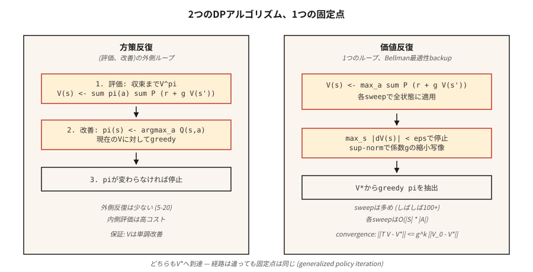

# Dinamik Programlama — Politika Yinelemesi ve Değer Yinelemesi

> Dinamik programlama hileli RL'dir. Geçiş ve ödül işlevlerini zaten biliyorsunuz; `V` veya `π` hareketi durana kadar Bellman denklemini yinelersiniz. Her örnekleme tabanlı yöntemin yaklaşmaya çalıştığı şey benchmark'dur.

**Tür:** Build
**Diller:** Python
**Önkoşullar:** Aşama 9 · 01 (MDP'ler)
**Süre:** ~75 dakika

## Sorun

Bilinen bir modele sahip bir MDP'niz var: herhangi bir durum-eylem çifti için `P(s' | s, a)` ve `R(s, a, s')`'yi sorgulayabilirsiniz. Envanter yöneticisi talep dağılımını bilir. Bir masa oyununun deterministik geçişleri vardır. Bir ızgara dünyası Python'un dört satırından oluşur. Bir *modeliniz* var.

Modelsiz RL (Q-öğrenme, PPO, REINFORCE), bir modelinizin olmadığı durumlar için icat edildi; yalnızca ortamdan örnek alabilirsiniz. Ancak bir taneye sahip olduğunuzda daha hızlı, daha iyi yöntemler vardır: dinamik programlama. Bellman bunları 1957'de tasarladı. Hala doğruluğu tanımlıyorlar: İnsanlar "bu MDP için en uygun politika" derken, DP'nin geri döneceği politikayı kastediyorlar.

2026'da bunlara üç nedenden dolayı ihtiyacınız olacak. İlk olarak, RL araştırmasındaki her tablo ortamı (GridWorld, FrozenLake, CliffWalking), altın standart politikasını üretmek için DP ile çözülür. İkincisi, kesin değerler örnekleme yöntemlerinde *hata ayıklamanıza* olanak tanır: Q-öğrenmenin `V*(s_0)` için tahmini DP yanıtıyla %30 oranında uyuşmuyorsa, Q-öğrenmenizde bir hata var demektir. Üçüncüsü, modern çevrimdışı RL ve planlama yöntemlerinin (MCTS, AlphaZero araması, Aşama 9 · 10'daki model tabanlı RL) tümü öğrenilmiş veya verilen bir model üzerinde Bellman yedeklemesini yineler.

## Konsept



**İki algoritma, her ikisi de Bellman'da sabit nokta yinelemeli.**

**Politika yinelemesi.** Politikanın değişmesi durana kadar iki adımı değiştirir.

1. *Değerlendirme:* verilen `π` politikası, yakınsayana kadar `V(s) ← Σ_a π(a|s) Σ_{s',r} P(s',r|s,a) [r + γ V(s')]`'yi tekrar tekrar uygulayarak `V^π`'yi hesaplayın.
2. *İyileştirme:* `V^π` verildiğinde, `π`'yi açgözlü w.r.t yapın. `V^π`: `π(s) ← argmax_a Σ_{s',r} P(s',r|s,a) [r + γ V(s')]`.

Yakınsama garantilidir çünkü (a) her iyileştirme adımı ya `π`'yı aynı tutar ya da bazı durumlar için `V^π`'yi kesinlikle artırır, (b) deterministik politikaların alanı sınırlıdır. Büyük durum uzaylarında bile genellikle ~5–20 dış yinelemede yakınsar.

**Değer yinelemesi.** Değerlendirme ve iyileştirmeyi tek bir taramaya daraltır. Bellman *optimallik* denklemini uygulayın:

`V(s) ← max_a Σ_{s',r} P(s',r|s,a) [r + γ V(s')]`

`max_s |V_{new}(s) - V(s)| < ε`'a kadar tekrarlayın. Açgözlü eylemi gerçekleştirerek sonunda politikayı çıkarın. Yineleme başına kesinlikle daha hızlıdır (iç değerlendirme döngüsü yoktur), ancak genellikle yakınsama için daha fazla yineleme gerekir.

**Genelleştirilmiş politika yinelemesi (GPI).** Birleştirici çerçeve. Değer işlevi ve politikası iki yönlü bir iyileştirme döngüsüne kilitlenmiştir; Her ikisini de karşılıklı tutarlılığa (eşzamansız değer yinelemesi, değiştirilmiş politika yinelemesi, Q-öğrenme, aktör eleştirmeni, PPO) doğru yönlendiren herhangi bir yöntem GPI'nin bir örneğidir.

**`γ < 1` neden önemlidir.** Bellman operatörü, destek normunda bir `γ` daralmasıdır: `||T V - T V'||_∞ ≤ γ ||V - V'||_∞`. Daralma benzersiz bir sabit nokta ve geometrik yakınsama anlamına gelir. `γ < 1`'u bırakırsanız garantiyi kaybedersiniz; sonlu bir ufka veya emici bir son duruma ihtiyacınız vardır.

```figure
value-iteration-gamma
```

## Build It — Kendin İnşa Et

### Adım 1: GridWorld MDP modelini oluşturun

Ders 01'deki aynı 4x4 GridWorld'ü kullanın. Stokastik bir değişken ekliyoruz: `0.1` olasılığıyla agent rastgele bir dik yöne kayar.

```python
SLIP = 0.1

def transitions(state, action):
    if state == TERMINAL:
        return [(state, 0.0, 1.0)]
    outcomes = []
    for direction, prob in action_probs(action):
        outcomes.append((apply_move(state, direction), -1.0, prob))
    return outcomes
```

`transitions(s, a)`, `(s', r, p)` listesini döndürür. Bu modelin tamamı.

### Adım 2: politika değerlendirmesi

Bir `π(s) = {action: prob}` politikası verildiğinde, Bellman denklemini `V` hareketi durana kadar yineleyin:

```python
def policy_evaluation(policy, gamma=0.99, tol=1e-6):
    V = {s: 0.0 for s in states()}
    while True:
        delta = 0.0
        for s in states():
            v = sum(pi_a * sum(p * (r + gamma * V[s_prime])
                              for s_prime, r, p in transitions(s, a))
                   for a, pi_a in policy(s).items())
            delta = max(delta, abs(v - V[s]))
            V[s] = v
        if delta < tol:
            return V
```

### 3. Adım: politikanın iyileştirilmesi

`π`'ı açgözlü politikayla w.r.t değiştirin. `V`. Eğer `π` değişmediyse geri dönün; optimum noktadayız.

```python
def policy_improvement(V, gamma=0.99):
    new_policy = {}
    for s in states():
        best_a = max(
            ACTIONS,
            key=lambda a: sum(p * (r + gamma * V[s_prime])
                              for s_prime, r, p in transitions(s, a)),
        )
        new_policy[s] = best_a
    return new_policy
```

### Adım 4: bunları birbirine dikin

```python
def policy_iteration(gamma=0.99):
    policy = {s: "up" for s in states()}   # arbitrary start
    for _ in range(100):
        V = policy_evaluation(lambda s: {policy[s]: 1.0}, gamma)
        new_policy = policy_improvement(V, gamma)
        if new_policy == policy:
            return V, policy
        policy = new_policy
```

4×4: 4–6 dış yinelemede tipik yakınsama. `V*(0,0) ≈ -6` çıktısını ve adım sayısını kesin olarak azaltan bir politikayı çıkarır.

### Adım 5: değer yinelemesi (tek döngülü sürüm)

```python
def value_iteration(gamma=0.99, tol=1e-6):
    V = {s: 0.0 for s in states()}
    while True:
        delta = 0.0
        for s in states():
            v = max(sum(p * (r + gamma * V[s_prime])
                       for s_prime, r, p in transitions(s, a))
                   for a in ACTIONS)
            delta = max(delta, abs(v - V[s]))
            V[s] = v
        if delta < tol:
            break
    policy = policy_improvement(V, gamma)
    return V, policy
```

Aynı sabit nokta, daha az kod satırı.

## Tuzaklar

- **Terminalleri kullanmayı unutmak.** Bellman'ı emici bir duruma uygularsanız, yine de hiçbir şeyi değiştirmeyen "en iyi eylemi" seçer. `if s == terminal: V[s] = 0` ile koruyun.
- **Sup-norm ve L2 yakınsaması.** Ortalamayı değil, `max |V_new - V|`'yi kullanın. Teorik garanti üst normdadır.
- **Yerinde ve eşzamanlı güncellemeler.** `V[s]`'nin yerinde güncellenmesi (Gauss-Seidel), ayrı bir `V_new` diktesinden (Jacobi) daha hızlı birleşir. Üretim kodu yerinde kullanılır.
- **Politika bağları.** İki eylemin Q değeri eşitse, `argmax` her yinelemede bağları farklı şekilde bozabilir ve "politika kararlı" kontrolünün salınmasına neden olabilir. Sabit bir eşitlik bozma kullanın (sabit sırayla ilk eylem).
- **Durum uzayı patlaması.** Tarama başına DP `O(|S| · |A|)`'tır. ~10⁷ duruma kadar çalışır. Bunun ötesinde, fonksiyon yaklaşımına ihtiyacınız vardır (Aşama 9 · 05'ten itibaren).

## Use It — Uygula

2026'da DP, planlamacıların doğruluk temeli ve iç döngüsüdür:

| Kullanım örneği | Yöntem |
|----------|--------|
| Küçük tablolu bir MDP'yi tam olarak çözün | Değer yinelemesi (daha basit) veya politika yinelemesi (daha az dış adım) |
| Q-öğrenme / PPO uygulamasını doğrulama | Oyuncak ortamında DP-optimal V* ile karşılaştırın |
| Model tabanlı RL (Aşama 9 · 10) | Öğrenilmiş bir geçiş modelinde Bellman yedeği |
| AlphaZero / MuZero'da Planlama | Monte Carlo Ağacı Arama = eşzamansız Bellman yedeklemesi |
| Çevrimdışı RL (CQL, IQL) | Muhafazakar Q-yineleme — DP'nin OOD eylemlerine ceza vermesi |

Ne zaman birisi "en uygun değer fonksiyonu" dese, "DP sabit noktası"nı kastediyor demektir. Bir makalede `V*` veya `Q*` gördüğünüzde bu döngüyü gözünüzde canlandırın.

## Ship It — Ürüne Dönüştür

`outputs/skill-dp-solver.md` olarak kaydet:

```markdown
---
name: dp-solver
description: Solve a small tabular MDP exactly via policy iteration or value iteration. Report convergence behavior.
version: 1.0.0
phase: 9
lesson: 2
tags: [rl, dynamic-programming, bellman]
---

Given an MDP with a known model, output:

1. Choice. Policy iteration vs value iteration. Reason tied to |S|, |A|, γ.
2. Initialization. V_0, starting policy. Convergence sensitivity.
3. Stopping. Sup-norm tolerance ε. Expected number of sweeps.
4. Verification. V*(s_0) computed exactly. Greedy policy extracted.
5. Use. How this baseline will be used to debug/evaluate sampling-based methods.

Refuse to run DP on state spaces > 10⁷. Refuse to claim convergence without a sup-norm check. Flag any γ ≥ 1 on an infinite-horizon task as a guarantee violation.
```

## Egzersizler

1. **Kolay.** 4×4 GridWorld'de `γ ∈ {0.9, 0.99}` ile değer yinelemesini çalıştırın. `max |ΔV| < 1e-6`'a kadar kaç tarama var? `V*`'yi 4×4 ızgara olarak yazdırın.
2. **Orta.** *Stokastik* GridWorld'de politika yinelemesini değer yinelemesiyle karşılaştırın (kayma olasılığı `0.1`). Sayım: taramalar, duvar saati süresi, son `V*(0,0)`. Yinelemelerde hangisi daha hızlı yakınsar? Duvar saatinde mi?
3. **Zor.** Değiştirilmiş politika yinelemesi oluşturun: değerlendirme adımında, yakınsama yerine yalnızca `k` tarama çalıştırın. `k ∈ {1, 2, 5, 10, 50}` için `V*(0,0)` hatasına karşı `k` grafiğini çizin. Eğri size değerlendirme/iyileştirme dengesi hakkında ne söylüyor?

## Anahtar Terimler

| Terim | İnsanlar ne diyor | Aslında ne anlama geliyor |
|------|-----------------|-----------------------|
| Politika yinelemesi | "DP algoritması" | Politikanın değişmesi durana kadar değerlendirme (`V^π`) ve iyileştirme (açgözlü `π` w.r.t. `V^π`). |
| Değer yinelemesi | "Daha Hızlı DP" | Tek taramada uygulanan Bellman optimallik yedeklemesi; geometrik olarak `V*`'a yakınsar. |
| Bellman operatörü | "Yineleme" | `(T V)(s) = max_a Σ P (r + γ V(s'))`; üst normda bir `γ`-daralması. |
| Kasılma | "DP neden yakınlaşıyor?" | `\|\|T x - T y\|\| ≤ γ \|\|x - y\|\|` ile herhangi bir `T` operatörünün benzersiz bir sabit noktası vardır. |
| GPI | "Her şey DP'dir" | Genelleştirilmiş Politika Yinelemesi: `V` ve `π`'yi karşılıklı tutarlılığa yönlendiren herhangi bir yöntem. |
| Senkronize güncelleme | "Jacobi tarzı" | Tarama boyunca eski `V`'yi kullanın; temiz bir şekilde analiz edilebilir ancak daha yavaştır. |
| Yerinde güncelleme | "Gauss-Seidel tarzı" | Güncellenirken `V`'yi kullanın; pratikte daha hızlı birleşir. |

## Daha Fazla Okuma

- [Sutton ve Barto (2018). Ch. 4 — Dinamik Programlama](http://incompleteideas.net/book/RLbook2020.pdf) — politika yinelemesinin ve değer yinelemesinin kanonik sunumu.
- [Bertsekas (2019). Pekiştirmeli Öğrenme ve Optimal Kontrol](http://www.athenasc.com/rlbook.html) — daralma haritalama argümanlarının titizlikle ele alınması.
- [Puterman (2005). Markov Karar Süreçleri](https://onlinelibrary.wiley.com/doi/book/10.1002/9780470316887) — değiştirilmiş politika yinelemesi ve yakınsama analizi.
-[Howard (1960). Dinamik Programlama ve Markov Süreçleri](https://mitpress.mit.edu/9780262582300/dynamic-programming-and-markov-processes/) — orijinal politika yineleme belgesi.
- [Bertsekas ve Tsitsiklis (1996). Nöro-Dinamik Programlama](http://www.athenasc.com/ndpbook.html) — Sonraki her derste kullanılan DP'den yaklaşık DP'ye / derin RL'ye köprü.
