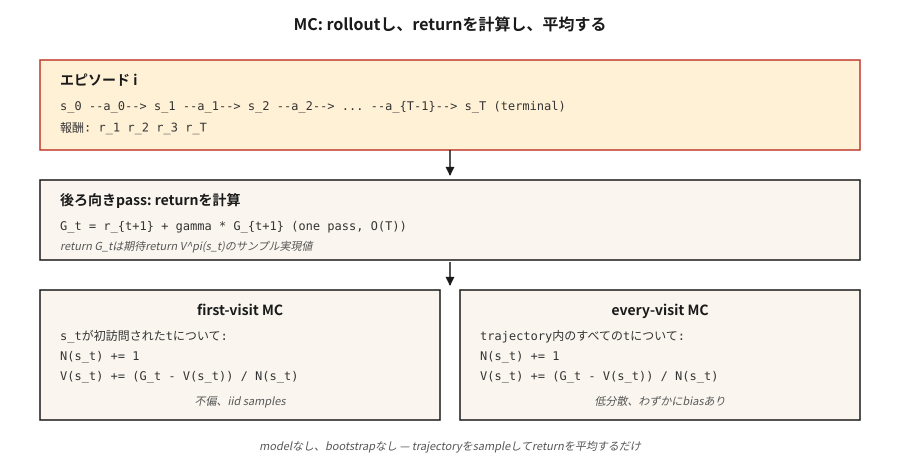

# Monte Carlo Yöntemleri — Bütün Bölümlerden Öğrenmek

> Dinamik programlamanın bir modele ihtiyacı vardır. Monte Carlo'nun bölümlerden başka hiçbir şeye ihtiyacı yok. Politikayı çalıştırın, getirileri izleyin, ortalamasını alın. RL'deki en basit fikir ve aşağı yöndeki her şeyin kilidini açan fikir.

**Tür:** Build
**Diller:** Python
**Önkoşullar:** Aşama 9 · 01 (MDP'ler), Aşama 9 · 02 (Dinamik Programlama)
**Süre:** ~75 dakika

## Sorun

Dinamik programlama zariftir ancak her durum ve eylem için `P(s' | s, a)` sorgulayabileceğinizi varsayar. Gerçek dünyada neredeyse hiçbir şey bu şekilde çalışmaz. Bir robot, eklem torkundan sonra kamera pikselleri üzerindeki dağılımı analitik olarak hesaplayamaz. Bir fiyatlandırma algoritması olası her müşteri tepkisine entegre olamaz. Bir LLM, bir token sonrasındaki olası tüm devamları sıralayamaz.

Yalnızca ortamdan *örnekleme* yeteneğine ihtiyaç duyan bir yönteme ihtiyacınız var. İlkeyi çalıştırın. `s_0, a_0, r_1, s_1, a_1, r_2, …, s_T` yörüngesini alın. Değerleri tahmin etmek için kullanın. Orası Monte Carlo'dur.

DP'den MC'ye geçiş felsefi açıdan önemlidir: *bilinen model + tam yedeklemeden* *örneklenmiş kullanıma sunma + ortalama getiriye* geçiyoruz. Farklılık atlıyor, ancak uygulanabilirlik patlıyor. Bu dersten sonraki her RL algoritması (TD, Q-learning, REINFORCE, PPO, GRPO) özünde bir Monte Carlo tahmincisidir ve bazen önyükleme katmanları da üstte yer alır.

## Konsept



**Temel fikir, tek satırda:** `G^{(i)}(s)`'nin gözlemlendiği `V^π(s) = E_π[G_t | s_t = s] ≈ (1/N) Σ_i G^{(i)}(s)`, `π` politikası kapsamında `s`'ye yapılan ziyaretlerin ardından geri dönüyor.

**İlk ziyaret ve her ziyaret MC karşılaştırması.** `s` durumunu birden çok kez ziyaret eden bir bölüm göz önüne alındığında, ilk ziyaret MC yalnızca ilk ziyaretten gelen dönüşü sayar; her ziyaret MC tüm ziyaretleri sayar. Her ikisi de sınırda tarafsızdır. İlk ziyaretin analizi daha kolaydır (iid örnekleri). Her ziyarette bölüm başına daha fazla veri kullanılır ve genellikle pratikte daha hızlı birleşir.

**Artımlı ortalama.** Tüm getirileri depolamak yerine değişen ortalamayı güncelleyin:

`V_n(s) = V_{n-1}(s) + (1/n) [G_n - V_{n-1}(s)]`

`V_new = V_old + α · (target - V_old)`'yi `α = 1/n` ile yeniden düzenleyin. `1/n`'yi sabit bir adım boyutu `α ∈ (0, 1)` ile değiştirin ve `π`'deki değişiklikleri izleyen, durağan olmayan bir MC tahmincisi elde edin. Bu hareket, MC'den TD'ye ve her modern RL algoritmasına geçişin tamamıdır.

**Keşif artık bir sorun haline geldi.** DP her eyalete numara vererek dokundu. MC yalnızca politika ziyaretlerini görür. Eğer `π` deterministik ise durum uzayının tüm bölgeleri asla örneklenmez ve değer tahminleri sonsuza kadar sıfırda kalır. Tarihsel sırayla üç düzeltme:

1. **Keşfetme başlar.** Her bölüme rastgele bir (s, a) çiftinden başlayın. Garanti kapsamı; pratikte gerçekçi değildir (bir robotu keyfi bir duruma "sıfırlayamazsınız").
2. **ε-açgözlü.** Açgözlü davran w.r.t. mevcut Q, ancak `ε` olasılıkla rastgele bir eylem seç. Tüm durum-eylem çiftleri asimptotik olarak örneklenir.
3. **İlke Dışı MC.** Bir davranış politikası `μ` kapsamında veri toplayın, önem örneklemesi yoluyla hedef politikası `π` hakkında bilgi edinin. Yüksek varyans, ancak DQN gibi tekrar oynatma arabellek yöntemlerine köprü oluşturur.

**Monte Carlo Kontrolü.** Değerlendirin → geliştirin → değerlendirin, tıpkı politika yinelemesinde olduğu gibi, ancak değerlendirme örneklemeye dayalıdır:

1. `π`'yı çalıştırın, bir bölüm alın.
2. Gözlemlenen getirilerden `Q(s, a)`'yi güncelleyin.
3. `π` ε-açgözlü w.r.t olsun. `Q`.
4. Tekrar edin.

Ilıman koşullar altında 1 olasılıkla `Q*` ve `π*`'ye yakınsar (her çift sonsuz sıklıkta ziyaret edilir, `α` Robbins-Monro'yu karşılar).

```figure
epsilon-greedy
```

## Build It — Kendin İnşa Et

### Adım 1: kullanıma sunma → (s, a, r) ​​listesi

```python
def rollout(env, policy, max_steps=200):
    trajectory = []
    s = env.reset()
    for _ in range(max_steps):
        a = policy(s)
        s_next, r, done = env.step(s, a)
        trajectory.append((s, a, r))
        s = s_next
        if done:
            break
    return trajectory
```

Model yok, yalnızca `env.reset()` ve `env.step(s, a)`. Spor salonu ortamıyla aynı arayüz ancak sadeleştirilmiş.

### Adım 2: geri dönüşleri hesaplayın (tersine tarama)

```python
def returns_from(trajectory, gamma):
    returns = []
    G = 0.0
    for _, _, r in reversed(trajectory):
        G = r + gamma * G
        returns.append(G)
    return list(reversed(returns))
```

Tek geçiş, `O(T)`. Geriye doğru yineleme `G_t = r_{t+1} + γ G_{t+1}` yeniden toplamayı önler.

### 3. Adım: ilk ziyaret MC değerlendirmesi

```python
def mc_policy_evaluation(env, policy, episodes, gamma=0.99):
    V = defaultdict(float)
    counts = defaultdict(int)
    for _ in range(episodes):
        trajectory = rollout(env, policy)
        returns = returns_from(trajectory, gamma)
        seen = set()
        for t, ((s, _, _), G) in enumerate(zip(trajectory, returns)):
            if s in seen:
                continue
            seen.add(s)
            counts[s] += 1
            V[s] += (G - V[s]) / counts[s]
    return V
```

İşi üç satır yapar: durumu ilk ziyarette görüldüğü gibi işaretleyin, sayıyı artırın, çalışma ortalamasını güncelleyin.

### Adım 4: ε-açgözlü MC kontrolü (politikaya bağlı)

```python
def mc_control(env, episodes, gamma=0.99, epsilon=0.1):
    Q = defaultdict(lambda: {a: 0.0 for a in ACTIONS})
    counts = defaultdict(lambda: {a: 0 for a in ACTIONS})

    def policy(s):
        if random() < epsilon:
            return choice(ACTIONS)
        return max(Q[s], key=Q[s].get)

    for _ in range(episodes):
        trajectory = rollout(env, policy)
        returns = returns_from(trajectory, gamma)
        seen = set()
        for (s, a, _), G in zip(trajectory, returns):
            if (s, a) in seen:
                continue
            seen.add((s, a))
            counts[s][a] += 1
            Q[s][a] += (G - Q[s][a]) / counts[s][a]
    return Q, policy
```

### Adım 5: DP altın standardıyla karşılaştırın

`V^π` ile ilgili MC tahmininiz, Bölümler → ∞ olarak Ders 02'deki DP sonucuyla uyumlu olmalıdır. Uygulamada: 4×4 GridWorld'deki 50.000 bölüm sizi DP yanıtının `~0.1` yakınına getirir.

## Tuzaklar

- **Sonsuz bölümler.** MC, bölümlerin *sonlandırılmasını* gerektirir. Politikanız sonsuza kadar döngüye girebiliyorsa, `max_steps` sınırı koyun ve sınırı örtülü başarısızlık olarak değerlendirin. Rastgele bir politikaya sahip GridWorld rutin olarak zaman aşımına uğrar; bu normaldir, sadece doğru saydığınızdan emin olun.
- **Varyans.** MC tam getirileri kullanır. Uzun bölümlerde farklılık çok büyüktür; sondaki şanssız bir ödül, `V(s_0)`'ı aynı miktarda değiştirir. TD yöntemleri (Ders 04) önyükleme yaparak bunu ortadan kaldırır.
- **Devlet kapsamı.** Açgözlü MC, yeni bir Q'da yalnızca bir eylemi deneyecek. *Keşfetmelisiniz* (ε-açgözlü, keşfetmeye başlar, UCB).
- **Durağan olmayan politikalar.** `π` değişirse (MC kontrolünde olduğu gibi), eski getiriler farklı bir politikadan gelir. Constant-α MC bunu hallediyor; Örnek ortalamalı MC bunu yapmaz.
- **Politika dışı önem örneklemesi.** `π(a|s)/μ(a|s)` ağırlıkları bir yörünge boyunca çoğalır. Farklılık ufukla birlikte patlar. Karar başına ağırlıklı IS ile sınırlayın veya TD'ye geçin.

## Use It — Uygula

Monte Carlo yöntemlerinin 2026'daki rolü:

| Kullanım örneği | Neden MC |
|----------|--------|
| Kısa ufuk oyunları (blackjack, poker) | Bölümler doğal olarak sona eriyor; İadeler temiz. |
| Günlüğe kaydedilen bir politikanın çevrimdışı değerlendirmesi | Saklanan yörüngeler üzerinden ortalama indirimli getiriler. |
| Monte Carlo Ağacı Arama (AlphaZero) | Ağaçtan MC sunumları kılavuz seçimini bırakır. |
| LLM RL değerlendirmesi | Belirli bir politika için örneklenen tamamlamalar üzerinden ortalama ödülü hesaplayın. |
| PPO'da temel tahmin | Avantaj hedefi `A_t = G_t - V(s_t)` bir MC `G_t` kullanır. |
| RL'yi öğretmek | Gerçekten işe yarayan en basit algoritma — çekirdeği görmek için önyüklemeyi şeritleyin. |

Modern derin RL algoritmaları (PPO, SAC), `n` adımlı dönüşler veya GAE aracılığıyla saf MC (tam dönüşler) ve saf TD (tek adımlı önyükleme) arasında enterpolasyon yapar. Her iki uç nokta da aynı tahmincinin örnekleridir.

## Ship It — Ürüne Dönüştür

`outputs/skill-mc-evaluator.md` olarak kaydet:

```markdown
---
name: mc-evaluator
description: Evaluate a policy via Monte Carlo rollouts and produce a convergence report with DP-comparison if available.
version: 1.0.0
phase: 9
lesson: 3
tags: [rl, monte-carlo, evaluation]
---

Given an environment (episodic, with reset+step API) and a policy, output:

1. Method. First-visit vs every-visit MC. Reason.
2. Episode budget. Target number, variance diagnostic, expected standard error.
3. Exploration plan. ε schedule (if needed) or exploring starts.
4. Gold-standard comparison. DP-optimal V* if tabular; otherwise a bound from a Q-learning / PPO baseline.
5. Termination check. Max-step cap, timeouts, handling of non-terminating trajectories.

Refuse to run MC on non-episodic tasks without a finite horizon cap. Refuse to report V^π estimates from fewer than 100 episodes per state for tabular tasks. Flag any policy with zero-variance actions as an exploration risk.
```

## Egzersizler

1. **Kolay.** 4×4 GridWorld'de tek tip rastgele politikanın ilk ziyaret MC değerlendirmesini uygulayın. 10.000 bölüm çalıştırın. DP yanıtına karşı bölüm sayısının bir fonksiyonu olarak `V(0,0)` grafiğini çizin.
2. **Orta.** `ε ∈ {0.01, 0.1, 0.3}` ile ε-açgözlü MC kontrolünü uygulayın. 20.000 bölümden sonraki ortalama getiriyi karşılaştırın. Eğri neye benziyor? Önyargı-varyans değiş tokuşu nerede yaşıyor?
3. **Zor.** Önem örneklemesi ile *politika dışı* MC'yi uygulayın: tek tip rastgele politika `μ` altında veri toplayın, deterministik optimal politika `π` için `V^π`'yi tahmin edin. Düz IS ile karar başına IS ve ağırlıklı IS'yi karşılaştırın. Hangisinin varyansı en düşüktür?

## Anahtar Terimler

| Terim | İnsanlar ne diyor | Aslında ne anlama geliyor |
|------|-----------------|-----------------------|
| Monte Carlo | "Rastgele örnekleme" | Dağıtımdan iid örneklerinin ortalamasını alarak beklentileri tahmin edin. |
| Dönüş `G_t` | "Gelecekteki ödül" | `t`. adımdan bölüm sonuna kadar indirimli ödüllerin toplamı: `Σ_{k≥0} γ^k r_{t+k+1}`. |
| İlk ziyaret MC | "Her durumu bir kez sayın" | Yalnızca bir bölümdeki ilk ziyaret değer tahminine katkıda bulunur. |
| Her ziyarette MC | "Tüm ziyaretleri kullan" | Her ziyaret katkıda bulunur; biraz önyargılı ancak örnek açısından daha verimli. |
| ε-açgözlü | "Keşif gürültüsü" | `1-ε` probuyla açgözlü eylemi seç; `ε` probuyla rastgele eylem. |
| Önem örneklemesi | "Yanlış dağıtımdan örnekleme düzeltmesi" | `μ` verisinden `V^π` değerini tahmin etmek için getirileri `π(a\|s)/μ(a\|s)` ürün bazında yeniden ağırlıklandırın. |
| Politikaya ilişkin | "Kendi verilerimden öğrenin" | Hedef politikası = davranış politikası. Vanilya MC, PPO, SARSA. |
| Politika dışı | "Başkasının verilerinden öğrenin" | Hedef politikası ≠ davranış politikası. Önemi örneklenmiş MC, Q-öğrenme, DQN. |

## Daha Fazla Okuma

- [Sutton ve Barto (2018). Ch. 5 — Monte Carlo Yöntemleri](http://incompleteideas.net/book/RLbook2020.pdf) — kanonik tedavi.
- [Singh ve Sutton (1996). Uygunluk İzlerini Değiştirerek Pekiştirmeli Öğrenme](https://link.springer.com/article/10.1007/BF00114726) — ilk ziyaret ve her ziyaret analizi.
- [Precup, Sutton, Singh (2000). Politika Dışı Politika Değerlendirmesi için Uygunluk İzlemeleri](http://incompleteideas.net/papers/PSS-00.pdf) — politika dışı MC ve sapma kontrolü.
- [Mahmood ve ark. (2014). Politika Dışı Öğrenme için Ağırlıklandırılmış Önem Örneklemesi](https://arxiv.org/abs/1404.6362) — modern düşük varyanslı IS tahmin edicileri.
-[Tesauro (1995). TD-Gammon, Kendi Kendine Öğreten Bir Tavla Programı](https://dl.acm.org/doi/10.1145/203330.203343) — MC/TD'nin kendi kendine oynamasının insanüstü oyuna yaklaşmasının ilk büyük ölçekli ampirik gösterimi; Bu aşamanın ikinci yarısındaki her dersin kavramsal öncüsü.
