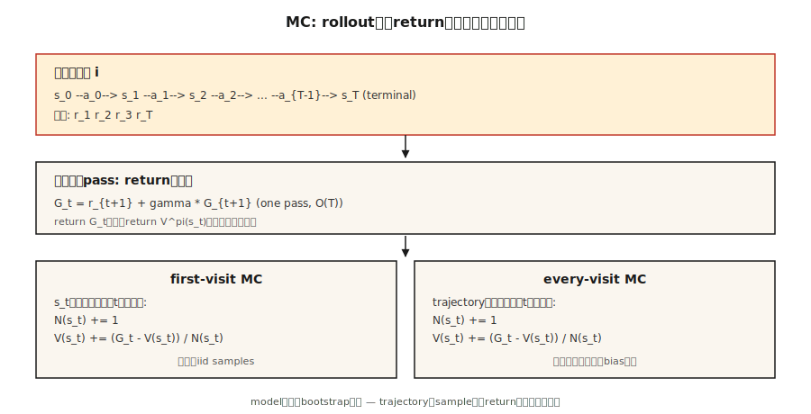

# 蒙特卡洛方法 —— 从完整回合中学习

> 动态规划需要模型。蒙特卡洛什么都不需要，只需要回合。运行策略，观察回报，取平均。强化学习中最简单的想法——也是解锁后续一切的方法。

**类型：** 构建
**语言：** Python
**前置知识：** 第九阶段 · 01（MDPs），第九阶段 · 02（动态规划）
**时间：** ~75 分钟

## 问题

动态规划很优雅，但它假设你可以查询每个状态和动作的 `P(s' | s, a)`。现实世界中几乎没有东西是这样工作的。机器人无法解析计算关节扭矩后相机像素的分布。定价算法无法对所有可能的客户反应进行积分。LLM 无法枚举一个 token 后所有可能的延续。

你需要一种只需要从环境中*采样*能力的方法。运行策略。获得轨迹 `s_0, a_0, r_1, s_1, a_1, r_2, …, s_T`。用它来估计价值。这就是蒙特卡洛。

从 DP 到 MC 的转变在哲学上很重要：我们从*已知模型 + 精确备份*转向*采样 rollout + 平均回报*。方差激增，但适用性爆炸。本课之后的每个 RL 算法——TD、Q-learning、REINFORCE、PPO、GRPO——本质上都是蒙特卡洛估计器，有时加上自举层。

## 概念



**核心思想，一句话：** `V^π(s) = E_π[G_t | s_t = s] ≈ (1/N) Σ_i G^{(i)}(s)`，其中 `G^{(i)}(s)` 是在策略 `π` 下访问 `s` 后观察到的回报。

**首次访问 vs 每次访问 MC。** 给定一个多次访问状态 `s` 的回合，首次访问 MC 只计算第一次访问后的回报；每次访问 MC 计算所有访问。两者在极限下都是无偏的。首次访问更容易分析（iid 样本）。每次访问每回合使用更多数据，实践中通常收敛更快。

**增量均值。** 不存储所有回报，而是更新运行平均值：

`V_n(s) = V_{n-1}(s) + (1/n) [G_n - V_{n-1}(s)]`

重组：`V_new = V_old + α · (target - V_old)`，其中 `α = 1/n`。将 `1/n` 替换为常数步长 `α ∈ (0, 1)`，你就得到了一个跟踪 `π` 变化的非平稳 MC 估计器。这一举措就是从 MC 到 TD 到每个现代 RL 算法的整个跳跃。

**探索现在成了问题。** DP 通过枚举接触每个状态。MC 只看到策略访问的状态。如果 `π` 是确定性的，状态空间的整个区域永远不会被采样，它们的价值估计永远保持为零。三个修复，按历史顺序：

1. **探索性启动。** 从随机的 (s, a) 对开始每个回合。保证覆盖；实践中不现实（你无法将机器人"重置"到任意状态）。
2. **ε-贪婪。** 对当前 Q 贪婪行动，但以概率 `ε` 随机选择一个动作。所有状态-动作对渐近地被采样。
3. **离线策略 MC。** 在行为策略 `μ` 下收集数据，通过重要性采样学习目标策略 `π` 的信息。方差高，但它是通向 DQN 等回放缓冲方法的桥梁。

**蒙特卡洛控制。** 评估 → 改进 → 评估，就像策略迭代一样，但评估是基于采样的：

1. 运行 `π`，获得一个回合。
2. 从观察到的回报更新 `Q(s, a)`。
3. 让 `π` 对 `Q` 贪婪。
4. 重复。

在温和条件下（每对访问无限次，`α` 满足 Robbins-Monro），以概率 1 收敛到 `Q*` 和 `π*`。

## 构建

### 第一步：rollout → (s, a, r) 列表

```python
def rollout(env, policy, max_steps=200):
    trajectory = []
    s = env.reset()
    for _ in range(max_steps):
        a = policy(s)
        s_next, r, done = env.step(s, a)
        trajectory.append((s, a, r))
        s = s_next
        if done:
            break
    return trajectory
```

没有模型，只有 `env.reset()` 和 `env.step(s, a)`。与 gym 环境相同的接口，但简化版。

### 第二步：计算回报（反向扫描）

```python
def returns_from(trajectory, gamma):
    returns = []
    G = 0.0
    for _, _, r in reversed(trajectory):
        G = r + gamma * G
        returns.append(G)
    return list(reversed(returns))
```

一次遍历，`O(T)`。反向递推 `G_t = r_{t+1} + γ G_{t+1}` 避免了重新求和。

### 第三步：首次访问 MC 评估

```python
def mc_policy_evaluation(env, policy, episodes, gamma=0.99):
    V = defaultdict(float)
    counts = defaultdict(int)
    for _ in range(episodes):
        trajectory = rollout(env, policy)
        returns = returns_from(trajectory, gamma)
        seen = set()
        for t, ((s, _, _), G) in enumerate(zip(trajectory, returns)):
            if s in seen:
                continue
            seen.add(s)
            counts[s] += 1
            V[s] += (G - V[s]) / counts[s]
    return V
```

三行做实际工作：首次访问时标记状态，增加计数，更新运行均值。

### 第四步：ε-贪婪 MC 控制（在线策略）

```python
def mc_control(env, episodes, gamma=0.99, epsilon=0.1):
    Q = defaultdict(lambda: {a: 0.0 for a in ACTIONS})
    counts = defaultdict(lambda: {a: 0 for a in ACTIONS})

    def policy(s):
        if random() < epsilon:
            return choice(ACTIONS)
        return max(Q[s], key=Q[s].get)

    for _ in range(episodes):
        trajectory = rollout(env, policy)
        returns = returns_from(trajectory, gamma)
        seen = set()
        for (s, a, _), G in zip(trajectory, returns):
            if (s, a) in seen:
                continue
            seen.add((s, a))
            counts[s][a] += 1
            Q[s][a] += (G - Q[s][a]) / counts[s][a]
    return Q, policy
```

### 第五步：与 DP 黄金标准比较

你的 `V^π` 的 MC 估计应该在回合数 → ∞ 时与第 02 课的 DP 结果一致。实践中：4×4 GridWorld 上 50,000 个回合让你在大约 `~0.1` 的 DP 答案范围内。

## 陷阱

- **无限回合。** MC 要求回合*终止*。如果你的策略可能永远循环，设置 `max_steps` 上限并将上限视为隐式失败。GridWorld 上的随机策略经常超时——这是正常的，只要确保你正确计数。
- **方差。** MC 使用完整回报。在长回合上，方差很大——末尾一个不幸的奖励会以相同幅度改变 `V(s_0)`。TD 方法（第 04 课）通过自举来削减这一点。
- **状态覆盖。** 在新鲜 Q 上平局贪婪的 MC 只会尝试一个动作。你*必须*探索（ε-贪婪、探索性启动、UCB）。
- **非平稳策略。** 如果 `π` 变化（如在 MC 控制中），旧的回报来自不同的策略。常数-α MC 处理这一点；样本平均 MC 不处理。
- **离线策略重要性采样。** 权重 `π(a|s)/μ(a|s)` 在轨迹上乘积。方差随视界爆炸。用每决策加权 IS 限制或切换到 TD。

## 应用

蒙特卡洛方法在 2026 年的角色：

| 用例 | 为什么用 MC |
|----------|--------|
| 短视界游戏（二十一点、扑克） | 回合自然终止；回报干净。 |
| 已记录策略的离线评估 | 对存储的轨迹平均折扣回报。 |
| 蒙特卡洛树搜索（AlphaZero） | 从树叶的 MC rollout 指导选择。 |
| LLM RL 评估 | 对给定策略的采样完成计算平均奖励。 |
| PPO 中的基线估计 | 优势目标 `A_t = G_t - V(s_t)` 使用 MC `G_t`。 |
| 教授 RL | 实际上有效的最简单算法——剥离自举以看到核心。 |

现代深度 RL 算法（PPO、SAC）通过 `n` 步回报或 GAE 在纯 MC（完整回报）和纯 TD（单步自举）之间插值。两个端点都是同一估计器的实例。

## 交付

保存为 `outputs/skill-mc-evaluator.md`：

```markdown
---
name: mc-evaluator
description: 通过蒙特卡洛 rollout 评估策略，并在可能时生成与 DP 比较的收敛报告。
version: 1.0.0
phase: 9
lesson: 3
tags: [rl, monte-carlo, evaluation]
---

给定一个环境（回合制，带 reset+step API）和一个策略，输出：

1. 方法。首次访问 vs 每次访问 MC。理由。
2. 回合预算。目标数量、方差诊断、期望标准误。
3. 探索计划。ε 时间表（如需要）或探索性启动。
4. 黄金标准比较。表格任务的 DP 最优 V*；否则来自 Q-learning / PPO 基线的界限。
5. 终止检查。最大步长上限、超时、非终止轨迹的处理。

拒绝在没有有限视界上限的非回合制任务上运行 MC。拒绝表格任务每状态少于 100 个回合的 V^π 估计报告。标记任何动作零方差的策略为探索风险。
```

## 练习

1. **简单。** 在 4×4 GridWorld 上实现均匀随机策略的首次访问 MC 评估。运行 10,000 个回合。将 `V(0,0)` 作为回合数的函数绘制，与 DP 答案对比。
2. **中等。** 实现 ε-贪婪 MC 控制，`ε ∈ {0.01, 0.1, 0.3}`。比较 20,000 个回合后的平均回报。曲线是什么样的？偏差-方差权衡在哪里？
3. **困难。** 用重要性采样实现*离线策略* MC：在均匀随机策略 `μ` 下收集数据，估计确定性最优策略 `π` 的 `V^π`。比较普通 IS vs 每决策 IS vs 加权 IS。哪个方差最低？

## 关键术语

| 术语 | 人们怎么说 | 实际含义 |
|------|-----------------|-----------------------|
| 蒙特卡洛 | "随机采样" | 通过对分布的 iid 样本取平均来估计期望。 |
| 回报 `G_t` | "未来奖励" | 从步骤 `t` 到回合结束的折扣奖励和：`Σ_{k≥0} γ^k r_{t+k+1}`。 |
| 首次访问 MC | "每个状态只计数一次" | 只有回合中的第一次访问对价值估计有贡献。 |
| 每次访问 MC | "使用所有访问" | 每次访问都有贡献；略有偏差但样本效率更高。 |
| ε-贪婪 | "探索噪声" | 以概率 `1-ε` 选择贪婪动作；以概率 `ε` 选择随机动作。 |
| 重要性采样 | "纠正从错误分布采样" | 通过 `π(a|s)/μ(a|s)` 乘积重新加权回报，以从 `μ` 数据估计 `V^π`。 |
| 在线策略 | "从我自己的数据学习" | 目标策略 = 行为策略。普通 MC、PPO、SARSA。 |
| 离线策略 | "从别人的数据学习" | 目标策略 ≠ 行为策略。重要性采样 MC、Q-learning、DQN。 |

## 延伸阅读

- [Sutton & Barto (2018). Ch. 5 — Monte Carlo Methods](http://incompleteideas.net/book/RLbook2020.pdf) — 经典处理。
- [Singh & Sutton (1996). Reinforcement Learning with Replacing Eligibility Traces](https://link.springer.com/article/10.1007/BF00114726) — 首次访问 vs 每次访问分析。
- [Precup, Sutton, Singh (2000). Eligibility Traces for Off-Policy Policy Evaluation](http://incompleteideas.net/papers/PSS-00.pdf) — 离线策略 MC 和方差控制。
- [Mahmood et al. (2014). Weighted Importance Sampling for Off-Policy Learning](https://arxiv.org/abs/1404.6362) — 现代低方差 IS 估计器。
- [Tesauro (1995). TD-Gammon, A Self-Teaching Backgammon Program](https://dl.acm.org/doi/10.1145/203330.203343) — MC/TD 自我对弈收敛到超人水平的第一个大规模实证演示；本阶段后半部分每个课程的概念先驱。
