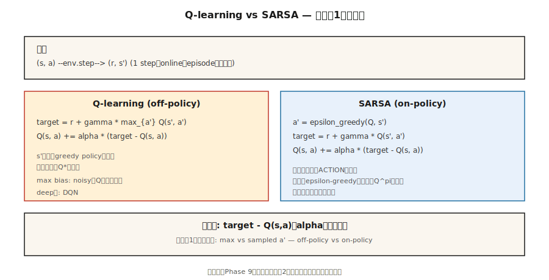

# Temporal Difference — Q-Learning と SARSA

> Monte Carlo はエピソード終了まで待ちます。TD は次の価値推定を bootstrap して、各ステップの後に更新します。Q-learning は off-policy で楽観的、SARSA は on-policy で慎重です。どちらもコードでは1行です。どちらも、このフェーズのすべての deep-RL 手法を支えています。

**種別:** 構築
**言語:** Python
**前提条件:** Phase 9 · 01 (MDPs), Phase 9 · 02 (Dynamic Programming), Phase 9 · 03 (Monte Carlo)
**所要時間:** 約75分

## 問題

Monte Carlo は動きますが、2つの高価な要求があります。終端するエピソードが必要で、最終リターンが入るまで更新できません。エピソードが1,000ステップなら、MC は何かを更新するまで1,000ステップ待ちます。高分散、低バイアスで、実務では遅いです。

動的計画法は反対の性質を持ちます。分散ゼロの bootstrapped backup ですが、既知モデルが必要です。

Temporal difference (TD) learning はその中間を取ります。単一の遷移 `(s, a, r, s')` から、1ステップ target `r + γ V(s')` を作り、`V(s)` をそこへ少し近づけます。モデル不要。完全なエピソード不要。RHS で近似 `V` を使うためバイアスはありますが、MC より分散が劇的に低く、ステップ1からオンライン更新できます。

これは現代 RL、つまり DQN、A2C、PPO、SAC のすべてが回る軸です。Phase 9 の残りは、このレッスンで書く1ステップ TD 更新の上に function approximation と技巧を重ねたものです。

## コンセプト



**V に対する TD(0) 更新:**

`V(s) ← V(s) + α [r + γ V(s') - V(s)]`

角括弧内の量が TD error `δ = r + γ V(s') - V(s)` です。MC における `G_t - V(s_t)` のオンライン版です。収束には Robbins-Monro を満たす `α`（`Σ α = ∞`, `Σ α² < ∞`）と、すべての状態が無限回訪問されることが必要です。

**Q-learning。** 制御のための off-policy TD 手法です。

`Q(s, a) ← Q(s, a) + α [r + γ max_{a'} Q(s', a') - Q(s, a)]`

`max` は、エージェントが実際にどの行動を取るかに関係なく、`s'` 以降は *greedy* 方策に従うと仮定します。この分離により、エージェントが ε-greedy で探索していても、Q-learning は `Q*` を学習できます。Mnih et al. (2015) はこれを Atari 上の deep Q-learning に変換しました（Lesson 05）。

**SARSA。** On-policy TD 手法です。

`Q(s, a) ← Q(s, a) + α [r + γ Q(s', a') - Q(s, a)]`

名前はタプル `(s, a, r, s', a')` から来ています。SARSA は greedy な `argmax` ではなく、エージェントが次に *実際に* 取る行動 `a'` を使います。実行中の ε-greedy `π` が何であれ、その `Q^π` に収束します。極限で `ε → 0` なら `Q*` になります。

**Cliff-walking の違い。** 古典的な cliff-walking タスク（崖から落ちる = 報酬 -100）では、Q-learning は崖沿いの最適経路を学びますが、探索中にはときどきペナルティを受けます。SARSA は、探索ノイズを Q-value に織り込むため、崖から1ステップ離れた安全な経路を学びます。訓練を進めると、`ε → 0` でどちらも最適に到達します。実務ではこれが重要です。デプロイ時にも実際に探索が起きるなら、SARSA の振る舞いはより保守的です。

**Expected SARSA。** `Q(s', a')` を `π` のもとでの期待値に置き換えます。

`Q(s, a) ← Q(s, a) + α [r + γ Σ_{a'} π(a'|s') Q(s', a') - Q(s, a)]`

SARSA より低分散（`a'` をサンプルしない）で、同じ on-policy target です。現代的な教科書では、しばしばデフォルトです。

**n-step TD と TD(λ)。** Bootstrap する前に `n` ステップ待つことで、TD(0) と MC の間を補間します。`n=1` が TD、`n=∞` が MC です。TD(λ) は幾何重み `(1-λ)λ^{n-1}` ですべての `n` を平均します。多くの deep-RL は `n` を3から20の間にします。

## 作る

### Step 1: ε-greedy 方策での SARSA

```python
def sarsa(env, episodes, alpha=0.1, gamma=0.99, epsilon=0.1):
    Q = defaultdict(lambda: {a: 0.0 for a in ACTIONS})

    def choose(s):
        if random() < epsilon:
            return choice(ACTIONS)
        return max(Q[s], key=Q[s].get)

    for _ in range(episodes):
        s = env.reset()
        a = choose(s)
        while True:
            s_next, r, done = env.step(s, a)
            a_next = choose(s_next) if not done else None
            target = r + (gamma * Q[s_next][a_next] if not done else 0.0)
            Q[s][a] += alpha * (target - Q[s][a])
            if done:
                break
            s, a = s_next, a_next
    return Q
```

8行です。Q-learning との *唯一の* 違いは target 行です。

### Step 2: Q-learning

```python
def q_learning(env, episodes, alpha=0.1, gamma=0.99, epsilon=0.1):
    Q = defaultdict(lambda: {a: 0.0 for a in ACTIONS})
    for _ in range(episodes):
        s = env.reset()
        while True:
            a = choose(s, Q, epsilon)
            s_next, r, done = env.step(s, a)
            target = r + (gamma * max(Q[s_next].values()) if not done else 0.0)
            Q[s][a] += alpha * (target - Q[s][a])
            if done:
                break
            s = s_next
    return Q
```

`max` が target と behavior を切り離します。この1つの記号が on-policy と off-policy の違いです。

### Step 3: 学習曲線

100エピソードごとの平均リターンを追跡します。単純な決定的 GridWorld では Q-learning の方が速く収束します。cliff-walking では SARSA の方が保守的です。`code/main.py` の 4×4 GridWorld では、`α=0.1, ε=0.1` でどちらも ~2,000 エピソード後にはほぼ最適になります。

### Step 4: DP の真値と比較する

Value iteration（Lesson 02）を実行して `Q*` を得ます。`max_{s,a} |Q_learned(s,a) - Q*(s,a)|` を確認します。健全な表形式 TD エージェントなら、4×4 GridWorld で10,000エピソード後に `~0.5` 以内へ入ります。

## 落とし穴

- **初期 Q 値は重要。** 楽観的初期化（負報酬タスクで `Q = 0`）は探索を促します。悲観的初期化は greedy 方策を永遠に閉じ込めることがあります。
- **α schedule。** 定数 `α` は非定常問題では有効です。減衰 `α_n = 1/n` は理論上は収束しますが、実務では遅すぎます。`α` を `[0.05, 0.3]` に固定し、学習曲線を監視してください。
- **ε schedule。** 高く始め（`ε=1.0`）、`ε=0.05` まで減衰します。"GLIE"（greedy in the limit with infinite exploration）が収束条件です。
- **Q-learning の max bias。** `Q` にノイズがあると、`max` operator は上向きにバイアスします。過大推定につながります。Hasselt の Double Q-learning（Lesson 05 の DDQN で使用）が、2つの Q table でこれを修正します。
- **非終端エピソード。** TD は終端なしでも学習できますが、ステップ上限を設けるか、上限時の bootstrap を正しく扱う必要があります。標準は、上限を非終端として扱い、bootstrapping を続けることです。
- **状態のハッシュ化。** 状態が tuple/tensor の場合は、hashable な key を使います（list ではなく tuple、生の float ではなく丸めた float の tuple）。

## 使う

2026年の TD の全体像です。

| タスク | 手法 | 理由 |
|------|--------|--------|
| 小さな表形式環境 | Q-learning | 最適方策を直接学ぶ。 |
| On-policy で安全重視 | SARSA / Expected SARSA | 探索中に保守的。 |
| 高次元状態 | DQN (Phase 9 · 05) | Replay と target net を持つ neural-net Q-function。 |
| 連続行動 | SAC / TD3 (Phase 9 · 07) | Q-network 上の TD update。policy net が行動を出す。 |
| LLM RL（reward-model-based） | PPO / GRPO (Phase 9 · 08, 12) | GAE による TD-style advantage を持つ actor-critic。 |
| Offline RL | CQL / IQL (Phase 9 · 08) | conservative regularization 付き Q-learning。 |

2026年の論文で読む「RL」の90%は、Q-learning または SARSA の何らかの発展形です。さらに深く読む前に、表形式更新を手になじませてください。

## Ship It

`outputs/skill-td-agent.md` として保存します。

```markdown
---
name: td-agent
description: Pick between Q-learning, SARSA, Expected SARSA for a tabular or small-feature RL task.
version: 1.0.0
phase: 9
lesson: 4
tags: [rl, td-learning, q-learning, sarsa]
---

Given a tabular or small-feature environment, output:

1. Algorithm. Q-learning / SARSA / Expected SARSA / n-step variant. One-sentence reason tied to on-policy vs off-policy and variance.
2. Hyperparameters. α, γ, ε, decay schedule.
3. Initialization. Q_0 value (optimistic vs zero) and justification.
4. Convergence diagnostic. Target learning curve, `|Q - Q*|` check if DP is possible.
5. Deployment caveat. How will exploration behave at inference? Is SARSA's conservatism needed?

Refuse to apply tabular TD to state spaces > 10⁶. Refuse to ship a Q-learning agent without a max-bias caveat. Flag any agent trained with ε held at 1.0 throughout (no exploitation phase).
```

## 演習

1. **Easy.** 4×4 GridWorld で Q-learning と SARSA を実装してください。2,000エピソードについて学習曲線（100エピソードごとの平均リターン）をプロットします。どちらが速く収束しますか。
2. **Medium.** cliff-walking 環境を作ってください（4×12、最後の行が崖、報酬 -100 で start にリセット）。Q-learning と SARSA の最終方策を比較します。それぞれが取る経路をスクリーンショットしてください。どちらが崖に近いですか。
3. **Hard.** Double Q-learning を実装してください。ノイズ付き報酬 GridWorld（ステップごとの報酬に Gaussian noise σ=5 を追加）で、Q-learning が `V*(0,0)` を意味のある量だけ過大推定し、Double Q-learning はそうならないことを示してください。

## 重要用語

| 用語 | よくある言い方 | 実際の意味 |
|------|-----------------|-----------------------|
| TD error | 「更新信号」 | `δ = r + γ V(s') - V(s)`。bootstrapped residual。 |
| TD(0) | 「1ステップ TD」 | 次状態の推定だけを使い、各遷移後に更新する。 |
| Q-learning | 「Off-policy RL 101」 | 次状態行動に対して `max` を取る TD 更新。behavior policy に関係なく `Q*` を学ぶ。 |
| SARSA | 「On-policy Q-learning」 | 実際の次行動を使う TD 更新。現在の ε-greedy π に対する `Q^π` を学ぶ。 |
| Expected SARSA | 「低分散な SARSA」 | サンプルされた `a'` を、π のもとでの期待値に置き換える。 |
| GLIE | 「正しい探索スケジュール」 | Greedy in the Limit with Infinite Exploration。Q-learning の収束に必要。 |
| Bootstrapping | 「target の中で現在の推定を使うこと」 | TD と MC を分けるもの。バイアスの源だが、分散を大幅に下げる。 |
| Maximization bias | 「Q-learning は過大推定する」 | ノイズのある推定に対する `max` は上向きにバイアスする。Double Q-learning で修正される。 |

## 参考資料

- [Watkins & Dayan (1992). Q-learning](https://link.springer.com/article/10.1007/BF00992698) — 原論文と収束証明です。
- [Sutton & Barto (2018). Ch. 6 — Temporal-Difference Learning](http://incompleteideas.net/book/RLbook2020.pdf) — TD(0)、SARSA、Q-learning、Expected SARSA。
- [Hasselt (2010). Double Q-learning](https://papers.nips.cc/paper_files/paper/2010/hash/091d584fced301b442654dd8c23b3fc9-Abstract.html) — maximization bias の修正です。
- [Seijen, Hasselt, Whiteson, Wiering (2009). A Theoretical and Empirical Analysis of Expected SARSA](https://ieeexplore.ieee.org/document/4927542) — expected SARSA の動機づけです。
- [Rummery & Niranjan (1994). On-line Q-learning using connectionist systems](https://www.researchgate.net/publication/2500611_On-Line_Q-Learning_Using_Connectionist_Systems) — SARSA という名前を生んだ論文です（当時は "modified connectionist Q-learning" と呼ばれていました）。
- [Sutton & Barto (2018). Ch. 7 — n-step Bootstrapping](http://incompleteideas.net/book/RLbook2020.pdf) — TD(0) を TD(n) へ一般化し、Q-learning から eligibility traces、さらに後の PPO の GAE へ続く道筋を示します。
