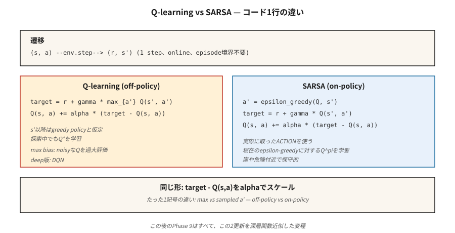

# 时序差分——Q-Learning 与 SARSA

> 蒙特卡洛等待回合结束。TD 在每一步后通过自助下一个价值估计来更新。Q-learning 是离策略且乐观的；SARSA 是同策略且谨慎的。两者都只有一行核心代码。两者都支撑着本阶段所有的深度 RL 方法。

**类型：** 构建
**语言：** Python
**前置要求：** 阶段 9 · 01（MDP）、阶段 9 · 02（动态规划）、阶段 9 · 03（蒙特卡洛）
**时间：** ~75 分钟

## 问题

蒙特卡洛能工作，但它有两个昂贵的要求。它需要回合能够终止，而且只有在最终回报产生后才更新。如果你的回合有 1,000 步，MC 要等 1,000 步才能更新任何东西。它是高方差、低偏差的，在实践中很慢。

动态规划有相反的特点——零方差的自助 backup——但需要已知模型。

时序差分学习（TD）在两者之间折中。从一个转移 (s, a, r, s') 中，构造一步目标 
 + γ V(s') 并将 V(s) 向它推进。不需要模型。不需要完整回合。由于在右侧使用了近似的 V 而有偏差，但方差远低于 MC，且从第一步开始即可在线更新。

这是所有现代 RL——DQN、A2C、PPO、SAC——的支点。阶段 9 的剩余部分是在你将在本课中编写的一步 TD 更新之上叠加的函数近似和技巧。

## 概念

**V 的 TD(0) 更新：**

V(s) ← V(s) + α [r + γ V(s') - V(s)]

括号中的量是 TD 误差 δ = r + γ V(s') - V(s)。它是 MC 中 G_t - V(s_t) 的在线版本。收敛需要 α 满足 Robbins-Monro 条件（Σ α = ∞，Σ α² < ∞）且所有状态被无限频繁访问。

**Q-learning。** 一种离策略 TD 控制方法：

Q(s, a) ← Q(s, a) + α [r + γ max_{a'} Q(s', a') - Q(s, a)]

max 假设从 s' 开始将遵循**贪心**策略，无论智能体实际采取什么动作。这种解耦使 Q-learning 在智能体通过 ε-贪心探索的同时学习 Q*。Mnih 等人（2015）将其转化为 Atari 上的深度 Q-learning（课程 05）。

**SARSA。** 一种同策略 TD 方法：

Q(s, a) ← Q(s, a) + α [r + γ Q(s', a') - Q(s, a)]

名称来自元组 (s, a, r, s', a')。SARSA 使用智能体**实际**采取的下一步动作 '，而不是贪心的 rgmax。对于正在运行的任何 ε-贪心 π，收敛到 Q^π，在极限 ε → 0 下变为 Q*。

**悬崖行走的差异。** 在经典的悬崖行走任务（掉下悬崖 = 奖励 -100）中，Q-learning 学习沿悬崖边缘的最优路径，但在探索期间偶尔会受到惩罚。SARSA 学习离悬崖一步之遥的更安全路径，因为它将探索噪声纳入了 Q 值的计算。经过训练，两者在 ε → 0 时都达到最优。在实践中这很重要：当部署时实际上仍在探索时，SARSA 的行为更保守。

**期望 SARSA。** 用 π 下的期望值替换 Q(s', a')：

Q(s, a) ← Q(s, a) + α [r + γ Σ_{a'} π(a'|s') Q(s', a') - Q(s, a)]

方差低于 SARSA（不需要对 ' 采样），相同的同策略目标。在现代教材中通常是默认选择。

**n-步 TD 和 TD(λ)。** 等待 
 步后再进行自助，在 TD(0) 和 MC 之间插值。
=1 是 TD，
=∞ 是 MC。TD(λ) 以几何权重 (1-λ)λ^{n-1} 对所有 
 取平均。大多数深度 RL 使用 3 到 20 之间的 
。

`igure
qlearning-gridworld
`

## 动手构建

### 步骤 1：ε-贪心策略上的 SARSA

`python
def sarsa(env, episodes, alpha=0.1, gamma=0.99, epsilon=0.1):
    Q = defaultdict(lambda: {a: 0.0 for a in ACTIONS})

    def choose(s):
        if random() < epsilon:
            return choice(ACTIONS)
        return max(Q[s], key=Q[s].get)

    for _ in range(episodes):
        s = env.reset()
        a = choose(s)
        while True:
            s_next, r, done = env.step(s, a)
            a_next = choose(s_next) if not done else None
            target = r + (gamma * Q[s_next][a_next] if not done else 0.0)
            Q[s][a] += alpha * (target - Q[s][a])
            if done:
                break
            s, a = s_next, a_next
    return Q
`

八行代码。与 Q-learning 的**唯一**区别是目标行。

### 步骤 2：Q-learning

`python
def q_learning(env, episodes, alpha=0.1, gamma=0.99, epsilon=0.1):
    Q = defaultdict(lambda: {a: 0.0 for a in ACTIONS})
    for _ in range(episodes):
        s = env.reset()
        while True:
            a = choose(s, Q, epsilon)
            s_next, r, done = env.step(s, a)
            target = r + (gamma * max(Q[s_next].values()) if not done else 0.0)
            Q[s][a] += alpha * (target - Q[s][a])
            if done:
                break
            s = s_next
    return Q
`

max 将目标与行为解耦。这一个符号就是同策略和离策略之间的区别。

### 步骤 3：学习曲线

每 100 个回合跟踪平均回报。在简单的确定性 GridWorld 上 Q-learning 收敛更快；在悬崖行走上 SARSA 更保守。在 code/main.py 的 4×4 GridWorld 上，两者在使用 α=0.1, ε=0.1 时约 2,000 个回合后接近最优。

### 步骤 4：与 DP 真实值比较

运行值迭代（课程 02）以获得 Q*。检查 max_{s,a} |Q_learned(s,a) - Q*(s,a)|。一个健康的表格型 TD 智能体在 4×4 GridWorld 上 10,000 个回合后能达到 ~0.5 以内。

## 常见陷阱

- **初始 Q 值很重要。** 乐观初始化（对负奖励任务设 Q = 0）鼓励探索。悲观初始化可能永远困住贪心策略。
- **α 调度。** 常数 α 对非平稳问题没问题。衰减的 α_n = 1/n 理论上有收敛保证，但实践中太慢——将 α 固定在 [0.05, 0.3] 并监控学习曲线。
- **ε 调度。** 从高值开始（ε=1.0），衰减到 ε=0.05。"GLIE"（无限探索下的极限贪心）是收敛条件。
- **Q-learning 的最大化偏差。** 当 Q 有噪声时，max 算子存在向上偏差。导致过高估计——Hasselt 的双 Q-learning（课程 05 中 DDQN 使用的）用两个 Q 表解决了这个问题。
- **未终止的回合。** TD 可以在没有终止的情况下学习，但你需要限制步数或在限制点正确处理自助。标准做法：将限制视为非终止，继续自助。
- **状态哈希。** 如果状态是元组/张量，使用可哈希的键（元组而非列表；四舍五入的浮点数元组而非原始值）。

## 使用场景

2026 年的 TD 格局：

| 任务 | 方法 | 原因 |
|------|--------|--------|
| 小型表格型环境 | Q-learning | 直接学习最优策略。 |
| 同策略安全关键 | SARSA / 期望 SARSA | 探索期间保守。 |
| 高维状态 | DQN（阶段 9 · 05） | 带回放和目标网络的神经网络 Q 函数。 |
| 连续动作 | SAC / TD3（阶段 9 · 07） | Q 网络上的 TD 更新；策略网络输出动作。 |
| LLM RL（基于奖励模型） | PPO / GRPO（阶段 9 · 08, 12） | 通过 GAE 使用 TD 风格优势的 Actor-critic。 |
| 离线 RL | CQL / IQL（阶段 9 · 08） | 带保守正则化的 Q-learning。 |

你在 2026 年论文中读到的百分之九十的"RL"都是 Q-learning 或 SARSA 的某种扩展。在深入学习之前，先把表格型更新铭记于心。

## 交付物

保存为 outputs/skill-td-agent.md：

`markdown
---
name: td-agent
description: 为表格型或小特征 RL 任务选择 Q-learning、SARSA 或期望 SARSA。
version: 1.0.0
phase: 9
lesson: 4
tags: [rl, td-learning, q-learning, sarsa]
---

给定一个表格型或小特征环境，输出：

1. 算法。Q-learning / SARSA / 期望 SARSA / n-步变体。一句话理由，与同策略 vs 离策略和方差相关。
2. 超参数。α、γ、ε、衰减调度。
3. 初始化。Q_0 值（乐观 vs 零）及理由。
4. 收敛诊断。目标学习曲线，如果 DP 可行则检查 |Q - Q*|。
5. 部署注意事项。推理时探索行为如何？是否需要 SARSA 的保守性？

拒绝将表格型 TD 应用于状态空间 > 10⁶。拒绝交付没有最大化偏差说明的 Q-learning 智能体。标记任何训练全程 ε 保持在 1.0 的智能体（没有利用阶段）。
`

## 练习

1. **简单。** 在 4×4 GridWorld 上实现 Q-learning 和 SARSA。绘制 2,000 个回合的学习曲线（每 100 回合的平均回报）。哪个收敛更快？
2. **中等。** 构建一个悬崖行走环境（4×12，最后一行是悬崖，奖励 -100 并重置到起点）。比较 Q-learning 和 SARSA 的最终策略。截图各自的路径。哪个更靠近悬崖？
3. **困难。** 实现双 Q-learning。在一个有噪声奖励的 GridWorld（每步奖励添加高斯噪声 σ=5）上，展示 Q-learning 显著高估 V*(0,0) 而双 Q-learning 不会。

## 关键术语

| 术语 | 人们说的 | 实际意思 |
|------|-----------------|-----------------------|
| TD 误差 | "更新信号" | δ = r + γ V(s') - V(s)，自助残差。 |
| TD(0) | "一步 TD" | 每次转移后仅使用下一状态的估计进行更新。 |
| Q-learning | "离策略 RL 入门" | 使用 max 对下一状态动作进行 TD 更新；无视行为策略学习 Q*。 |
| SARSA | "同策略 Q-learning" | 使用实际下一动作的 TD 更新；学习当前 ε-贪心 π 的 Q^π。 |
| 期望 SARSA | "低方差 SARSA" | 用 π 下的期望替换采样的 '。 |
| GLIE | "正确的探索调度" | 无限探索下的极限贪心；Q-learning 收敛所需。 |
| 自助法 | "在目标中使用当前估计" | 区分 TD 与 MC 的特点。偏差的来源，但大幅降低方差。 |
| 最大化偏差 | "Q-learning 高估" | 对噪声估计取 max 存在向上偏差；由双 Q-learning 修复。 |

## 扩展阅读

- [Watkins & Dayan (1992). Q-learning](https://link.springer.com/article/10.1007/BF00992698) — 原始论文和收敛证明。
- [Sutton & Barto (2018). Ch. 6 — Temporal-Difference Learning](http://incompleteideas.net/book/RLbook2020.pdf) — TD(0)、SARSA、Q-learning、期望 SARSA。
- [Hasselt (2010). Double Q-learning](https://papers.nips.cc/paper_files/paper/2010/hash/091d584fced301b442654dd8c23b3fc9-Abstract.html) — 修复最大化偏差。
- [Seijen, Hasselt, Whiteson, Wiering (2009). A Theoretical and Empirical Analysis of Expected SARSA](https://ieeexplore.ieee.org/document/4927542) — 期望 SARSA 的动机。
- [Rummery & Niranjan (1994). On-line Q-learning using connectionist systems](https://www.researchgate.net/publication/2500611_On-Line_Q-Learning_Using_Connectionist_Systems) — 提出 SARSA 的论文（当时称为"modified connectionist Q-learning"）。
- [Sutton & Barto (2018). Ch. 7 — n-step Bootstrapping](http://incompleteideas.net/book/RLbook2020.pdf) — 将 TD(0) 推广到 TD(n)，从 Q-learning 到资格迹再到 PPO 中 GAE 的路径。