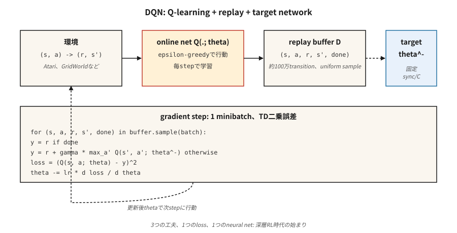

# Derin Q-Ağları (DQN)

> 2013: Mnih, ham pikseller üzerinde bir Q-öğrenme ağını eğitti ve yedi Atari oyununda tüm klasik RL agent'yi yendi. 2015: Nature'da yayınlanan oyun sayısı 49'a çıkarıldı ve derin RL çağını ateşledi. DQN, Q-öğrenme artı fonksiyon yaklaşımını kararlı hale getiren üç püf noktasıdır.

**Tür:** Yapım
**Diller:** Python
**Önkoşullar:** Aşama 3 · 03 (Backpropagation), Aşama 9 · 04 (Q-öğrenme, SARSA)
**Süre:** ~75 dakika

## Sorun

Tablosal Q-öğrenme, her (durum, eylem) çifti için ayrı bir Q değerine ihtiyaç duyar. Bir satranç tahtasının ~10⁴³ durumu vardır. Bir Atari çerçevesi 210×160×3 = 100.800 özelliktir. Tabular RL, bırakın milyarlarca eyaleti, binlerce eyalette ölüyor.

Geriye dönüp bakıldığında düzeltme açıktır: Q tablosunu neural network, `Q(s, a; θ)` ile değiştirin. Ancak geriye dönüp bakıldığında bunun anlaşılması onlarca yıl sürdü. Q-öğrenme ile saf işlev yaklaşımı, "ölümcül üçlü" altında farklılık gösterir - işlev yaklaşımı + önyükleme + politika dışı öğrenme. Mnih ve ark. (2013, 2015) öğrenmeyi istikrara kavuşturan üç mühendislik püf noktası belirledi:

1. **Deneyim tekrarı** geçişlerin ilişkisini bozar.
2. **Hedef ağ** önyükleme hedefini dondurur.
3. **Ödül kırpma** gradient büyüklüklerini normalleştirir.

Atari'deki DQN, tek bir hiperparametre setine sahip tek bir mimarinin ham piksellerden düzinelerce kontrol problemini çözdüğü ilk seferdi. O zamandan beri oluşturulan "deep-RL" olan her şey - DDQN, Rainbow, Dueling, Distributional, R2D2, Agent57 - bu üç hileli temelin üzerine yığılmıştır.

## Konsept



**Amaç.** DQN, sinirsel Q fonksiyonundaki tek adımlı TD kaybını en aza indirir:

`L(θ) = E_{(s,a,r,s')~D} [ (r + γ max_{a'} Q(s', a'; θ^-) - Q(s, a; θ))² ]`

`θ` = çevrimiçi ağ, gradient inişiyle her adımda güncellenir. `θ^-` = hedef ağ, `θ`'den periyodik olarak kopyalanır (her ~10.000 adımda bir). `D` = geçmiş geçişlerin tekrar oynatma arabelleği.

**Önem sırasına göre üç püf noktası:**

**Yeniden oynatma deneyimini yaşayın.** `~10⁶` geçişlerinden oluşan bir halka arabelleği. Her eğitim adımında, rastgele ve eşit bir şekilde bir mini parti numunesi alınır. Bu, zamansal korelasyonu bozar (ardışık çerçeveler neredeyse aynıdır), ağın nadir ödüllendirici geçişlerden birçok kez öğrenmesine olanak tanır ve ardışık gradient güncellemelerinin ilişkisini bozar. Bu olmadan, sinir ağına sahip politikaya bağlı tank avcısı Atari'den ayrılıyor.

**Hedef ağ.** Bellman denkleminin her iki tarafında da aynı ağı `Q(·; θ)` kullanmak, hedefin her güncellemede hareket etmesini, yani "kendi kuyruğunu kovalamasını" sağlar. Çözüm: dondurulmuş ağırlıklara sahip ikinci bir `Q(·; θ^-)` ağı tutun. Her `C` adımında `θ → θ^-`'yi kopyalayın. Bu, aynı anda binlerce gradient adımı için regresyon hedefini stabilize eder. Yazılım güncellemeleri `θ^- ← τ θ + (1-τ) θ^-` (DDPG, SAC'de kullanılır) daha sorunsuz bir çeşittir.

**Ödül kesintisi.** Atari ödül büyüklükleri 1 ila 1000+ arasında değişir. `{-1, 0, +1}`'ye kırpma, herhangi bir oyunun gradient'ye hakim olmasını engeller. Ödülün büyüklüğü önemli olduğunda yanlış; Yalnızca işaretin önemli olduğu Atari için sorun değil.

**Double DQN.** Hasselt (2016) maksimizasyon önyargısını düzeltir: eylemi *seçmek* için çevrimiçi ağı, onu *değerlendirmek* için hedef ağını kullanın.

`target = r + γ Q(s', argmax_{a'} Q(s', a'; θ); θ^-)`

Anında değiştirme, sürekli olarak daha iyi. Varsayılan olarak kullanın.

**Diğer iyileştirmeler (Rainbow, 2017):** öncelikli tekrar (yüksek TD hatası geçişlerini daha fazla örnekleyin), düello mimarisi (ayrı `V(s)` ve avantajlı kafalar), gürültülü ağlar (öğrenilmiş keşif), n adımlı dönüşler, dağıtımsal Q (C51/QR-DQN), çok adımlı önyükleme. Her biri yüzde birkaç ekler; kazanımlar kabaca eklenir.

## İnşa Et

Buradaki kod yalnızca stdlib'den numpy içermez - küçük, sürekli bir GridWorld üzerinde elle yuvarlanan tek gizli katmanlı bir MLP kullanırız, böylece her eğitim adımı mikrosaniyeler içinde çalışır. Algoritma, ölçekte Atari DQN ile aynıdır.

### Adım 1: tekrar oynatma arabelleği

```python
class ReplayBuffer:
    def __init__(self, capacity):
        self.buf = []
        self.capacity = capacity
    def push(self, s, a, r, s_next, done):
        if len(self.buf) == self.capacity:
            self.buf.pop(0)
        self.buf.append((s, a, r, s_next, done))
    def sample(self, batch, rng):
        return rng.sample(self.buf, batch)
```

Atari için ~50.000 kapasite; Oyuncak çevremiz için 5.000 yeterli.

### Adım 2: küçük bir Q ağı (manuel MLP)

```python
class QNet:
    def __init__(self, n_in, n_hidden, n_actions, rng):
        self.W1 = [[rng.gauss(0, 0.3) for _ in range(n_in)] for _ in range(n_hidden)]
        self.b1 = [0.0] * n_hidden
        self.W2 = [[rng.gauss(0, 0.3) for _ in range(n_hidden)] for _ in range(n_actions)]
        self.b2 = [0.0] * n_actions
    def forward(self, x):
        h = [max(0.0, sum(w * xi for w, xi in zip(row, x)) + b) for row, b in zip(self.W1, self.b1)]
        q = [sum(w * hi for w, hi in zip(row, h)) + b for row, b in zip(self.W2, self.b2)]
        return q, h
```

İleri geçiş: doğrusal → ReLU → doğrusal. Ağın tamamı budur.

### 3. Adım: DQN güncellemesi

```python
def train_step(online, target, batch, gamma, lr):
    grads = zeros_like(online)
    for s, a, r, s_next, done in batch:
        q, h = online.forward(s)
        if done:
            y = r
        else:
            q_next, _ = target.forward(s_next)
            y = r + gamma * max(q_next)
        td_error = q[a] - y
        accumulate_grads(grads, online, s, h, a, td_error)
    apply_sgd(online, grads, lr / len(batch))
```

Şekil, Ders 04'ten Q-öğrenmedir ve iki farkla: (a) bir tabloyu indekslemek yerine farklılaştırılabilir bir `Q(·; θ)` aracılığıyla geri destek yaparız, (b) hedef `Q(·; θ^-)`'yi kullanır.

### Adım 4: dış döngü

Her bölüm için, `Q(·; θ)` üzerinde ε-açgözlü davranın, geçişleri arabelleğe itin, bir mini parti örnekleyin, bir gradient adımı atın, `θ^- ← θ`'yi periyodik olarak senkronize edin. Desen:

```python
for episode in range(N):
    s = env.reset()
    while not done:
        a = epsilon_greedy(online, s, epsilon)
        s_next, r, done = env.step(s, a)
        buffer.push(s, a, r, s_next, done)
        if len(buffer) >= batch:
            train_step(online, target, buffer.sample(batch), gamma, lr)
        if steps % sync_every == 0:
            target = copy(online)
        s = s_next
```

agent, 16-dim tek-sıcak durumuna sahip minik GridWorld'ümüzde ~500 bölümde optimale yakın bir politika öğrenir. Atari'de bunu 200 milyon kareye ölçeklendirin ve bir CNN özellik çıkarıcı ekleyin.

## Tuzaklar

- **Ölümcül üçlü.** İşlev yaklaşımı + politika dışı + önyükleme birbirinden farklı olabilir. DQN, hedef net + tekrar oynatmayla hafifletir; da çıkarmayın.
- **Keşif.** ε, eğitimin ilk ~%10'u boyunca genellikle 1,0'dan 0,01'e kadar azalmalıdır. Yeterince erken keşif yapılmazsa, Q-net yerel bir havzaya yaklaşır.
- **Fazla tahmin.** Gürültülü Q üzerindeki `max` yukarı yönlü eğilimdedir. Üretimde daima Double DQN kullanın.
- **Ödül ölçeği.** Ödülleri kırpın veya normalleştirin; gradient büyüklüğü ödül büyüklüğüyle orantılıdır.
- **Arabellek soğuk başlatmasını tekrar oynatın.** Tamponda birkaç bin geçiş olana kadar eğitim vermeyin. ~20 örnekteki erken gradient'ler aşırı uyum.
- **Hedef senkronizasyon frekansı.** Çok sık ≈ hedef ağ yok; çok seyrek ≈ eski hedefler. Atari DQN, 10.000 env adımı kullanır. Temel kural: eğitim ufkunun her ~1/100'ünü senkronize edin.
- **Gözlem ön işlemesi.** Atari DQN, Markov durumunu oluşturmak için 4 kareyi yığınlar. Hız bilgisine sahip herhangi bir env'nin çerçeve istifleme veya yinelenen duruma ihtiyacı vardır.

## Kullan onu

2026'da DQN nadiren son teknoloji ürünü olsa da referans politika dışı algoritma olmaya devam ediyor:

| Görev | Seçim yöntemi | Neden DQN olmasın? |
|------|------------------|--------------|
| Ayrık eylem Atari benzeri | Rainbow DQN veya Müsli | Aynı framework, daha fazla numara. |
| Sürekli kontrol | SAC / TD3 (Aşama 9 · 07) | DQN'nin politika ağı yoktur. |
| Politikaya uygun / yüksek verim | PPO (Aşama 9 · 08) | Tekrar oynatma arabelleği yok; ölçeklendirmek daha kolaydır. |
| Çevrimdışı RL | CQL / IQL / Karar Transformer | Muhafazakar Q hedefleri, önyükleme patlamaları yok. |
| Büyük ayrı eylem alanları (önerici) | embedding eylemiyle DQN veya IMPALA | İyi; dekorasyon önemlidir. |
| Yüksek Lisans RL | PPO / GRPO | Adım düzeyinde değil, sıra düzeyinde; farklı bir kayıp. |

Dersler hala seyahat ediyor. Tekrar oynatma ve hedef ağlar SAC, TD3, DDPG, SAC-X, AlphaZero'nun kendi kendine oynatma arabelleğinde ve tüm çevrimdışı RL yöntemlerinde görünür. Ödül kırpma, PPO'da avantajın normalleştirilmesi olarak varlığını sürdürüyor. Mimari plandır.

## Gönderin

`outputs/skill-dqn-trainer.md` olarak kaydet:

```markdown
---
name: dqn-trainer
description: Produce a DQN training config (buffer, target sync, ε schedule, reward clipping) for a discrete-action RL task.
version: 1.0.0
phase: 9
lesson: 5
tags: [rl, dqn, deep-rl]
---

Given a discrete-action environment (observation shape, action count, horizon, reward scale), output:

1. Network. Architecture (MLP / CNN / Transformer), feature dim, depth.
2. Replay buffer. Capacity, minibatch size, warmup size.
3. Target network. Sync strategy (hard every C steps or soft τ).
4. Exploration. ε start / end / schedule length.
5. Loss. Huber vs MSE, gradient clip value, reward clipping rule.
6. Double DQN. On by default unless explicit reason to disable.

Refuse to ship a DQN with no target network, no replay buffer, or ε held at 1. Refuse continuous-action tasks (route to SAC / TD3). Flag any reward range > 10× per-step mean as needing clipping or scale normalization.
```

## Egzersizler

1. **Kolay.** `code/main.py`'yi çalıştırın. Bölüm başına dönüş eğrisini çizin. Çalışan ortalama -10'u geçene kadar kaç bölüm var?
2. **Orta.** Hedef ağı devre dışı bırakın (Çevrimiçi ağı Bellman hedefinin her iki tarafı için de kullanın). Eğitim istikrarsızlığını ölçün - geri dönüş salınıyor mu yoksa ayrılıyor mu?
3. **Zor.** Double DQN ekleyin: `argmax a'`'yi seçmek için çevrimiçi ağı kullanın, değerlendirmek için ağı hedefleyin. Gürültülü bir ödül GridWorld'de 1000 bölümden sonra `Q(s_0, best_a)` ile gerçek `V*(s_0)`'nin önyargısını Double DQN ile ve Double DQN olmadan karşılaştırın.

## Anahtar Terimler

| Dönem | İnsanlar ne diyor | Aslında ne anlama geliyor |
|------|-----------------|-----------------------|
| DQN | "Derin Q-öğrenme" | Sinirsel Q fonksiyonu, tekrar arabelleği ve hedef ağ ile Q-öğrenme. |
| Deneyim tekrarı | "Karışık geçişler" | Halka tamponu her gradient adımında eşit şekilde örneklenir; verileri ilişkisizleştirir. |
| Hedef ağ | "Dondurulmuş önyükleme" | Bellman hedefinde kullanılan Q'nun periyodik kopyası; antrenmanı stabilize eder. |
| Ölümcül üçlü | "RL neden ayrılıyor" | İşlev yaklaşımı + önyükleme + politika dışı = yakınsama garantisi yok. |
| Çift DQN | "Maksimizasyon yanlılığını düzeltme" | Çevrimiçi ağ eylemi seçer, hedef ağ ise onu değerlendirir. |
| Düello DQN | "V ve A kafaları" | Q = V + A - ortalama(A)'yı ayrıştırın; aynı çıktı, daha iyi gradient akışı. |
| Gökkuşağı | "Bütün hileler" | DDQN + PER + düello + n-adım + gürültülü + dağıtım bir arada. |
| BAŞINA | "Öncelikli Tekrar Oynatma" | Örnek geçişler TD hatası büyüklüğüyle orantılıdır. |

## Daha Fazla Okuma

- [Mnih ve ark. (2013). Derin Güçlendirme Öğrenmeyle Atari Oynamak](https://arxiv.org/abs/1312.5602) — Derin RL'yi başlatan 2013 NeurIPS atölye çalışması makalesi.
- [Mnih ve ark. (2015). Derin takviyeli öğrenme yoluyla insan düzeyinde kontrol](https://www.nature.com/articles/nature14236) — Nature gazetesi, 49 oyunlu DQN.
- [Hasselt, Guez, Gümüş (2016). Çift Q-öğrenme ile Derin Takviyeli Öğrenme](https://arxiv.org/abs/1509.06461) — DDQN.
- [Wang ve ark. (2016). Düello Ağı Mimarileri](https://arxiv.org/abs/1511.06581) — DQN düellosu.
- [Hessel ve ark. (2018). Rainbow: Deep RL'deki İyileştirmeleri Birleştirmek](https://arxiv.org/abs/1710.02298) — yığılmış hileler kağıdı.
- [OpenAI Dönüyor — DQN](https://spinningup.openai.com/en/latest/algorithms/dqn.html) — anlaşılır, modern bir anlatım.
- [Sutton ve Barto (2018). Ch. 9 — Yaklaşımlı Politikaya Dayalı Tahmin](http://incompleteideas.net/book/RLbook2020.pdf) — DQN'nin hedef ağı ve tekrar oynatma arabelleğinin dizginlemek üzere tasarlandığı "ölümcül üçlünün" (işlev yaklaşımı + önyükleme + politika dışı) ders kitaplarında ele alınması.
- [CleanRL DQN uygulaması](https://docs.cleanrl.dev/rl-algorithms/dqn/) — ablasyon çalışmalarında kullanılan tek dosyalı DQN referansı; Bu dersin sıfırdan versiyonunun yanında okumak güzel.
