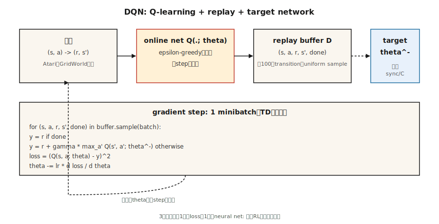

# 深度 Q 网络（Deep Q-Networks, DQN）

> 译注：本文译自同目录 [`en.md`](./en.md)。术语遵循仓根 [TRANSLATION_GUIDE.md](../../../../TRANSLATION_GUIDE.md)。

> 2013 年：Mnih 用一个 Q-learning 网络在原始像素上训练，在七款 Atari 游戏上击败了所有经典 RL agent。2015 年：扩展到 49 款游戏，发表于 Nature，点燃了 deep-RL 时代。DQN 就是 Q-learning 加上三个让函数逼近变得稳定的工程小技巧。

**Type:** Build
**Languages:** Python
**Prerequisites:** Phase 3 · 03 (Backpropagation), Phase 9 · 04 (Q-learning, SARSA)
**Time:** ~75 minutes

## 问题（The Problem）

表格式 Q-learning 需要为每一对 (state, action) 单独存一个 Q 值。一盘国际象棋的状态数大约是 10⁴³，一帧 Atari 画面是 210×160×3 = 100,800 维特征。表格式 RL 在几千个状态上就崩了，更别说几十亿个。

事后看来修法很显然：把 Q 表换成神经网络 `Q(s, a; θ)`。但这件事情"事后看显然"花了几十年才落地。把函数逼近朴素地拼到 Q-learning 上会发散，原因被称为"致命三角"（deadly triad）——函数逼近 + 自举（bootstrapping）+ off-policy 学习。Mnih 等人（2013、2015）找到了三个能稳住学习过程的工程技巧：

1. **Experience replay（经验回放）**让 transition 之间去相关。
2. **Target network（目标网络）**冻住 bootstrap 目标。
3. **Reward clipping（回报裁剪）**把梯度幅值归一化。

DQN 在 Atari 上首次做到：用同一套架构、同一组超参，从原始像素出发解决了几十个控制问题。从那以后所有"deep-RL"的工作——DDQN、Rainbow、Dueling、Distributional、R2D2、Agent57——都堆在这"三件套"基底之上。

## 概念（The Concept）



**优化目标。** DQN 在神经 Q 函数上最小化一步 TD loss：

`L(θ) = E_{(s,a,r,s')~D} [ (r + γ max_{a'} Q(s', a'; θ^-) - Q(s, a; θ))² ]`

`θ` = online network（在线网络），每一步用梯度下降更新。`θ^-` = target network（目标网络），周期性地从 `θ` 拷贝过来（约每 10,000 步一次）。`D` = 存放历史 transition 的 replay buffer（回放缓冲区）。

**三件套，按重要性排序：**

**Experience replay。** 一个容量约 10⁶ 的环形缓冲区。每次训练步从中均匀随机采一个 minibatch。这样做切断了时间相关性（相邻几帧几乎一模一样），让网络可以从稀有的高回报 transition 上反复学习，同时让连续的梯度更新之间去相关。没有它的话，把 on-policy TD 接到神经网络上在 Atari 上必然发散。

**Target network。** 如果 Bellman 方程两端都用同一张网络 `Q(·; θ)`，那目标会随每次更新一起动——"追自己尾巴"。修法是再开一张网络 `Q(·; θ^-)`，权重冻结；每隔 `C` 步把 `θ` 拷贝给 `θ^-`。这样回归目标可以在数千步梯度更新里保持稳定。软更新 `θ^- ← τ θ + (1-τ) θ^-`（DDPG、SAC 用的那种）是它的平滑版本。

**Reward clipping。** Atari 各游戏的回报量级从 1 到 1000+ 不等。裁到 `{-1, 0, +1}` 可以避免某一款游戏单独霸占梯度。代价是当回报量级本身有意义时这个做法是错的；对 Atari 这类只看符号的环境则没问题。

**Double DQN。** Hasselt（2016）解决了最大化偏差（maximization bias）：用 online net *选*动作，用 target net *评估*这个动作。

`target = r + γ Q(s', argmax_{a'} Q(s', a'; θ); θ^-)`

直接替换原来的目标即可，效果一致更好。默认就该用它。

**其他改进（Rainbow，2017）：** prioritized replay（按 TD 误差大小优先采样）、dueling 架构（把 `V(s)` 头和 advantage 头分开）、noisy networks（学得到的探索）、n-step returns、distributional Q（C51/QR-DQN）、多步自举。每一项各自加几个百分点；这些收益大致可以叠加。

## 动手实现（Build It）

这里的代码只用 Python 标准库，不依赖 numpy——我们手撸一个单隐藏层 MLP，跑在一个微型连续 GridWorld 上，每一步训练耗时是微秒级。算法本身和 Atari 规模的 DQN 完全一致。

### 第 1 步：replay buffer

```python
class ReplayBuffer:
    def __init__(self, capacity):
        self.buf = []
        self.capacity = capacity
    def push(self, s, a, r, s_next, done):
        if len(self.buf) == self.capacity:
            self.buf.pop(0)
        self.buf.append((s, a, r, s_next, done))
    def sample(self, batch, rng):
        return rng.sample(self.buf, batch)
```

Atari 用约 50,000 容量就够；我们的玩具环境 5,000 已经绰绰有余。

### 第 2 步：一个迷你 Q 网络（手写 MLP）

```python
class QNet:
    def __init__(self, n_in, n_hidden, n_actions, rng):
        self.W1 = [[rng.gauss(0, 0.3) for _ in range(n_in)] for _ in range(n_hidden)]
        self.b1 = [0.0] * n_hidden
        self.W2 = [[rng.gauss(0, 0.3) for _ in range(n_hidden)] for _ in range(n_actions)]
        self.b2 = [0.0] * n_actions
    def forward(self, x):
        h = [max(0.0, sum(w * xi for w, xi in zip(row, x)) + b) for row, b in zip(self.W1, self.b1)]
        q = [sum(w * hi for w, hi in zip(row, h)) + b for row, b in zip(self.W2, self.b2)]
        return q, h
```

前向传播：linear → ReLU → linear。整张网络就这点东西。

### 第 3 步：DQN 更新

```python
def train_step(online, target, batch, gamma, lr):
    grads = zeros_like(online)
    for s, a, r, s_next, done in batch:
        q, h = online.forward(s)
        if done:
            y = r
        else:
            q_next, _ = target.forward(s_next)
            y = r + gamma * max(q_next)
        td_error = q[a] - y
        accumulate_grads(grads, online, s, h, a, td_error)
    apply_sgd(online, grads, lr / len(batch))
```

骨架就是第 04 课的 Q-learning，差别有两点：(a) 我们对一个可微的 `Q(·; θ)` 做反向传播，而不是查表索引；(b) 目标用的是 `Q(·; θ^-)`。

### 第 4 步：外层主循环

每个 episode 里，按 ε-greedy 在 `Q(·; θ)` 上选动作，把 transition 推进 buffer，采一个 minibatch，做一步梯度更新，周期性地同步 `θ^- ← θ`。模式如下：

```python
for episode in range(N):
    s = env.reset()
    while not done:
        a = epsilon_greedy(online, s, epsilon)
        s_next, r, done = env.step(s, a)
        buffer.push(s, a, r, s_next, done)
        if len(buffer) >= batch:
            train_step(online, target, buffer.sample(batch), gamma, lr)
        if steps % sync_every == 0:
            target = copy(online)
        s = s_next
```

在我们这个 16 维 one-hot 状态的迷你 GridWorld 上，agent 大约 500 个 episode 就能学到接近最优的策略。放到 Atari 上，把规模拉到 2 亿帧，再加一个 CNN 特征抽取器即可。

## 坑（Pitfalls）

- **Deadly triad。** 函数逼近 + off-policy + 自举可能发散。DQN 用 target net + replay 把它压住；这俩都不能去掉。
- **Exploration（探索）。** ε 必须衰减，典型做法是在前 ~10% 训练步里从 1.0 降到 0.01。早期探索不够的话，Q 网络会陷入某个局部 basin。
- **过估计。** 在带噪 Q 上取 `max` 会有上偏。生产里务必用 Double DQN。
- **Reward 量级。** 对 reward 做裁剪或归一化；梯度幅值正比于 reward 幅值。
- **Replay buffer 冷启动。** buffer 里没攒到几千条 transition 之前别开训。早期在 ~20 个样本上梯度下降必过拟合。
- **Target 同步频率。** 太频繁 ≈ 没有 target net；太稀疏 ≈ 目标过期。Atari DQN 用 10,000 步环境步。经验法则：大约每训练 horizon 的 1/100 同步一次。
- **观察预处理。** Atari DQN 把 4 帧叠起来好让状态满足 Markov。任何带速度信息的环境都需要 frame stacking 或循环状态。

## 用起来（Use It）

到 2026 年，DQN 已经很少是 SOTA，但仍是 off-policy 算法的参考基准：

| 任务 | 首选方法 | 为什么不用 DQN？ |
|------|------------------|--------------|
| 离散动作的 Atari 类任务 | Rainbow DQN 或 Muesli | 同一框架，技巧更多。 |
| 连续控制 | SAC / TD3（Phase 9 · 07） | DQN 没有策略网络。 |
| On-policy / 高吞吐 | PPO（Phase 9 · 08） | 不需要 replay buffer；更易扩展。 |
| Offline RL | CQL / IQL / Decision Transformer | 保守的 Q 目标，没有自举发散问题。 |
| 大规模离散动作空间（推荐系统） | 带 action embedding 的 DQN，或 IMPALA | 用 DQN 也行；细节决定成败。 |
| LLM RL | PPO / GRPO | 序列级而非步级；loss 形态不同。 |

不过这些经验仍然通用。Replay 和 target network 出现在 SAC、TD3、DDPG、SAC-X、AlphaZero 的 self-play buffer 里，以及所有 offline RL 方法中。Reward clipping 的精神则在 PPO 的 advantage normalization 里延续了下来。这套架构是后续工作的蓝图。

## 上线部署（Ship It）

存为 `outputs/skill-dqn-trainer.md`：

```markdown
---
name: dqn-trainer
description: Produce a DQN training config (buffer, target sync, ε schedule, reward clipping) for a discrete-action RL task.
version: 1.0.0
phase: 9
lesson: 5
tags: [rl, dqn, deep-rl]
---

Given a discrete-action environment (observation shape, action count, horizon, reward scale), output:

1. Network. Architecture (MLP / CNN / Transformer), feature dim, depth.
2. Replay buffer. Capacity, minibatch size, warmup size.
3. Target network. Sync strategy (hard every C steps or soft τ).
4. Exploration. ε start / end / schedule length.
5. Loss. Huber vs MSE, gradient clip value, reward clipping rule.
6. Double DQN. On by default unless explicit reason to disable.

Refuse to ship a DQN with no target network, no replay buffer, or ε held at 1. Refuse continuous-action tasks (route to SAC / TD3). Flag any reward range > 10× per-step mean as needing clipping or scale normalization.
```

## 练习（Exercises）

1. **Easy.** 跑 `code/main.py`。画出每个 episode 的回报曲线。运行均值越过 -10 需要多少 episode？
2. **Medium.** 关掉 target network（Bellman 目标两端都用 online net）。测一下训练不稳定性——回报是震荡还是发散？
3. **Hard.** 加上 Double DQN：用 online net 选 `argmax a'`，用 target net 评估。在带噪 reward 的 GridWorld 上跑 1,000 个 episode，对比有无 Double DQN 时 `Q(s_0, best_a)` 相对真值 `V*(s_0)` 的偏差。

## 关键术语（Key Terms）

| 术语 | 大家口头怎么说 | 实际指什么 |
|------|-----------------|-----------------------|
| DQN | "Deep Q-learning" | 把 Q 函数换成神经网络的 Q-learning，配 replay buffer 和 target network。 |
| Experience replay | "打乱后的 transition" | 一个环形缓冲区，每次梯度步从中均匀采样；目的是给数据去相关。 |
| Target network | "冻住的 bootstrap" | Bellman 目标里用的 Q 的周期性快照；用来稳定训练。 |
| Deadly triad | "为什么 RL 会发散" | 函数逼近 + 自举 + off-policy = 没有收敛保证。 |
| Double DQN | "修最大化偏差" | 用 online net 选动作，用 target net 评估。 |
| Dueling DQN | "V 头 + A 头" | 把 Q 分解成 Q = V + A - mean(A)；输出一样，但梯度流更好。 |
| Rainbow | "把所有 trick 堆一起" | DDQN + PER + dueling + n-step + noisy + distributional 的合体。 |
| PER | "Prioritized Replay（优先回放）" | 按 TD 误差幅值正比地采样 transition。 |

## 延伸阅读（Further Reading）

- [Mnih et al. (2013). Playing Atari with Deep Reinforcement Learning](https://arxiv.org/abs/1312.5602) —— 2013 年的 NeurIPS workshop 论文，deep RL 的开山之作。
- [Mnih et al. (2015). Human-level control through deep reinforcement learning](https://www.nature.com/articles/nature14236) —— Nature 论文，49 款游戏的 DQN。
- [Hasselt, Guez, Silver (2016). Deep Reinforcement Learning with Double Q-learning](https://arxiv.org/abs/1509.06461) —— DDQN。
- [Wang et al. (2016). Dueling Network Architectures](https://arxiv.org/abs/1511.06581) —— dueling DQN。
- [Hessel et al. (2018). Rainbow: Combining Improvements in Deep RL](https://arxiv.org/abs/1710.02298) —— 把所有 trick 堆一起的论文。
- [OpenAI Spinning Up — DQN](https://spinningup.openai.com/en/latest/algorithms/dqn.html) —— 现代视角下清晰的讲解。
- [Sutton & Barto (2018). Ch. 9 — On-policy Prediction with Approximation](http://incompleteideas.net/book/RLbook2020.pdf) —— 教科书对"deadly triad"（函数逼近 + 自举 + off-policy）的处理，DQN 的 target network 与 replay buffer 正是为驯服它而设计。
- [CleanRL DQN implementation](https://docs.cleanrl.dev/rl-algorithms/dqn/) —— 消融实验里常用的单文件 DQN 参考实现；建议和本课从零实现的版本对照阅读。
