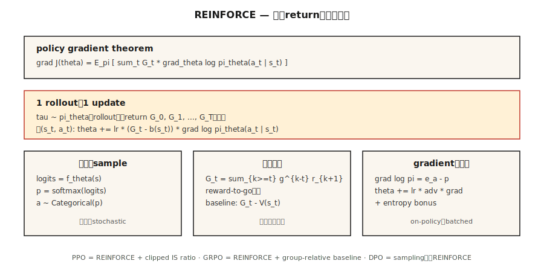

# 策略梯度 —— 从零实现 REINFORCE（Policy Gradient — REINFORCE from Scratch）

> 译注：本文译自同目录 [`en.md`](./en.md)。术语遵循仓根 [TRANSLATION_GUIDE.md](../../../../TRANSLATION_GUIDE.md)。

> 别再去估值。直接把策略参数化，算期望回报对参数的梯度，沿梯度爬坡。Williams (1992) 用一条定理就写完了。这就是 PPO、GRPO，以及所有 LLM 强化学习循环存在的根因。

**Type:** Build
**Languages:** Python
**Prerequisites:** Phase 3 · 03（Backpropagation）, Phase 9 · 03（Monte Carlo）, Phase 9 · 04（TD Learning）
**Time:** ~75 分钟

## 问题（The Problem）

Q-learning 和 DQN 把 *value*（价值）函数参数化，靠 `argmax Q` 选动作。这在动作离散、状态离散时还行，但一旦动作是连续的（在 10 维力矩上怎么 `argmax`？），或者你想要一个随机策略（`argmax` 天生是确定的），它就崩了。

策略梯度（policy gradient）反过来直接把 *policy*（策略）本身参数化。`π_θ(a | s)` 是一个神经网络，输出动作上的分布。采样它来动作。算期望回报对 `θ` 的梯度。沿梯度爬坡。没有 `argmax`，没有 Bellman 递推，只有对 `J(θ) = E_{π_θ}[G]` 做 gradient ascent（梯度上升）。

REINFORCE 定理（Williams 1992）告诉你这个梯度是可计算的：`∇J(θ) = E_π[ G · ∇_θ log π_θ(a | s) ]`。跑一个 episode；算 return；每一步乘上 `∇ log π_θ(a | s)`；取平均；做梯度上升。完事。

2026 年的每一种 LLM-RL 算法——PPO、DPO、GRPO——都是 REINFORCE 的精修版。把它写进肌肉记忆，是本阶段剩下内容、以及 Phase 10 · 07（RLHF 实现）和 Phase 10 · 08（DPO）的前置。

## 概念（The Concept）



**策略梯度定理（policy gradient theorem）。** 对任意由 `θ` 参数化的策略 `π_θ`：

`∇J(θ) = E_{τ ~ π_θ}[ Σ_{t=0}^{T} G_t · ∇_θ log π_θ(a_t | s_t) ]`

其中 `G_t = Σ_{k=t}^{T} γ^{k-t} r_{k+1}` 是从第 `t` 步起的折扣回报。期望取在从 `π_θ` 采样得到的完整轨迹（trajectory）`τ` 上。

**证明很短。** 对 `J(θ) = Σ_τ P(τ; θ) G(τ)` 在期望下求导。用 `∇P(τ; θ) = P(τ; θ) ∇ log P(τ; θ)`（对数导数 trick）。把 `log P(τ; θ) = Σ log π_θ(a_t | s_t) + 不依赖 θ 的环境项` 拆开。环境项消失。两行代数就给你这条定理。

**降方差技巧。** 朴素 REINFORCE 的方差大得离谱——return 嘈杂，`∇ log π` 嘈杂，两者乘起来更嘈杂。两个标准修法：

1. **Baseline（基线）扣减。** 把 `G_t` 替换成 `G_t - b(s_t)`，其中 `b(s_t)` 是任何不依赖 `a_t` 的 baseline。无偏，因为 `E[b(s_t) · ∇ log π(a_t | s_t)] = 0`。常见选择：用一个 critic 学到的 `b(s_t) = V̂(s_t)` → actor-critic（第 07 课）。
2. **Reward-to-go（剩余回报）。** 把 `Σ_t G_t · ∇ log π_θ(a_t | s_t)` 替换成 `Σ_t G_t^{from t} · ∇ log π_θ(a_t | s_t)`。给定一个动作，只有未来的 return 重要——过去的奖励只贡献零均值噪声。

合起来你得到：

`∇J ≈ (1/N) Σ_{i=1}^{N} Σ_{t=0}^{T_i} [ G_t^{(i)} - V̂(s_t^{(i)}) ] · ∇_θ log π_θ(a_t^{(i)} | s_t^{(i)})`

这就是带 baseline 的 REINFORCE——A2C（第 07 课）和 PPO（第 08 课）的直系祖先。

**Softmax 策略参数化。** 离散动作的标准选择：

`π_θ(a | s) = exp(f_θ(s, a)) / Σ_{a'} exp(f_θ(s, a'))`

其中 `f_θ` 是任何输出每个动作分数的神经网络。梯度有干净的形式：

`∇_θ log π_θ(a | s) = ∇_θ f_θ(s, a) - Σ_{a'} π_θ(a' | s) ∇_θ f_θ(s, a')`

也就是：所采取动作的分数减去它在策略下的期望分数。

**连续动作下的高斯策略。** `π_θ(a | s) = N(μ_θ(s), σ_θ(s))`。`∇ log N(a; μ, σ)` 有闭式解。Phase 9 · 07 的 SAC 需要的全部东西。

## 动手实现（Build It）

### 第 1 步：softmax 策略网络

```python
def policy_logits(theta, state_features):
    return [dot(theta[a], state_features) for a in range(N_ACTIONS)]

def softmax(logits):
    m = max(logits)
    exps = [exp(l - m) for l in logits]
    Z = sum(exps)
    return [e / Z for e in exps]
```

表格型环境用线性策略（每个动作一个权重向量）就够。换 Atari，把它换成 CNN，softmax 头保留即可。

### 第 2 步：采样和对数概率

```python
def sample_action(probs, rng):
    x = rng.random()
    cum = 0
    for a, p in enumerate(probs):
        cum += p
        if x <= cum:
            return a
    return len(probs) - 1

def log_prob(probs, a):
    return log(probs[a] + 1e-12)
```

### 第 3 步：rollout，并捕获 log-prob

```python
def rollout(theta, env, rng, gamma):
    trajectory = []
    s = env.reset()
    while not done:
        logits = policy_logits(theta, s)
        probs = softmax(logits)
        a = sample_action(probs, rng)
        s_next, r, done = env.step(s, a)
        trajectory.append((s, a, r, probs))
        s = s_next
    return trajectory
```

### 第 4 步：REINFORCE 更新

```python
def reinforce_step(theta, trajectory, gamma, lr, baseline=0.0):
    returns = compute_returns(trajectory, gamma)
    for (s, a, _, probs), G in zip(trajectory, returns):
        advantage = G - baseline
        grad_log_pi_a = [-p for p in probs]
        grad_log_pi_a[a] += 1.0
        for i in range(N_ACTIONS):
            for j in range(len(s)):
                theta[i][j] += lr * advantage * grad_log_pi_a[i] * s[j]
```

梯度 `∇ log π(a|s) = e_a - π(·|s)`（`a` 的 onehot 减去概率向量）是 softmax 策略梯度的核心。把它烧进肌肉记忆。

### 第 5 步：baseline

最近若干 episode 的 `G` 的 running mean（滑动均值）作为 baseline，已经足以让 4×4 GridWorld 跑起来；约 500 个 episode 就能收敛。把 baseline 升级成学到的 `V̂(s)`，你就拿到了 actor-critic。

## 易踩坑（Pitfalls）

- **梯度爆炸。** Return 可以非常大。乘 `∇ log π` 之前，永远把 `G` 在 batch 内归一化到 `~N(0, 1)`。
- **熵塌缩（entropy collapse）。** 策略过早收敛到一个近乎确定的动作，停止探索，卡死。修法：在目标里加熵奖励 `β · H(π(·|s))`。
- **方差大。** 朴素 REINFORCE 需要数千个 episode。critic baseline（第 07 课）或 TRPO/PPO 的信赖域（trust region，第 08 课）是标准修法。
- **样本效率低。** On-policy 意味着每个 transition 更新一次后就丢掉。靠重要性采样（importance sampling）做 off-policy 修正可以把数据捞回来，代价是方差（PPO 的 ratio 就是一个被 clip 的 IS 权重）。
- **非平稳梯度。** 100 个 episode 之前算出来的同一个梯度用的是旧的 `π`。On-policy 方法每跑几次 rollout 就更新，正是为此。
- **信用分配（credit assignment）。** 没有 reward-to-go 时，过去的奖励只贡献噪声。永远用 reward-to-go。

## 用起来（Use It）

2026 年很少直接跑 REINFORCE，但它的梯度公式无处不在：

| 用途 | 派生方法 |
|----------|---------------|
| 连续控制 | PPO / SAC，配高斯策略 |
| LLM RLHF | 带 KL 惩罚的 PPO，跑在 token 级策略上 |
| LLM 推理（DeepSeek） | GRPO —— 用 group-relative baseline 的 REINFORCE，无 critic |
| 多智能体 | 中心化 critic 的 REINFORCE（MADDPG、COMA） |
| 离散动作机器人 | A2C、A3C、PPO |
| 仅有偏好数据 | DPO —— 把 REINFORCE 改写成偏好似然损失，无需采样 |

当你在 2026 年的训练脚本里看到 `loss = -advantage * log_prob`，那就是带 baseline 的 REINFORCE。整篇整篇的论文（DPO、GRPO、RLOO）都是在这一行之上做降方差的把戏。

## 上线部署（Ship It）

保存为 `outputs/skill-policy-gradient-trainer.md`：

```markdown
---
name: policy-gradient-trainer
description: Produce a REINFORCE / actor-critic / PPO training config for a given task and diagnose variance issues.
version: 1.0.0
phase: 9
lesson: 6
tags: [rl, policy-gradient, reinforce]
---

Given an environment (discrete / continuous actions, horizon, reward stats), output:

1. Policy head. Softmax (discrete) or Gaussian (continuous) with parameter counts.
2. Baseline. None (vanilla), running mean, learned `V̂(s)`, or A2C critic.
3. Variance controls. Reward-to-go on by default, return normalization, gradient clip value.
4. Entropy bonus. Coefficient β and decay schedule.
5. Batch size. Episodes per update; on-policy data freshness contract.

Refuse REINFORCE-no-baseline on horizons > 500 steps. Refuse continuous-action control with a softmax head. Flag any run with `β = 0` and observed policy entropy < 0.1 as entropy-collapsed.
```

## 练习（Exercises）

1. **Easy.** 在 4×4 GridWorld 上用线性 softmax 策略实现 REINFORCE。不带 baseline 训练 1,000 个 episode。画学习曲线；测方差（return 的标准差）。
2. **Medium.** 加一个 running-mean baseline。重新训。和朴素版比较样本效率和方差。baseline 把收敛步数减少了多少？
3. **Hard.** 加熵奖励 `β · H(π)`。在 `β ∈ {0, 0.01, 0.1, 1.0}` 上扫一遍。画最终 return 和策略熵。在这个任务上甜点在哪？

## 关键术语（Key Terms）

| 术语 | 大家怎么说 | 实际意思 |
|------|-----------------|-----------------------|
| Policy gradient | "直接训策略" | `∇J(θ) = E[G · ∇ log π_θ(a\|s)]`；由 log-derivative trick 得到。 |
| REINFORCE | "最早的 PG 算法" | Williams (1992)；蒙特卡洛 return 乘以 log-policy 的梯度。 |
| Log-derivative trick | "Score function estimator" | `∇P(τ;θ) = P(τ;θ) · ∇ log P(τ;θ)`；让期望的梯度可计算。 |
| Baseline | "降方差" | 任何从 `G` 中减去的 `b(s)`；无偏，因为 `E[b · ∇ log π] = 0`。 |
| Reward-to-go | "只算未来的 return" | 用 `G_t^{from t}` 替代完整的 `G_0`；正确且方差更低。 |
| Entropy bonus | "鼓励探索" | 加上 `+β · H(π(·\|s))` 项防止策略塌缩。 |
| On-policy | "在你刚看到的数据上训" | 梯度的期望取在当前策略下——不能直接复用旧数据。 |
| Advantage | "比平均好多少" | `A(s, a) = G(s, a) - V(s)`；带 baseline 的 REINFORCE 所乘的有符号量。 |

## 延伸阅读（Further Reading）

- [Williams (1992). Simple Statistical Gradient-Following Algorithms for Connectionist Reinforcement Learning](https://link.springer.com/article/10.1007/BF00992696) —— 最初的 REINFORCE 论文。
- [Sutton et al. (2000). Policy Gradient Methods for Reinforcement Learning with Function Approximation](https://papers.nips.cc/paper_files/paper/1999/hash/464d828b85b0bed98e80ade0a5c43b0f-Abstract.html) —— 现代版的、带函数近似的策略梯度定理。
- [Sutton & Barto (2018). Ch. 13 — Policy Gradient Methods](http://incompleteideas.net/book/RLbook2020.pdf) —— 教科书式呈现。
- [OpenAI Spinning Up — VPG / REINFORCE](https://spinningup.openai.com/en/latest/algorithms/vpg.html) —— 清晰的教学讲解，附 PyTorch 代码。
- [Peters & Schaal (2008). Reinforcement Learning of Motor Skills with Policy Gradients](https://homes.cs.washington.edu/~todorov/courses/amath579/reading/PolicyGradient.pdf) —— 降方差，以及把 REINFORCE 与信赖域家族（TRPO、PPO）连接起来的自然梯度视角。
