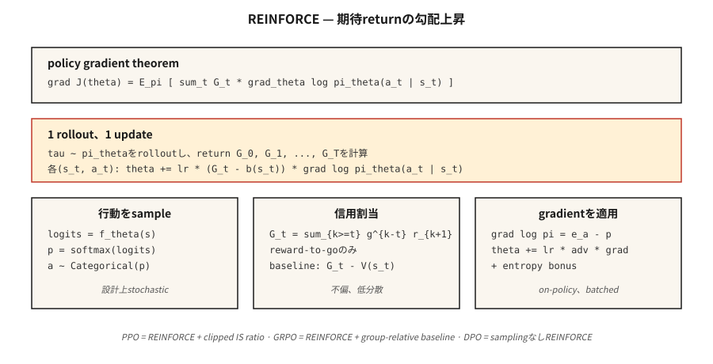

# 策略梯度——从零实现 REINFORCE

> 别再估计价值了。直接参数化策略，计算期望回报的梯度，向上攀登。Williams（1992）在一个定理中写出了它。这就是 PPO、GRPO 和所有 LLM RL 循环存在的原因。

**类型：** 构建
**语言：** Python
**前置要求：** 阶段 3 · 03（反向传播）、阶段 9 · 03（蒙特卡洛）、阶段 9 · 04（TD 学习）
**时间：** ~75 分钟

## 问题

Q-learning 和 DQN 参数化的是**价值**函数。你通过 rgmax Q 来选择动作。这对离散动作和离散状态没问题。但当动作是连续的时候（在 10 维扭矩上做 rgmax？）或者当你想要随机策略时（rgmax 天生是确定性的），它就不行了。

策略梯度参数化的是**策略**本身。π_θ(a | s) 是一个输出动作分布的神经网络。从中采样来行动。计算期望回报相对于 θ 的梯度。向上攀登。没有 rgmax。没有 Bellman 递归。只是在 J(θ) = E_{π_θ}[G] 上做梯度上升。

REINFORCE 定理（Williams 1992）告诉你这个梯度是可计算的：∇J(θ) = E_π[ G · ∇_θ log π_θ(a | s) ]。运行一个回合。计算回报。在每一步乘以 ∇ log π_θ(a | s)。取平均。梯度上升。完成。

2026 年所有的 LLM-RL 算法——PPO、DPO、GRPO——都是 REINFORCE 的改进。透彻理解它是本阶段剩余部分以及阶段 10 · 07（RLHF 实现）和阶段 10 · 08（DPO）的前置要求。

## 概念

**策略梯度定理。** 对于由 θ 参数化的任意策略 π_θ：

∇J(θ) = E_{τ ~ π_θ}[ Σ_{t=0}^{T} G_t · ∇_θ log π_θ(a_t | s_t) ]

其中 G_t = Σ_{k=t}^{T} γ^{k-t} r_{k+1} 是从步骤 	 开始的折扣回报。期望是对从 π_θ 采样的完整轨迹 τ 进行的。

**证明很短。** 在期望下对 J(θ) = Σ_τ P(τ; θ) G(τ) 求导。使用 ∇P(τ; θ) = P(τ; θ) ∇ log P(τ; θ)（对数导数技巧）。分解 log P(τ; θ) = Σ log π_θ(a_t | s_t) + 与 θ 无关的环境项。环境项消失。两行代数就得出了定理。

**方差降低技巧。** 原始 REINFORCE 有极高的方差——回报有噪声，∇ log π 有噪声，它们的乘积非常嘈杂。两个标准修复：

1. **基线减法。** 对于任何不依赖于 _t 的基线 (s_t)，用 G_t - b(s_t) 替换 G_t。无偏，因为 E[b(s_t) · ∇ log π(a_t | s_t)] = 0。典型选择：由评论家学习的 (s_t) = V̂(s_t) → actor-critic（课程 07）。
2. **待获得奖励。** 将 Σ_t G_t · ∇ log π_θ(a_t | s_t) 替换为 Σ_t G_t^{from t} · ∇ log π_θ(a_t | s_t)。对于给定的动作，只有未来回报才重要——过去的奖励贡献了零均值噪声。

结合起来，你得到：

∇J ≈ (1/N) Σ_{i=1}^{N} Σ_{t=0}^{T_i} [ G_t^{(i)} - V̂(s_t^{(i)}) ] · ∇_θ log π_θ(a_t^{(i)} | s_t^{(i)})

这是带基线的 REINFORCE——A2C（课程 07）和 PPO（课程 08）的直接祖先。

**Softmax 策略参数化。** 对于离散动作，标准选择：

π_θ(a | s) = exp(f_θ(s, a)) / Σ_{a'} exp(f_θ(s, a'))

其中 _θ 是输出每个动作得分的神经网络。梯度有简洁的形式：

∇_θ log π_θ(a | s) = ∇_θ f_θ(s, a) - Σ_{a'} π_θ(a' | s) ∇_θ f_θ(s, a')

即，所选动作的得分减去其在策略下的期望值。

**连续动作的高斯策略。** π_θ(a | s) = N(μ_θ(s), σ_θ(s))。∇ log N(a; μ, σ) 有闭合形式。这就是阶段 9 · 07 的 SAC 所需的全部。

`igure
policy-gradient-landscape
`

## 动手构建

### 步骤 1：softmax 策略网络

`python
def policy_logits(theta, state_features):
    return [dot(theta[a], state_features) for a in range(N_ACTIONS)]

def softmax(logits):
    m = max(logits)
    exps = [exp(l - m) for l in logits]
    Z = sum(exps)
    return [e / Z for e in exps]
`

对表格型环境使用线性策略（每个动作一个权重向量）。对于 Atari，换成 CNN 并保留 softmax 头。

### 步骤 2：采样和对数概率

`python
def sample_action(probs, rng):
    x = rng.random()
    cum = 0
    for a, p in enumerate(probs):
        cum += p
        if x <= cum:
            return a
    return len(probs) - 1

def log_prob(probs, a):
    return log(probs[a] + 1e-12)
`

### 步骤 3：捕获对数概率的 rollout

`python
def rollout(theta, env, rng, gamma):
    trajectory = []
    s = env.reset()
    while not done:
        logits = policy_logits(theta, s)
        probs = softmax(logits)
        a = sample_action(probs, rng)
        s_next, r, done = env.step(s, a)
        trajectory.append((s, a, r, probs))
        s = s_next
    return trajectory
`

### 步骤 4：REINFORCE 更新

`python
def reinforce_step(theta, trajectory, gamma, lr, baseline=0.0):
    returns = compute_returns(trajectory, gamma)
    for (s, a, _, probs), G in zip(trajectory, returns):
        advantage = G - baseline
        grad_log_pi_a = [-p for p in probs]
        grad_log_pi_a[a] += 1.0
        for i in range(N_ACTIONS):
            for j in range(len(s)):
                theta[i][j] += lr * advantage * grad_log_pi_a[i] * s[j]
`

梯度 ∇ log π(a|s) = e_a - π(·|s)（ 的 onehot 减去概率）是 softmax 策略梯度的核心。把它刻入肌肉记忆。

### 步骤 5：基线

近期回合的 G 的运行均值足以降低方差使 4×4 GridWorld 运行起来；大约需要 500 个回合收敛。将基线升级为学习到的 V̂(s)，你就得到了 actor-critic。

## 常见陷阱

- **梯度爆炸。** 回报可能很大。在乘以 ∇ log π 之前，始终将 G 在批次内归一化到 ~N(0, 1)。
- **熵坍缩。** 策略过早收敛到近乎确定性的动作，停止探索，陷入困境。修复方法：在目标中添加熵奖励 β · H(π(·|s))。
- **高方差。** 原始 REINFORCE 需要数千个回合。评论家基线（课程 07）或 TRPO/PPO 的信任区域（课程 08）是标准修复。
- **样本低效。** 同策略意味着你在一次更新后丢弃所有转移。通过重要性采样的离策略校正可以复用数据，但代价是方差（PPO 的比率是裁剪后的 IS 权重）。
- **非平稳梯度。** 100 个回合前的同一梯度使用的是旧的 π。同策略方法因此每几个 rollout 就更新一次。
- **信用分配。** 没有待获得奖励，过去的奖励会贡献噪声。始终使用待获得奖励。

## 使用场景

在 2026 年，REINFORCE 很少直接运行，但其梯度公式无处不在：

| 用例 | 衍生方法 |
|----------|---------------|
| 连续控制 | 带高斯策略的 PPO / SAC |
| LLM RLHF | 带 KL 惩罚的 PPO，运行在 token 级别的策略上 |
| LLM 推理（DeepSeek） | GRPO——带组相对基线的 REINFORCE，无评论家 |
| 多智能体 | 集中式评论家 REINFORCE（MADDPG、COMA） |
| 离散动作机器人 | A2C、A3C、PPO |
| 仅偏好设置 | DPO——重写为偏好似然损失的 REINFORCE，无需采样 |

当你在 2026 年的训练脚本中读到 loss = -advantage * log_prob 时，那就是带基线的 REINFORCE。整篇论文（DPO、GRPO、RLOO）都是在这一行代码之上的方差降低技巧。

## 交付物

保存为 outputs/skill-policy-gradient-trainer.md：

`markdown
---
name: policy-gradient-trainer
description: 为给定任务生成 REINFORCE / actor-critic / PPO 训练配置并诊断方差问题。
version: 1.0.0
phase: 9
lesson: 6
tags: [rl, policy-gradient, reinforce]
---

给定一个环境（离散/连续动作、视野、奖励统计），输出：

1. 策略头。Softmax（离散）或高斯（连续），含参数数量。
2. 基线。无（原始）、运行均值、学习到的 V̂(s) 或 A2C 评论家。
3. 方差控制。默认开启待获得奖励、回报归一化、梯度裁剪值。
4. 熵奖励。系数 β 和衰减调度。
5. 批量大小。每次更新的回合数；同策略数据新鲜度约定。

拒绝在视野 > 500 步时使用无基线的 REINFORCE。拒绝使用 softmax 头处理连续动作控制。标记任何 β = 0 且观察到的策略熵 < 0.1 的运行视为熵坍缩。
`

## 练习

1. **简单。** 在 4×4 GridWorld 上用线性 softmax 策略实现 REINFORCE。不使用基线训练 1,000 个回合。绘制学习曲线；衡量方差（回报的标准差）。
2. **中等。** 添加运行均值基线。再次训练。将样本效率和方差与原始运行比较。基线将收敛步骤减少了多少？
3. **困难。** 添加熵奖励 β · H(π)。扫描 β ∈ {0, 0.01, 0.1, 1.0}。绘制最终回报和策略熵。在这个任务上的最佳点在哪里？

## 关键术语

| 术语 | 人们说的 | 实际意思 |
|------|-----------------|-----------------------|
| 策略梯度 | "直接训练策略" | ∇J(θ) = E[G · ∇ log π_θ(a\|s)]；从对数导数技巧推导。 |
| REINFORCE | "原始的 PG 算法" | Williams（1992）；蒙特卡洛回报乘以对数策略梯度。 |
| 对数导数技巧 | "评分函数估计器" | ∇P(τ;θ) = P(τ;θ) · ∇ log P(τ;θ)；使期望的梯度易于处理。 |
| 基线 | "方差降低" | 从 G 中减去的任意 (s)；无偏因为 E[b · ∇ log π] = 0。 |
| 待获得奖励 | "只有未来回报重要" | 使用 G_t^{from t} 而不是完整的 G_0；正确且方差更低。 |
| 熵奖励 | "鼓励探索" | +β · H(π(·\|s)) 项防止策略坍缩。 |
| 同策略 | "用刚看到的数据训练" | 梯度期望是针对当前策略的——不能直接重用旧数据。 |
| 优势 | "比平均好多少" | A(s, a) = G(s, a) - V(s)；带基线的 REINFORCE 相乘的有符号量。 |

## 扩展阅读

- [Williams (1992). Simple Statistical Gradient-Following Algorithms for Connectionist Reinforcement Learning](https://link.springer.com/article/10.1007/BF00992696) — 原始 REINFORCE 论文。
- [Sutton et al. (2000). Policy Gradient Methods for Reinforcement Learning with Function Approximation](https://papers.nips.cc/paper_files/paper/1999/hash/464d828b85b0bed98e80ade0a5c43b0f-Abstract.html) — 带函数近似的现代策略梯度定理。
- [Sutton & Barto (2018). Ch. 13 — Policy Gradient Methods](http://incompleteideas.net/book/RLbook2020.pdf) — 教材展示。
- [OpenAI Spinning Up — VPG / REINFORCE](https://spinningup.openai.com/en/latest/algorithms/vpg.html) — 带有 PyTorch 代码的清晰教学讲解。
- [Peters & Schaal (2008). Reinforcement Learning of Motor Skills with Policy Gradients](https://homes.cs.washington.edu/~todorov/courses/amath579/reading/PolicyGradient.pdf) — 方差降低和将 REINFORCE 连接到信任区域家族（TRPO、PPO）的自然梯度视角。