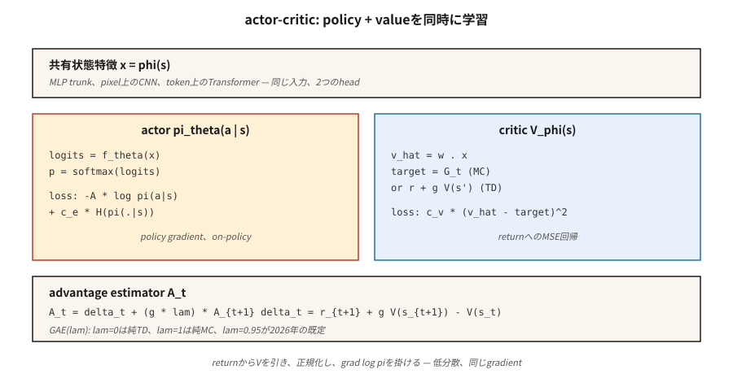

# Aktör-Eleştirmen — A2C ve A3C

> REINFORCE gürültülüdür. `V̂(s)` öğrenen bir eleştirmen ekleyin, bunu getiriden çıkarın ve aynı beklentiye sahip ancak çok daha düşük varyansa sahip bir avantaj elde edin. Bu, oyuncu eleştirmeni. A2C bunu eşzamanlı olarak çalıştırır; A3C bunu iş parçacıkları arasında çalıştırır. Her ikisi de her modern derin RL yöntemi için zihinsel modeldir.

**Tür:** Build
**Diller:** Python
**Önkoşullar:** Aşama 9 · 04 (TD Öğrenme), Aşama 9 · 06 (REINFORCE)
**Süre:** ~75 dakika

## Sorun

Vanilya REINFORCE işe yarıyor ama değişkenliği berbat. Monte Carlo'nun dönüşleri `G_t` bölümler arasında 10'un üzerinde salınım yapabilir. Bu gürültüyü `∇ log π` ile çarpmak ve ortalamasını almak, politikayı çok daha az DQN güncellemesiyle taşıyabileceğiniz mesafeye taşımak için binlerce bölüm süren bir gradient tahmincisi üretir.

Varyans ham getirilerin kullanılmasından kaynaklanmaktadır. Bir taban çizgisi `b(s_t)`'yi (öğrenilmiş bir değer de dahil olmak üzere herhangi bir durum fonksiyonu) çıkarırsanız beklenti değişmez ve varyans düşer. En iyi izlenebilir temel `V̂(s_t)`'dir. Şimdi `∇ log π` miktarının çarpımı *avantaj*:

`A(s, a) = G - V̂(s)`

Bir eylem ortalamanın üzerinde getiri sağlıyorsa iyidir; aşağıdaysa kötü. Bilgili bir eleştirmenle REINFORCE yapmak *aktör-eleştirmendir*. Eleştirmen, oyuncuya düşük varyanslı bir öğretmen verir. Bu, 2015'ten sonraki tüm derin politika yöntemleridir (A2C, A3C, PPO, SAC, IMPALA).

## Konsept



**İki ağ, bir paylaşılan kayıp:**

- **Aktör** `π_θ(a | s)`: politika. Harekete geçmek için örneklendi. gradient politikasıyla eğitildi.
- **Eleştirmen** `V_φ(s)`: eyaletten beklenen getiriyi tahmin ediyor. `(V_φ(s) - target)²`'yi en aza indirmek için eğitildi.

**Avantajı.** İki standart form:

- *MC avantajı:* `A_t = G_t - V_φ(s_t)`. Tarafsız, daha yüksek varyans.
- *TD avantajı:* `A_t = r_{t+1} + γ V_φ(s_{t+1}) - V_φ(s_t)`. Önyargılı (`V_φ` kullanır), çok daha düşük varyans. Ayrıca *TD artığı* `δ_t` olarak da adlandırılır.

**n-adım avantajı.** İkisi arasında enterpolasyon yapın:

`A_t^{(n)} = r_{t+1} + γ r_{t+2} + … + γ^{n-1} r_{t+n} + γ^n V_φ(s_{t+n}) - V_φ(s_t)`

`n = 1` saf tank avcısıdır. `n = ∞` MC'dir. Çoğu uygulama Atari için `n = 5`, MuJoCo'da PPO için `n = 2048` kullanır.

**Genelleştirilmiş Avantaj Tahmini (GAE).** Schulman ve ark. (2016) tüm n-adım avantajları üzerinden üstel ağırlıklı bir ortalama önermiştir:

`A_t^{GAE} = Σ_{l=0}^{∞} (γλ)^l δ_{t+l}`

`λ ∈ [0, 1]` ile. `λ = 0` TD'dir (düşük varyans, yüksek sapma). `λ = 1` MC'dir (yüksek varyans, tarafsız). `λ = 0.95` 2026 varsayılanıdır; sapma/varyans kadranı istediğiniz yere gelinceye kadar ayarlayın.

**A2C: eşzamanlı avantaj aktör-eleştirmeni.** `N` paralel ortamlarda `T` adımı toplayın. Her adım için avantajları hesaplayın. Birleştirilmiş grupta aktör ve eleştirmeni güncelleyin. Tekrarlamak. A3C'nin daha basit, daha ölçeklenebilir kardeşi.

**A3C: eşzamansız avantajlı aktör-eleştirmen.** Mnih ve ark. (2016). Her biri bir env çalıştıran `N` çalışan iş parçacığı oluşturur. Her çalışan, gradient'ları yerel olarak kendi dağıtımında hesaplar, ardından bunları eşzamansız olarak paylaşılan bir parametre sunucusuna uygular. Tekrar oynatma arabelleğine gerek yok; çalışanlar farklı yörüngelerde koşarak ilişkilerini bozarlar. A3C, CPU'lar üzerinde geniş ölçekte eğitim alabileceğinizi kanıtladı. 2026'da GPU tabanlı A2C (toplu paralel ortamlar) hakim oluyor çünkü GPU'lar büyük partiler istiyor.

**Birleşik kayıp.**

`L(θ, φ) = -E[ A_t · log π_θ(a_t | s_t) ]  +  c_v · E[(V_φ(s_t) - G_t)²]  -  c_e · E[H(π_θ(·|s_t))]`

Üç terim: politika-gradient kaybı, değer regresyonu, entropi bonusu. `c_v ~ 0.5`, `c_e ~ 0.01` kanonik başlangıç ​​noktalarıdır.

## Build It — Kendin İnşa Et

### Adım 1: Bir eleştirmen

Doğrusal eleştirmen `V_φ(s) = w · features(s)` MSE ile güncellendi:

```python
def critic_update(w, x, target, lr):
    v_hat = dot(w, x)
    err = target - v_hat
    for j in range(len(w)):
        w[j] += lr * err * x[j]
    return v_hat
```

Tablo halindeki bir ortamda eleştirmen birkaç yüz bölüm halinde birleşiyor. Atari'de doğrusal eleştiriyi, paylaşılan bir CNN hattı + değer başlığıyla değiştirin.

### Adım 2: n-adım avantajı

`T` uzunluğunda bir kullanıma sunma ve `V(s_T)` ön yüklemeli bir son verildiğinde:

```python
def compute_advantages(rewards, values, gamma=0.99, lam=0.95, last_value=0.0):
    advantages = [0.0] * len(rewards)
    gae = 0.0
    for t in reversed(range(len(rewards))):
        next_v = values[t + 1] if t + 1 < len(values) else last_value
        delta = rewards[t] + gamma * next_v - values[t]
        gae = delta + gamma * lam * gae
        advantages[t] = gae
    returns = [a + v for a, v in zip(advantages, values)]
    return advantages, returns
```

`returns` kritik hedeftir. `advantages`, `∇ log π`'yi çarpan şeydir.

### 3. Adım: birleşik güncelleme

```python
for step_i, (x, a, _r, probs) in enumerate(traj):
    adv = advantages[step_i]
    target_v = returns[step_i]

    # critic
    critic_update(w, x, target_v, lr_v)

    # actor
    for i in range(N_ACTIONS):
        grad_logpi = (1.0 if i == a else 0.0) - probs[i]
        for j in range(N_FEAT):
            theta[i][j] += lr_a * adv * grad_logpi * x[j]
```

Politikaya bağlı olarak, güncelleme başına bir dağıtım, aktör ve eleştirmen için ayrı öğrenme oranları.

### Adım 4: paralelleştirme (A3C ve A2C)

- **A3C:** `N` iş parçacığını döndür. Her biri kendi ortamını ve kendi ileri geçişini çalıştırır. gradient güncellemesini periyodik olarak paylaşılan bir ana bilgisayara aktarın. Ustanın üzerinde kilit yok; yarışlar sorun değil, sadece gürültü katıyorlar.
- **A2C:** `N` env örneğini tek bir işlemde çalıştırın, gözlemleri bir `[N, obs_dim]` topluluğa, toplu ileri geçişe, toplu geri geçişe yığınlayın. Daha yüksek GPU kullanımı, belirleyici, akıl yürütmesi daha kolay. 2026'daki varsayılan.

Oyuncak kodumuz netlik sağlamak amacıyla tek iş parçacıklıdır; Toplu A2C'ye yeniden yazmak üç satırlık numpy'dir.

## Tuzaklar

- **Eleştirmen gradient oyuncusundan önce önyargılıdır.** Eleştirmen rastgeleyse, temel çizgisi bilgi verici değildir ve saf gürültü üzerinde eğitim alıyorsunuzdur. gradient politikasını etkinleştirmeden önce eleştirmeni birkaç yüz adım ısıtın veya yavaş bir aktör öğrenme hızı kullanın.
- **Avantaj normalleştirmesi.** Avantajları parti başına sıfır ortalama/birim std'ye göre normalleştirin. Sıfıra yakın maliyetle eğitimi büyük ölçüde dengeler.
- **Paylaşılan hat.** Görüntü girişlerinde aktör ve eleştirmen için paylaşılan bir özellik çıkarıcı kullanın. Ayrı kafalar. Paylaşılan özellikler her iki kayıpta da bedavadır.
- **Politikaya uygun sözleşme.** A2C, verileri tam olarak bir güncelleme için yeniden kullanır. Daha fazlası ve gradient'niz önyargılıdır (PPO'nun eklediği şey, önem örnekleme düzeltmesidir).
- **Entropi çöküşü.** `c_e > 0` olmadan, politika birkaç yüz güncellemede neredeyse deterministik hale gelir ve araştırmayı bırakır.
- **Ödül ölçeği.** Avantaj büyüklükleri ödül ölçeğine bağlıdır. Görevler genelinde tutarlı gradient büyüklükler için ödülleri normalleştirin (e.g. çalışan-std bölme).

## Use It — Uygula

A2C/A3C, 2026'da nadiren son tercih olur ancak bunlar daha sonra her şeyin iyileştireceği mimaridir:

| Yöntem | A2C ile İlişkisi |
|--------|----------------|
| PPO | A2C + çok dönemli güncellemeler için kırpılmış önem oranı |
| İMPALA | A3C + V-trace politika dışı düzeltme |
| SAC (Aşama 9 · 07) | Yumuşak değer eleştirmeni ile politika dışı A2C (sonraki ders) |
| GRPO (Aşama 9 · 12) | Eleştirmensiz A2C — gruba göre avantaj |
| DPO | A2C tercih sıralamasında kayıp yaşadı, örnekleme yok |
| AlphaStar / OpenAI Beş | Lig antrenmanı + taklit ön antrenmanı ile A2C |

2026 tarihli bir makalede "avantaj" görüyorsanız, oyuncu eleştirmenini düşünün.

## Ship It — Ürüne Dönüştür

`outputs/skill-actor-critic-trainer.md` olarak kaydet:

```markdown
---
name: actor-critic-trainer
description: Produce an A2C / A3C / GAE configuration for a given environment, with advantage estimation and loss weights specified.
version: 1.0.0
phase: 9
lesson: 7
tags: [rl, actor-critic, gae]
---

Given an environment and compute budget, output:

1. Parallelism. A2C (GPU batched) vs A3C (CPU async) and the number of workers.
2. Rollout length T. Steps per env per update.
3. Advantage estimator. n-step or GAE(λ); specify λ.
4. Loss weights. `c_v` (value), `c_e` (entropy), gradient clip.
5. Learning rates. Actor and critic (separate if using).

Refuse single-worker A2C on environments with horizon > 1000 (too on-policy, too slow). Refuse to ship without advantage normalization. Flag any run with `c_e = 0` and observed entropy < 0.1 as entropy-collapsed.
```

## Egzersizler

1. **Kolay.** 4×4 GridWorld'de MC avantajıyla (`G_t - V(s_t)`) oyuncu eleştirmenlerini eğitin. Örnek verimliliğini Ders 06'daki çalışan ortalama temel çizgisiyle REINFORCE ile karşılaştırın.
2. **Orta.** Kalan tank avcısı avantajına (`r + γ V(s') - V(s)`) geçin. Avantaj gruplarının varyansını ölçün. Ne kadar düşer?
3. **Zor.** GAE(λ)'yi uygulayın. `λ ∈ {0, 0.5, 0.9, 0.95, 1.0}` tara. Nihai getiri ile numune verimliliğinin grafiğini çizin. Bu görev için önyargı/varyans tatlı noktası nerede?

## Anahtar Terimler

| Terim | İnsanlar ne diyor | Aslında ne anlama geliyor |
|------|-----------------|-----------------------|
| Aktör | "Politika ağı" | `π_θ(a\|s)`, gradient politikası tarafından güncellendi. |
| Eleştirmen | "Değer net" | `V_φ(s)`, MSE regresyonuyla dönüşlere / TD hedeflerine göre güncellendi. |
| Avantajı | "Ortalamadan ne kadar iyi" | `A(s, a) = Q(s, a) - V(s)` veya tahmin edicileri. `∇ log π` çarpanı. |
| TD kalıntısı | "delta" | `δ_t = r + γ V(s') - V(s)`; tek adımlı avantaj tahmini. |
| GAE | "İnterpolasyon düğmesi" | `λ` ile parametrelendirilmiş, n adımlı avantajların üstel ağırlıklı toplamı. |
| A2C | "Senkronize oyuncu-eleştirmen" | Env'ler arasında toplu olarak; kullanıma sunma başına bir gradient adım. |
| A3C | "Async aktör-eleştirmeni" | Çalışan iş parçacıkları gradient'ları paylaşılan bir parametre sunucusuna aktarır. Orijinal kağıt; 2026'da daha az yaygın. |
| Önyükleme | "Ufuktaki V'yi kullanın" | Dağıtımı kesin, toplamı kapatmak için `γ^n V(s_{t+n})` ekleyin. |

## Daha Fazla Okuma

- [Mnih ve ark. (2016). Derin Pekiştirmeli Öğrenme için Eşzamansız Yöntemler](https://arxiv.org/abs/1602.01783) — A3C, orijinal eşzamansız aktör-eleştirmen makalesi.
- [Schulman ve ark. (2016). Genelleştirilmiş Avantaj Tahminini Kullanan Yüksek Boyutlu Sürekli Kontrol](https://arxiv.org/abs/1506.02438) — GAE.
- [Sutton ve Barto (2018). Ch. 13 — Aktör-Eleştirmen Yöntemleri](http://incompleteideas.net/book/RLbook2020.pdf) — temeller; bunu Ch ile eşleştirin. Eleştiri bir sinir ağı olduğunda fonksiyon yaklaşımı hakkında 9.
- [Espeholt ve ark. (2018). IMPALA](https://arxiv.org/abs/1802.01561) — V-trace politika dışı düzeltmeyle ölçeklenebilir dağıtılmış aktör eleştirmeni.
- [OpenAI Baselines / Stable-Baselines3](https://stable-baselines3.readthedocs.io/) — okumaya değer üretim A2C/PPO uygulamaları.
- [Konda ve Tsitsiklis (2000). Aktör-Eleştirmen Algoritmaları](https://papers.nips.cc/paper/1786-actor-critic-algorithms) — iki zaman ölçekli aktör-eleştirmen ayrıştırmasının temel yakınsama sonucu.
