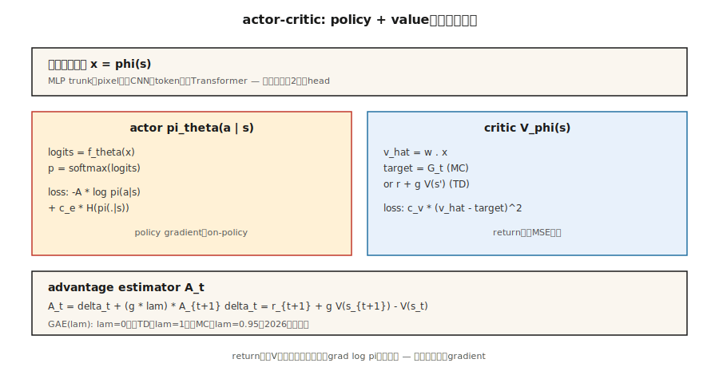

# Actor-Critic — A2C 和 A3C

> REINFORCE 噪声很大。加入一个学习 `V̂(s)` 的评论家（Critic），将其从回报中减去，就得到一个期望相同但方差小得多的优势函数。这就是演员-评论家（Actor-Critic）。A2C 同步运行；A3C 跨线程运行。两者是所有现代深度强化学习方法的心智模型。

**类型：** 构建
**语言：** Python
**前置知识：** 阶段 9 · 04（时序差分学习，TD Learning），阶段 9 · 06（REINFORCE）
**时间：** ~75 分钟

## 问题描述

原始 REINFORCE 虽能工作，但其方差极差。蒙特卡洛（Monte Carlo）回报 `G_t` 在不同回合之间可能波动十倍。将这种噪声乘以 `∇ log π` 并求平均，所产生的梯度估计器需要数千次回合才能将策略移动同样距离，而 DQN 更新次数则少得多。

方差来源于使用原始回报。如果减去一个基线 `b(s_t)`（任何关于状态的函数，包括学习到的值），期望保持不变，方差则下降。最易处理的基线是 `V̂(s_t)`。此时与 `∇ log π` 相乘的量是*优势函数（Advantage）*：

`A(s, a) = G - V̂(s)`

如果一个动作产生的回报高于平均水平，则为好；低于则为坏。带有学习到的评论家的 REINFORCE 就是*演员-评论家（Actor-Critic）*。评论家为演员提供了一个低方差的教师。这是 2015 年后所有深度策略方法（A2C、A3C、PPO、SAC、IMPALA）的基础。

## 概念



**两个网络，共享损失：**

- **演员（Actor）** `π_θ(a | s)`：策略。通过采样来行动。使用策略梯度训练。
- **评论家（Critic）** `V_φ(s)`：估计从状态开始的期望回报。训练目标是最小化 `(V_φ(s) - target)²`。

**优势函数。** 两种标准形式：

- *MC 优势：* `A_t = G_t - V_φ(s_t)`。无偏，方差较高。
- *TD 优势：* `A_t = r_{t+1} + γ V_φ(s_{t+1}) - V_φ(s_t)`。有偏（使用了 `V_φ`），方差低得多。也称为 *TD 残差（TD Residual）* `δ_t`。

**n 步优势。** 在两者之间插值：

`A_t^{(n)} = r_{t+1} + γ r_{t+2} + … + γ^{n-1} r_{t+n} + γ^n V_φ(s_{t+n}) - V_φ(s_t)`

`n = 1` 是纯 TD。`n = ∞` 是 MC。大多数实现中，Atari 使用 `n = 5`，MuJoCo 上的 PPO 使用 `n = 2048`。

**广义优势估计（Generalized Advantage Estimation，GAE）。** Schulman 等人（2016）提出对所有 n 步优势进行指数加权平均：

`A_t^{GAE} = Σ_{l=0}^{∞} (γλ)^l δ_{t+l}`

其中 `λ ∈ [0, 1]`。`λ = 0` 是 TD（低方差，高偏差）。`λ = 1` 是 MC（高方差，无偏）。`λ = 0.95` 是 2026 年的默认值——调整偏置/方差旋钮直到满意为止。

**A2C：同步优势演员-评论家（Synchronous Advantage Actor-Critic）。** 在 `N` 个并行环境中收集 `T` 步经验。为每一步计算优势。在合并的批次上更新演员和评论家。重复。A3C 的更简单、更易扩展的兄弟。

**A3C：异步优势演员-评论家（Asynchronous Advantage Actor-Critic）。** Mnih 等人（2016）。生成 `N` 个工作线程，每个运行一个环境。每个工作线程在自己的轨迹上本地计算梯度，然后异步地将其应用于共享的参数服务器。无需回放缓冲区——工作线程通过运行不同轨迹来去相关。A3C 证明了可以在 CPU 上大规模训练。到了 2026 年，基于 GPU 的 A2C（批量并行环境）占据主导，因为 GPU 需要大批量。

**组合损失。**

`L(θ, φ) = -E[ A_t · log π_θ(a_t | s_t) ]  +  c_v · E[(V_φ(s_t) - G_t)²]  -  c_e · E[H(π_θ(·|s_t))]`

三项：策略梯度损失、价值回归、熵奖励。`c_v ~ 0.5`，`c_e ~ 0.01` 是典型起始点。

## 构建它

### 第一步：评论家

线性评论家 `V_φ(s) = w · features(s)`，通过 MSE 更新：

```python
def critic_update(w, x, target, lr):
    v_hat = dot(w, x)
    err = target - v_hat
    for j in range(len(w)):
        w[j] += lr * err * x[j]
    return v_hat
```

在表格环境中，评论家在几百轮内收敛。在 Atari 上，将线性评论家替换为共享的 CNN 主干 + 价值头。

### 第二步：n 步优势

给定长度为 `T` 的轨迹和自举的最终 `V(s_T)`：

```python
def compute_advantages(rewards, values, gamma=0.99, lam=0.95, last_value=0.0):
    advantages = [0.0] * len(rewards)
    gae = 0.0
    for t in reversed(range(len(rewards))):
        next_v = values[t + 1] if t + 1 < len(values) else last_value
        delta = rewards[t] + gamma * next_v - values[t]
        gae = delta + gamma * lam * gae
        advantages[t] = gae
    returns = [a + v for a, v in zip(advantages, values)]
    return advantages, returns
```

`returns` 是评论家的目标。`advantages` 是与 `∇ log π` 相乘的量。

### 第三步：组合更新

```python
for step_i, (x, a, _r, probs) in enumerate(traj):
    adv = advantages[step_i]
    target_v = returns[step_i]

    # 评论家更新
    critic_update(w, x, target_v, lr_v)

    # 演员更新
    for i in range(N_ACTIONS):
        grad_logpi = (1.0 if i == a else 0.0) - probs[i]
        for j in range(N_FEAT):
            theta[i][j] += lr_a * adv * grad_logpi * x[j]
```

同策略，每次更新使用一次轨迹，演员和评论家使用不同的学习率。

### 第四步：并行化（A3C vs A2C）

- **A3C：** 启动 `N` 个线程。每个线程运行自己的环境并执行自己的前向传播。定期将梯度更新推送到共享主服务器。主服务器无需加锁——竞争是可以的，只会增加噪声。
- **A2C：** 在单个进程中运行 `N` 个环境实例，将观测堆叠成 `[N, obs_dim]` 的批次，批量前向传播，批量反向传播。GPU 利用率更高，确定性更强，更易推理。2026 年的默认选择。

我们的示例代码为清晰起见是单线程的；重写成批量的 A2C 只需三行 numpy 代码。

## 陷阱

- **评论家偏差先于演员梯度。** 如果评论家是随机的，其基线没有信息量，你就是在纯噪声上训练。在开启策略梯度之前，先预热评论家几百步，或者使用较慢的演员学习率。
- **优势归一化。** 将每个批次中的优势归一化为零均值/单位标准差。几乎零成本下极大稳定训练。
- **共享主干。** 对于图像输入，为演员和评论家使用共享的特征提取器。使用独立的头。共享特征可以免费获得两种损失的收益。
- **同策略契约。** A2C 只对每个数据使用一次更新。多次使用会导致梯度有偏（重要性采样校正是 PPO 加入的功能）。
- **熵崩溃。** 如果没有 `c_e > 0`，策略会在几百次更新后变得接近确定，停止探索。
- **奖励尺度。** 优势的数量级取决于奖励尺度。归一化奖励（例如，运行标准差除法）以便在不同任务间获得一致的梯度幅度。

## 使用它

A2C/A3C 在 2026 年很少是最终选择，但它们是后续所有改进所基于的架构：

| 方法 | 与 A2C 的关系 |
|--------|----------------|
| PPO | A2C + 剪裁的重要性比率，用于多时期更新 |
| IMPALA | A3C + V-trace 离策略校正 |
| SAC（阶段 9 · 07） | 离策略 A2C，带软值评论家（下一课） |
| GRPO（阶段 9 · 12） | 不带评论家的 A2C——组相对优势 |
| DPO | 将 A2C 压缩为偏好排序损失，无需采样 |
| AlphaStar / OpenAI Five | A2C 加上联盟训练和模仿预训练 |

如果你在 2026 年的论文中看到“优势”，请想到演员-评论家。

## 交付它

保存为 `outputs/skill-actor-critic-trainer.md`：

```markdown
---
name: actor-critic-trainer
description: 为给定环境生成 A2C / A3C / GAE 配置，包含优势估计和损失权重。
version: 1.0.0
phase: 9
lesson: 7
tags: [rl, actor-critic, gae]
---

给定环境和计算预算，输出：

1. 并行方式。A2C（GPU 批量） vs A3C（CPU 异步）以及工作线程数量。
2. 轨迹长度 T。每个环境每次更新的步数。
3. 优势估计器。n 步估计或 GAE(λ)；指定 λ。
4. 损失权重。`c_v`（价值）、`c_e`（熵）、梯度裁剪。
5. 学习率。演员和评论家（如果分开则分别设置）。

拒绝在 horizon > 1000 的环境上使用单工作线程 A2C（太同策略，太慢）。拒绝在没有优势归一化的情况下交付。标记任何 `c_e = 0` 且观测到熵 < 0.1 的运行结果为熵崩溃。
```

## 练习

1. **简单。** 在 4×4 网格世界中用 MC 优势（`G_t - V(s_t)`）训练演员-评论家。与第 6 课中使用运行均值基线的 REINFORCE 比较样本效率。
2. **中等。** 切换到 TD 残差优势（`r + γ V(s') - V(s)`）。测量优势批次的方差。下降了多少？
3. **困难。** 实现 GAE(λ)。扫描 `λ ∈ {0, 0.5, 0.9, 0.95, 1.0}`。绘制最终回报与样本效率的关系图。该任务的偏置/方差最佳点在何处？

## 关键术语

| 术语 | 人们怎么说 | 实际含义 |
|------|-----------------|-----------------------|
| 演员（Actor） | "策略网络" | `π_θ(a|s)`，通过策略梯度更新。 |
| 评论家（Critic） | "价值网络" | `V_φ(s)`，通过 MSE 回归到回报/TD 目标更新。 |
| 优势（Advantage） | "比平均好多少" | `A(s, a) = Q(s, a) - V(s)` 或其估计器。`∇ log π` 的乘数。 |
| TD 残差（TD Residual） | "δ" | `δ_t = r + γ V(s') - V(s)`；单步优势估计。 |
| GAE | "插值旋钮" | n 步优势的指数加权和，由 `λ` 参数化。 |
| A2C | "同步演员-评论家" | 跨环境批量处理；每个轨迹执行一次梯度更新。 |
| A3C | "异步演员-评论家" | 工作线程将梯度推送到共享参数服务器。原始论文；2026 年较少见。 |
| 自举（Bootstrap） | "在 horizon 处使用 V" | 截断轨迹，添加 `γ^n V(s_{t+n})` 以封闭求和。 |

## 延伸阅读

- [Mnih et al. (2016). Asynchronous Methods for Deep Reinforcement Learning](https://arxiv.org/abs/1602.01783) — A3C，原始异步演员-评论家论文。
- [Schulman et al. (2016). High-Dimensional Continuous Control Using Generalized Advantage Estimation](https://arxiv.org/abs/1506.02438) — GAE。
- [Sutton & Barto (2018). Ch. 13 — Actor-Critic Methods](http://incompleteideas.net/book/RLbook2020.pdf) — 基础；当评论家是神经网络时，与第 9 章函数近似一起阅读。
- [Espeholt et al. (2018). IMPALA](https://arxiv.org/abs/1802.01561) — 可扩展的分布式演员-评论家，带 V-trace 离策略校正。
- [OpenAI Baselines / Stable-Baselines3](https://stable-baselines3.readthedocs.io/) — 值得阅读的工业级 A2C/PPO 实现。
- [Konda & Tsitsiklis (2000). Actor-Critic Algorithms](https://papers.nips.cc/paper/1786-actor-critic-algorithms) — 双时间尺度演员-评论家分解的基础收敛结果。