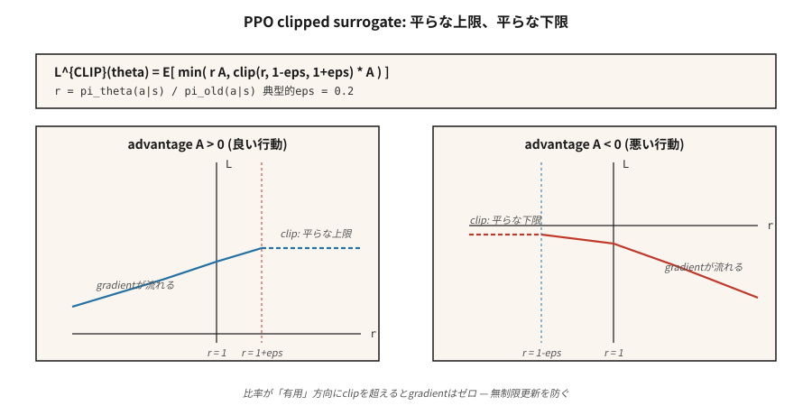

# Yakınsal Politika Optimizasyonu (PPO)

> A2C, bir güncellemeden sonra her sunumu iptal eder. PPO, gradient politikasını kısaltılmış bir önem oranıyla sarar, böylece politikada patlama olmadan aynı veriler üzerinde 10'dan fazla dönem gerçekleştirebilirsiniz. Schulman ve ark. (2017). 2026'da hala varsayılan politika gradient algoritması.

**Tür:** Yapım
**Diller:** Python
**Önkoşullar:** Aşama 9 · 06 (GÜÇLENDİRME), Aşama 9 · 07 (Aktör-Eleştirmen)
**Süre:** ~75 dakika

## Sorun

A2C (Ders 07) politikaya bağlıdır: gradient `E_{π_θ}[A · ∇ log π_θ]`, *geçerli* `π_θ`'den örneklenmiş veriler gerektirir. Bir güncelleme aldığınızda `π_θ` değişir; kullandığınız veriler artık politika dışıdır. Tekrar kullandığınızda gradient'niz önyargılıdır.

Sunumlar pahalıdır. Atari'de 8 ortam × 128 adım = 1024 geçiş ve bir düzine saniyelik çevre süresi boyunca bir sunum. Bir gradient adımından sonra bunu çöpe atmak israftır.

Güven Bölgesi Politikası Optimizasyonu (TRPO, Schulman 2015) ilk düzeltmeydi: eski ve yeni politika arasındaki KL farklılığının `δ`'nin altında kalması için her güncellemeyi kısıtlayın. Teorik olarak temizdir ancak güncelleme başına eşlenik gradient çözümü gerektirir. 2026'da TRPO'yu kimse yönetmiyor.

PPO (Schulman ve ark. 2017), katı güven bölgesi kısıtlamasının yerine basit, kırpılmış bir hedef koyar. Fazladan bir kod satırı. Kullanıma sunma başına on dönem. Eşlenik gradient yok. Yeterince iyi teorik garantiler. Dokuz yıl sonra, MuJoCo'dan RLHF'ye kadar her şey için hala varsayılan politika gradient algoritmasıdır.

## Konsept



**Önem oranı.**

`r_t(θ) = π_θ(a_t | s_t) / π_{θ_old}(a_t | s_t)`

Bu, yeni politikanın verileri toplayan politikaya göre olasılık oranıdır. `r_t = 1` değişiklik yok anlamına gelir. `r_t = 2`, yeni politikanın `a_t`'yi alma olasılığının eski politikaya göre iki kat daha fazla olduğu anlamına gelir.

**Kırpılmış vekil.**

`L^{CLIP}(θ) = E_t [ min( r_t(θ) A_t, clip(r_t(θ), 1-ε, 1+ε) A_t ) ]`

İki terim:

- `A_t > 0` avantajı ve oran `1 + ε`'yi aşmaya çalışırsa, klip gradient'yi düzleştirir — iyi bir eylemi eski olasılığın üzerine `+ε`'den daha ileriye itmeyin.
- `A_t < 0` avantajı ve oran `1 - ε`'yi aşmaya çalışırsa (yani, kötü bir eylemi, kırpılmış azalmasına kıyasla daha olası hale getireceğiz), klip gradient'yi kapatır — kötü bir eylemi `-ε`'nin altına itmeyin.

`min` diğer yönü yönetir: eğer oran *faydalı* yönde hareket etmişse, yine de gradient elde edersiniz (yan tarafta size zarar verecek hiçbir kırpma yoktur).

Tipik `ε = 0.2`. Hedefi `r_t`'nin bir fonksiyonu olarak çizin: "iyi tarafta" düz bir çatı ve "kötü tarafta" düz bir zemin bulunan parçalı doğrusal bir fonksiyon.

**Tam PPO kaybı.**

`L(θ, φ) = L^{CLIP}(θ) - c_v · (V_φ(s_t) - V_t^{target})² + c_e · H(π_θ(·|s_t))`

A2C ile aynı oyuncu-eleştirmen yapısı. Üç katsayı, genellikle `c_v = 0.5`, `c_e = 0.01`, `ε = 0.2`.

**Eğitim döngüsü.**

1. Her biri `T` adımları için `N` paralel ortamlar genelinde `N × T` geçişlerini toplayın.
2. Avantajları (GAE) hesaplayın, bunları sabit olarak dondurun.
3. `π_{θ_old}`'yi mevcut `π_θ`'nin anlık görüntüsü olarak dondurun.
4. `K` dönemleri için, her `(s, a, A, V_target, log π_old(a|s))` mini grubu için:
   - `r_t(θ) = exp(log π_θ(a|s) - log π_old(a|s))`'yi hesaplayın.
   - `L^{CLIP}` + değer kaybı + entropi uygulayın.
- Gradient adımı.
5. Dağıtımı atın. 1. adıma dönün.

`K = 10` ve 64'lük mini gruplar standart bir hiperparametre setidir. PPO sağlamdır: Kesin rakamlar nadiren ±%50 dahilinde önemlidir.

**KL-ceza çeşidi.** Orijinal makale, uyarlanabilir bir KL cezası kullanan bir alternatif önerdi: `L = L^{PG} - β · KL(π_θ || π_old)` ve `β`, gözlemlenen KL'ye göre ayarlandı. Kırpma versiyonu baskın hale geldi; KL varyantı RLHF'de hayatta kalır (burada referans politikasına yönelik KL, zaten her zaman istediğiniz ayrı bir kısıtlamadır).

## İnşa Et

### 1. Adım: kullanıma sunma sırasında `log π_old(a | s)`'yi yakalayın

```python
for step in range(T):
    probs = softmax(logits(theta, state_features(s)))
    a = sample(probs, rng)
    s_next, r, done = env.step(s, a)
    buffer.append({
        "s": s, "a": a, "r": r, "done": done,
        "v_old": value(w, state_features(s)),
        "log_pi_old": log(probs[a] + 1e-12),
    })
    s = s_next
```

Anlık görüntü, kullanıma sunma sırasında bir kez alınır. Güncelleme dönemlerinde değişmez.

### Adım 2: GAE avantajlarını hesaplayın (Ders 07)

A2C ile aynı. Toplu iş genelinde normalleştirin.

### 3. Adım: kırpılmış vekil güncelleme

```python
for _ in range(K_EPOCHS):
    for mb in minibatches(buffer, size=64):
        for rec in mb:
            x = state_features(rec["s"])
            probs = softmax(logits(theta, x))
            logp = log(probs[rec["a"]] + 1e-12)
            ratio = exp(logp - rec["log_pi_old"])
            adv = rec["advantage"]
            surrogate = min(
                ratio * adv,
                clamp(ratio, 1 - EPS, 1 + EPS) * adv,
            )
            # backprop -surrogate, add value loss, subtract entropy
            grad_logpi = onehot(rec["a"]) - probs
            if (adv > 0 and ratio >= 1 + EPS) or (adv < 0 and ratio <= 1 - EPS):
                pg_grad = 0.0  # clipped
            else:
                pg_grad = ratio * adv
            for i in range(N_ACTIONS):
                for j in range(N_FEAT):
                    theta[i][j] += LR * pg_grad * grad_logpi[i] * x[j]
```

"Kırpılmış → sıfır gradient" modeli PPO'nun kalbidir. Yeni politika zaten yararlı yönde çok fazla sürüklenmişse güncelleme durdurulur.

### Adım 4: değer ve entropi

A2C'de olduğu gibi, eleştirmen hedefine standart MSE ve aktöre bir entropi bonusu ekleyin.

### Adım 5: teşhis

Her güncellemede izlenecek üç şey:

- **Ortalama KL** `E[log π_old - log π_θ]`. `[0, 0.02]`'de kalmalı. `0.1`'yi geçerse `K_EPOCHS` veya `LR`'yi azaltın.
- **Kırpma payı** — oranı `[1-ε, 1+ε]` dışında kalan numunelerin kesri. `~0.1-0.3` olmalıdır. `~0` ise klip hiçbir zaman tetiklenmez → `LR` veya `K_EPOCHS`'yi yükseltin. `~0.5+` ise, kullanıma fazla uygun hale getiriyorsunuz → azaltın.
- **Açıklanan fark** `1 - Var(V_target - V_pred) / Var(V_target)`. Eleştirmen kalite ölçüsü. Eleştirmen öğrendikçe 1'e doğru tırmanmalı.

## Tuzaklar

- **Klip katsayısı yanlış ayarlandı.** `ε = 0.2` fiili standarttır. `0.1`'ye gitmek güncellemeleri çok çekingen hale getiriyor; `0.3+` istikrarsızlığa davetiye çıkarıyor.
- **Çok fazla dönem.** `K > 20`, politikanın `π_old`'den uzaklaşması nedeniyle rutin olarak istikrarsızlaşıyor. Özellikle büyük ağlar için dönemleri sınırlayın.
- **Ödül normalleştirmesi yok.** Büyük ödül ölçekleri klip aralığını tüketiyor. Avantajları hesaplamadan önce ödülleri normalleştirin (std'yi çalıştırarak).
- **Avantaj normalleştirmesini unutuyoruz.** Toplu iş başına sıfır ortalama/birim standart normalleştirme standarttır. Bunu atlamak çoğu benchmark'de PPO'yu mahveder.
- **Öğrenme oranı azalmamıştır.** PPO, doğrusal LR'nin sıfıra azalmasından yararlanır. Sabit LR genellikle daha kötüdür.
- **Önem oranı matematik hataları.** Sayısal kararlılık için her zaman `exp(log_new - log_old)`, `new / old` değil.
- **Yanlış gradient işareti.** Taşıyıcıyı büyüt = *küçült* `-L^{CLIP}`. Ters çevrilmiş bir işaret en yaygın PPO hatasıdır.

## Kullan onu

PPO, şaşırtıcı sayıda alanda 2026'nın varsayılan RL algoritmasıdır:

| Kullanım örneği | PPO çeşidi |
|----------|-------------|
| MuJoCo / robotik kontrol | Gauss politikasıyla PPO, GAE(0,95) |
| Atari / ayrık oyunlar | Kategorik politikaya sahip PPO, 128 adımlı kullanıma sunma |
| Yüksek Lisans için RLHF | Referans modele KL cezası ile PPO, yanıt sonunda RM'den ödül |
| Büyük ölçekli oyun agents | IMPALA + PPO (AlphaStar, OpenAI Five) |
| Muhakeme Yüksek Lisansı | GRPO (Ders 12) — Eleştirisiz PPO çeşidi |
| Yalnızca tercih verileri | DPO — PPO+KL'nin kapalı formda çökmesi, çevrimiçi örnekleme yok |

PPO *kayıp şekli* (kırpılmış vekil + değer + entropi) DPO, GRPO ve hemen hemen her RLHF boru hattının iskelesidir.

## Gönderin

`outputs/skill-ppo-trainer.md` olarak kaydet:

```markdown
---
name: ppo-trainer
description: Produce a PPO training config and a diagnostic plan for a given environment.
version: 1.0.0
phase: 9
lesson: 8
tags: [rl, ppo, policy-gradient]
---

Given an environment and training budget, output:

1. Rollout size. `N` envs × `T` steps.
2. Update schedule. `K` epochs, minibatch size, LR schedule.
3. Surrogate params. `ε` (clip), `c_v`, `c_e`, advantage normalization on.
4. Advantage. GAE(`λ`) with explicit `γ` and `λ`.
5. Diagnostics plan. KL, clip fraction, explained variance thresholds with alerts.

Refuse `K > 30` or `ε > 0.3` (unsafe trust region). Refuse any PPO run without advantage normalization or KL/clip monitoring. Flag clip fraction sustained above 0.4 as drift.
```

## Egzersizler

1. **Kolay.** `ε=0.2, K=4` ile 4×4 GridWorld'de PPO'yu çalıştırın. Eşleşen env adımlarında örnek verimliliğini A2C (kullanım başına bir dönem) ile karşılaştırın.
2. **Orta.** `K ∈ {1, 4, 10, 30}`'yi tarayın. Dönüş ve env adımlarının grafiğini çizin ve güncelleme başına ortalama KL'yi izleyin. KL bu görevde hangi `K`'de patlıyor?
3. **Zor.** Kırpılan vekil değişkeni uyarlanabilir bir KL cezasıyla değiştirin (`KL > 2·target` ise `β` iki katına çıkar, `KL < target/2` ise yarıya iner). Nihai dönüşü, kararlılığı ve klipssizliği karşılaştırın.

## Anahtar Terimler

| Dönem | İnsanlar ne diyor | Aslında ne anlama geliyor |
|------|-----------------|-----------------------|
| Önem oranı | "r_t(θ)" | `π_θ(a\|s) / π_old(a\|s)`; verileri toplayan politikadan sapma. |
| Kırpılmış vekil | "PPO'nun ana numarası" | `min(r·A, clip(r, 1-ε, 1+ε)·A)`; gradient'yi düz bir şekilde, faydalı taraftaki klibin ötesine geçirin. |
| Güven bölgesi | "TRPO / PPO amacı" | Monoton iyileştirmeyi garanti etmek için her güncellemenin KL'sini sınırlayın. |
| KL penaltı | "Yumuşak güven bölgesi" | Alternatif PPO: `L - β · KL(π_θ \|\| π_old)`. Uyarlanabilir `β`. |
| Klip kesri | "Kırpma ne sıklıkla tetiklenir" | Teşhis — 0,1-0,3 olmalıdır; dışarısı yanlış ayarlanmış demektir. |
| Çok dönemli eğitim | "Verilerin yeniden kullanımı" | Her kullanıma sunmada K dönem; Örnek verimliliği için işlem gören varyans maliyeti. |
| Politikaya ilişkin | "Çoğunlukla politikaya bağlı" | PPO nominal olarak politikaya uygundur ancak K>1 dönemleri biraz politika dışı verileri güvenli bir şekilde kullanır. |
| PPO-KL | "Diğer PPO" | KL-penaltı çeşidi; KL-referansın zaten bir kısıtlama olduğu RLHF'de kullanılır. |

## Daha Fazla Okuma

- [Schulman ve ark. (2017). Yakınsal Politika Optimizasyon Algoritmaları](https://arxiv.org/abs/1707.06347) — makale.
- [Schulman ve ark. (2015). Güven Bölgesi Politikası Optimizasyonu](https://arxiv.org/abs/1502.05477) — TRPO, PPO'nun öncülü.
- [Andrychowicz ve ark. (2021). On-Policy RL'de Neler Önemlidir? Büyük Ölçekli Ampirik Bir Çalışma](https://arxiv.org/abs/2006.05990) — her PPO hiperparametresi azaltıldı.
- [Ouyang ve ark. (2022). İnsan geri bildirimiyle talimatları takip edecek şekilde dil modellerini eğitmek](https://arxiv.org/abs/2203.02155) — InstructGPT; RLHF'de PPO tarifi.
- [OpenAI Spinning Up — PPO](https://spinningup.openai.com/en/latest/algorithms/ppo.html) — PyTorch ile temiz, modern bir anlatım.
- [CleanRL PPO uygulaması](https://github.com/vwxyzjn/cleanrl) — birçok makale tarafından kullanılan tek dosyalı PPO'ya referans.
- [Hugging Face TRL — PPOTrainer](https://huggingface.co/docs/trl/main/en/ppo_trainer) — dil modellerinde PPO üretim tarifi; Ders 09 (RLHF) ile birlikte okuyun.
- [Engstrom ve ark. (2020). Derin Politikada Uygulama Önemlidir Gradients](https://arxiv.org/abs/2005.12729) — "37 kod düzeyinde optimizasyon" makalesi; hangi PPO hilelerinin yük taşıdığı ve hangilerinin folklor olduğu.
