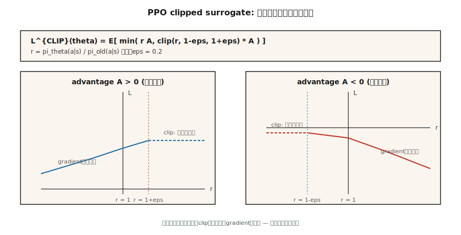

# 近端策略优化（PPO）

> 策略梯度步长太大 → 策略崩溃。步长太小 → 收敛需要永远。Schulman 等人（2017）用裁剪的重要性比率修复了这个问题。PPO 是 2026 年在线策略 RL 的默认设置，也是 RLHF 循环中使用的算法。

**类型：** 构建
**语言：** Python
**前置知识：** 第九阶段 · 07（Actor-Critic、A2C、GAE）
**时间：** ~75 分钟

## 问题

A2C 和 REINFORCE 使用随机梯度上升：计算梯度，走固定步长 `α`。问题是步长 `α` 对*所有*参数都相同。一个参数可能需要 `0.01` 的更新；另一个需要 `10.0`。固定步长要么太小（慢），要么太大（策略崩溃到一个坏动作，永远无法恢复）。

TRPO（Schulman 等人，2015）通过约束 KL 散度来解决这个问题："只走使新旧策略之间的 KL 散度 < δ 的步"。这有效但计算昂贵——每次更新都需要共轭梯度。

PPO（Schulman 等人，2017）用一个裁剪的目标替换了 KL 约束。它更简单，一样好，并且成为每个在线策略 RL 系统的默认设置。当你读到"我们用 PPO 训练"时，这就是他们使用的算法。

## 概念



**重要性比率。** 令 `π_old` 为收集数据的策略，`π` 为当前（正在训练的）策略。比率是：

`r_t(θ) = π_θ(a_t | s_t) / π_old(a_t | s_t)`

如果 `r_t(θ) > 1`，当前策略比旧策略更可能采取这个动作。如果 `r_t(θ) < 1`，则更不可能。

**裁剪的目标。** PPO 裁剪这个比率以防止大的策略变化：

`L_CLIP(θ) = E_t[ min( r_t(θ) · A_t, clip(r_t(θ), 1 - ε, 1 + ε) · A_t ) ]`

其中 `A_t` 是优势，`ε` 是一个小的超参数（通常 0.1 或 0.2）。

**直觉。** 如果优势为正（`A_t > 0`），我们想增加这个动作的概率。但 `r_t(θ)` 被裁剪在 `1 + ε`。如果 `r_t(θ)` 超过 `1 + ε`，目标停止增长——我们不再进一步增加概率。如果优势为负（`A_t < 0`），我们想减少概率，但 `r_t(θ)` 被裁剪在 `1 - ε`。这防止了策略在一个方向上走得太远。

**完整 PPO 目标。** 加上价值损失和熵奖励：

`L(θ) = E_t[ L_CLIP(θ) - c1 · (V_θ(s_t) - G_t)² + c2 · H(π_θ(·|s_t)) ]`

- `L_CLIP`：裁剪的策略目标。
- `c1 · (V - G)²`：critic 的 TD 损失。
- `c2 · H(π)`：熵奖励。

**多 epoch 训练。** PPO 从同一批次数据上运行多个梯度 epoch（通常 3-10）。这是关键——与 A2C 不同，A2C 每个样本只使用一次，PPO 在丢弃之前多次重用数据。这提高了样本效率。

**GAE。** PPO 使用 GAE（λ=0.95）进行优势估计，与 A2C 相同。

**KL 惩罚变体。** PPO 的原始论文还描述了一个 KL 惩罚版本：

`L_KL(θ) = E_t[ r_t(θ) · A_t - β · KL(π_old || π_θ) ]`

其中 `β` 是自适应调整的。裁剪版本在实践中更受欢迎，因为它更简单。

## 构建

### 第一步：收集 Rollout

```python
def collect_rollout(env, policy, steps):
    trajectory = []
    s = env.reset()
    for _ in range(steps):
        logits = policy.actor(s)
        probs = softmax(logits)
        a = sample_action(probs)
        s_next, r, done = env.step(a)
        trajectory.append((s, a, r, s_next, done, probs[a]))
        s = s_next if not done else env.reset()
    return trajectory
```

记录旧策略概率 `π_old(a|s)` 用于比率计算。

### 第二步：计算 GAE 优势

```python
def compute_gae(trajectory, critic, gamma, lam):
    advantages = []
    returns = []
    gae = 0
    for t in reversed(range(len(trajectory))):
        s, a, r, s_next, done, _ = trajectory[t]
        V_s = critic(s)
        V_next = 0 if done else critic(s_next)
        delta = r + gamma * V_next - V_s
        gae = delta + gamma * lam * gae
        advantages.insert(0, gae)
        returns.insert(0, gae + V_s)
    return advantages, returns
```

### 第三步：PPO 更新

```python
def ppo_update(policy, trajectory, advantages, returns, epsilon, lr, epochs):
    for _ in range(epochs):
        for (s, a, _, _, _, old_prob), A, G in zip(trajectory, advantages, returns):
            logits = policy.actor(s)
            probs = softmax(logits)
            new_prob = probs[a]
            ratio = new_prob / old_prob
            
            clipped_ratio = max(1 - epsilon, min(1 + epsilon, ratio))
            actor_loss = -min(ratio * A, clipped_ratio * A)
            
            V_s = policy.critic(s)
            critic_loss = (V_s - G) ** 2
            
            entropy = -sum(p * log(p + 1e-12) for p in probs)
            
            loss = actor_loss + 0.5 * critic_loss - 0.01 * entropy
            
            # 反向传播并更新
            policy.backward(loss, lr)
```

### 第四步：外层循环

```python
for iteration in range(total_iterations):
    trajectory = collect_rollout(env, policy, steps_per_iteration)
    advantages, returns = compute_gae(trajectory, policy.critic, gamma, lam)
    # 归一化优势
    mean_A = sum(advantages) / len(advantages)
    std_A = (sum((a - mean_A)**2 for a in advantages) / len(advantages)) ** 0.5
    advantages = [(a - mean_A) / (std_A + 1e-8) for a in advantages]
    
    ppo_update(policy, trajectory, advantages, returns, epsilon, lr, epochs=4)
```

## 陷阱

- **裁剪值 `ε`。** 太小（0.01）→ 策略变化太慢。太大（0.3）→ 裁剪不生效，策略可能崩溃。0.1-0.2 是甜点。
- **Epoch 数量。** 太少（1）→ 样本效率低。太多（10+）→ 过拟合同一批次，策略退化。3-4 是标准。
- **批量大小。** 太小 → 梯度噪声高。太大 → 内存问题。2048-4096 环境步是标准。
- **学习率。** PPO 对学习率敏感。太高 → 不稳定。太低 → 收敛慢。通常 3e-4 是起点。
- **优势归一化。** 始终归一化优势。这稳定训练，不引入偏差。
- **KL 散度监控。** 即使使用裁剪版本，监控 `KL(π_old || π)` 也是有用的。如果 KL > 0.02，考虑减小 `ε` 或学习率。
- **Clip fraction。** 被裁剪的样本比例。如果 > 0.2，策略变化可能太大。如果 < 0.01，可能学习太慢。

## 应用

PPO 是 2026 年在线策略 RL 的默认选择：

| 任务 | 为什么用 PPO |
|------|-------------|
| 机器人控制 | 稳定，对超参数不敏感，连续动作 |
| 游戏 AI | OpenAI Five、AlphaStar 使用 PPO 变体 |
| LLM RLHF | 标准算法；KL 惩罚防止策略漂移 |
| 多智能体 | MAPPO 是 PPO 的多智能体扩展 |
| 模拟到真实 | 在模拟中训练 PPO，迁移到真实机器人 |

PPO 的主要替代是 SAC（离线策略，样本效率更高但仅连续动作）和 DQN 家族（离散动作，离线策略）。

## 交付

保存为 `outputs/skill-ppo-trainer.md`：

```markdown
---
name: ppo-trainer
description: 为在线策略 RL 任务生成 PPO 训练配置，包括裁剪、GAE、多 epoch 设置。
version: 1.0.0
phase: 9
lesson: 8
tags: [rl, ppo, policy-gradient]
---

给定一个环境（动作空间、视界、奖励统计），输出：

1. 网络。Actor（softmax/高斯）、Critic（标量）、共享特征层。
2. PPO 参数。ε（裁剪）、epoch 数量、批量大小、小批量大小。
3. GAE。λ、γ。默认 λ=0.95, γ=0.99。
4. 损失权重。c1（critic 系数）、c2（熵系数）。
5. 学习率。Actor LR、Critic LR（通常相同）。
6. 监控。KL 散度阈值、clip fraction 目标范围。

拒绝 ε > 0.5 或 epoch > 20 的配置。拒绝没有优势归一化的 PPO。标记 clip fraction > 0.3 的运行为不稳定。
```

## 练习

1. **简单。** 在 CartPole 上实现 PPO。训练直到平均回报 > 450。记录需要的迭代次数。
2. **中等。** 比较 PPO 与 A2C 在相同环境上的样本效率。PPO 的多 epoch 更新是否显著提高了数据效率？
3. **困难。** 实现 PPO 的 KL 惩罚变体。自适应调整 `β`：如果 KL > 目标，增加 `β`；如果 KL < 目标/2，减小 `β`。与裁剪版本比较。

## 关键术语

| 术语 | 人们怎么说 | 实际含义 |
|------|-----------------|-----------------------|
| PPO | "默认在线策略 RL" | 带裁剪重要性比率的策略梯度；稳定且简单。 |
| 重要性比率 | "新策略 vs 旧策略" | `r_t(θ) = π_θ(a_t|s_t) / π_old(a_t|s_t)`。 |
| 裁剪 | "限制比率" | `clip(r, 1-ε, 1+ε)`；防止大的策略变化。 |
| TRPO | "PPO 的前辈" | 用 KL 约束代替裁剪；计算昂贵。 |
| 多 epoch | "重用数据" | 在同一批次上运行多个梯度步骤。 |
| Clip fraction | "多少被裁剪了" | 被裁剪样本的比例；监控指标。 |
| KL 惩罚 | "软约束" | `β · KL(π_old || π)`；替代裁剪。 |

## 延伸阅读

- [Schulman et al. (2017). Proximal Policy Optimization Algorithms](https://arxiv.org/abs/1707.06347) — PPO 论文。
- [Schulman et al. (2015). Trust Region Policy Optimization](https://arxiv.org/abs/1502.05477) — TRPO 论文。
- [OpenAI Spinning Up — PPO](https://spinningup.openai.com/en/latest/algorithms/ppo.html) — 教学阐述。
- [CleanRL PPO implementation](https://docs.cleanrl.dev/rl-algorithms/ppo/) — 参考单文件实现。
