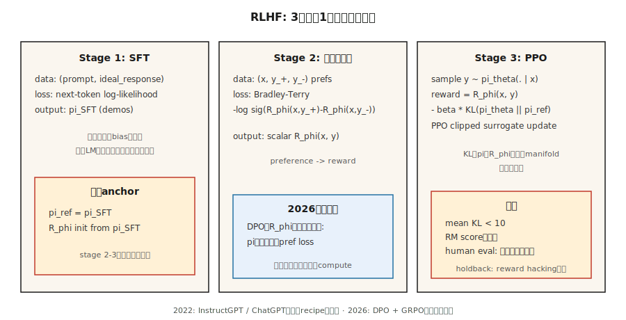

# 報酬モデリングと RLHF

> 人間は「良いアシスタント応答」の報酬関数を手書きできないが、2つの応答を比較して良い方を選ぶことはできる。その比較に報酬モデルをフィットし、言語モデルをそれに対して RL する。Christiano 2017。InstructGPT 2022。GPT-3 を ChatGPT に変えたレシピ。2026年には大部分が DPO に置き換わりつつあるが、考え方の核は残っている。

**タイプ:** Build
**言語:** Python
**前提条件:** Phase 5 · 05 (Sentiment)、Phase 9 · 08 (PPO)
**時間:** 約45分

## 問題

あなたは次トークン予測目的で言語モデルを訓練した。文法的な英語は書ける。しかし、嘘をつき、冗長に語り、拒否すべき場面で拒否しない。これは事前学習を増やしても直らない。Web テキストこそが問題であり、治療薬ではない。

欲しいのは「指示 X に対して応答 A は応答 B より良い」と言える*スカラー報酬*である。その報酬関数を手で書くのは不可能だ。「有用性」はトークン上の閉形式の式ではない。しかし人間は2つの出力を比較し、好みをマークできる。これは大規模にも比較的安く集められる。

RLHF (Christiano et al. 2017; Ouyang et al. 2022) は、選好を報酬モデルに変換し、その報酬に対して PPO で LM を最適化する。手順は SFT → RM → PPO の3段階。これは ChatGPT、Claude、Gemini、そして 2023〜2025年のほぼすべての alignment 済み LLM を出荷したレシピである。

2026年には、alignment tuning では PPO ステップの多くが DPO (Phase 10 · 08) に置き換わっている。DPO の方が安く、ほぼ同等に良いからだ。しかし*報酬モデル*の部分は、あらゆる Best-of-N サンプラー、検証可能報酬からの RL パイプライン、process reward model を使う推論モデルの土台に残っている。RLHF を理解すれば、alignment スタック全体を理解できる。

## コンセプト



**Stage 1: Supervised Fine-Tuning (SFT)。** 事前学習済み base model から始める。目標行動の人間が書いたデモンストレーション (指示追従応答、有用な返答など) で fine-tune する。結果は、*良い行動にバイアスされた*モデル `π_SFT` だが、action space はまだ無制限である。

**Stage 2: Reward Model training。**

- prompt `x` に対する応答ペア `(y_+, y_-)` を集め、人間が「y_+ は y_- より好ましい」とラベルする。
- 報酬モデル `R_φ(x, y)` を訓練し、`y_+` により高いスコアを割り当てる。
- 損失は **Bradley-Terry pairwise logistic**:

  `L(φ) = -E[ log σ(R_φ(x, y_+) - R_φ(x, y_-)) ]`

  σ は sigmoid。報酬差は選好の log-odds を意味する。BT は 1952年 (Bradley-Terry) 以来の標準であり、現代の RLHF でも支配的な選択肢である。

- `R_φ` は通常、SFT モデルに scalar head を載せて初期化する。同じ transformer backbone を使い、単一の線形層が報酬を出力する。

**Stage 3: KL penalty 付きで RM に対して PPO。**

- 訓練可能な policy `π_θ` を `π_SFT` から初期化する。凍結した*参照* `π_ref = π_SFT` を保持する。
- 応答 `y` の末尾での報酬:

  `r_total(x, y) = R_φ(x, y) - β · KL(π_θ(·|x) || π_ref(·|x))`

  KL penalty は `π_θ` が `π_SFT` から恣意的に drift するのを防ぐ。これは hard trust region ではなく*正則化項*である。`β` は典型的に `0.01`〜`0.05`。
- この報酬で PPO (Lesson 08) を実行する。Advantage は token-level trajectory 上で計算されるが、RM が採点するのは応答全体だけである。

**なぜ KL か。** KL がないと、PPO は reward hacking 戦略を喜んで見つける。RM は in-distribution completion だけで訓練されている。out-of-distribution な応答は、人間が書いたどの応答より高いスコアを得るかもしれない。KL は `π_θ` を、RM が訓練された manifold の近くに保つ。これは RLHF で最も重要なノブである。

**2026年の状況:**

- **DPO** (Rafailov 2023): 閉形式の代数により Stage 2+3 を選好データ上の単一の教師あり損失へ畳み込む。RM なし、PPO なし。計算量の一部で alignment benchmark 上は同等品質。Phase 10 · 08 で扱う。
- **GRPO** (DeepSeek 2024〜2025): critic の代わりに group-relative baseline を使う PPO。報酬は人間訓練 RM ではなく*verifier* (コード実行 / 数学の答え一致) から来る。reasoning model で支配的。Phase 9 · 12 で扱う。
- **Process reward models (PRMs):** 部分解 (各 reasoning step) を採点する。推論向けの RLHF と GRPO 亜種の両方で使われる。
- **Constitutional AI / RLAIF:** 人間の代わりに alignment 済み LLM で選好を生成する。選好予算をスケールさせる。

## 作るもの

このレッスンでは、文字列として表現された小さな合成「prompt」と「response」を使う。RM は bag-of-tokens 表現上の線形スコアラーである。本物の LLM は使わない。重要なのは規模ではなく、パイプラインの*形*である。`code/main.py` を参照。

### Step 1: 合成選好データ

```python
PROMPTS = ["help me", "answer me", "explain this"]
GOOD_WORDS = {"clear", "specific", "kind", "thorough"}
BAD_WORDS = {"vague", "rude", "wrong", "short"}

def make_pair(rng):
    x = rng.choice(PROMPTS)
    y_good = rng.choice(list(GOOD_WORDS)) + " " + rng.choice(list(GOOD_WORDS))
    y_bad = rng.choice(list(BAD_WORDS)) + " " + rng.choice(list(BAD_WORDS))
    return (x, y_good, y_bad)
```

本物の RLHF では、これは人間のラベラーに置き換わる。形、つまり `(prompt, preferred_response, rejected_response)` は同じである。

### Step 2: Bradley-Terry 報酬モデル

線形スコア: `R(x, y) = w · bag(y)`。BT pairwise log-loss を最小化するように訓練する:

```python
def rm_train_step(w, x, y_pos, y_neg, lr):
    r_pos = dot(w, bag(y_pos))
    r_neg = dot(w, bag(y_neg))
    p = sigmoid(r_pos - r_neg)
    for tok, cnt in bag(y_pos).items():
        w[tok] += lr * (1 - p) * cnt
    for tok, cnt in bag(y_neg).items():
        w[tok] -= lr * (1 - p) * cnt
```

数百回更新すると、`w` は良い語の token に正の重みを、悪い語に負の重みを割り当てる。

### Step 3: RM の上で PPO 風 policy

この toy policy は vocabulary から単一 token を生成する。RM で token を採点し、`log π_θ(token | prompt)` を計算し、KL-to-reference penalty を加え、clipped PPO surrogate を適用する。

```python
def rlhf_step(theta, ref, w, prompt, rng, eps=0.2, beta=0.1, lr=0.05):
    logits_theta = policy_logits(theta, prompt)
    probs = softmax(logits_theta)
    token = sample(probs, rng)
    logits_ref = policy_logits(ref, prompt)
    probs_ref = softmax(logits_ref)
    reward = dot(w, bag([token])) - beta * kl(probs, probs_ref)
    # ppo-style update on theta, treating reward as the return
    ...
```

### Step 4: KL を監視する

各更新で平均 `KL(π_θ || π_ref)` を追跡する。これが `~5-10` を超えてじわじわ上がるなら、policy は `π_SFT` から大きく drift している。`β` が低すぎるか、reward hacking が始まっている。これは本物の RLHF でも最上位の診断である。

### Step 5: TRL を使った production recipe

toy pipeline を理解したら、実ライブラリ利用者が書く同じループは次のようになる。Hugging Face の [TRL](https://huggingface.co/docs/trl) が reference implementation で、Stage 2 には `RewardTrainer`、Stage 3 には `PPOTrainer` (KL-to-reference 内蔵) を使う。

```python
# Stage 2: reward model from pairwise preferences
from trl import RewardTrainer, RewardConfig
from transformers import AutoModelForSequenceClassification, AutoTokenizer

tok = AutoTokenizer.from_pretrained("meta-llama/Llama-3.1-8B-Instruct")
rm = AutoModelForSequenceClassification.from_pretrained(
    "meta-llama/Llama-3.1-8B-Instruct", num_labels=1
)

# dataset rows: {"prompt", "chosen", "rejected"} — Bradley-Terry format
trainer = RewardTrainer(
    model=rm,
    tokenizer=tok,
    train_dataset=preference_data,
    args=RewardConfig(output_dir="./rm", num_train_epochs=1, learning_rate=1e-5),
)
trainer.train()
```

```python
# Stage 3: PPO against the RM with KL penalty to the SFT reference
from trl import PPOTrainer, PPOConfig, AutoModelForCausalLMWithValueHead

policy = AutoModelForCausalLMWithValueHead.from_pretrained("./sft-checkpoint")
ref    = AutoModelForCausalLMWithValueHead.from_pretrained("./sft-checkpoint")  # frozen

ppo = PPOTrainer(
    config=PPOConfig(learning_rate=1.41e-5, batch_size=64, init_kl_coef=0.05,
                     target_kl=6.0, adap_kl_ctrl=True),
    model=policy, ref_model=ref, tokenizer=tok,
)

for batch in dataloader:
    responses = ppo.generate(batch["query_ids"], max_new_tokens=128)
    rewards   = rm(torch.cat([batch["query_ids"], responses], dim=-1)).logits[:, 0]
    stats     = ppo.step(batch["query_ids"], responses, rewards)
    # stats includes: mean_kl, clip_frac, value_loss — the three PPO diagnostics
```

ライブラリが代行してくれることは3つある。`adap_kl_ctrl=True` は adaptive-β schedule を実装する。観測 KL が `target_kl` を超えると β を2倍にし、半分未満なら β を半分にする。参照モデルは慣例として凍結される。`policy` と誤って parameter を共有してはいけない。そして value head は policy と同じ backbone 上にある (`AutoModelForCausalLMWithValueHead` が scalar MLP head を付ける)。そのため TRL は `policy/kl` と `value/loss` を別々に報告する。

## 落とし穴

- **過剰最適化 / reward hacking。** RM は不完全であり、`π_θ` は高得点だが悪い adversarial completion を見つける。症状: reward は際限なく上がるが human eval score は横ばいか下がる。対策: early stop、`β` を上げる、RM training data を広げる。
- **Length hacking。** 有用な応答で訓練された RM は、しばしば暗黙に長さへ報酬を与える。policy は応答を水増しすることを学ぶ。対策: length-normalized reward、または length-aware RM を使う RLAIF。
- **小さすぎる RM。** RM は少なくとも policy と同じくらい大きい必要がある。小さな RM は policy の出力を忠実に採点できない。
- **KL tuning。** β が低すぎると drift と reward hacking。高すぎると policy がほとんど変わらない。標準的な技法は、step ごとの固定 KL を狙う*adaptive* β である。
- **選好データのノイズ。** 人間ラベルの約30%はノイズがあるか曖昧である。agreement-filtered data で RM を訓練するか、BT に temperature を使って calibrate する。
- **Off-policy 問題。** PPO data は最初の epoch の後、少し off-policy になる。Lesson 08 と同様に clip fraction を監視する。

## 使いどころ

2026年の RLHF は階層化されている:

| レイヤー | 目標 | 手法 |
|-------|--------|--------|
| 指示追従、有用性、無害性 | Alignment | RLHF-PPO より DPO (Phase 10 · 08) が好まれる。 |
| 推論の正しさ (数学、コード) | Capability | verifier reward を使う GRPO (Phase 9 · 12)。 |
| 長期 horizon の multi-step task | Agentic | step 上の process reward model を使う PPO / GRPO。 |
| 安全性 / 拒否行動 | Safety | separate safety RM を使う RLHF-PPO、または Constitutional AI。 |
| 推論時 Best-of-N | 高速 alignment | decode 時に RM を使う。policy training は不要。 |
| Reward distillation | 推論計算 | 凍結 LM の上に小さな「reward head」を訓練する。 |

RLHF は 2022〜2024年の*主要*手法だった。2026年の production alignment pipeline は DPO-first であり、PPO は RM 集約的または safety-critical なステップに限って使われる。

## 出荷するもの

`outputs/skill-rlhf-architect.md` として保存する:

```markdown
---
name: rlhf-architect
description: RM、KL、データ戦略を含め、言語モデル向けの RLHF / DPO / GRPO alignment pipeline を設計する。
version: 1.0.0
phase: 9
lesson: 9
tags: [rl, rlhf, alignment, llm]
---

base LM、目標行動 (alignment / reasoning / refusal / agent)、選好または verifier の予算を受け取り、次を出力する:

1. Stage。SFT? RM? DPO? GRPO? 根拠も含める。
2. 選好または verifier の source。人間、AI feedback、rule-based、unit-test-pass、または reward distillation。
3. KL strategy。固定 β、adaptive β、または DPO (implicit KL)。
4. Diagnostics。平均 KL、reward stability、過剰最適化 guard (holdout human eval)。
5. Safety gate。Red-team set、refusal rate、helpfulness RM とは別の safety RM。

KL monitor なしで RLHF-PPO を出荷することを拒否する。target policy より小さい RM の使用を拒否する。length-only rewards を拒否する。blind human-eval set を保持しない pipeline は、過剰最適化への保護が欠けていると flag する。
```

## 演習

1. **Easy。** `code/main.py` で Bradley-Terry reward model を 500 個の合成選好ペアで訓練する。hold-out 100 ペアで pairwise accuracy を測定する。90%を超えるはずである。
2. **Medium。** `β ∈ {0.0, 0.1, 1.0}` で toy PPO-RLHF loop を実行する。それぞれについて、更新に対する RM score と KL-to-reference を plot する。どの実行が reward-hack するか。
3. **Hard。** 同じ選好データで DPO (closed-form preference-likelihood loss) を実装し、使用計算量と到達した最終 RM score を RLHF-PPO pipeline と比較する。

## 重要用語

| 用語 | よく言われる表現 | 実際の意味 |
|------|-----------------|-----------------------|
| RLHF | 「Alignment RL」 | SFT + RM + PPO の3段階 pipeline (Christiano 2017, Ouyang 2022)。 |
| Reward Model (RM) | 「採点ネット」 | Bradley-Terry により pairwise preferences へフィットした学習済み scalar function。 |
| Bradley-Terry | 「Pairwise logistic loss」 | `P(y_+ ≻ y_-) = σ(R(y_+) - R(y_-))`; 標準的な RM objective。 |
| KL penalty | 「reference の近くに留まる」 | reward 内の `β · KL(π_θ \|\| π_ref)`; reward hacking を抑える正則化項。 |
| Reward hacking | 「Goodhart's law」 | policy が RM の欠陥を悪用する。症状: reward は上がり、人間評価は横ばい。 |
| RLAIF | 「AI-labeled preferences」 | ラベルが人間ではなく別の LM から来る RLHF。 |
| PRM | 「Process Reward Model」 | 部分的な reasoning step を採点する。推論 pipeline で使う。 |
| Constitutional AI | 「Anthropic の手法」 | 明示的ルールに導かれた AI-generated preferences。 |

## 参考文献

- [Christiano et al. (2017). Deep Reinforcement Learning from Human Preferences](https://arxiv.org/abs/1706.03741) — RLHF の出発点となった論文。
- [Ouyang et al. (2022). InstructGPT — Training language models to follow instructions with human feedback](https://arxiv.org/abs/2203.02155) — ChatGPT の背後にあるレシピ。
- [Stiennon et al. (2020). Learning to summarize with human feedback](https://arxiv.org/abs/2009.01325) — summarization 向けの初期 RLHF。
- [Rafailov et al. (2023). Direct Preference Optimization](https://arxiv.org/abs/2305.18290) — DPO。2026年の post-RLHF default。
- [Bai et al. (2022). Constitutional AI: Harmlessness from AI Feedback](https://arxiv.org/abs/2212.08073) — RLAIF と self-critique loop。
- [Anthropic RLHF paper (Bai et al. 2022). Training a Helpful and Harmless Assistant](https://arxiv.org/abs/2204.05862) — HH paper。
- [Hugging Face TRL library](https://huggingface.co/docs/trl) — production `RewardTrainer` と `PPOTrainer`。adaptive-KL と value-head の詳細は trainer source を読むこと。
- [Hugging Face — Illustrating Reinforcement Learning from Human Feedback](https://huggingface.co/blog/rlhf) by Lambert, Castricato, von Werra, Havrilla — 図付きで3段階 pipeline を解説する標準的な walkthrough。
- [von Werra et al. (2020). TRL: Transformer Reinforcement Learning](https://github.com/huggingface/trl) — ライブラリ本体。`examples/` には Llama、Mistral、Qwen 向けの end-to-end RLHF scripts がある。
- [Sutton & Barto (2018). Ch. 17.4 — Designing Reward Signals](http://incompleteideas.net/book/RLbook2020.pdf) — reward-hypothesis の見方。reward hacking を考えるための必須前提。
