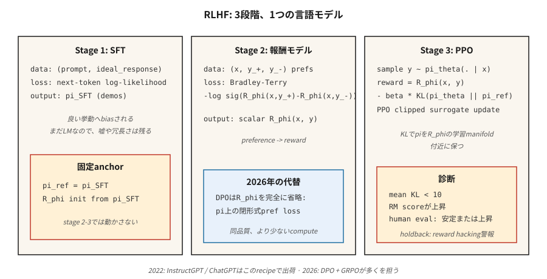

# Ödül Modelleme ve RLHF

> İnsanlar "iyi asistan tepkisi" için bir ödül fonksiyonu yazamazlar ancak iki tepkiyi karşılaştırıp daha iyi olanı seçebilirler. Bu karşılaştırmalara bir ödül modeli yerleştirin, ardından dil modelini buna göre RL yapın. Christiano 2017. InstructGPT 2022. GPT-3'ü ChatGPT'ye dönüştüren tarif. 2026'da çoğunlukla DPO ile değiştirilecek, ancak zihinsel model kalacak.

**Tür:** Yapım
**Diller:** Python
**Önkoşullar:** Aşama 5 · 05 (Duygu), Aşama 9 · 08 (PPO)
**Süre:** ~45 dakika

## Sorun

Bir sonraki token tahmin hedefine ilişkin bir dil modeli eğittiniz. Gramer İngilizcesi yazıyor. Aynı zamanda yalan söyler, gevezelik eder ve reddetmeyi reddeder. Bunu daha fazla ön eğitimle çözemezsiniz; web metni sorundur, tedavi değil.

"X talimatı için A yanıtı, B yanıtından daha iyidir" diyen bir *skaler ödül* istiyorsunuz. Bu ödül fonksiyonunu elle yazmak imkansızdır. "Yardımseverlik", token'ler üzerinde kapalı biçimli bir ifade değildir. Ancak insanlar iki çıktıyı karşılaştırabilir ve bir tercihi işaretleyebilir. Büyük ölçekte toplamak ucuzdur.

RLHF (Christiano ve ark. 2017; Ouyang ve ark. 2022) tercihleri bir ödül modeline dönüştürür ve ardından bu ödüle karşı PPO aracılığıyla LM'yi optimize eder. Üç adımda: SFT → RM → PPO. ChatGPT, Claude, Gemini ve diğer tüm uyumlu LLM'leri 2023-2025'te gönderen tarif budur.

2026'da PPO adımı çoğunlukla DPO (Aşama 10 · 08) ile değiştirildi çünkü daha ucuz ve hizalama ayarı için neredeyse aynı derecede iyi. Ancak *ödül modeli* parçası hâlâ her N'nin En İyisi örnekleyicisinin, doğrulanabilir ödüllerden gelen her RL ardışık düzeninin ve süreç ödül modelini kullanan her muhakeme modelinin temelini oluşturmaktadır. RLHF'yi anladığınızda tüm hizalama yığınını anlarsınız.

## Konsept



**Aşama 1: Denetimli Fine-Tuning (SFT).** Önceden eğitilmiş bir temel modelden başlayın. Hedef davranışın insan tarafından yazılan gösterimlerine (talimatları takip eden yanıtlar, yardımcı yanıtlar vb.) ince ayar yapın. Sonuç: *iyi davranışlara eğilimli* ancak yine de sınırsız bir eylem alanına sahip bir `π_SFT` modeli.

**2. Aşama: Ödül Modeli eğitimi.**

- İnsanlar tarafından "y_+, y_-'ye tercih edilir" olarak etiketlenen prompt `x`'ye verilen `(y_+, y_-)` yanıt çiftlerini toplayın.
- `y_+`'ye daha yüksek puanlar atamak için `R_φ(x, y)` ödül modelini eğitin.
- Kayıp: **Bradley-Terry ikili lojistiği**:

  `L(φ) = -E[ log σ(R_φ(x, y_+) - R_φ(x, y_-)) ]`

  σ sigmoiddir. Ödüldeki fark, tercihin log-olasılığını ima eder. BT 1952'den beri standarttır (Bradley-Terry) ve modern RLHF'de baskın seçimdir.

- `R_φ` genellikle SFT modelinden üstte bir skaler kafa ile başlatılır. Aynı transformer omurgası; tek bir doğrusal katman ödülün çıktısını verir.

**3. Aşama: RM'ye karşı KL cezasıyla PPO.**

- `π_SFT`'den `π_θ` eğitilebilir ilkesini başlatın. Dondurulmuş bir *referansı* saklayın `π_ref = π_SFT`.
- Yanıtın sonunda ödül `y`:

  `r_total(x, y) = R_φ(x, y) - β · KL(π_θ(·|x) || π_ref(·|x))`

  KL cezası, `π_θ`'nin `π_SFT`'den keyfi olarak sapmasını önler; bu bir *düzenleyicidir*, sıkı bir güven bölgesi değildir. `β` genellikle `0.01`-`0.05`.
- Bu ödülle PPO'yu (Ders 08) çalıştırın. Avantajlar token düzeyindeki yörüngeye göre hesaplanır, ancak RM yalnızca tam yanıtı puanlar.

**Neden KL?** O olmadan, PPO memnuniyetle ödül hackleme stratejileri bulacaktır; RM yalnızca dağıtım içi tamamlamalar konusunda eğitilmiştir. Dağıtım dışı bir yanıt, insanlar tarafından yazılan herhangi bir yanıttan daha yüksek puan alabilir. KL, `π_θ`'yi RM'nin eğitildiği manifoldun yakınında tutar. RLHF'deki en önemli düğmedir.

**2026 durumu:**

- **DPO** (Rafailov 2023): kapalı biçimli cebir, Aşama 2+3'ü tek bir denetimli tercih tercihi kaybına indirger. RM yok, PPO yok. İşlemin bir kısmı için benchmark hizalamasında aynı kalite. Aşama 10 · 08 kapsamındadır.
- **GRPO** (DeepSeek 2024–2025): Eleştirmen yerine gruba bağlı bir temele sahip PPO, insan tarafından eğitilmiş bir RM yerine *doğrulayıcıdan* (kod çalıştırmaları / matematik yanıtı eşleşmeleri) ödül. Akıl yürütme modelleri için baskın. Aşama 9 · 12 kapsamındadır.
- **Süreç ödül modelleri (PRM'ler):** hem RLHF hem de GRPO varyantlarında akıl yürütme için kullanılan kısmi çözümleri (her akıl yürütme adımı) puanlar.
- **Anayasal AI / RLAIF:** insanlar yerine tercihler oluşturmak için uyumlu bir Yüksek Lisans kullanın. Tercih bütçesini ölçeklendirir.

## İnşa Et

Bu derste küçük sentetik "prompt'ler" ve dizeler olarak temsil edilen "yanıtlar" kullanılır. RM, bir token paketi temsili üzerinden doğrusal bir puanlayıcıdır. Gerçek bir yüksek lisans yoktur; ölçeği değil, boru hattının *şekli* önemlidir. Bkz. `code/main.py`.

### Adım 1: sentetik tercih verileri

```python
PROMPTS = ["help me", "answer me", "explain this"]
GOOD_WORDS = {"clear", "specific", "kind", "thorough"}
BAD_WORDS = {"vague", "rude", "wrong", "short"}

def make_pair(rng):
    x = rng.choice(PROMPTS)
    y_good = rng.choice(list(GOOD_WORDS)) + " " + rng.choice(list(GOOD_WORDS))
    y_bad = rng.choice(list(BAD_WORDS)) + " " + rng.choice(list(BAD_WORDS))
    return (x, y_good, y_bad)
```

Gerçek RLHF'de bunun yerini insan etiketleyiciler alır. Şekil - `(prompt, preferred_response, rejected_response)` - aynıdır.

### Adım 2: Bradley-Terry ödül modeli

Doğrusal puan: `R(x, y) = w · bag(y)`. BT ikili günlük kaybını en aza indirmek için eğitim yapın:

```python
def rm_train_step(w, x, y_pos, y_neg, lr):
    r_pos = dot(w, bag(y_pos))
    r_neg = dot(w, bag(y_neg))
    p = sigmoid(r_pos - r_neg)
    for tok, cnt in bag(y_pos).items():
        w[tok] += lr * (1 - p) * cnt
    for tok, cnt in bag(y_neg).items():
        w[tok] -= lr * (1 - p) * cnt
```

Birkaç yüz güncellemeden sonra `w`, iyi kelime token'lere pozitif, kötü kelimeye ise negatif ağırlıklar atar.

### 3. Adım: RM'nin yanı sıra PPO benzeri politika

Oyuncak politikamız, bir sözlükten tek bir token üretir. RM kapsamında token'yi puanlıyoruz, `log π_θ(token | prompt)`'yi hesaplıyoruz, referansa KL cezası ekliyoruz ve kırpılmış PPO vekilini uyguluyoruz.

```python
def rlhf_step(theta, ref, w, prompt, rng, eps=0.2, beta=0.1, lr=0.05):
    logits_theta = policy_logits(theta, prompt)
    probs = softmax(logits_theta)
    token = sample(probs, rng)
    logits_ref = policy_logits(ref, prompt)
    probs_ref = softmax(logits_ref)
    reward = dot(w, bag([token])) - beta * kl(probs, probs_ref)
    # ppo-style update on theta, treating reward as the return
    ...
```

### Adım 4: KL'yi izleyin

Her güncellemeyi takip etmek `KL(π_θ || π_ref)` anlamına gelir. `~5-10`'yi geçerse politika `π_SFT`'den uzaklaşmış demektir; daha düşük `β` yükseliyor veya ödül hackleme başlıyor. Bu, gerçek RLHF'de en iyi teşhistir.

### Adım 5: TRL ile üretim tarifi

Oyuncak hattını anladığınızda, gerçek bir kütüphane kullanıcısının yazdığı döngünün aynısını göreceksiniz. Hugging Face'in [TRL](https://huggingface.co/docs/trl) referans uygulamasıdır — Aşama 2 için `RewardTrainer` ve Aşama 3 için `PPOTrainer` (yerleşik KL-referansa sahip).

```python
# Stage 2: reward model from pairwise preferences
from trl import RewardTrainer, RewardConfig
from transformers import AutoModelForSequenceClassification, AutoTokenizer

tok = AutoTokenizer.from_pretrained("meta-llama/Llama-3.1-8B-Instruct")
rm = AutoModelForSequenceClassification.from_pretrained(
    "meta-llama/Llama-3.1-8B-Instruct", num_labels=1
)

# dataset rows: {"prompt", "chosen", "rejected"} — Bradley-Terry format
trainer = RewardTrainer(
    model=rm,
    tokenizer=tok,
    train_dataset=preference_data,
    args=RewardConfig(output_dir="./rm", num_train_epochs=1, learning_rate=1e-5),
)
trainer.train()
```

```python
# Stage 3: PPO against the RM with KL penalty to the SFT reference
from trl import PPOTrainer, PPOConfig, AutoModelForCausalLMWithValueHead

policy = AutoModelForCausalLMWithValueHead.from_pretrained("./sft-checkpoint")
ref    = AutoModelForCausalLMWithValueHead.from_pretrained("./sft-checkpoint")  # frozen

ppo = PPOTrainer(
    config=PPOConfig(learning_rate=1.41e-5, batch_size=64, init_kl_coef=0.05,
                     target_kl=6.0, adap_kl_ctrl=True),
    model=policy, ref_model=ref, tokenizer=tok,
)

for batch in dataloader:
    responses = ppo.generate(batch["query_ids"], max_new_tokens=128)
    rewards   = rm(torch.cat([batch["query_ids"], responses], dim=-1)).logits[:, 0]
    stats     = ppo.step(batch["query_ids"], responses, rewards)
    # stats includes: mean_kl, clip_frac, value_loss — the three PPO diagnostics
```

Kütüphanenin sizin için yaptığı üç şey. `adap_kl_ctrl=True` uyarlanabilir-β programını uygular: KL'nin `target_kl`'yi aştığı gözlemlenirse, β iki katına çıkar; yarının altındaysa, β yarıya düşer. Referans modeli gelenek gereği dondurulmuştur; parametreleri `policy` ile yanlışlıkla paylaşmamalısınız. Ve değer kafası, politikayla aynı omurga üzerinde yaşar (`AutoModelForCausalLMWithValueHead`, skaler bir MLP kafası ekler), bu nedenle TRL, `policy/kl` ve `value/loss`'yi ayrı ayrı rapor eder.

## Tuzaklar

- **Aşırı optimizasyon / ödül korsanlığı.** RM kusurludur; `π_θ`, yüksek puan alan ancak kötü olan çekişmeli tamamlamaları bulur. Belirtiler: Ödül süresiz olarak artarken, insanların değerlendirme puanı sabit kalır veya düşer. Düzeltme: Erken durun, `β`'yi yükseltin, RM eğitim verilerini genişletin.
- **Uzunluk hackleme.** Yararlı yanıtlar konusunda eğitilmiş RM'ler genellikle dolaylı olarak uzunluğu ödüllendirir. Politika yanıtları doldurmayı öğrenir. İyileştirme: uzunluğa göre normalleştirilmiş ödül veya uzunluğa duyarlı RM ile RLAIF.
- **Çok küçük RM.** RM'nin en az politika kadar büyük olması gerekir. Küçük bir RM, politikanın çıktılarını güvenilir bir şekilde puanlayamaz.
- **KL ayarı.** Çok düşük β → sürüklenme ve ödül hackleme. Çok yüksek β → politika neredeyse hiç değişmiyor. Standart hile, adım başına sabit bir KL'yi hedefleyen *uyarlanabilir* β'dır.
- **Tercih verisi gürültüsü.** İnsan etiketlerinin ~%30'u gürültülü veya belirsizdir. RM'yi anlaşmayla filtrelenmiş veriler üzerinde eğiterek kalibre edin veya BT'de bir sıcaklık kullanın.
- **Politika dışı sorunlar.** PPO verileri, ilk dönemden sonra biraz politika dışıdır. Klip fraksiyonunu Ders 08'deki gibi izleyin.

## Kullan onu

2026'daki RLHF katmanlıdır:

| Katman | Hedef | Yöntem |
|-------|--------|--------|
| Talimat izleme, yardımseverlik, zararsızlık | Hizalama | RLHF-PPO'ya göre DPO (Faz 10 · 08) tercih edilir. |
| Muhakeme doğruluğu (matematik, kod) | Yetenek | Doğrulayıcı ödüllü GRPO (Aşama 9 · 12). |
| Uzun ufuklu çok adımlı görevler | Agentic | Adımlar halinde süreç ödül modelleriyle PPO / GRPO. |
| Güvenlik / reddetme davranışı | Güvenlik | Ayrı güvenlik RM'si veya Anayasal AI ile RLHF-PPO. |
| inference'de N'nin En İyisi | Hızlı hizalama | Kod çözme sırasında RM'yi kullanın; politika eğitimine gerek yok. |
| Ödül damıtma | Inference hesaplama | Donmuş bir LM'nin üstüne küçük bir "ödül kafası" eğitin. |

RLHF, 2022-2024'te *tek* yöntemdi. 2026'da, üretim hizalama ardışık düzenleri, RM yoğun veya güvenlik açısından kritik adımlar için önce DPO, yalnızca PPO olacaktır.

## Gönderin

`outputs/skill-rlhf-architect.md` olarak kaydet:

```markdown
---
name: rlhf-architect
description: Design an RLHF / DPO / GRPO alignment pipeline for a language model, including RM, KL, and data strategy.
version: 1.0.0
phase: 9
lesson: 9
tags: [rl, rlhf, alignment, llm]
---

Given a base LM, a target behavior (alignment / reasoning / refusal / agent), and a preference or verifier budget, output:

1. Stage. SFT? RM? DPO? GRPO? With justification.
2. Preference or verifier source. Humans, AI feedback, rule-based, unit-test-pass, or reward distillation.
3. KL strategy. Fixed β, adaptive β, or DPO (implicit KL).
4. Diagnostics. Mean KL, reward stability, over-optimization guard (holdout human eval).
5. Safety gate. Red-team set, refusal rate, safety RM separate from helpfulness RM.

Refuse to ship RLHF-PPO without a KL monitor. Refuse to use an RM smaller than the target policy. Refuse length-only rewards. Flag any pipeline that does not hold back a blind human-eval set as lacking over-optimization protection.
```

## Egzersizler

1. **Kolay.** Bradley-Terry ödül modelini `code/main.py`'de 500 sentetik tercih çifti üzerinde eğitin. Uzatılmış 100 çift üzerinde ikili doğruluğu ölçün. %90'ı aşması gerekiyor.
2. **Orta.** Oyuncak PPO-RLHF döngüsünü `β ∈ {0.0, 0.1, 1.0}` ile çalıştırın. Her biri için, güncellemeler üzerinden RM puanı ile KL-referans grafiğini çizin. Hangisi ödül hackini çalıştırıyor?
3. **Zor.** Aynı tercih verileri üzerinde DPO'yu (kapalı form tercihi-olasılık kaybı) uygulayın ve kullanılan hesaplama ve elde edilen nihai RM puanı açısından RLHF-PPO ardışık düzeniyle karşılaştırın.

## Anahtar Terimler

| Dönem | İnsanlar ne diyor | Aslında ne anlama geliyor |
|------|-----------------|-----------------------|
| RLHF | "Hizalama RL" | Üç aşamalı SFT + RM + PPO boru hattı (Christiano 2017, Ouyang 2022). |
| Ödül Modeli (RM) | "Puan ağı" | Bradley-Terry aracılığıyla ikili tercihlere uygun skaler fonksiyon öğrenildi. |
| Bradley-Terry | "İkili lojistik kaybı" | `P(y_+ ≻ y_-) = σ(R(y_+) - R(y_-))`; standart RM hedefi. |
| KL penaltı | "Referansın yakınında kalın" | Ödülde `β · KL(π_θ \|\| π_ref)`; ödül korsanlığı karşıtı düzenleyici. |
| Ödül hackleme | "Goodhart yasası" | Politika, RM kusurlarından yararlanır; Belirtiler: Ödüllendirme, insani değerlendirme düzlüğü. |
| RLAIF | "AI etiketli tercihler" | Etiketlerin insanlar yerine başka bir LM'den geldiği RLHF. |
| PRM | "Süreç Ödül Modeli" | Kısmi muhakeme adımlarını puanlar; akıl yürütme boru hatlarında kullanılır. |
| Anayasal Yapay Zeka | "Antropik yöntem" | Açık kurallarla yönlendirilen yapay zeka tarafından oluşturulan tercihler. |

## Daha Fazla Okuma

- [Christiano ve ark. (2017). İnsan Tercihlerinden Derin Güçlendirme Öğrenimi](https://arxiv.org/abs/1706.03741) — RLHF'yi başlatan makale.
- [Ouyang ve ark. (2022). InstructGPT — İnsan geri bildirimiyle talimatları takip edecek şekilde dil modellerini eğitmek](https://arxiv.org/abs/2203.02155) — ChatGPT'nin arkasındaki tarif.
- [Stiennon ve ark. (2020). İnsan geri bildirimiyle özetlemeyi öğrenme](https://arxiv.org/abs/2009.01325) — özetleme için daha önceki RLHF.
- [Rafailov ve ark. (2023). Doğrudan Tercih Optimizasyonu](https://arxiv.org/abs/2305.18290) — DPO; 2026'da RLHF sonrası varsayılan.
- [Bai ve ark. (2022). Anayasal Yapay Zeka: Yapay Zeka Geri Bildiriminden Gelen Zararsızlık](https://arxiv.org/abs/2212.08073) — RLAIF ve özeleştiri döngüsü.
- [Antropik RLHF makalesi (Bai ve ark. 2022). Yararlı ve Zararsız Bir Asistanın Eğitimi](https://arxiv.org/abs/2204.05862) — HH gazetesi.
- [Sarılma Yüzü TRL kitaplığı](https://huggingface.co/docs/trl) — `RewardTrainer` ve `PPOTrainer` üretimi. Uyarlanabilir KL ve değer odaklı ayrıntılar için eğitmen kaynağını okuyun.
- Lambert, Castricato, von Werra, Havrilla tarafından yazılan [Sarılma Yüz — İnsan Geribildiriminden Takviyeli Öğrenmeyi Gösterme](https://huggingface.co/blog/rlhf) — üç aşamalı boru hattının diyagramlarla birlikte kanonik gözden geçirilmesi.
- [von Werra ve ark. (2020). TRL: Transformer Takviyeli Öğrenme](https://github.com/huggingface/trl) — kitaplık; `examples/`, Llama, Mistral ve Qwen için uçtan uca RLHF komut dosyalarına sahiptir.
- [Sutton ve Barto (2018). Ch. 17.4 — Ödül Sinyallerinin Tasarlanması](http://incompleteideas.net/book/RLbook2020.pdf) — ödül hipotezi görünümü; Ödül hacklemeyi düşünmek için temel önkoşul.
