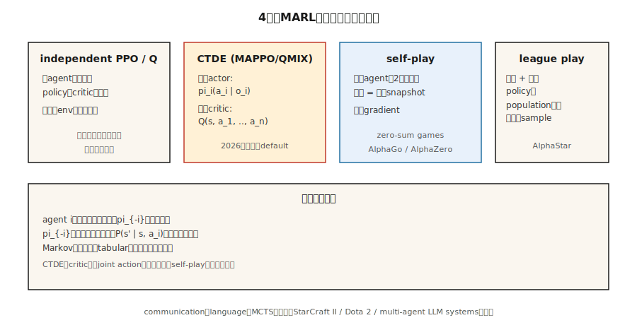

# Multi-Agent RL

> Single-agent RL は環境が stationary であると仮定する。同じ世界に2つの学習エージェントを置くと、その仮定は壊れる。各エージェントは相手の環境の一部であり、どちらも変化しているからだ。Multi-agent RL は、Markov 仮定が成り立たなくなっても学習を収束させるための技法群である。

**タイプ:** Build
**言語:** Python
**前提条件:** Phase 9 · 04 (Q-learning)、Phase 9 · 06 (REINFORCE)、Phase 9 · 07 (Actor-Critic)
**時間:** 約45分

## 問題

部屋を移動することを学ぶロボットは single-agent RL 問題である。サッカーチームは違う。AlphaStar 対 StarCraft の対戦相手も違う。入札エージェントの marketplace も違う。四方向停止で交渉する2台の車も違う。現実の many-on-many 問題の多くは single-agent ではない。

あらゆる multi-agent setting では、ある1つの agent から見て、他の agent は*環境*の一部である。他の agent が学習して行動を変えるにつれ、環境は non-stationary になる。Markov property、つまり「次状態は現在状態と自分の action だけに依存する」という性質は破られる。次状態は*他の* agent が選んだものにも依存し、その policy は動く標的だからだ。

これは tabular convergence proof を壊す。Q-learning の保証は stationary environment を仮定している。素朴な deep RL も壊れる。agent 同士がループ状に追いかけ合い、安定した policy に収束しない。必要なのは multi-agent 専用の技法である。centralized training / decentralized execution、counterfactual baseline、league play、self-play などだ。

2026年の応用: robot swarm、traffic routing、自律車両 fleet、market simulator、multi-agent LLM system (Phase 16)、そして複数の知的プレイヤーを持つあらゆるゲーム。

## コンセプト



**形式化: Markov Game。** MDP の一般化である。状態 `S`、joint action `a = (a_1, …, a_n)`、遷移 `P(s' | s, a)`、agent ごとの報酬 `R_i(s, a, s')` を持つ。各 agent `i` は自分の policy `π_i` の下で自分の return を最大化する。報酬が同一なら **fully cooperative**。zero-sum なら **adversarial**。混在するなら **general-sum** である。

**主要な課題:**

- **Non-stationarity。** agent `i` から見た `P(s' | s, a_i)` は、変化中の `π_{-i}` に依存する。
- **Credit assignment。** shared reward の場合、どの agent がそれを引き起こしたのか。
- **Exploration coordination。** agent は同じ状態を重複して探索するのではなく、相補的な strategy を探索しなければならない。
- **Scalability。** joint action space は `n` に対して指数的に増える。
- **Partial observability。** 各 agent は自分の observation しか見ない。global state は隠れている。

**4つの支配的な regime:**

**1. Independent Q-learning / independent PPO (IQL, IPPO)。** 各 agent が他者を環境の一部として扱い、自分の Q または policy を学習する。単純で、時には機能する。特に experience replay が smoothing agent-modeling trick として効く場合はそうだ。理論的収束性はない。実務では loosely-coupled task には十分なことがあり、tightly-coupled task には弱い。

**2. Centralized training, decentralized execution (CTDE)。** 現代で最も一般的な paradigma。各 agent は local observation `o_i` に条件づけられた自分の*policy* `π_i` を持ち、deployment では標準的な decentralized execution を行う。一方、*training* 中は centralized critic `Q(s, a_1, …, a_n)` が full global state と joint action に条件づけられる。例:
- **MADDPG** (Lowe et al. 2017): agent ごとに centralized critic を持つ DDPG。
- **COMA** (Foerster et al. 2017): counterfactual baseline。「もし自分が action `a'` を取っていたら reward はどうだったか」と問い、自分の寄与を分離する。
- **MAPPO** / **IPPO** with shared critic (Yu et al. 2022): centralized value function を使う PPO。2026年の cooperative MARL で支配的。
- **QMIX** (Rashid et al. 2018): value decomposition。`Q_tot(s, a) = f(Q_1(s, a_1), …, Q_n(s, a_n))` を monotonic mixing で構成する。

**3. Self-play。** 同じ agent の2つのコピーが互いに対戦する。opponent の policy は、過去 snapshot の自分の policy である。AlphaGo / AlphaZero / MuZero。OpenAI Five。zero-sum game で最もよく機能し、training signal は対称的である。

**4. League play。** self-play を general-sum / adversarial environment に拡張したもの。過去と現在の policy の population を保持し、league から opponent を sample して訓練する。exploiter (現在の best を倒すことに特化) と main exploiter (exploiter を倒すことに特化) を加える。AlphaStar (StarCraft II)。ゲームに「rock-paper-scissors」型の strategy cycle がある場合に必要となる。

**Communication。** agent 同士が学習済み message `m_i` を送り合えるようにする。cooperative setting で機能する。Foerster et al. (2016) は differentiable inter-agent communication を end-to-end で訓練できることを示した。現在の LLM-based multi-agent system (Phase 16) は、本質的に自然言語で communication している。

## 作るもの

このレッスンでは、2体の cooperative agent を持つ 6×6 GridWorld を使う。agent は反対側の角から開始し、shared goal に到達しなければならない。shared reward は、どちらかがまだ動いている間は step ごとに `-1`、両方が到着すると `+10`。`code/main.py` を参照。

### Step 1: multi-agent env

```python
class CoopGridWorld:
    def __init__(self):
        self.size = 6
        self.goal = (5, 5)

    def reset(self):
        return ((0, 0), (5, 0))  # two agents

    def step(self, state, actions):
        a1, a2 = state
        new1 = move(a1, actions[0])
        new2 = move(a2, actions[1])
        done = (new1 == self.goal) and (new2 == self.goal)
        reward = 10.0 if done else -1.0
        return (new1, new2), reward, done
```

*joint* action space は `|A|² = 16`。global state は2つの位置である。

### Step 2: independent Q-learning

各 agent は joint state を key にした自分の Q-table を実行する。各 step で、両方が ε-greedy action を選び、joint transition を集め、shared reward でそれぞれの Q を更新する。

```python
def independent_q(env, episodes, alpha, gamma, epsilon):
    Q1, Q2 = defaultdict(default_q), defaultdict(default_q)
    for _ in range(episodes):
        s = env.reset()
        while not done:
            a1 = epsilon_greedy(Q1, s, epsilon)
            a2 = epsilon_greedy(Q2, s, epsilon)
            s_next, r, done = env.step(s, (a1, a2))
            target1 = r + gamma * max(Q1[s_next].values())
            target2 = r + gamma * max(Q2[s_next].values())
            Q1[s][a1] += alpha * (target1 - Q1[s][a1])
            Q2[s][a2] += alpha * (target2 - Q2[s][a2])
            s = s_next
```

この task では reward が dense で aligned なので機能する。tightly-coupled task、たとえば一方の agent が他方を*待つ*必要がある場合には失敗する。

### Step 3: decomposed-value update 付き centralized Q

joint action 上の単一 Q `Q(s, a_1, a_2)` を使う。shared reward から更新する。execution 時は marginalize して decentralize する: `π_i(s) = argmax_{a_i} max_{a_{-i}} Q(s, a_1, a_2)`。指数的な joint action space と引き換えに、*正しい* global view を得る。

### Step 4: simple self-play (adversarial 2-agent)

同じ agent、2つの role。agent A を agent B に対して訓練し、`K` episode ごとに A の weights を B にコピーする。対称的な訓練で、一貫した進歩を得る。AlphaZero recipe の縮小版である。

## 落とし穴

- **Non-stationary replay。** independent agent での experience replay は single-agent より悪化する。古い transition は、いまでは obsolete な opponent によって生成されたものだからだ。対策: relabel する、または recency で重み付けする。
- **Credit assignment ambiguity。** 長い episode の後に shared reward が来ると、どの agent が貢献したか明確でない。対策: counterfactual baseline (COMA)、または agent ごとの reward shaping。
- **Policy drift / chasing。** 各 agent の best response は、相手の更新ごとに変わる。対策: centralized critic、遅い learning rate、または一方ずつ freeze する。
- **coordination による reward hacking。** agent が設計者の予期しない coordinated exploit を見つける。auction agent が bid zero に収束する。対策: careful reward design、behavioral constraints。
- **Exploration redundancy。** 両方の agent が同じ state-action pair を探索する。対策: agent ごとの entropy bonus、または role-conditioning。
- **League cycles。** pure self-play は dominance cycle にはまりうる。対策: diverse opponents を持つ league play。
- **Sample explosion。** `n` agents × state space × joint actions。function approximation で近似し、factored action space (agent ごとに1つの policy output head) を使う。

## 使いどころ

2026年の MARL application map:

| Domain | Method | Notes |
|--------|--------|-------|
| Cooperative navigation / manipulation | MAPPO / QMIX | CTDE; shared critic + decentralized actors。 |
| Two-player games (chess, Go, poker) | Self-play with MCTS (AlphaZero) | Zero-sum; symmetric training。 |
| Complex multiplayer (Dota, StarCraft) | League play + imitation pretraining | OpenAI Five, AlphaStar。 |
| Autonomous-vehicle fleets | CTDE MAPPO / PPO with attention | Partial obs; variable team sizes。 |
| Auction markets | Game-theoretic equilibrium + RL | `n` → ∞ のとき mean-field RL。 |
| LLM multi-agent systems (Phase 16) | Natural-language comm + role conditioning | agent-planning layer での RL loop。 |

2026年における MARL 最大の成長領域は LLM-based である。言語モデル agent の swarm が交渉し、討論し、ソフトウェアを作る。RL は token-level ではなく*trajectory-level* output 上の preference optimization として現れる (Phase 16 · 03)。

## 出荷するもの

`outputs/skill-marl-architect.md` として保存する:

```markdown
---
name: marl-architect
description: 与えられた task に対して適切な multi-agent RL regime (IPPO, CTDE, self-play, league) を選ぶ。
version: 1.0.0
phase: 9
lesson: 10
tags: [rl, multi-agent, marl, self-play]
---

`n` 体の agent を持つ task を受け取り、次を出力する:

1. Regime classification。Cooperative / adversarial / general-sum。根拠を示す。
2. Algorithm。IPPO / MAPPO / QMIX / self-play / league。coupling の強さと reward structure に結びつけて理由を述べる。
3. Information access。Centralized training (critic に渡す global info は何か)? Decentralized execution?
4. Credit assignment。Counterfactual baseline、value decomposition、または reward shaping。
5. Exploration plan。Per-agent entropy、population-based training、または league。

Tightly-coupled cooperative task で independent Q-learning を拒否する。cycle risk のある general-sum に self-play を推奨することを拒否する。fixed-opponent eval のない MARL pipeline は flag する (cherry-picked self-play numbers はよくある)。
```

## 演習

1. **Easy。** 2-agent cooperative GridWorld で independent Q-learning を訓練する。mean return > 0 まで何 episode かかるか。joint learning curve を plot する。
2. **Medium。** 「coordination」task を追加する。両方の agent が同じ turn に goal に乗ったときだけ goal に到達したとする。independent Q はまだ収束するか。何が壊れるか。
3. **Hard。** MAPPO-style training 向けの centralized critic を実装し、coordination task で independent PPO と convergence speed を比較する。

## 重要用語

| 用語 | よく言われる表現 | 実際の意味 |
|------|-----------------|-----------------------|
| Markov game | 「Multi-agent MDP」 | `(S, A_1, …, A_n, P, R_1, …, R_n)`; 各 agent が自分の reward を持つ。 |
| CTDE | 「Centralized training, decentralized execution」 | training 時は joint critic、各 agent の policy は local obs だけを使う。 |
| IPPO | 「Independent PPO」 | 各 agent が PPO を別々に実行する。単純な baseline だが、しばしば過小評価される。 |
| MAPPO | 「Multi-agent PPO」 | global state に条件づけた centralized value function を使う PPO。 |
| QMIX | 「Monotonic value decomposition」 | `Q_tot = f_monotone(Q_1, …, Q_n)` により decentralized argmax が可能。 |
| COMA | 「Counterfactual multi-agent」 | Advantage = 自分の Q から、自分の action で marginalize した expected Q を引いたもの。 |
| Self-play | 「Agent vs past self」 | 単一 agent、2つの role。zero-sum game の標準。 |
| League play | 「Population training」 | past policy を cache し、pool から opponent を sample する。strategy cycle を扱う。 |

## 参考文献

- [Lowe et al. (2017). Multi-Agent Actor-Critic for Mixed Cooperative-Competitive Environments (MADDPG)](https://arxiv.org/abs/1706.02275) — centralized critic を使う CTDE。
- [Foerster et al. (2017). Counterfactual Multi-Agent Policy Gradients (COMA)](https://arxiv.org/abs/1705.08926) — credit assignment 向け counterfactual baseline。
- [Rashid et al. (2018). QMIX: Monotonic Value Function Factorisation](https://arxiv.org/abs/1803.11485) — monotonicity を持つ value decomposition。
- [Yu et al. (2022). The Surprising Effectiveness of PPO in Cooperative Multi-Agent Games (MAPPO)](https://arxiv.org/abs/2103.01955) — PPO は MARL でも驚くほど強い。
- [Vinyals et al. (2019). Grandmaster level in StarCraft II using multi-agent reinforcement learning (AlphaStar)](https://www.nature.com/articles/s41586-019-1724-z) — 大規模 league play。
- [Silver et al. (2017). Mastering the game of Go without human knowledge (AlphaGo Zero)](https://www.nature.com/articles/nature24270) — zero-sum game における pure self-play。
- [Sutton & Barto (2018). Ch. 15 — Neuroscience & Ch. 17 — Frontiers](http://incompleteideas.net/book/RLbook2020.pdf) — textbook による multi-agent setting と、CTDE が解く non-stationarity 問題の短い扱い。
- [Zhang, Yang & Başar (2021). Multi-Agent Reinforcement Learning: A Selective Overview](https://arxiv.org/abs/1911.10635) — cooperative、competitive、mixed MARL と convergence result を扱うサーベイ。
