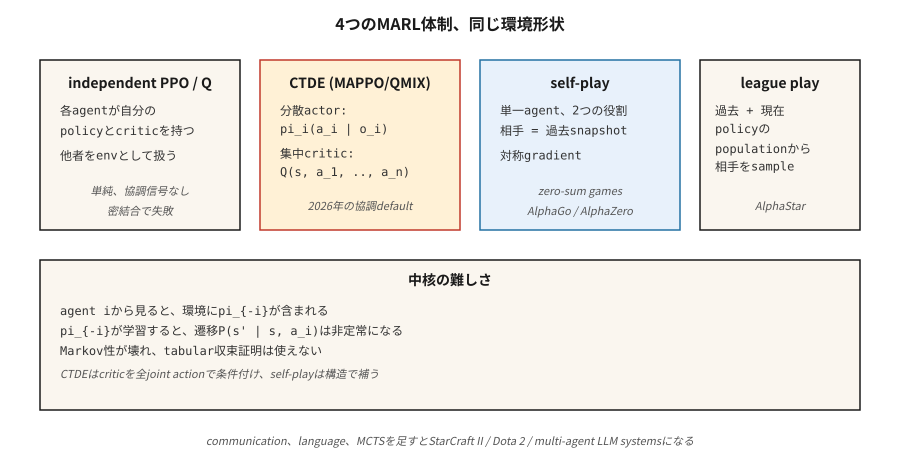

# Çoklu Agent RL

> Single-agent RL ortamın sabit olduğunu varsayar. İki öğrenen agent'yi aynı dünyaya koyduğunuzda bu varsayım bozulur: her agent diğerinin ortamının parçasıdır ve her ikisi de değişmektedir. Multi-agent RL, Markov varsayımı artık geçerli olmadığında öğrenmeyi yakınsamaya yönelik bir dizi püf noktasıdır.

**Tür:** Yapım
**Diller:** Python
**Önkoşullar:** Aşama 9 · 04 (Q-öğrenme), Aşama 9 · 06 (GÜÇLENDİRME), Aşama 9 · 07 (Aktör-Eleştirmen)
**Süre:** ~45 dakika

## Sorun

Bir odada gezinmeyi öğrenen bir robot tek agent RL problemidir. Futbol takımı değil. AlphaStar vs StarCraft rakipleri değil. agent tekliflerinin verildiği bir pazar yeri değildir. İki arabanın dört yönlü bir durak için pazarlık yapması doğru değil. Çoğuna-çoğa gerçek dünya sorunları öyle değil.

Her çoklu agent ayarında, herhangi bir agent'nin bakış açısına göre, diğer agent'ler *çevrenin bir parçasıdır*. Öğrenip davranışlarını değiştirdikçe çevre durağan hale gelir. Markov özelliği - "sonraki durum yalnızca mevcut duruma ve eylemime bağlı" - ihlal ediliyor çünkü sonraki durum aynı zamanda *diğer* agent'lerin seçimine de bağlı ve politikaları hareketli hedefler.

Bu, tablosal yakınsama kanıtlarını bozar (Q-öğrenmenin garantisi sabit bir ortam varsayar). Bu aynı zamanda saf RL'yi de bozuyor: agent'ler döngüler halinde birbirini kovalıyor, asla istikrarlı bir politikaya yaklaşmıyor. Çoklu agent'ye özgü tekniklere ihtiyacınız var: merkezi eğitim / merkezi olmayan uygulama, karşı olgusal temeller, lig oyunu, kendi kendine oyun.

2026 uygulamaları: robot sürüleri, trafik yönlendirme, otonom araç filoları, pazar simülatörleri, çoklu agent LLM sistemleri (Aşama 16) ve birden fazla akıllı oyuncunun bulunduğu herhangi bir oyun.

## Konsept



**Biçimcilik: Markov Oyunu.** MDP'nin bir genellemesi: `S`, ortak eylem `a = (a_1, …, a_n)`, geçiş `P(s' | s, a)` ve agent başına ödül `R_i(s, a, s')`'yi belirtir. Her agent `i`, kendi `π_i` politikası kapsamında kendi getirisini maksimuma çıkarır. Ödüller aynıysa **tamamen işbirliğine dayalıdır**. Sıfır toplamlı ise **çelişkilidir**. Karma ise **genel toplam** olur.

**Temel zorluklar:**

- **Durağan olmama.** agent'den `P(s' | s, a_i)` `i`'nin görüşü, değişen `π_{-i}`'ye bağlıdır.
- **Kredi tahsisi.** Paylaşılan bir ödülle buna hangi agent sebep oldu?
- **Keşif koordinasyonu.** Agent'ler aynı durumu gereksiz yere keşfetmemeli, tamamlayıcı stratejileri keşfetmelidir.
- **Ölçeklenebilirlik.** `n`'de ortak eylem alanı katlanarak büyüyor.
- **Kısmi observability.** Her agent yalnızca kendi gözlemini görür; küresel durum gizlidir.

**Dört baskın rejim:**

**1. Bağımsız Q-öğrenme / bağımsız PPO (IQL, IPPO).** Her agent, diğerlerine ortamın bir parçası olarak davranarak kendi Q'sunu veya politikasını öğrenir. Basit, bazen işe yarıyor (özellikle yumuşatıcı bir agent modelleme numarası görevi gören deneyim tekrarıyla). Teorik yakınsama: yok. Uygulamada: gevşek bağlı görevler için iyi, sıkı bağlı görevler için kötü.

**2. Merkezi eğitim, merkezi olmayan uygulama (CTDE).** En yaygın modern paradigma. Her agent'nin, yerel gözlem `o_i`'yi (deployment'de standart merkezi olmayan yürütme) koşullandıran kendi *politikası* `π_i` vardır. *Eğitim* sırasında, merkezi bir eleştirmen `Q(s, a_1, …, a_n)`, küresel durumun ve ortak eylemin tamamını şart koşar. Örnekler:
- **MADDPG** (Lowe ve diğerleri 2017): agent'ye göre merkezi eleştiriye sahip DDPG.
- **COMA** (Foerster ve ark. 2017): karşı-olgusal temel — "Bunun yerine `a'` eylemini gerçekleştirseydim ödülüm ne olurdu?" diye sorun. — benim katkımı izole ediyor.
- **MAPPO** / **IPPO**, paylaşılan eleştiriyle (Yu ve ark. 2022): Merkezi değer fonksiyonuna sahip PPO. 2026'da kooperatif MARL için baskın.
- **QMIX** (Rashid ve diğerleri 2018): değer ayrışımı — monotonik karıştırma ile `Q_tot(s, a) = f(Q_1(s, a_1), …, Q_n(s, a_n))`.

**3. Kendi kendine oynatma.** Aynı agent'nin iki kopyası birbirini oynatır. Rakibin politikası benim geçmişteki anlık bir fotoğraftan kalma politikam *dır*. AlphaGo / AlphaZero / MuZero. OpenAI Beş. Sıfır toplamlı oyunlar için en iyi sonucu verir; eğitim sinyali simetriktir.

**4. Lig oyunu.** Kendi kendine oynamanın genel toplam/düşman ortamlarına genişletilmesi: geçmiş ve güncel politikaların bir listesini tutun, ligden bir rakip örnekleyin, onlara karşı antrenman yapın. Sömürücüleri (mevcut en iyiyi yenmede uzmanlaşır) ve ana sömürücüleri (sömürücüleri yenmede uzmanlaşır) ekler. AlphaStar (StarCraft II). Oyun "taş-kağıt-makas" strateji döngülerini kabul ettiğinde gereklidir.

**İletişim.** agent'lerin birbirlerine `m_i` öğrenilen mesajları göndermesine izin verin. Kooperatif ortamında çalışır. Foerster ve ark. (2016), farklılaştırılabilir agent arası iletişimin uçtan uca eğitilebileceğini gösterdi. Günümüzün LLM tabanlı çoklu agent sistemleri (Faz 16) esas olarak doğal dilde iletişim kurar.

## İnşa Et

Bu derste iki ortak agent içeren 6×6 GridWorld kullanılıyor. Zıt köşelerden başlarlar ve ortak bir hedefe ulaşmaları gerekir. Paylaşılan ödül: agent hala hareket halindeyken adım başına `-1`, her ikisi de geldiğinde `+10`. Bkz. `code/main.py`.

### Adım 1: çoklu agent env

```python
class CoopGridWorld:
    def __init__(self):
        self.size = 6
        self.goal = (5, 5)

    def reset(self):
        return ((0, 0), (5, 0))  # two agents

    def step(self, state, actions):
        a1, a2 = state
        new1 = move(a1, actions[0])
        new2 = move(a2, actions[1])
        done = (new1 == self.goal) and (new2 == self.goal)
        reward = 10.0 if done else -1.0
        return (new1, new2), reward, done
```

*Ortak* eylem alanı `|A|² = 16`'dir. Küresel devlet iki konumdur.

### Adım 2: bağımsız Q-öğrenme

Her agent, ortak duruma göre anahtarlanmış kendi Q tablosunu çalıştırır. Her adımda: her ikisi de ε-açgözlü eylemleri seçer, ortak geçişi toplar, her biri paylaşılan ödülle kendi Q'sunu günceller.

```python
def independent_q(env, episodes, alpha, gamma, epsilon):
    Q1, Q2 = defaultdict(default_q), defaultdict(default_q)
    for _ in range(episodes):
        s = env.reset()
        while not done:
            a1 = epsilon_greedy(Q1, s, epsilon)
            a2 = epsilon_greedy(Q2, s, epsilon)
            s_next, r, done = env.step(s, (a1, a2))
            target1 = r + gamma * max(Q1[s_next].values())
            target2 = r + gamma * max(Q2[s_next].values())
            Q1[s][a1] += alpha * (target1 - Q1[s][a1])
            Q2[s][a2] += alpha * (target2 - Q2[s][a2])
            s = s_next
```

Ödüller yoğun ve uyumlu olduğundan bu görev üzerinde çalışır. Sıkı bağlantılı görevlerde başarısız olur (e.g., burada bir agent diğerini *beklemek* zorundadır).

### Adım 3: ayrıştırılmış değer güncellemesiyle merkezi Q

Ortak eylemlerde bir Q kullanın `Q(s, a_1, a_2)`. Paylaşılan ödülden güncelleme. Marjinalleştirerek yürütme sırasında merkezi olmayan hale getirin: `π_i(s) = argmax_{a_i} max_{a_{-i}} Q(s, a_1, a_2)`. *Doğru* bir küresel görünüm için üstel ortak eylem alanını değiştirir.

### Adım 4: kendi kendine basit oyun (düşmanca 2-agent)

Aynı agent, iki rol. agent A'yı agent B'ye karşı eğitin; `K` bölümlerinden sonra A'nın ağırlıklarını B'ye kopyalayın. Simetrik eğitim, tutarlı ilerleme. Minyatürde AlphaZero tarifi.

## Tuzaklar

- **Durağan olmayan tekrar oynatma.** Bağımsız agent'lerle tekrar oynatma deneyimi, tek agent'den daha kötüdür çünkü eski geçişler artık geçerliliğini yitirmiş rakipler tarafından oluşturulmuştur. Düzeltme: yeniliğe göre yeniden etiketleme veya ağırlıklandırma.
- **Kredi tahsisinde belirsizlik.** Uzun bir bölümün ardından paylaşılan ödül; Hangi agent'nin katkıda bulunduğunu söylemenin net bir yolu yok. Düzeltme: Karşıolgusal taban çizgileri (COMA) veya agent'ye göre ödül şekillendirme.
- **Politika sürüklenme / takip.** Her agent'nin en iyi tepkisi, birbirlerinin güncellemesiyle değişir. Düzeltme: Merkezi eleştiri, yavaş öğrenme oranları veya birer birer donma.
- **Koordinasyon yoluyla hacklemeyi ödüllendirin.** Agent'ler, tasarımcının öngörmediği koordineli istismarlar bulur. Açık artırma agent'ler sıfır teklif verecek şekilde birleşir. Düzeltme: Dikkatli ödül tasarımı, davranışsal kısıtlamalar.
- **Keşif yedekliliği.** Her iki agent de aynı durum-eylem çiftlerini araştırır. Düzeltme: agent başına entropi bonusları veya rol koşullandırma.
- **Lig döngüleri.** Tamamen kendi kendine oynama, bir hakimiyet döngüsünde sıkışıp kalabilir. Düzeltme: Farklı rakiplerle ligde oynama.
- **Örnek patlama.** `n` agents × durum alanı × ortak eylemler. Fonksiyon yaklaşımıyla yaklaşık; faktörlü eylem alanları (agent başına bir politika çıktı başlığı).

## Kullan onu

2026 MARL uygulama haritası:

| Etki Alanı | Yöntem | Notlar |
|--------|--------|-------|
| İşbirliğine dayalı navigasyon / manipülasyon | MAPPO / QMIX | CTDE; paylaşılan eleştirmen + merkezi olmayan aktörler. |
| İki oyunculu oyunlar (satranç, Go, poker) | MCTS (AlphaZero) ile kendi kendine oynama | Sıfır toplam; Simetrik eğitim. |
| Karmaşık çok oyunculu (Dota, StarCraft) | Lig maçı + taklit ön eğitimi | OpenAI Beş, AlphaStar. |
| Otonom araç filoları | CTDE MAPPO / PPO dikkatle | Kısmi gözlem; değişken takım boyutları. |
| Açık artırma pazarları | Oyun-teorik denge + RL | `n` → ∞ olduğunda ortalama alan RL. |
| Yüksek Lisans multi-agent sistemleri (Faz 16) | Doğal dil iletişim + rol koşullandırma | agent planlama katmanındaki RL döngüsü. |

2026 yılında, MARL'ın en büyük büyüme alanı Yüksek Lisans tabanlıdır: agent dil modeli sürüsü müzakere eder, tartışır ve yazılım oluşturur. RL, token düzeyinde değil (Aşama 16 · 03) *yörünge düzeyindeki* çıkışlarda tercih optimizasyonu olarak görünür.

## Gönderin

`outputs/skill-marl-architect.md` olarak kaydet:

```markdown
---
name: marl-architect
description: Pick the right multi-agent RL regime (IPPO, CTDE, self-play, league) for a given task.
version: 1.0.0
phase: 9
lesson: 10
tags: [rl, multi-agent, marl, self-play]
---

Given a task with `n` agents, output:

1. Regime classification. Cooperative / adversarial / general-sum. Justify.
2. Algorithm. IPPO / MAPPO / QMIX / self-play / league. Reason tied to coupling tightness and reward structure.
3. Information access. Centralized training (what global info goes to the critic)? Decentralized execution?
4. Credit assignment. Counterfactual baseline, value decomposition, or reward shaping.
5. Exploration plan. Per-agent entropy, population-based training, or league.

Refuse independent Q-learning on tightly-coupled cooperative tasks. Refuse to recommend self-play for general-sum with cycle risks. Flag any MARL pipeline without a fixed-opponent eval (cherry-picked self-play numbers are common).
```

## Egzersizler

1. **Kolay.** 2-agent ortak GridWorld'de bağımsız Q-öğrenmeyi eğitin. Ortalama dönüş > 0 olana kadar kaç bölüm var? Ortak öğrenme eğrisini çizin.
2. **Orta.** Bir "koordinasyon" görevi ekleyin: hedefe yalnızca her iki agent aynı turda hedefe adım attığında ulaşılır. Bağımsız Q hala yakınsıyor mu? Ne kırılıyor?
3. **Zor.** MAPPO tarzı eğitim için merkezi bir eleştiri uygulayın ve koordinasyon görevinde yakınsama hızını bağımsız PPO ile karşılaştırın.

## Anahtar Terimler

| Dönem | İnsanlar ne diyor | Aslında ne anlama geliyor |
|------|-----------------|-----------------------|
| Markov oyunu | "Çoklu agent MDP" | `(S, A_1, …, A_n, P, R_1, …, R_n)`; her agent'nin kendi ödülü vardır. |
| CTDE | "Merkezi eğitim, merkezi olmayan uygulama" | Eğitim sırasında ortak eleştirmen; her agent'nin politikası yalnızca yerel gözlemleri kullanır. |
| IPPO | "Bağımsız PPO" | Her agent, PPO'yu ayrı ayrı çalıştırır. Basit temel; çoğu zaman küçümsenir. |
| MAPPO | "Çoklu agent PPO" | Küresel duruma bağlı merkezi değer fonksiyonuna sahip PPO. |
| QMIX | "Monotonik değer ayrışımı" | `Q_tot = f_monotone(Q_1, …, Q_n)` merkezi olmayan argmax'a izin verir. |
| KOMA | "Karşıolgusal çoklu-agent" | Avantaj = benim Q eksi beklenen Q'nun eylemim üzerinde marjinalleşmesi. |
| Kendi kendine oynama | "Agent ve geçmiş benlik" | Tek agent, iki rol; Sıfır toplamlı oyunlar için standart. |
| Lig maçı | "Nüfus eğitimi" | Geçmiş politikaları önbelleğe alın, havuzdan rakipleri örnekleyin; strateji döngülerini yönetir. |

## Daha Fazla Okuma

- [Lowe ve ark. (2017). Çoklu Agent Karma İşbirlikçi-Rekabetçi Ortamlar için Aktör-Eleştirmen (MADDPG)](https://arxiv.org/abs/1706.02275) — Merkezi bir eleştirmenle CTDE.
- [Foerster ve ark. (2017). Karşı Olgusal Çoklu Agent Politikası Gradients (COMA)](https://arxiv.org/abs/1705.08926) — kredi ataması için karşı olgusal temel çizgiler.
- [Rashid ve ark. (2018). QMIX: Monotonik Değer Fonksiyonunun Çarpanlara Ayrılması](https://arxiv.org/abs/1803.11485) — monotonluk ile değer ayrışımı.
- [Yu ve ark. (2022). İşbirliğine Dayalı Çoklu Agent Oyunlarında PPO'nun Şaşırtıcı Etkinliği (MAPPO)](https://arxiv.org/abs/2103.01955) — PPO, MARL için şaşırtıcı derecede güçlüdür.
- [Vinyals ve diğerleri. (2019). StarCraft II'de çoklu agent takviyeli öğrenim (AlphaStar)](https://www.nature.com/articles/s41586-019-1724-z) kullanan büyük ustalık seviyesi — geniş ölçekte lig oyunu.
- [Gümüş ve ark. (2017). Go oyununda insan bilgisi olmadan ustalaşmak (AlphaGo Zero)](https://www.nature.com/articles/nature24270) — sıfır toplamlı oyunlarda saf kendi kendine oyun.
- [Sutton ve Barto (2018). Ch. 15 — Sinirbilim ve Böl. 17 — Sınırlar](http://incompleteideas.net/book/RLbook2020.pdf) — ders kitabının çoklu agent ayarlarına ilişkin kısa incelemesini ve CTDE'nin çözmek üzere tasarlandığı durağan olmama sorununu içerir.
- [Zhang, Yang ve Başar (2021). Multi-Agent Takviyeli Öğrenme: Seçici Bir Genel Bakış](https://arxiv.org/abs/1911.10635) — işbirlikçi, rekabetçi ve karma MARL'yi yakınsama sonuçlarıyla kapsayan anket.
