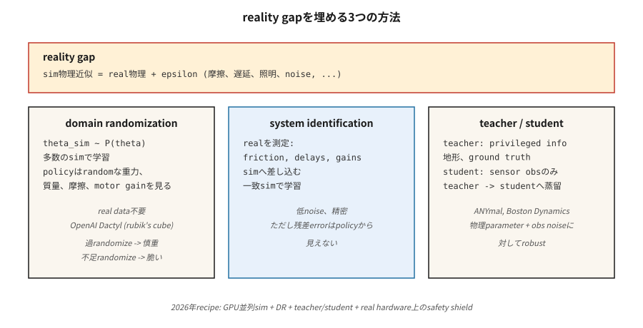

# Sim'den Gerçeğe Aktarım

> Donanımda arıza yapan bir simülatörde eğitilen politika, simülatörü ezberleyen bir politikadır. Etki alanı rastgeleleştirmesi, etki alanı uyarlaması ve sistem tanımlaması, öğrenilmiş denetleyicilerin gerçeklik boşluğunu aşmasını sağlayan üç araçtır.

**Tür:** Learn
**Diller:** Python
**Önkoşullar:** Aşama 9 · 08 (PPO), Aşama 2 · 10 (Önyargı/Varyans)
**Süre:** ~45 dakika

## Sorun

Gerçek bir robotu eğitmek yavaş, tehlikeli ve pahalıdır. İki ayaklı bir kişinin yürümeyi öğrenmesi için milyonlarca eğitim bölümü gerekir; Donanımı kırdığında bile devrilen gerçek bir iki ayaklı. Simülasyon size sınırsız sıfırlama, deterministik tekrarlanabilirlik, paralel ortamlar sunar ve hiçbir fiziksel hasar vermez.

Ancak simülatörler yanılıyor. Rulmanlar MuJoCo modellerine göre daha fazla sürtünmeye sahiptir. Kameralarda simülatörün içermediği lens distorsiyonu vardır. Motorlarda sim modellerinin %99'unun atladığı gecikmeler, boşluklar ve doygunluk vardır. Rüzgar, toz ve değişken aydınlatma, steril işleme üzerine eğitilmiş bir politikayı sabote ediyor. **Gerçeklik açığı** (simülasyon dağıtımı ile gerçek dağıtım arasındaki sistematik fark), robotik için konuşlandırılmış RL'nin temel sorunudur.

*Simülasyondan gerçek dağıtıma geçişe dayanıklı* bir politikaya ihtiyacınız var. Üç tarihsel yaklaşım: simülatörü rastgele hale getirme (etki alanı rastgeleleştirmesi), politikayı biraz gerçek verilerle uyarlama (etki alanı uyarlaması / fine-tuning) veya gerçek sistemin parametrelerini belirleyip bunları eşleştirme (sistem tanımlama). 2026'da baskın tarif, üçünü de devasa paralel simülasyonla birleştiriyor (Isaac Sim, Isaac Lab, GPU'da Mujoco MJX).

## Konsept



**Alan Rastgeleleştirmesi (DR).** Tobin ve ark. 2017, Peng ve ark. 2018. Eğitim sırasında gerçek robotta farklılık gösterebilecek her sim parametresini rastgele yapın: kütleler, sürtünme katsayıları, motor PD kazançları, sensör gürültüsü, kamera konumu, aydınlatma, dokular, temas modelleri. Politika, "bugün hangi sim'de olduğu" konusunda koşullu bir dağılım öğrenir ve tüm kapsam boyunca genelleme yapar. Gerçek robot eğitim kapsamına girerse politika işe yarar.

- **Artı:** gerçek verilere gerek yok. Tek tarif, birçok robot.
- **Dezavantajı:** Aşırı rastgeleleştirilmiş eğitim "evrensel" ancak aşırı ihtiyatlı bir politika üretir. Çok fazla gürültü ≈ çok fazla düzenleme.

**Sistem Tanımlaması (SI).** Eğitimden önce simülatörün parametrelerini gerçek dünya verilerine uyarlayın. Eğer gerçek robotta kol-eklem sürtünmesini ölçebiliyorsanız bunu sim'e takın. Daha sonra bu değerleri bekleyen bir politika geliştirin. Gerçek sisteme erişime ihtiyaç duyar ancak gerçeklik açığını doğrudan azaltır.

- **Artı:** kesin, düşük gürültülü egzersiz hedefi.
- **Dezavantajı:** kalan model hatası politika tarafından görülmez; küçük tanımlanamayan etkiler (e.g. motor ölü bandı) hâlâ deployment'yi bozuyor.

**Alan Adı Uyarlaması.** Simülasyonla eğitim alın, az miktarda gerçek veriyle ince ayarlar yapın. İki tat:

- **Real2Sim2Real:** Gerçek kullanıma sunmaları kullanarak artık bir simülatör `f(s, a, z) - f_sim(s, a)` öğrenin, düzeltilmiş simülasyonda eğitim alın. Çok fazla gerçek veri olmadan açığı kapatır.
- **Gözlem uyarlaması:** öğrenilmiş bir özellik çıkarıcı (e.g. GAN pikselden piksele) aracılığıyla gerçek gözlemleri → sim benzeri gözlemleri eşleyen bir politika eğitin. Denetleyici sim'de kalır.

**Ayrıcalıklı öğrenme / öğretmen-öğrenci.** Miki ve ark. 2022 (HERHANGİ BİR DÖRTLÜ). Ayrıcalıklı bilgilere (yer gerçeği sürtünmesi, arazi yüksekliği, IMU kayması) erişimi olan bir *öğretmeni* simülasyonda eğitin. Yalnızca gerçek sensör gözlemlerini gören bir *öğrenciyi* damıtın. Öğrenci, geçmişten fiziksel parametrelere karşı dayanıklı ayrıcalıklı özellikler çıkarmayı öğrenir.

**Devasa paralel simülasyon.** 2024–2026. Isaac Lab, Mujoco MJX ve Brax, hepsi tek bir GPU üzerinde binlerce paralel robotu çalıştırıyor. 4.096 paralel insansı robota sahip PPO, yılların deneyimini saatler içinde topluyor. Eğitim dağılımı genişledikçe "gerçeklik açığı" daralıyor; Bu 4.096 ortamın her biri farklı rastgele parametrelere sahip olduğunda DR neredeyse ücretsiz hale gelir.

**Gerçek dünyadaki 2026 tarifi (dört ayaklı yürüme örneği):**

1. Alana göre rastgeleleştirilmiş yerçekimi, sürtünme, motor kazanımları ve yük ile devasa paralel simülasyon.
2. Ayrıcalıklı bilgilerle (arazi haritası, vücut hızı temel gerçeği) eğitilmiş öğretmen politikası.
3. Öğrenci politikası yalnızca propriyosepsiyon (bacak eklem kodlayıcıları) kullanılarak öğretmenden damıtılmıştır.
4. Gerçek IMU üzerinde otomatik kodlayıcı aracılığıyla isteğe bağlı gözlem uyarlaması.
5. Dağıtın. 10'dan fazla ortamda sıfır atış. Başarısız olursa, güvenliği kısıtlı PPO ile dakikalarca gerçek dünya fine-tuning yapın.

## Build It — Kendin İnşa Et

Bu dersin kodu, *gürültülü* geçişlerle GridWorld'de etki alanı rastgeleleştirmesinin küçük bir gösterimidir. "Sim"de rastgele kayma olasılıklarını deneyimleyen ve eğitim sırasında hiç görmediği bir kayma seviyesiyle "gerçek" üzerinde değerlendirme yapan bir politika yetiştiriyoruz. Şekil doğrudan MuJoCo'dan donanıma aktarımla eşleşir.

### Adım 1: parametreli sim

```python
def step(state, action, slip):
    if rng.random() < slip:
        action = random_perpendicular(action)
    ...
```

`slip` simülatörün ortaya çıkardığı bir parametredir. Gerçek robotikte sürtünme, kütle, motor kazancı, sim ile gerçek arasında geçiş yapan herhangi bir şey olabilir.

### 2. Adım: DR ile antrenman yapın

Her bölümün başında `slip ~ Uniform[0.0, 0.4]` örneğini alın. PPO / Q-öğrenme / herhangi bir şeyi eğitin. Bunu birçok bölüm için yapın.

### 3. Adım: "gerçek" fişlerde sıfır atışı değerlendirin

`slip ∈ {0.0, 0.1, 0.2, 0.3, 0.5, 0.7}` üzerinde değerlendirin. İlk dördü eğitim desteği kapsamındadır; `0.5` ve `0.7` dışarıda. DR tarafından eğitilmiş bir politika, iç destekte optimale yakın kalmalı ve dışarıda incelikli bir şekilde düşmelidir. Sabit kaymalı eğitimli bir politika, eğitim fişinin dışında kırılgan olacaktır.

### Adım 4: dar eğitimle karşılaştırın

Yalnızca `slip = 0.0` ile ikinci bir politika eğitin. Aynı `slip` taramada değerlendirin. Gerçek kayma > 0 olur olmaz yıkıcı bir düşüş görmelisiniz.

## Tuzaklar

- **Çok fazla rastgeleleştirme.** `slip ∈ [0, 0.9]` konusunda eğitim aldığınızda politikanız riskten o kadar kaçınır ki asla en uygun yolu denemez. "Her şey olabilir" ifadesini değil, *beklenen* gerçek dünya dağılımını eşleştirin.
- **Çok az rastgeleleştirme.** İnce bir dilim üzerinde eğitim alırsanız politika hiçbir şekilde genelleştirilemez. Politika geliştikçe dağıtımı genişleten uyarlanabilir müfredatı (Otomatik Etki Alanı Rastgeleleştirmesi) kullanın.
- **Yanlış tanımlanmış parametre alanı.** Yanlış şeyi rastgele hale getirin (gerçek boşluk motor gecikmesi olduğunda kamera rengi) ve DR yardımcı olmaz. Önce gerçek robotun profilini çıkarın.
- **Ayrıcalıklı bilgi sızıntısı.** Yalnızca gözlemler için değil, eylemler için de küresel durumu kullanan bir öğretmen, yetişemeyen bir öğrenci üretebilir. Öğretmenin politikasının öğrenciye verilen gözlem geçmişi ile gerçekleştirilebilir olmasını sağlayın.
- **Simden sim'e aktarım hatası.** Politikanız daha zorlu bir sim sürümüne karşı dayanıklı değilse, gerçek dünyaya da dayanıklı olmayacaktır. Dağıtımdan önce daima uzatılmış bir sim varyantı üzerinde test yapın.
- **Gerçek dünyada güvenlik zarfı yok.** Simülasyonda çalışan ve düşük seviyeli güvenlik kalkanı olmadan "gerçekte çalışan" bir politika yine de donanımı bozabilir. Öğrenilmemiş bir kontrol cihazına hız limitleri, tork limitleri ve bağlantı limitleri ekleyin.

## Use It — Uygula

2026 sim-to-real yığını:

| Etki Alanı | Yığın |
|--------|-------|
| Bacaklı hareket (HERHANGİ BİR, Nokta, insansı) | Isaac Lab + DR + ayrıcalıklı öğretmen / öğrenci |
| Manipülasyon (hünerli eller, al ve yerleştir) | Görme için Isaac Lab + DR + DR-GAN |
| Otonom sürüş | CARLA / NVIDIA DRIVE Sim + DR + gerçek ince ayar |
| Drone yarışı | RotorS / Flightmare + DR + çevrimiçi uyarlama |
| Parmak/el manipülasyonu | OpenAI Dactyl (benzeri görülmemiş ölçekte DR) |
| Endüstriyel silahlar | MuJoCo-Warp + SI + küçük gerçek ince ayar |

Tüm ölçeklerde kontrol için iş akışı tutarlıdır: Sim'i mümkün olan en iyi şekilde yerleştirin, sığdıramadıklarınızı rastgele yapın, muazzam politikalar eğitin, damıtın, bir güvenlik kalkanı ile konuşlandırın.

## Ship It — Ürüne Dönüştür

`outputs/skill-sim2real-planner.md` olarak kaydet:

```markdown
---
name: sim2real-planner
description: Plan a sim-to-real transfer pipeline for a given robot + task, covering DR, SI, and safety.
version: 1.0.0
phase: 9
lesson: 11
tags: [rl, sim2real, robotics, domain-randomization]
---

Given a robot platform, a task, and access to real hardware time, output:

1. Reality gap inventory. Suspected sources ranked by expected impact (contact, sensing, actuation delay, vision).
2. DR parameters. Exact list, ranges, distribution. Justify each range against real measurements.
3. SI steps. Which parameters to measure; measurement method.
4. Teacher/student split. What privileged info the teacher uses; what obs the student uses.
5. Safety envelope. Low-level limits, emergency stops, backup controller.

Refuse to deploy without (a) a zero-shot sim-variant test, (b) a safety shield, (c) a rollback plan. Flag any DR range wider than 3× measured real variability as likely over-randomized.
```

## Egzersizler

1. **Kolay.** Sabit kaymalı GridWorld'de (kayma=0.0) bir Q-öğrenme agent eğitin. ∈ {0.0, 0.1, 0.3, 0.5} kaymasını değerlendirin. Getiriyi kaymaya göre grafiğe dökün.
2. **Orta.** Bir DR Q-öğrenme agent örneklemesi `slip ~ Uniform[0, 0.3]` eğitin. Aynı taramayı değerlendirin. DR slip=0,5'te (dağıtım dışı) ne kadar fayda sağlıyor?
3. **Zor.** Bir müfredat uygulayın: kayma=0,0 ile başlayın, politika optimumun %90'ına ulaştığında DR aralığını genişletin. Sabit bir DR temel çizgisine kıyasla kayma=0,3 sıfır atışa ulaşmak için toplam ortam adımlarını ölçün.

## Anahtar Terimler

| Terim | İnsanlar ne diyor | Aslında ne anlama geliyor |
|------|-----------------|-----------------------|
| Gerçeklik boşluğu | "Simülasyondan gerçeğe fark" | Eğitim ve deployment fizik/algılama arasındaki dağılım değişimi. |
| Etki alanı rastgeleleştirmesi (DR) | "Rastgele simülasyonlarda eğitim alın" | Politikanın genelleştirilmesi için eğitim sırasında sim parametrelerini rastgele hale getirin. |
| Sistem tanımlama (SI) | "Gerçek ve sim'e uygun olanı ölç" | Gerçek fiziksel parametreleri tahmin edin; SIM'i eşleşecek şekilde ayarlayın. |
| Alan adı uyarlaması | "Gerçek verilere ince ayar yapın" | Sim eğitiminden sonra gerçek dünyada küçük ince ayarlar; obs veya dinamikleri uyarlayabilir. |
| Ayrıcalıklı bilgi | "Öğretmen için temel gerçek" | Yalnızca sim'in sahip olduğu bilgiler; öğrenci bunu obs geçmişinden çıkarmalıdır. |
| Öğretmen/öğrenci | "Ayrıcalıklı -> gözlemlenebilir" | Kısayollarla eğitilmiş öğretmen; Öğrenci onlarsız taklit etmeyi öğrenir. |
| ADR | "Otomatik Etki Alanı Rastgeleleştirmesi" | Politika geliştikçe DR aralıklarını genişleten müfredat. |
| Real2Sim | "Boşluğu gerçek verilerle kapatın" | Sim'in gerçek sunumları taklit etmesini sağlamak için bir artık öğrenin. |

## Daha Fazla Okuma

- [Tobin ve ark. (2017). Derin Neural Network'leri Simülasyondan Gerçek Dünyaya Aktarmak için Etki Alanı Rastgeleleştirmesi](https://arxiv.org/abs/1703.06907) — orijinal DR makalesi (robotik vizyonu).
- [Peng ve ark. (2018). Dinamik Rastgeleleştirme ile Robotik Kontrolün Sim'den Gerçeğe Aktarımı](https://arxiv.org/abs/1710.06537) — Dinamikler için DR, dört ayaklı hareket.
- [OpenAI ve ark. (2019). Rubik Küpünü Robot Eliyle Çözmek](https://arxiv.org/abs/1910.07113) — Dactyl, geniş ölçekte ADR.
- [Miki ve ark. (2022). Vahşi doğada dört ayaklı robotlar için sağlam algısal hareket kabiliyetini öğrenme](https://www.science.org/doi/10.1126/scirobotics.abk2822) — ANYmal için öğretmen-öğrenci.
- [Makoviychuk ve ark. (2021). Isaac Gym: Robot Öğrenimi için Yüksek Performanslı GPU Tabanlı Fizik Simülasyonu](https://arxiv.org/abs/2108.10470) — 2025–2026 deployment'ları çalıştıran devasa paralel simülasyon.
- [Akkaya ve ark. (2019). Otomatik Etki Alanı Rastgeleleştirmesi](https://arxiv.org/abs/1910.07113) — ADR müfredat yöntemi.
- [Sutton ve Barto (2018). Ch. 8 — Tablo Yöntemleriyle Planlama ve Öğrenme](http://incompleteideas.net/book/RLbook2020.pdf) — Modern simden gerçeğe ardışık düzenleri destekleyen Dyna çerçeveleme (planlama + kullanıma sunma için bir model kullanın).
- [Zhao, Queralta ve Westerlund (2020). Robotik için Derin Pekiştirmeli Öğrenmende Sim'den Gerçeğe Transfer: Bir Anket](https://arxiv.org/abs/2009.13303) — benchmark sonuçlarıyla simden gerçeğe yöntemlerin sınıflandırması.
