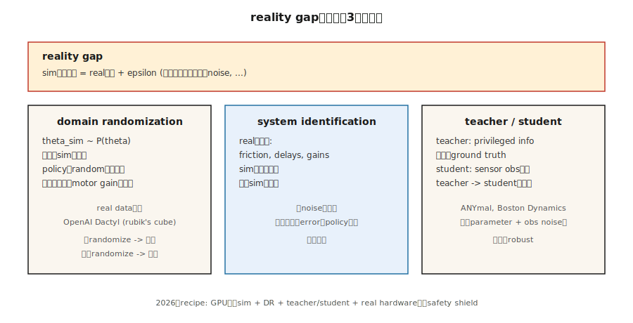

# 模拟到真实迁移

> 2016 年：OpenAI 在模拟中训练机器人手解魔方，迁移到真实世界。2018-2024 年：域随机化成为机器人 RL 的标准。核心洞察：不要在模拟中匹配真实——让模拟*如此多样化*以至于真实世界只是另一个变体。

**类型：** 构建
**语言：** Python
**前置知识：** 第九阶段 · 08（PPO），第九阶段 · 07（Actor-Critic）
**时间：** ~75 分钟

## 问题

在真实机器人上训练 RL 是痛苦的：
- 物理机器人慢（10 Hz vs 模拟中的 1000+ Hz）。
- 机器人损坏、磨损、需要维护。
- 安全约束限制了探索。
- 数据收集昂贵。

模拟是答案：在物理引擎中训练，迁移到真实世界。但模拟不完美。摩擦、质量分布、传感器噪声、执行器延迟——所有这些都不同。这就是"现实差距"。

模拟到真实迁移弥合这个差距。它使机器人 RL 实用。

## 概念



### 域随机化（DR）

Tobin 等人（2017）和 Sadeghi & Levine（2017）的核心洞察：不是调整模拟以匹配真实，而是在训练时随机化模拟参数。如果策略在广泛的物理参数范围内稳健，它可能泛化到真实世界。

随机化的参数包括：
- 质量、摩擦、恢复系数
- 执行器增益、延迟、噪声
- 传感器噪声、偏差、 dropout
- 光照、纹理、相机位置（视觉任务）
- 重力、风速（如果相关）

关键：随机化范围必须*足够宽*以包含真实世界，但*不要太宽*以至于任务在极端情况下无法解决。

### 系统辨识（SI）

不是随机化，而是调整模拟参数以匹配真实世界数据。收集真实世界的轨迹，优化模拟参数以最小化模拟与真实之间的差距。

`θ* = argmin_θ E_{τ~real} [ || τ - sim_θ(π) ||² ]`

这比 DR 更精确，但需要真实世界的数据，并且可能对分布外行为过拟合。

### 域适应

使用机器学习来对齐模拟和真实的特征分布：
- **对抗性域适应：** 训练一个判别器来区分模拟和真实特征，训练特征提取器来欺骗它。
- ** CycleGAN：** 将模拟图像翻译成真实风格（或反之）。
- **特征级对齐：** 最小化模拟和真实特征之间的最大均值差异（MMD）。

### 特权学习 / 教师-学生

在模拟中训练一个"教师"策略，它可以访问*特权信息*（例如，真实状态、接触力、物体位置）。然后训练一个"学生"策略，只使用真实观察（例如，相机图像、本体感受）来模仿教师。

`L_student = E[ || π_student(obs_real) - π_teacher(state_privileged) ||² ]`

这是视觉机器人任务的标准方法：教师看到真实状态，学生只看到相机图像。

### 大规模并行模拟

Isaac Gym / Isaac Sim（NVIDIA）允许在 GPU 上并行运行数千个模拟环境。这改变了计算范式：
- 1 个真实机器人：10 Hz，1 个环境。
- 1 个 GPU：1000+ 环境，1000+ Hz 有效吞吐量。

在 2025-2026 年，大多数机器人 RL 在 Isaac Sim 或 MuJoCo 中训练，使用数百万模拟步骤，然后迁移到真实硬件。

## 构建

### 第一步：带域随机化的模拟环境

```python
class RandomizedEnv:
    def __init__(self, base_env, randomization_ranges):
        self.base = base_env
        self.ranges = randomization_ranges
    
    def reset(self):
        # 随机化物理参数
        self.mass = random.uniform(self.ranges['mass'])
        self.friction = random.uniform(self.ranges['friction'])
        self.actuator_noise = random.uniform(self.ranges['actuator_noise'])
        
        # 应用参数
        self.base.set_mass(self.mass)
        self.base.set_friction(self.friction)
        
        return self.base.reset()
    
    def step(self, action):
        noisy_action = action + random.gauss(0, self.actuator_noise)
        return self.base.step(noisy_action)
```

### 第二步：教师-学生训练

```python
# 阶段 1：训练教师（特权状态）
teacher = PPOAgent(obs_dim=privileged_state_dim, action_dim=action_dim)
for episode in range(num_teacher_episodes):
    state = env.reset()
    privileged = env.get_privileged_state()
    # 使用 PPO 训练教师
    ...

# 阶段 2：训练学生（真实观察）
student = PPOAgent(obs_dim=real_obs_dim, action_dim=action_dim)
for episode in range(num_student_episodes):
    obs = env.reset()
    privileged = env.get_privileged_state()
    
    with torch.no_grad():
        teacher_action = teacher.act(privileged)
    
    student_action = student.act(obs)
    
    # 行为克隆损失
    bc_loss = mse_loss(student_action, teacher_action)
    student.update(bc_loss)
    
    # 可选：也使用 RL 目标
    ...
```

### 第三步：系统辨识

```python
def system_identification(real_trajectories, sim_env, initial_params):
    params = initial_params
    for iteration in range(num_si_iterations):
        # 使用当前参数生成模拟轨迹
        sim_trajectories = [rollout(sim_env, params) for _ in range(num_rollouts)]
        
        # 计算差距
        gap = compute_gap(real_trajectories, sim_trajectories)
        
        # 梯度下降参数
        params = params - lr * gradient(gap, params)
    
    return params
```

## 陷阱

- **随机化范围。** 太窄 → 真实世界在分布外。太宽 → 任务在极端情况下无法解决。从文献中的范围开始，根据真实世界性能迭代调整。
- **模拟保真度。** 低保真模拟（例如，简化的接触模型）可能无法捕获真实世界的关键动态。使用高保真物理引擎（MuJoCo、Isaac Sim、Bullet）。
- **观察差距。** 模拟和真实的相机图像不同（光照、纹理、传感器噪声）。使用域适应或特权学习。
- **延迟。** 真实执行器有延迟（10-50 ms）。在模拟中包含延迟。
- **安全。** 真实机器人可能损坏自己或环境。使用安全 RL 技术（约束 MDP、安全层）。
- **过拟合到模拟。** 策略可能利用模拟的物理漏洞（例如，不现实的接触力）。监控模拟到真实的差距。

## 应用

| 领域 | 方法 | 说明 |
|------|------|------|
| 机器人操作 | DR + 教师-学生 | 抓取、装配任务。 |
| 四足机器人 | DR + PPO | ANYmal、Spot 的步态控制。 |
| 自动驾驶 | DR + 域适应 | CARLA → 真实世界驾驶。 |
| 无人机 | DR + SI | 敏捷飞行控制。 |
| 人形机器人 | 大规模 DR + 特权学习 | 双足行走、跑酷。 |

## 交付

保存为 `outputs/skill-sim-to-real-trainer.md`：

```markdown
---
name: sim-to-real-trainer
description: 为机器人任务生成模拟到真实迁移配置，包括域随机化、特权学习和系统辨识。
version: 1.0.0
phase: 9
lesson: 11
tags: [rl, sim-to-real, robotics, domain-randomization]
---

给定一个机器人任务（自由度、传感器、执行器），输出：

1. 模拟环境。物理引擎（MuJoCo/Isaac Sim/Bullet）、并行环境数量。
2. 域随机化。随机化参数列表、范围、分布（均匀/高斯/对数均匀）。
3. 训练方法。DR only、DR + 教师-学生、DR + SI。
4. 迁移策略。零样本、微调（真实世界数据百分比）、安全约束。
5. 验证。模拟到真实差距指标、真实世界评估协议。

拒绝没有域随机化的模拟到真实迁移。拒绝没有执行器延迟建模的机器人任务。标记任何模拟保真度低于真实世界 80% 的设置。
```

## 练习

1. **简单。** 在 MuJoCo 中实现一个带域随机化的倒立摆环境。随机化摆的质量和长度。训练 PPO 并测试对不同参数的稳健性。
2. **中等。** 实现教师-学生框架。教师访问真实角度和角速度。学生只看到噪声观察。比较迁移性能。
3. **困难。** 收集真实世界轨迹（或使用预录数据集）。运行系统辨识以优化模拟参数。比较 SI + DR 与仅 DR 的迁移成功率。

## 关键术语

| 术语 | 人们怎么说 | 实际含义 |
|------|-----------------|-----------------------|
| 现实差距 | "模拟 ≠ 真实" | 模拟和真实世界动态之间的差异。 |
| 域随机化 | "多样化模拟" | 随机化物理参数以训练稳健策略。 |
| 系统辨识 | "匹配模拟到真实" | 优化模拟参数以匹配真实世界数据。 |
| 特权学习 | "教师知道更多" | 在特权状态上训练教师，在真实观察上训练学生。 |
| 域适应 | "对齐特征" | 使用 ML 对齐模拟和真实的特征分布。 |
| Isaac Sim | "GPU 物理" | NVIDIA 的并行物理模拟器，用于大规模 RL。 |

## 延伸阅读

- [Tobin et al. (2017). Domain Randomization for Transferring Deep Neural Networks](https://arxiv.org/abs/1703.06907) — 视觉任务的 DR。
- [Sadeghi & Levine (2017). CAD2RL: Real Single-Image Flight without a Single Real Image](https://arxiv.org/abs/1611.04201) — 无真实图像的模拟到真实。
- [OpenAI (2019). Solving Rubik's Cube with a Robot Hand](https://arxiv.org/abs/1910.07113) — 大规模 DR 用于灵巧操作。
- [Hwangbo et al. (2019). Learning Agile and Dynamic Motor Skills](https://arxiv.org/abs/1901.08652) — ANYmal 四足机器人。
- [Rudin et al. (2022). Learning to Walk in Minutes](https://arxiv.org/abs/2109.11978) — 大规模并行模拟用于人形机器人。
