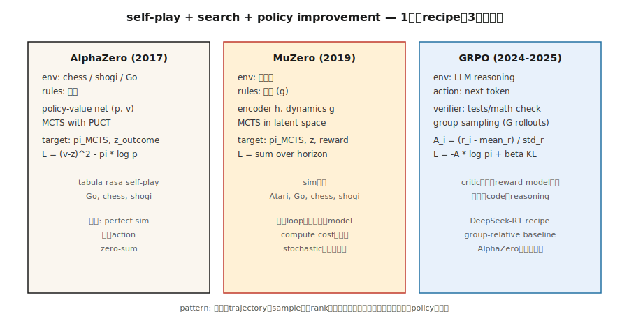

# ゲームのための RL — AlphaZero、MuZero、LLM 推論時代

> 1992年: TD-Gammon が pure TD でバックギャモンの人間 champion を破った。2016年: AlphaGo が Lee Sedol に勝った。2017年: AlphaZero が chess、shogi、Go をゼロから支配した。2024年: DeepSeek-R1 は、PPO を GRPO に置き換えれば同じ recipe が reasoning にも効くことを示した。ゲームは、この phase のあらゆる breakthrough を駆動する benchmark である。

**タイプ:** Build
**言語:** Python
**前提条件:** Phase 9 · 05 (DQN)、Phase 9 · 08 (PPO)、Phase 9 · 09 (RLHF)、Phase 9 · 10 (MARL)
**時間:** 約120分

## 問題

ゲームには RL が欲しいものがすべてある。きれいな reward (win/loss)。無限の episode (self-play reset)。完全な simulation (ゲームそのものが simulator)。離散または小さな continuous action space。adversarial robustness を強制する multi-agent structure。

そしてゲームは、主要な RL breakthrough がすべて試された場所である。TD-Gammon (backgammon, 1992)。Atari-DQN (2013)。AlphaGo (2016)。AlphaZero (2017)。OpenAI Five (Dota 2, 2019)。AlphaStar (StarCraft II, 2019)。MuZero (learned model, 2019)。AlphaTensor (matrix multiplication, 2022)。AlphaDev (sorting algorithms, 2023)。DeepSeek-R1 (math reasoning, 2025)。これは、game-RL technique が text にも効くことを示す最新の実証である。

この capstone は、3つの landmark architecture、AlphaZero、MuZero、GRPO を、1つの統一的な lens、つまり **self-play + search + policy improvement** から眺める。それぞれが前のものを一般化している。特に GRPO は、token を action、数学的 verification を win signal として、AlphaZero の recipe を LLM reasoning に適用したものだ。

## コンセプト



**統一ループ。**

```
while True:
    trajectory = self_play(current_policy, search)     # play game against self
    policy_target = search.improved_policy(trajectory) # search improves raw policy
    policy_net.update(policy_target, value_target)     # supervised on search output
```

**AlphaZero (2017)。** Silver et al. 既知の rule を持つ game (chess、shogi、Go) が与えられた場合:

- Policy-value network: 1つの tower `f_θ(s) → (p, v)`。`p` は legal move 上の prior。`v` は期待 game outcome。
- Monte Carlo Tree Search (MCTS): 各 move で possible continuation の tree を展開する。`(p, v)` を prior + bootstrap として使う。UCB (PUCT) で node を選ぶ: `a* = argmax Q(s, a) + c · p(a|s) · √N(s) / (1 + N(s, a))`。
- Self-play: agent-vs-agent で game を play する。move `t` では、MCTS visit distribution `π_t` が policy training target になる。
- Loss: `L = (v - z)² - π · log p + c · ||θ||²`。`z` は game outcome (+1 / 0 / -1)。

人間知識ゼロ。handcrafted heuristic ゼロ。chess、shogi、Go をそれぞれ数千万 self-play game 後に master した単一 recipe である。

**MuZero (2019)。** Schrittwieser et al. rule が既知であるという要件を取り除く。

- 固定 environment の代わりに、*latent dynamics model* `(h, g, f)` を学習する:
  - `h(s)`: observation を latent state に encode する。
  - `g(s_latent, a)`: next latent state + reward を予測する。
  - `f(s_latent)`: policy prior + value を予測する。
- MCTS は*学習済み latent space*内で走る。同じ search、同じ training loop。
- Go、chess、shogi *および* Atari で機能する。rule knowledge なしの1つの algorithm である。

**Stochastic MuZero (2022)。** stochastic dynamics と chance node を加え、backgammon-class game へ拡張する。

**Muesli、Gumbel MuZero (2022-2024)。** sample efficiency と deterministic search の改善。

**GRPO (2024-2025)。** DeepSeek-R1 recipe。同じ AlphaZero 型 loop を language-model reasoning に適用する。

- 「Game」: math / coding / reasoning problem に答える。「Win」= verifier (test case pass、numerical answer match) が 1 を返す。
- Policy: LLM。Action: token。State: prompt + response-so-far。
- critic (PPO-style V_φ) はない。代わりに、各 prompt について policy から `G` 個の completion を sample する。それぞれ reward を計算する。**group-relative advantage** `A_i = (r_i - mean_r) / std_r` を REINFORCE-style update の signal として使う。
- drift を防ぐため、reference policy への KL penalty を使う (RLHF と同じ)。
- 完全な loss:

  `L_GRPO(θ) = -E_{q, {o_i}} [ (1/G) Σ_i A_i · log π_θ(o_i | q) ] + β · KL(π_θ || π_ref)`

reward model なし、critic なし、MCTS なし。group-relative baseline が3つすべてを置き換える。reasoning benchmark では、計算量の一部で PPO-RLHF 品質に並ぶか上回る。

**R1 recipe の全体像。** DeepSeek-R1 (DeepSeek 2025) は1本の paper に2つの model を含む。

- **R1-Zero。** DeepSeek-V3 base model から始める。SFT なし。2つの reward component、*accuracy reward* (rule-based。final answer が正しい number に parse されるか / code が unit tests を pass するか) と *format reward* (completion が chain-of-thought を `<think>…</think>` tag で包むか) を使い、GRPO を直接適用する。数千 step の間に average response length は約100 token から約10,000 token へ伸び、math benchmark score は near-o1-preview level へ上がる。model はゼロから reasoning を学ぶ。欠点は、chain of thought がしばしば読みにくく、言語が混ざり、stylistic polish を欠くことだ。
- **R1。** R1-Zero の readability problem を4段階 pipeline で修正する:
  1. **Cold-start SFT。** clean formatting の long-CoT demonstration を数千件集める。base model をそれらで supervised-finetune する。これにより読みやすい starting point を得る。
  2. **Reasoning-oriented GRPO。** accuracy+format rewards に加え、code-switching を防ぐ *language-consistency* reward を使って GRPO を適用する。
  3. **Rejection sampling + SFT round 2。** RL checkpoint から約600Kの reasoning trajectory を sample し、正しい final answer と読みやすい CoT を持つものだけを残し、約200Kの non-reasoning SFT example (writing、QA、self-cognition) と組み合わせる。base を再度 fine-tune する。
  4. **Full-spectrum GRPO。** reasoning (rule-based rewards) と general alignment (helpfulness/harmlessness preference-based rewards) の両方を対象に、もう一度 RL を行う。

結果は open weights で AIME と MATH-500 において o1 に匹敵し、distill できるほど小さい。同じ paper は、R1 の reasoning trace に対する SFT により、Qwen-1.5B から Llama-70B までの6つの distilled dense model も公開している。student では RL を使わない。強い RL teacher の distillation は、student scale でのゼロからの RL を一貫して上回る。

**reasoning で PPO ではなく GRPO を使う理由。** DeepSeekMath paper (2024年2月) の理由は3つ。(1) value network を訓練しないため memory が半減する。(2) group baseline は reasoning task が生む sparse end-of-trajectory reward を自然に扱う。(3) per-prompt normalization により、難易度が大きく異なる problem 間でも advantage が比較可能になる。PPO の単一 critic ではこれは難しい。

**Search-free vs search-based。** game は分岐している:

- *長い horizon の perfect-information game* (Go、chess): まだ search-based。AlphaZero / MuZero が支配的。
- *LLM reasoning*: production ではまだ MCTS はない。full rollout 上の GRPO と inference compute 向け best-of-N。Process reward model (PRM) は step-level search が戻ってくる兆しである。

## 作るもの

`code/main.py` の code は、**GRPO の縮小版**を実装する。複数 group の sample を持つ bandit である。algorithm は LLM 上と同じで、policy と environment が単純なだけだ。2025年の innovation である *loss* と *group-relative advantage* を学ぶ。

### Step 1: 小さな verifier environment

```python
QUESTIONS = [
    {"prompt": "q1", "correct": 3},
    {"prompt": "q2", "correct": 1},
]

def verify(prompt_idx, answer_token):
    return 1.0 if answer_token == QUESTIONS[prompt_idx]["correct"] else 0.0
```

本物の GRPO では、verifier が unit tests を実行するか、数学的等価性を check する。

### Step 2: policy: prompt ごとの K answer token 上の softmax

```python
def policy_probs(theta, p_idx):
    return softmax(theta[p_idx])
```

prompt に条件づけられた LLM の final-layer output に相当する。

### Step 3: group sampling と group-relative advantage

```python
def grpo_step(theta, p_idx, G=8, beta=0.01, lr=0.1, rng=None):
    probs = policy_probs(theta, p_idx)
    samples = [sample(probs, rng) for _ in range(G)]
    rewards = [verify(p_idx, s) for s in samples]
    mean_r = sum(rewards) / G
    std_r = stddev(rewards) + 1e-8
    advs = [(r - mean_r) / std_r for r in rewards]

    for a, A in zip(samples, advs):
        grad = onehot(a) - probs
        for i in range(len(probs)):
            theta[p_idx][i] += lr * A * grad[i]
    # KL penalty: pull theta toward reference
    for i in range(len(probs)):
        theta[p_idx][i] -= beta * (theta[p_idx][i] - reference[p_idx][i])
```

group-relative advantage が 2024年の DeepSeek trick である。critic は不要。"baseline" は group mean で、normalization は group std を使う。

### Step 4: REINFORCE baseline (value-free) と比較する

同じ setup、同じ compute、plain REINFORCE。GRPO の方が速く、より安定して収束する。

### Step 5: entropy と KL を観察する

RLHF と同じ diagnostics を使う。reference への mean KL、policy entropy、reward-over-time。これらが安定したら training は完了である。

## 落とし穴

- **verifier gaming による reward hacking。** GRPO は RLHF と同じ risk を継承する。verifier が間違っているか exploitable なら、LLM は exploit を見つける。robust verifier (複数 test case、formal proof) が重要である。
- **Group size が小さすぎる。** group baseline の variance は `1/√G` に比例する。`G = 4` 未満では advantage signal が noisy になる。標準的な選択は `G = 8` から `64`。
- **Length bias。** 長さの異なる LLM completion は log-probability も異なる。token count で normalize する、sequence-level log-prob を使う、または max length で truncate する。
- **Pure self-play cycles。** AlphaZero-style training は general-sum game で dominance loop にはまりうる。diverse opponent pool (league play、Lesson 10) で緩和する。
- **Search-policy mismatch。** AlphaZero は policy に search output を模倣させる。policy net が search distribution を表現するには小さすぎると training が止まる。
- **Compute floor。** MuZero / AlphaZero には巨大な compute が必要である。単一 ablation でも数百 GPU-hours になることが多い。学習用には miniature demo (例: Connect Four 上の AlphaZero) がある。
- **Verifier coverage。** buggy solution を pass させる unit tests は、その bug を reinforce する。edge case を捕まえる verifier を設計する。

## 使いどころ

2026年の game-RL landscape、domain 別:

| Domain | Dominant method |
|--------|-----------------|
| Two-player zero-sum board games (Go, chess, shogi) | AlphaZero / MuZero / KataGo |
| Imperfect info card games (poker) | CFR + deep learning (DeepStack, Libratus, Pluribus) |
| Atari / pixel games | Muesli / MuZero / IMPALA-PPO |
| Large multiplayer strategy (Dota, StarCraft) | PPO + self-play + league (OpenAI Five, AlphaStar) |
| LLM math/code reasoning | GRPO (DeepSeek-R1, Qwen-RL, open replications) |
| LLM alignment | DPO / RLHF-PPO (GRPO ではない。verifier が preference であり verifiable ではないため) |
| Robotics | PPO + DR (game-RL ではないが、同じ policy-gradient tool を使う) |
| Combinatorial problems | AlphaZero variants (AlphaTensor, AlphaDev) |

*recipe*、つまり self-play、search-augmented improvement、policy distillation は、text、pixel、physical control をまたいで広がる。GRPO は最も若い instance であり、さらに増えていく。

## 出荷するもの

`outputs/skill-game-rl-designer.md` として保存する:

```markdown
---
name: game-rl-designer
description: 与えられた domain に対して game-RL または reasoning-RL training pipeline (AlphaZero / MuZero / GRPO) を設計する。
version: 1.0.0
phase: 9
lesson: 12
tags: [rl, alphazero, muzero, grpo, self-play]
---

target (perfect-info game / imperfect-info / Atari / LLM reasoning / combinatorial) を受け取り、次を出力する:

1. Environment fit。Known rules? Markov? Stochastic? Multi-agent? AlphaZero vs MuZero vs GRPO の判断材料にする。
2. Search strategy。MCTS (learned prior 付き PUCT)、Gumbel-sampled、best-of-N、または none。
3. Self-play plan。Symmetric self-play / league / offline data / verifier-generated。
4. Target signal。Game outcome / verifier reward / preference / learned model。robustness plan を含める。
5. Diagnostics。baseline に対する win rate、ELO curve、verifier pass rate、reference への KL。

Imperfect-info game に AlphaZero を使うことを拒否する (CFR に route する)。trusted verifier なしの GRPO を拒否する。fixed baseline opponent set のない game-RL pipeline を拒否する (self-play ELO は otherwise uncalibrated)。
```

## 演習

1. **Easy。** `code/main.py` で GRPO bandit を実装する。2 prompts × 4 answer tokens で訓練する。`G=8` なら 1,000 update 未満で収束する。
2. **Medium。** PPO (clipped) と vanilla REINFORCE を差し込む。同じ bandit 上で GRPO と sample efficiency と reward variance を比較する。
3. **Hard。** length-2 の「reasoning chain」へ拡張する。agent は2 token を emit し、verifier は pair に reward を与える。GRPO が two-step sequence の credit assignment をどう扱うか測定する。(Hint: *full sequence* ごとに group advantage を計算し、両方の token position に伝播する。)

## 重要用語

| 用語 | よく言われる表現 | 実際の意味 |
|------|-----------------|-----------------------|
| MCTS | 「learned net 付き tree search」 | Monte Carlo Tree Search。learned `(p, v)` prior を使う UCB1/PUCT selection。 |
| AlphaZero | 「Self-play + MCTS」 | MCTS visit と game outcome に合わせて訓練される policy-value net。 |
| MuZero | 「Learned-model AlphaZero」 | 同じ loop を learned dynamics による latent space で行う。 |
| GRPO | 「Critic-free PPO」 | Group Relative Policy Optimization。group-mean baseline + KL を持つ REINFORCE。 |
| PUCT | 「AlphaZero の UCB」 | `Q + c · p · √N / (1 + N_a)`。value estimate と prior の balance を取る。 |
| Self-play | 「Agent vs past self」 | zero-sum の標準。対称的な training signal。 |
| League play | 「Population-based self-play」 | past + current + exploiter を opponent として sample する。 |
| Verifier reward | 「Verifiable RL」 | deterministic checker (tests pass、answer matches) から来る reward。 |
| Process reward | 「PRM」 | final answer だけでなく各 reasoning step を採点する。 |

## 参考文献

- [Silver et al. (2017). Mastering the game of Go without human knowledge (AlphaGo Zero)](https://www.nature.com/articles/nature24270).
- [Silver et al. (2018). A general reinforcement learning algorithm that masters chess, shogi, and Go through self-play (AlphaZero)](https://www.science.org/doi/10.1126/science.aar6404).
- [Schrittwieser et al. (2020). Mastering Atari, Go, chess and shogi by planning with a learned model (MuZero)](https://www.nature.com/articles/s41586-020-03051-4).
- [Vinyals et al. (2019). Grandmaster level in StarCraft II (AlphaStar)](https://www.nature.com/articles/s41586-019-1724-z).
- [DeepSeek-AI (2024). DeepSeekMath: Pushing the Limits of Mathematical Reasoning in Open Language Models (GRPO)](https://arxiv.org/abs/2402.03300) — GRPO と group-relative baseline を導入した paper。
- [DeepSeek-AI (2025). DeepSeek-R1: Incentivizing Reasoning Capability in LLMs via Reinforcement Learning](https://arxiv.org/abs/2501.12948) — 完全な4段階 R1 recipe と R1-Zero ablation。
- [Brown et al. (2019). Superhuman AI for multiplayer poker (Pluribus)](https://www.science.org/doi/10.1126/science.aay2400) — 大規模 CFR + deep-learning。
- [Tesauro (1995). Temporal Difference Learning and TD-Gammon](https://dl.acm.org/doi/10.1145/203330.203343) — すべての始まりとなった paper。
- [Hugging Face TRL — GRPOTrainer](https://huggingface.co/docs/trl/main/en/grpo_trainer) — custom reward function で GRPO を適用する production reference。
- [Qwen Team (2024). Qwen2.5-Math — GRPO replication](https://github.com/QwenLM/Qwen2.5-Math) — 複数 scale での R1 recipe の open replication。
- [Sutton & Barto (2018). Ch. 17 — Frontiers of Reinforcement Learning](http://incompleteideas.net/book/RLbook2020.pdf) — self-play、search、そして R1 が LLM scale で具体化した「designed reward」の textbook framing。
