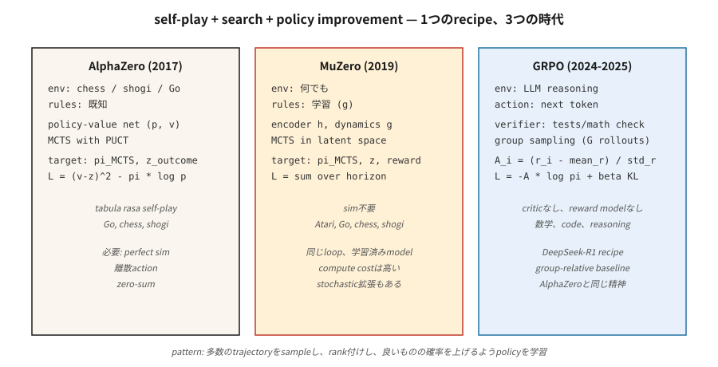

# Oyunlar için RL — AlphaZero, MuZero ve LLM-Akıl Yürütme Çağı

> 1992: TD-Gammon, saf TD ile tavlada insan şampiyonlarını yendi. 2016: AlphaGo, Lee Sedol'u yendi. 2017: AlphaZero satranç, shogi ve Go'ya sıfırdan hakim oldu. 2024: DeepSeek-R1, GRPO'nun PPO'nun yerini almasıyla aynı tarifin akıl yürütmeye dayalı olarak çalıştığını kanıtladı. Oyunlar, bu aşamadaki her atılımı yönlendiren benchmark'dir.

**Tür:** Yapım
**Diller:** Python
**Önkoşullar:** Aşama 9 · 05 (DQN), Aşama 9 · 08 (PPO), Aşama 9 · 09 (RLHF), Aşama 9 · 10 (MARL)
**Süre:** ~120 dakika

## Sorun

Oyunlar RL'nin istediği her şeye sahiptir. Temiz ödül (kazanç/mağlubiyet). Sonsuz bölümler (kendi kendine oynatma sıfırlanır). Mükemmel simülasyon (oyun *simülatördür*). Ayrık veya küçük sürekli eylem alanları. Rekabetçi sağlamlığı zorlayan çoklu agent yapısı.

Ve oyunlar, her büyük RL atılımının test edildiği yöntemdir. TD-Gammon (tavla, 1992). Atari-DQN (2013). AlphaGo (2016). AlphaZero (2017). OpenAI Beş (Dota 2, 2019). AlphaStar (StarCraft II, 2019). MuZero (öğrenilmiş model, 2019). AlphaTensor (matris çarpımı, 2022). AlphaDev (sıralama algoritmaları, 2023). DeepSeek-R1 (matematiksel muhakeme, 2025) — oyun-RL tekniklerinin metin üzerinde işe yaradığının en son gösterimi.

Bu özet, üç önemli mimariyi (AlphaZero, MuZero ve GRPO) tek bir birleştirici mercek aracılığıyla inceliyor: **kendi kendine oyun + arama + politika iyileştirme**. Her biri bir öncekini genelleştirir; Özellikle GRPO, AlphaZero'nun LLM muhakemesine uygulanan tarifidir; eylemler olarak token'ler ve kazanma sinyali olarak matematiksel doğrulamadır.

## Konsept



**Birleştirici döngü.**

```
while True:
    trajectory = self_play(current_policy, search)     # play game against self
    policy_target = search.improved_policy(trajectory) # search improves raw policy
    policy_net.update(policy_target, value_target)     # supervised on search output
```

**AlphaZero (2017).** Silver ve ark. Kuralları bilinen bir oyun (satranç, shogi, Go) verildiğinde:

- Politika değeri ağı: bir kule `f_θ(s) → (p, v)`. `p` yasal hamlelerden önce gelen bir hamledir. `v` beklenen oyun sonucudur.
- Monte Carlo Ağaç Arama (MCTS): Her harekette olası devamların bulunduğu ağacı genişletin. `(p, v)`'yi önceki + önyükleme olarak kullanın. Düğümleri UCB'ye (PUCT) göre seçin: `a* = argmax Q(s, a) + c · p(a|s) · √N(s) / (1 + N(s, a))`.
- Kendi kendine oynama: agent-vs-agent oyunları oynayın. `t` hareketinde, MCTS ziyaret dağıtımı `π_t` politika eğitimi hedefi haline gelir.
- Kayıp: `L = (v - z)² - π · log p + c · ||θ||²`. `z` oyun sonucudur (+1 / 0 / -1).

İnsan bilgisi sıfır. Sıfır el işi buluşsal yöntem. Her biri kendi kendine oynadığı birkaç on milyonlarca oyunun ardından satranç, shogi ve Go'da ustalaşan tek bir tarif.

**MuZero (2019).** Schrittwieser ve ark. Kuralların bilinmesi zorunluluğunu ortadan kaldırır.

- Sabit bir ortam yerine *gizli dinamik modelini* öğrenin `(h, g, f)`:
  - `h(s)`: gözlemi gizli duruma kodlayın.
  - `g(s_latent, a)`: bir sonraki gizli durumu + ödülü tahmin edin.
  - `f(s_latent)`: politika öncelik + değerini tahmin edin.
- MCTS *öğrenilmiş gizli alanda* çalışır. Aynı arama, aynı eğitim döngüsü.
- Go, satranç, shogi *ve* Atari üzerinde çalışır — tek algoritma, kural bilgisi yoktur.

**Stochastic MuZero (2022).** Stokastik dinamikler ve şans düğümleri ekler; tavla sınıfı oyunlara kadar uzanır.

**Müsli, Gumbel MuZero (2022-2024).** Örnek verimliliği ve deterministik aramada iyileştirmeler.

**GRPO (2024-2025).** DeepSeek-R1 tarifi. Dil modeli akıl yürütmeye uygulanan aynı AlphaZero şeklindeki döngü:

- "Oyun": bir matematik / kodlama / akıl yürütme problemine cevap verin. "Kazanma" = doğrulayıcı (test durumu geçer, sayısal yanıt eşleşir) 1 değerini döndürür.
- Politika: Yüksek Lisans. Eylemler: token'ler. Durum: prompt + şu ana kadarki yanıt.
- Eleştiri yok (PPO tarzı V_φ). Bunun yerine, her prompt için ilkeden `G` tamamlamalarını örnekleyin. Her biri için ödülü hesaplayın. REINFORCE tarzı güncelleme sinyali olarak **gruba göre avantaj** `A_i = (r_i - mean_r) / std_r`'yi kullanın.
- KL cezasının sürüklenmeyi önleme politikasına referans olması (RLHF gibi).
- Tam kayıp:

  `L_GRPO(θ) = -E_{q, {o_i}} [ (1/G) Σ_i A_i · log π_θ(o_i | q) ] + β · KL(π_θ || π_ref)`

Ödül modeli yok, eleştiri yok, MCTS yok. Gruba bağlı temel, üçünün de yerini alır. İşlemin çok küçük bir kısmında benchmark'lerin akıl yürütmesinde PPO-RLHF kalitesiyle eşleşir veya onu aşar.

**R1 tarifinin tamamı.** DeepSeek-R1 (DeepSeek 2025) tek bir makalede iki modeldir:

- **R1-Zero.** DeepSeek-V3 temel modelinden başlayın. SFT yok. GRPO'yu doğrudan iki ödül bileşeniyle uygulayın: *doğruluk ödülü* (kural tabanlı - son yanıt doğru sayıya ayrıştırıldı mı / kod birim testleri geçti mi) ve *biçim ödülü* (tamamlama, düşünce zincirini `<think>…</think>` etiketlerine sardı mı). Binlerce adımdan sonra ortalama yanıt uzunluğu ~100'den ~10.000 token'ye çıkar ve matematik benchmark puanları o1'e yakın önizleme seviyelerine yükselir. Model, akıl yürütmeyi sıfırdan öğrenir. Dezavantajı ise düşünce zincirlerinin çoğunlukla okunamaması, karışık diller olması ve stilistik ciladan yoksun olmasıdır.
- **R1.** R1-Zero'nun okunabilirlik sorunlarını dört aşamalı bir işlem hattıyla düzeltin:
  1. **SFT'yi soğuk başlatma.** Temiz biçimlendirmeyle birkaç bin uzun CoT gösterimini toplayın. Temel modele denetimli ince ayar yapın. Bu okunabilir bir başlangıç ​​noktası sağlar.
  2. **Akıl yürütme odaklı GRPO.** Kod değiştirmeyi önlemek için GRPO'yu doğruluk+format ödüllerinin yanı sıra *dil tutarlılığı* ödülüyle birlikte uygulayın.
  3. **Reddetme örneklemesi + SFT 2. tur.** RL kontrol noktasından ~600 bin muhakeme yörüngesi örneği alın, yalnızca doğru nihai yanıtlara ve okunabilir CoT'ye sahip olanları tutun ve ~200 bin muhakeme yürütmeyen SFT örnekleriyle (yazma, QA, öz biliş) birleştirin. Tabana tekrar ince ayar yapın.
  4. **Tam spektrumlu GRPO.** Hem akıl yürütmeyi (kural tabanlı ödüller) hem de genel uyumu (yardımcılık/zararsızlık tercihine dayalı ödüller) kapsayan bir RL turu daha.

Sonuç, açık ağırlıklarda AIME ve MATH-500'de o1 ile eşleşir ve damıtılacak kadar küçüktür. Aynı makale aynı zamanda SFT'nin R1'in muhakeme izlerini kullanarak altı damıtılmış yoğun modeli (Qwen-1.5B'den Llama-70B'ye kadar) yayınlamaktadır - öğrencide RL yoktur. Güçlü bir RL öğretmeninin damıtılması, öğrenci ölçeğinde sürekli olarak RL'yi sıfırdan yener.

**Akıl yürütme için neden PPO yerine GRPO.** DeepSeekMath makalesindeki (Şubat 2024) üç neden: (1) eğitilecek değer ağının olmaması, belleğin yarıya indirilmesi; (2) grup temel çizgisi, muhakeme görevlerinin ürettiği seyrek yörünge sonu ödülünü doğal olarak ele alır; (3) prompt başına normalleştirme, PPO'nun tek eleştirmeninin yapamadığı, son derece farklı zorluktaki problemler arasında avantajları karşılaştırılabilir hale getirir.

**Arama gerektirmeyen ve arama tabanlı.** Oyunlar dallara ayrıldı:

- *Uzun ufuklara sahip mükemmel bilgi içeren oyunlar* (Go, satranç): hâlâ aramaya dayalı. AlphaZero / MuZero hakim.
- *Yüksek Lisans gerekçesi*: henüz üretimde MCTS yok; Tam kullanıma sunmada GRPO, inference bilgi işlem için N'nin en iyisi. Süreç ödül modelleri (PRM'ler), adım düzeyinde aramanın yeniden ekleneceğine işaret ediyor.

## İnşa Et

`code/main.py`'deki kod, birden fazla örnek grubuna sahip bir haydut olan **minyatür GRPO**'yu uygular. Algoritma, LLM'deki ile aynıdır; yalnızca politika ve ortam daha basittir. 2025 yeniliği olan *kaybı* ve *gruba göre avantajı* öğretir.

### 1. Adım: küçük bir doğrulama ortamı

```python
QUESTIONS = [
    {"prompt": "q1", "correct": 3},
    {"prompt": "q2", "correct": 1},
]

def verify(prompt_idx, answer_token):
    return 1.0 if answer_token == QUESTIONS[prompt_idx]["correct"] else 0.0
```

Gerçek GRPO'da doğrulayıcı birim testleri çalıştırır veya matematik eşitliğini kontrol eder.

### Adım 2: politika: K üzerinden softmax, prompt başına token yanıtını verir

```python
def policy_probs(theta, p_idx):
    return softmax(theta[p_idx])
```

prompt üzerinde şartlandırılmış bir LLM'nin son katman çıktısına eşdeğerdir.

### Adım 3: grup örneklemesi ve gruba göre avantaj

```python
def grpo_step(theta, p_idx, G=8, beta=0.01, lr=0.1, rng=None):
    probs = policy_probs(theta, p_idx)
    samples = [sample(probs, rng) for _ in range(G)]
    rewards = [verify(p_idx, s) for s in samples]
    mean_r = sum(rewards) / G
    std_r = stddev(rewards) + 1e-8
    advs = [(r - mean_r) / std_r for r in rewards]

    for a, A in zip(samples, advs):
        grad = onehot(a) - probs
        for i in range(len(probs)):
            theta[p_idx][i] += lr * A * grad[i]
    # KL penalty: pull theta toward reference
    for i in range(len(probs)):
        theta[p_idx][i] -= beta * (theta[p_idx][i] - reference[p_idx][i])
```

Grup açısından avantaj, 2024 DeepSeek numarasıdır. Eleştirmene gerek yok. "Temel" grup ortalamasıdır ve normalleştirme grup std'yi kullanır.

### Adım 4: REINFORCE temel çizgisiyle karşılaştırın (değersiz)

Aynı kurulum, aynı bilgi işlem, düz REINFORCE. GRPO daha hızlı ve daha kararlı bir şekilde birleşir.

### Adım 5: entropiyi ve KL'yi gözlemleyin

RLHF ile aynı tanılama: Referansa KL anlamına gelir, politika entropisi, zaman içinde ödül. Bunlar stabil hale geldikten sonra eğitim yapılır.

## Tuzaklar

- **Doğrulayıcı oyunları yoluyla ödül korsanlığı.** GRPO, RLHF'nin riskini devralır: doğrulayıcı hatalı veya kötüye kullanılabilirse, LLM açıktan yararlanmayı bulacaktır. Sağlam doğrulayıcılar (çoklu test senaryoları, resmi kanıtlar) önemlidir.
- **Grup boyutu çok küçük.** Grup temel çizgisinin varyansı `1/√G` gibi gider. `G = 4`'nin altında avantaj sinyali gürültülüdür; standart seçim `G = 8` ila `64`'dir.
- **Uzunluk yanlılığı.** Farklı uzunluktaki LLM tamamlamalarının farklı log olasılıkları vardır. token sayımına göre normalleştirin veya dizi düzeyinde log-prob kullanın veya maksimum uzunluğa kadar kesin.
- **Tamamen kendi kendine oyun döngüleri.** AlphaZero tarzı eğitim, genel toplamlı oyunlarda hakimiyet döngülerine takılıp kalabilir. Farklı rakip havuzları nedeniyle hafifletildi (lig oyunu, Ders 10).
- **Arama politikası uyumsuzluğu.** AlphaZero, politikayı arama çıktısını taklit edecek şekilde eğitir. Politika ağı, aramanın dağılımını temsil edemeyecek kadar küçükse, eğitim durur.
- **Hesaplama katı.** MuZero / AlphaZero'nun yoğun bilgi işlem ihtiyacı var. Tek bir ablasyon genellikle yüzlerce GPU saatini alır. Öğrenme için minyatür demolar mevcuttur (e.g., Connect Four'da AlphaZero).
- **Doğrulayıcı kapsamı.** Hatalı bir çözüm olarak kabul edilen birim testleri hatayı güçlendiriyor. Uç durumları yakalayan doğrulayıcılar tasarlayın.

## Kullan onu

Etki alanına göre 2026 oyun-RL ortamı:

| Etki Alanı | Baskın yöntem |
|--------|-----------------|
| İki oyunculu sıfır toplamlı masa oyunları (Go, satranç, shogi) | AlphaZero / MuZero / KataGo |
| Kusurlu bilgi içeren kart oyunları (poker) | CFR + deep learning (DeepStack, Libratus, Pluribus) |
| Atari / piksel oyunları | Müsli / MuZero / IMPALA-PPO |
| Büyük çok oyunculu strateji (Dota, StarCraft) | PPO + kendi kendine oynama + lig (OpenAI Five, AlphaStar) |
| Yüksek Lisans matematik/kod muhakemesi | GRPO (DeepSeek-R1, Qwen-RL, açık kopyalar) |
| Yüksek Lisans hizalama | DPO / RLHF-PPO (GRPO değil; doğrulayıcı, doğrulanamaz tercihtir) |
| Robotik | PPO + DR (oyun-RL değil, aynı politika gradient araçlarını kullanır) |
| Kombinatoryal problemler | AlphaZero çeşitleri (AlphaTensor, AlphaDev) |

*Tarif* (kendi kendine oynama, aramayla artırılmış iyileştirme, politikanın ayrıştırılması) metni, pikselleri ve fiziksel kontrolü kapsar. GRPO en genç örnektir; daha fazlası geliyor.

## Gönderin

`outputs/skill-game-rl-designer.md` olarak kaydet:

```markdown
---
name: game-rl-designer
description: Design a game-RL or reasoning-RL training pipeline (AlphaZero / MuZero / GRPO) for a given domain.
version: 1.0.0
phase: 9
lesson: 12
tags: [rl, alphazero, muzero, grpo, self-play]
---

Given a target (perfect-info game / imperfect-info / Atari / LLM reasoning / combinatorial), output:

1. Environment fit. Known rules? Markov? Stochastic? Multi-agent? Informs AlphaZero vs MuZero vs GRPO.
2. Search strategy. MCTS (PUCT with learned prior), Gumbel-sampled, best-of-N, or none.
3. Self-play plan. Symmetric self-play / league / offline data / verifier-generated.
4. Target signal. Game outcome / verifier reward / preference / learned model. Include robustness plan.
5. Diagnostics. Win rate vs baseline, ELO curve, verifier pass rate, KL to reference.

Refuse AlphaZero on imperfect-info games (route to CFR). Refuse GRPO without a trusted verifier. Refuse any game-RL pipeline without a fixed baseline opponent set (self-play ELO is uncalibrated otherwise).
```

## Egzersizler

1. **Kolay.** `code/main.py`'de GRPO haydutunu uygulayın. Her biri 2 prompt × 4 cevap token üzerinde eğitim alın. `G=8` ile 1.000'den az güncellemeyi birleştirin.
2. **Orta.** PPO'yu (kırpılmış) ve vanilyayı REINFORCE'a takın. Örnek verimliliğini ve ödül farkını aynı hayduttaki GRPO ile karşılaştırın.
3. **Zor.** 2 uzunluktaki "akıl yürütme zincirine" uzatın: agent iki token yayar ve doğrulayıcı bu çifti ödüllendirir. GRPO'nun iki adımlı dizilerde kredi atamasını nasıl gerçekleştirdiğini ölçün. (İpucu: *tam dizi* başına grup avantajını hesaplayın, her iki token konumuna dağıtın.)

## Anahtar Terimler

| Dönem | İnsanlar ne diyor | Aslında ne anlama geliyor |
|------|-----------------|-----------------------|
| MCTS | "Öğrenilen ağ ile ağaç arama" | Monte Carlo Ağacı Arama; Öğrenilen `(p, v)` öncelikleriyle UCB1/PUCT seçimi. |
| AlfaSıfır | "Kendi kendine oynama + MCTS" | MCTS ziyaretlerini ve oyun sonuçlarını eşleştirmek için eğitilmiş politika değeri ağı. |
| MuZero | "Öğrenilmiş model AlphaZero" | Aynı döngü ama öğrenilmiş dinamikler yoluyla gizli uzayda. |
| GRPO | "Eleştirisiz PPO" | Grup Göreli Politika Optimizasyonu; Grup ortalaması taban çizgisi + KL ile GÜÇLENDİRİN. |
| PUCT | "AlphaZero'nun UCB'si" | `Q + c · p · √N / (1 + N_a)` — değer tahminini öncekiyle dengeler. |
| Kendi kendine oynama | "Agent ve geçmiş benlik" | Sıfır toplamlı standart; simetrik eğitim sinyali. |
| Lig maçı | "Nüfusa dayalı kendi kendine oynama" | Geçmiş + mevcut + sömürücüler rakip olarak örneklendi. |
| Doğrulayıcı ödülü | "Doğrulanabilir RL" | Ödül, deterministik bir denetleyiciden gelir (testlerin geçmesi, yanıtların eşleşmesi). |
| Süreç ödülü | "PRM" | Yalnızca son yanıtı değil, her akıl yürütme adımını puanlar. |

## Daha Fazla Okuma

- [Gümüş ve ark. (2017). Go oyununda insan bilgisi olmadan ustalaşmak (AlphaGo Zero)](https://www.nature.com/articles/nature24270).
- [Gümüş ve ark. (2018). Satranç, shogi ve Go'yu kendi kendine oynama (AlphaZero)](https://www.science.org/doi/10.1126/science.aar6404) konusunda uzmanlaşan genel bir takviyeli öğrenme algoritması.
- [Schrittwieser ve ark. (2020). Öğrenilmiş bir model (MuZero) ile planlama yaparak Atari, Go, satranç ve shogi'de ustalaşmak](https://www.nature.com/articles/s41586-020-03051-4).
- [Vinyals ve diğerleri. (2019). StarCraft II'de (AlphaStar) büyük ustalık seviyesi](https://www.nature.com/articles/s41586-019-1724-z).
- [DeepSeek-AI (2024). DeepSeekMath: Açık Dil Modellerinde Matematiksel Akıl Yürütmenin Sınırlarını Zorlamak (GRPO)](https://arxiv.org/abs/2402.03300) — GRPO'yu ve gruba bağlı temel çizgiyi tanıtan makale.
- [DeepSeek-AI (2025). DeepSeek-R1: Yüksek Lisanslarda Güçlendirme Öğrenimi Yoluyla Muhakeme Yeteneğinin Teşvik Edilmesi](https://arxiv.org/abs/2501.12948) — tam dört aşamalı R1 tarifi artı R1-Sıfır ablasyon.
- [Brown ve ark. (2019). Çok oyunculu poker için insanüstü yapay zeka (Pluribus)](https://www.science.org/doi/10.1126/science.aay2400) — CFR + geniş ölçekte derin öğrenme.
-[Tesauro (1995). Temporal Fark Öğrenme ve TD-Gammon](https://dl.acm.org/doi/10.1145/203330.203343) — her şeyi başlatan makale.
- [Hugging Face TRL — GRPOTrainer](https://huggingface.co/docs/trl/main/en/grpo_trainer) — GRPO'yu özel ödül işlevleriyle uygulamaya yönelik üretim referansı.
- [Qwen Takımı (2024). Qwen2.5-Math — GRPO replikasyonu](https://github.com/QwenLM/Qwen2.5-Math) — R1 tarifinin birden fazla ölçekte açık replikasyonu.
- [Sutton ve Barto (2018). Ch. 17 — Takviyeli Öğrenmenin Sınırları](http://incompleteideas.net/book/RLbook2020.pdf) — R1'in LLM ölçeğinde örneklediği kendi kendine oyun, arama ve "tasarlanmış ödül" için ders kitabı çerçevesi.
