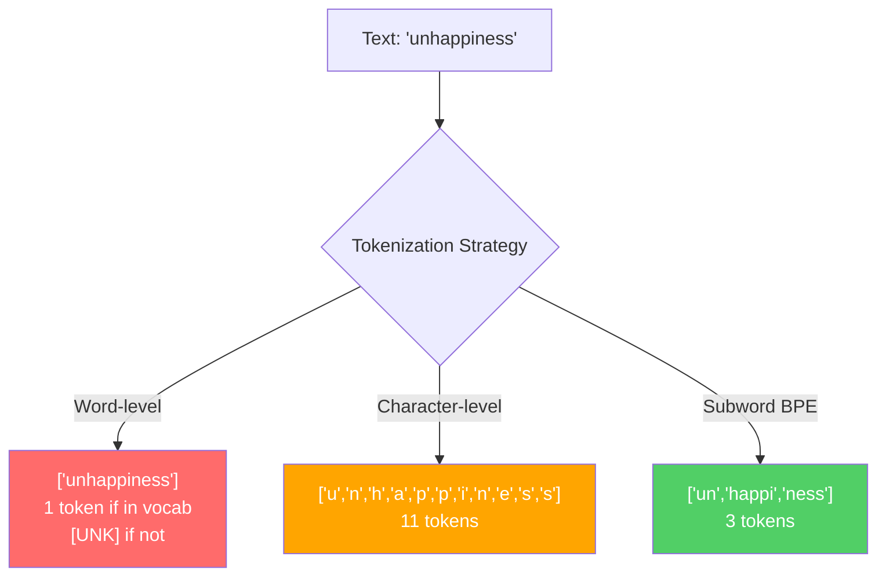
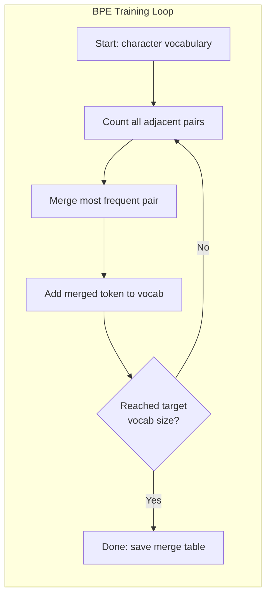
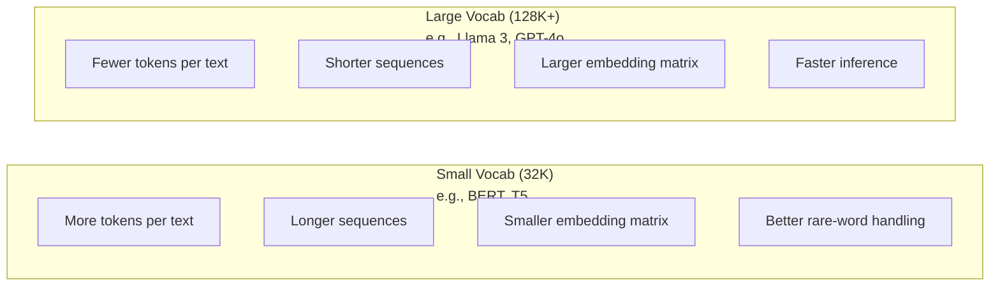

# トークナイザー: BPE、WordPiece、SentencePiece

> LLM は英語を読んでいるわけではありません。読んでいるのは整数です。その整数が意味を運ぶのか、無駄になるのかを決めるのがトークナイザーです。

**種類:** 実装
**言語:** Python
**前提条件:** フェーズ 05 (NLP の基礎)
**時間:** 約90分

## 学習目標

- BPE、WordPiece、Unigram のトークナイゼーションアルゴリズムをゼロから実装し、それぞれのマージ戦略を比較する
- 語彙サイズがモデル効率に与える影響を説明する: 小さすぎるとシーケンスが長くなり、大きすぎると埋め込みパラメータを浪費する
- 言語やコードごとのトークナイゼーションの副作用を分析し、特定のトークナイザーが破綻する箇所を見つける
- `tiktoken` と `sentencepiece` ライブラリを使ってテキストをトークン化し、生成されたトークン ID を調べる

## 課題

LLM は英語を読んでいません。どの言語も読んでいません。読んでいるのは数値です。

`"Hello, world!"` と `[15496, 11, 995, 0]` の間にあるものがトークナイザーです。モデルが処理できるようにする前に、すべての単語、すべての空白、すべての句読点を整数へ変換しなければなりません。この変換は中立ではありません。後から取り消せない前提をモデルに埋め込みます。

ここを間違えると、モデルは一般的な単語を複数トークンで表すために容量を浪費します。`"unfortunately"` が1トークンではなく4トークンになります。多音節語の多い文章では、128K のコンテキストウィンドウが実質 75% 小さくなります。うまく設計すれば、同じコンテキストウィンドウに2倍の意味を詰め込めます。`"this model handles code well"` と `"this model chokes on Python"` の差は、トークナイザーがどう訓練されたかで決まることがよくあります。

GPT-4 や Claude への API 呼び出しは、すべてトークン単位で課金されます。モデルが生成するすべてのトークンに計算コストがかかります。出力を表現するのに必要なトークン数が少ないほど、エンドツーエンドの推論は速くなります。トークナイゼーションは前処理ではありません。アーキテクチャです。

## 考え方

### 失敗した3つの方法と、勝ち残った1つ

テキストを数値へ変換する明らかな方法は3つあります。そのうち2つは大規模には機能しません。

**単語レベルトークナイゼーション**は空白と句読点で分割します。`"The cat sat"` は `["The", "cat", "sat"]` になります。単純です。では `"tokenization"` はどうでしょうか。`"GPT-4o"` はどうでしょうか。ドイツ語の複合語 `"Geschwindigkeitsbegrenzung"` はどうでしょうか。単語レベル方式では、あらゆる言語のあらゆる単語をカバーする巨大な語彙が必要です。語彙にない単語に出会うと、悪名高い `[UNK]` トークンになります。これはモデルにとって「これが何か分からない」という意味です。英語だけでも語形は100万を超えます。コード、URL、科学表記、さらに100以上の言語を加えれば、必要な語彙は無限に近づきます。

**文字レベルトークナイゼーション**は逆方向に振り切ります。`"hello"` は `["h", "e", "l", "l", "o"]` になります。語彙は非常に小さく、せいぜい数百文字です。未知トークンは発生しません。しかしシーケンスが極端に長くなります。単語レベルなら10トークンで済む文が、文字レベルでは50トークンになります。モデルは `"t"`、`"h"`、`"e"` が並ぶと `"the"` を意味することを学ばなければならず、人間なら3歳で覚えることに注意容量を燃やします。

**サブワードトークナイゼーション**はちょうどよい妥協点を見つけます。頻出語は丸ごと残します。`"the"` は1トークンです。まれな単語は意味のある部品へ分解します。`"unhappiness"` は `["un", "happi", "ness"]` になります。語彙は扱いやすいサイズ、たとえば 30K から 128K トークンに収まります。シーケンスも短く保てます。どんな単語もサブワード部品から作れるため、未知トークンは実質的になくなります。

現代の LLM はすべてサブワードトークナイゼーションを使います。GPT-2、GPT-4、BERT、Llama 3、Claude もそうです。問題は、どのアルゴリズムを使うかです。



### BPE: Byte Pair Encoding

BPE は、トークナイゼーションに転用された貪欲な圧縮アルゴリズムです。考え方はインデックスカード1枚に収まるほど単純です。

個々の文字から始めます。訓練コーパス内の隣接ペアをすべて数えます。最も頻度の高いペアを新しいトークンへマージします。目標の語彙サイズに達するまで繰り返します。

これは `"lower"`、`"lowest"`、`"newest"` という小さなコーパスで BPE を動かした例です。

```
Corpus (with word frequencies):
  "lower"  x5
  "lowest" x2
  "newest" x6

Step 0 -- Start with characters:
  l o w e r       (x5)
  l o w e s t     (x2)
  n e w e s t     (x6)

Step 1 -- Count adjacent pairs:
  (e,s): 8    (s,t): 8    (l,o): 7    (o,w): 7
  (w,e): 13   (e,r): 5    (n,e): 6    ...

Step 2 -- Merge most frequent pair (w,e) -> "we":
  l o we r        (x5)
  l o we s t      (x2)
  n e we s t      (x6)

Step 3 -- Recount and merge (e,s) -> "es":
  l o we r        (x5)
  l o we s t      (x2)    <- 'es' only forms from 'e'+'s', not 'we'+'s'
  n e we s t      (x6)    <- wait, the 'e' before 'we' and 's' after 'we'

Actually tracking this precisely:
  After "we" merge, remaining pairs:
  (l,o): 7   (o,we): 7   (we,r): 5   (we,s): 8
  (s,t): 8   (n,e): 6    (e,we): 6

Step 3 -- Merge (we,s) -> "wes" or (s,t) -> "st" (tied at 8, pick first):
  Merge (we,s) -> "wes":
  l o we r        (x5)
  l o wes t       (x2)
  n e wes t       (x6)

Step 4 -- Merge (wes,t) -> "west":
  l o we r        (x5)
  l o west        (x2)
  n e west        (x6)

...continue until target vocab size reached.
```

マージ表こそがトークナイザーです。新しいテキストをエンコードするときは、学習された順番でマージを適用します。どのマージが存在するかは訓練コーパスで決まり、その選択がモデルの見る入力を恒久的に形作ります。



### バイトレベル BPE (GPT-2、GPT-3、GPT-4)

標準的な BPE は Unicode 文字を対象に動きます。バイトレベル BPE は生のバイト列、つまり 0 から 255 を対象に動きます。これにより基礎語彙はちょうど256になり、どんな言語やエンコーディングでも扱え、未知トークンを生成しません。

GPT-2 がこの方式を導入しました。基礎語彙は取り得るすべてのバイトをカバーします。BPE のマージはその上に積み上がります。OpenAI の `tiktoken` ライブラリは、次の語彙サイズでバイトレベル BPE を実装しています。

- GPT-2: 50,257 トークン
- GPT-3.5/GPT-4: 約100,256トークン (`cl100k_base` エンコーディング)
- GPT-4o: 200,019トークン (`o200k_base` エンコーディング)

### WordPiece (BERT)

WordPiece は BPE に似ていますが、マージの選び方が違います。生の頻度ではなく、訓練データの尤度を最大化します。

```
BPE merge criterion:      count(A, B)
WordPiece merge criterion: count(AB) / (count(A) * count(B))
```

BPE は「どのペアが最もよく出現するか」を尋ねます。WordPiece は「偶然から期待されるよりも、どのペアが一緒に現れやすいか」を尋ねます。この微妙な違いが、異なる語彙を生みます。WordPiece は、単に頻出するだけでなく、共起が意外なマージを好みます。

WordPiece は継続サブワードに `"##"` 接頭辞も使います。

```
"unhappiness" -> ["un", "##happi", "##ness"]
"embedding"   -> ["em", "##bed", "##ding"]
```

`"##"` 接頭辞は、この部品が前のトークンの続きであることを示します。BERT は 30,522 トークンの語彙を持つ WordPiece を使います。BERT 系の各種モデルも同じです。ただし DistilBERT は BERT 系ですが、RoBERTa のトークナイザーは実際には BPE です。

### SentencePiece (Llama、T5)

SentencePiece は、空白を含む Unicode 文字の生ストリームとして入力を扱います。事前トークナイゼーションのステップはありません。単語境界に関する言語固有ルールもありません。このため本当に言語非依存で、中国語、日本語、タイ語など、空白で単語が区切られない言語でも機能します。

SentencePiece は2つのアルゴリズムをサポートします。

- **BPE モード**: 標準 BPE と同じマージロジックを、生の文字列に適用する
- **Unigram モード**: 大きな語彙から始め、全体の尤度への影響が最も小さいトークンを反復的に削除する。BPE の逆で、マージではなく枝刈りを行う

Llama 2 は 32,000 トークンの語彙を持つ SentencePiece BPE を使います。T5 は 32,000 トークンの SentencePiece Unigram を使います。なお Llama 3 は、128,256 トークンの `tiktoken` ベースのバイトレベル BPE トークナイザーに切り替わりました。

### 語彙サイズのトレードオフ

これは実際のエンジニアリング判断であり、測定可能な影響があります。



具体的な数字で考えます。語彙が 128K、埋め込み次元が 4,096 の場合、埋め込み行列だけで `128,000 x 4,096 = 524 million` パラメータになります。語彙が 32K なら 131 million パラメータです。トークナイザーの選択だけで 400M パラメータの差が生まれます。

一方で、大きな語彙はテキストをより強く圧縮します。32K 語彙では100トークンになる英語段落が、128K 語彙なら70トークンで済むかもしれません。これは生成時の forward pass が30%少なくなるということです。何百万リクエストを処理するモデルでは、計算コストの直接的な削減になります。

傾向は明確です。語彙サイズは大きくなっています。GPT-2 は 50,257、GPT-4 は約100K、Llama 3 は128K、GPT-4o は200Kを使います。

| モデル | 語彙サイズ | トークナイザー種別 | 英単語あたりの平均トークン数 |
|-------|-----------|----------------|---------------------------|
| BERT | 30,522 | WordPiece | 約1.4 |
| GPT-2 | 50,257 | Byte-level BPE | 約1.3 |
| Llama 2 | 32,000 | SentencePiece BPE | 約1.4 |
| GPT-4 | 約100,256 | Byte-level BPE | 約1.2 |
| Llama 3 | 128,256 | Byte-level BPE (tiktoken) | 約1.1 |
| GPT-4o | 200,019 | Byte-level BPE | 約1.0 |

### 多言語税

主に英語で訓練されたトークナイザーは、他言語に厳しく当たります。GPT-2 のトークナイザーでは、韓国語テキストは平均して単語あたり2から3トークンになります。中国語ではさらに悪くなることがあります。つまり韓国語ユーザーは、英語ユーザーと同じ料金を払っているにもかかわらず、実質的なコンテキストウィンドウが半分になります。

Llama 3 が語彙を 32K から 128K へ4倍にした理由はここにあります。非英語の文字体系により多くのトークンを割り当てることで、言語間でより公平な圧縮ができます。

## 作ってみる

### ステップ1: 文字レベルトークナイザー

基礎から始めます。文字レベルトークナイザーは、各文字を Unicode コードポイントへ対応付けます。訓練は不要です。未知トークンもありません。単純な直接対応です。

```python
class CharTokenizer:
    def encode(self, text):
        return [ord(c) for c in text]

    def decode(self, tokens):
        return "".join(chr(t) for t in tokens)
```

`"hello"` は `[104, 101, 108, 108, 111]` になります。すべての文字がそれぞれ1トークンです。ここが、これから改善するベースラインです。

### ステップ2: BPE トークナイザーをゼロから作る

本物の実装です。GPT-2 のように生バイトで訓練し、ペアを数え、最頻ペアをマージし、すべてのマージを順番に記録します。マージ表がトークナイザーです。

```python
from collections import Counter

class BPETokenizer:
    def __init__(self):
        self.merges = {}
        self.vocab = {}

    def _get_pairs(self, tokens):
        pairs = Counter()
        for i in range(len(tokens) - 1):
            pairs[(tokens[i], tokens[i + 1])] += 1
        return pairs

    def _merge_pair(self, tokens, pair, new_token):
        merged = []
        i = 0
        while i < len(tokens):
            if i < len(tokens) - 1 and tokens[i] == pair[0] and tokens[i + 1] == pair[1]:
                merged.append(new_token)
                i += 2
            else:
                merged.append(tokens[i])
                i += 1
        return merged

    def train(self, text, num_merges):
        tokens = list(text.encode("utf-8"))
        self.vocab = {i: bytes([i]) for i in range(256)}

        for i in range(num_merges):
            pairs = self._get_pairs(tokens)
            if not pairs:
                break
            best_pair = max(pairs, key=pairs.get)
            new_token = 256 + i
            tokens = self._merge_pair(tokens, best_pair, new_token)
            self.merges[best_pair] = new_token
            self.vocab[new_token] = self.vocab[best_pair[0]] + self.vocab[best_pair[1]]

        return self

    def encode(self, text):
        tokens = list(text.encode("utf-8"))
        for pair, new_token in self.merges.items():
            tokens = self._merge_pair(tokens, pair, new_token)
        return tokens

    def decode(self, tokens):
        byte_sequence = b"".join(self.vocab[t] for t in tokens)
        return byte_sequence.decode("utf-8", errors="replace")
```

訓練ループが BPE の中核です。ペアを数え、勝者をマージし、繰り返します。各マージは総トークン数を減らします。`num_merges` 回の後、語彙は基礎バイトの256から `256 + num_merges` へ増えます。

エンコードでは、学習された正確な順序でマージを適用します。これは重要です。マージ1で `"th"` が作られ、マージ5で `"the"` が作られたなら、エンコード時もマージ1を先に適用し、マージ5で `"th" + "e"` から `"the"` を形成できるようにしなければなりません。

デコードはその逆です。各トークン ID を語彙で引き、バイト列を連結し、UTF-8 としてデコードします。

### ステップ3: エンコードとデコードのラウンドトリップ

```python
corpus = (
    "The cat sat on the mat. The cat ate the rat. "
    "The dog sat on the log. The dog ate the frog. "
    "Natural language processing is the study of how computers "
    "understand and generate human language. "
    "Tokenization is the first step in any NLP pipeline."
)

tokenizer = BPETokenizer()
tokenizer.train(corpus, num_merges=40)

test_sentences = [
    "The cat sat on the mat.",
    "Natural language processing",
    "tokenization pipeline",
    "unhappiness",
]

for sentence in test_sentences:
    encoded = tokenizer.encode(sentence)
    decoded = tokenizer.decode(encoded)
    raw_bytes = len(sentence.encode("utf-8"))
    ratio = len(encoded) / raw_bytes
    print(f"'{sentence}'")
    print(f"  Tokens: {len(encoded)} (from {raw_bytes} bytes) -- ratio: {ratio:.2f}")
    print(f"  Roundtrip: {'PASS' if decoded == sentence else 'FAIL'}")
```

圧縮率は、トークナイザーがどれほど有効かを示します。比率が 0.50 なら、生バイトの半分のトークン数まで圧縮できたということです。低いほどよいです。訓練コーパス上では比率は良くなります。`"unhappiness"` のような分布外テキスト、つまりコーパスに現れない語では比率が悪くなります。未知のパターンに対して、トークナイザーは文字レベル相当の符号化へ戻るためです。

### ステップ4: tiktoken と比較する

```python
import tiktoken

enc = tiktoken.get_encoding("cl100k_base")

texts = [
    "The cat sat on the mat.",
    "unhappiness",
    "Hello, world!",
    "def fibonacci(n): return n if n < 2 else fibonacci(n-1) + fibonacci(n-2)",
    "Geschwindigkeitsbegrenzung",
]

for text in texts:
    our_tokens = tokenizer.encode(text)
    tiktoken_tokens = enc.encode(text)
    tiktoken_pieces = [enc.decode([t]) for t in tiktoken_tokens]
    print(f"'{text}'")
    print(f"  Our BPE:   {len(our_tokens)} tokens")
    print(f"  tiktoken:  {len(tiktoken_tokens)} tokens -> {tiktoken_pieces}")
```

`tiktoken` はまったく同じアルゴリズムを使いますが、数百GBのテキストと10万マージで訓練されています。アルゴリズムは同じです。違いは訓練データとマージ数です。1段落と40マージで訓練したあなたのトークナイザーは、大規模コーパスと100Kマージで訓練された `tiktoken` には勝てません。しかし仕組みは同じです。

### ステップ5: 語彙分析

```python
def analyze_vocabulary(tokenizer, test_texts):
    total_tokens = 0
    total_chars = 0
    token_usage = Counter()

    for text in test_texts:
        encoded = tokenizer.encode(text)
        total_tokens += len(encoded)
        total_chars += len(text)
        for t in encoded:
            token_usage[t] += 1

    print(f"Vocabulary size: {len(tokenizer.vocab)}")
    print(f"Total tokens across all texts: {total_tokens}")
    print(f"Total characters: {total_chars}")
    print(f"Avg tokens per character: {total_tokens / total_chars:.2f}")

    print(f"\nMost used tokens:")
    for token_id, count in token_usage.most_common(10):
        token_bytes = tokenizer.vocab[token_id]
        display = token_bytes.decode("utf-8", errors="replace")
        print(f"  Token {token_id:4d}: '{display}' (used {count} times)")

    unused = [t for t in tokenizer.vocab if t not in token_usage]
    print(f"\nUnused tokens: {len(unused)} out of {len(tokenizer.vocab)}")
```

これにより、語彙内の Zipf 分布が見えてきます。少数のトークン、たとえば空白、`"the"`、`"e"` が支配的です。多くのトークンはめったに使われません。本番トークナイザーはこの分布に合わせて最適化されます。よく現れるパターンには短いトークン ID が割り当てられ、まれなパターンは長い表現になります。

## 使ってみる

スクラッチ実装の BPE は動きます。次は本番ツールがどのようなものか見てみます。

### tiktoken (OpenAI)

```python
import tiktoken

enc = tiktoken.get_encoding("cl100k_base")

text = "Tokenizers convert text to integers"
tokens = enc.encode(text)
print(f"Tokens: {tokens}")
print(f"Pieces: {[enc.decode([t]) for t in tokens]}")
print(f"Roundtrip: {enc.decode(tokens)}")
```

`tiktoken` は Rust で書かれ、Python バインディングを持ちます。秒間数百万トークンをエンコードできます。同じ BPE アルゴリズムを、産業用の実装にしたものです。

### Hugging Face tokenizers

```python
from tokenizers import Tokenizer
from tokenizers.models import BPE
from tokenizers.trainers import BpeTrainer
from tokenizers.pre_tokenizers import ByteLevel

tokenizer = Tokenizer(BPE())
tokenizer.pre_tokenizer = ByteLevel()

trainer = BpeTrainer(vocab_size=1000, special_tokens=["<pad>", "<eos>", "<unk>"])
tokenizer.train(["corpus.txt"], trainer)

output = tokenizer.encode("The cat sat on the mat.")
print(f"Tokens: {output.tokens}")
print(f"IDs: {output.ids}")
```

Hugging Face の `tokenizers` ライブラリも内部では Rust です。GB 規模のコーパスで BPE を数秒で訓練します。自分のモデルを訓練するときに使うのはこれです。

### Llama のトークナイザーを読み込む

```python
from transformers import AutoTokenizer

tokenizer = AutoTokenizer.from_pretrained("meta-llama/Llama-3.1-8B")

text = "Tokenizers are the unsung heroes of LLMs"
tokens = tokenizer.encode(text)
print(f"Token IDs: {tokens}")
print(f"Tokens: {tokenizer.convert_ids_to_tokens(tokens)}")
print(f"Vocab size: {tokenizer.vocab_size}")

multilingual = ["Hello world", "Hola mundo", "Bonjour le monde"]
for text in multilingual:
    ids = tokenizer.encode(text)
    print(f"'{text}' -> {len(ids)} tokens")
```

Llama 3 の 128K 語彙は、GPT-2 の 50K 語彙よりも非英語テキストを大幅に効率よく圧縮します。これは自分でも確認できます。同じ文を複数の言語でエンコードし、トークン数を数えてください。

## 形にして届ける

このレッスンでは `outputs/prompt-tokenizer-analyzer.md` を作ります。これは、任意のテキストとモデルの組み合わせについて、トークナイゼーション効率を分析する再利用可能なプロンプトです。テキストサンプルを渡すと、どのモデルのトークナイザーが最も適しているかを教えてくれます。

## 演習

1. BPE トークナイザーを変更して、各マージステップで語彙を表示するようにしてください。`"t" + "h"` が `"th"` になり、さらに `"th" + "e"` が `"the"` になる様子を観察します。一般的な英単語が部品から組み上がっていく過程を追跡してください。

2. BPE トークナイザーに特殊トークン (`<pad>`、`<eos>`、`<unk>`) を追加してください。それらに ID 0、1、2 を割り当て、他のすべてのトークンをずらします。BPE の前に空白で分割する事前トークナイゼーションステップも実装してください。

3. WordPiece のマージ基準、つまり頻度ではなく尤度比を実装してください。同じコーパス、同じマージ数で BPE と WordPiece の両方を訓練します。得られた語彙を比較してください。どちらがより言語学的に意味のあるサブワードを作るでしょうか。

4. 多言語トークナイザー効率ベンチマークを作ってください。英語、スペイン語、中国語、韓国語、アラビア語でそれぞれ10文を用意します。`tiktoken` (`cl100k_base`) でトークン化し、文字あたり平均トークン数を測ります。各言語の「多言語税」を定量化してください。

5. より大きなコーパス、たとえば Wikipedia 記事をダウンロードして BPE トークナイザーを訓練してください。同じテキスト上で `tiktoken` との圧縮率差が10%以内になるようにマージ数を調整します。これにより、コーパスサイズ、マージ数、圧縮品質の関係を理解できます。

## 重要用語

| 用語 | よくある言い方 | 実際の意味 |
|------|----------------|------------|
| Token | 「単語」 | モデル語彙内の単位。文字、サブワード、単語、複数語のまとまりのいずれにもなり得る |
| BPE | 「何かの圧縮」 | Byte Pair Encoding。目標語彙サイズに達するまで、最頻の隣接トークンペアを反復的にマージする |
| WordPiece | 「BERT のトークナイザー」 | BPE に似ているが、生頻度ではなく `count(AB)/(count(A)*count(B))` の尤度比を最大化するマージを選ぶ |
| SentencePiece | 「トークナイザーライブラリ」 | 事前トークナイゼーションなしで生の Unicode に作用する言語非依存トークナイザー。BPE と Unigram をサポートする |
| Vocabulary size | 「知っている単語数」 | 一意なトークンの総数。GPT-2 は 50,257、BERT は 30,522、Llama 3 は 128,256 |
| Fertility | 「トークナイザー用語ではなさそう」 | 単語あたりの平均トークン数。言語間のトークナイザー効率を測る。1.0 は理想、3.0 はモデルが3倍働くことを意味する |
| Byte-level BPE | 「GPT のトークナイザー」 | Unicode 文字ではなく生バイト (0-255) 上で動く BPE。どんな入力でも未知トークンが発生しない |
| Merge table | 「トークナイザーファイル」 | 訓練中に学習されたペアマージの順序付きリスト。これがトークナイザーそのものであり、順序が重要 |
| Pre-tokenization | 「空白で分割すること」 | サブワードトークナイゼーションの前に適用するルール。空白分割、数字分離、句読点処理など |
| Compression ratio | 「トークナイザーの効率」 | 生成されたトークン数を入力バイト数で割った値。低いほど圧縮が良く、推論が速い |

## 参考資料

- [Sennrich et al., 2016 -- "Neural Machine Translation of Rare Words with Subword Units"](https://arxiv.org/abs/1508.07909) -- BPE を NLP に導入し、1994年の圧縮アルゴリズムを現代のトークナイゼーションの基礎へ変えた論文
- [Kudo & Richardson, 2018 -- "SentencePiece: A simple and language independent subword tokenizer"](https://arxiv.org/abs/1808.06226) -- 多言語モデルを実用的にした、言語非依存のトークナイゼーション
- [OpenAI tiktoken repository](https://github.com/openai/tiktoken) -- GPT-3.5/4/4o で使われる、Python バインディング付き Rust 製の本番 BPE 実装
- [Hugging Face Tokenizers documentation](https://huggingface.co/docs/tokenizers) -- Rust の性能を備えた本番グレードのトークナイザー訓練
